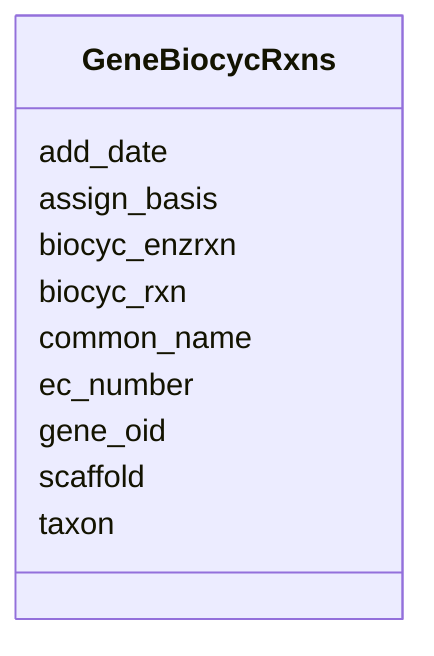

# Class: GeneBiocycRxns 


URI: [img_core_v400:GeneBiocycRxns](https://w3id.org/jgi/img_core_v400/GeneBiocycRxns)





<!-- no inheritance hierarchy -->


## Slots

| Name | Cardinality and Range | Description | Inheritance |
| ---  | --- | --- | --- |
| [gene_oid](gene_oid.md) | 0..1 <br/> [Integer](Integer.md) |  | direct |
| [biocyc_enzrxn](biocyc_enzrxn.md) | 0..1 <br/> [String](String.md) |  | direct |
| [biocyc_rxn](biocyc_rxn.md) | 0..1 <br/> [String](String.md) |  | direct |
| [ec_number](ec_number.md) | 0..1 <br/> [String](String.md) |  | direct |
| [common_name](common_name.md) | 0..1 <br/> [String](String.md) |  | direct |
| [assign_basis](assign_basis.md) | 0..1 <br/> [String](String.md) |  | direct |
| [add_date](add_date.md) | 0..1 <br/> [Datetime](Datetime.md) |  | direct |
| [taxon](taxon.md) | 0..1 <br/> [Integer](Integer.md) |  | direct |
| [scaffold](scaffold.md) | 0..1 <br/> [Integer](Integer.md) |  | direct |


## Identifier and Mapping Information


### Schema Source


* from schema: https://w3id.org/jgi/img_core_v400


## Mappings

| Mapping Type | Mapped Value |
| ---  | ---  |
| self | img_core_v400:GeneBiocycRxns |
| native | img_core_v400:GeneBiocycRxns |


## LinkML Source

<!-- TODO: investigate https://stackoverflow.com/questions/37606292/how-to-create-tabbed-code-blocks-in-mkdocs-or-sphinx -->

### Direct

<details>
```yaml
name: gene_biocyc_rxns
from_schema: https://w3id.org/jgi/img_core_v400
attributes:
  gene_oid:
    name: gene_oid
    from_schema: https://w3id.org/jgi/img_core_v400
    domain_of:
    - actino_abc_genes
    - delete_genes
    - dt_ht_hits
    - dt_img_gene_prot_pep_sample
    - dt_phylum_dist_genes
    - dt_scog_genes
    - gene
    - gene_aliases
    - gene_biocyc_rxns
    - gene_cathfam
    - gene_cog_groups
    - gene_essential_genes
    - gene_exceptions
    - gene_ext_links
    - gene_feature_tags
    - gene_frag_coords
    - gene_go_terms
    - gene_img_interpro_hits
    - gene_ko_enzymes
    - gene_ko_enzymes_new
    - gene_ko_terms
    - gene_kog_groups
    - gene_notes
    - gene_paralogs
    - gene_pdb_xrefs
    - gene_pfam_families
    - gene_sig_peptides
    - gene_smart
    - gene_superfam
    - gene_tigrfams
    - gene_xref_families
    - kp_pseudo
    - merfs_gene_mapping
    - mv_gene_tmhmm_stats
    - tmp_genes
    range: integer
    required: false
  biocyc_enzrxn:
    name: biocyc_enzrxn
    from_schema: https://w3id.org/jgi/img_core_v400
    rank: 1000
    domain_of:
    - gene_biocyc_rxns
    range: string
    required: false
  biocyc_rxn:
    name: biocyc_rxn
    from_schema: https://w3id.org/jgi/img_core_v400
    rank: 1000
    domain_of:
    - gene_biocyc_rxns
    range: string
    required: false
  ec_number:
    name: ec_number
    from_schema: https://w3id.org/jgi/img_core_v400
    domain_of:
    - biocyc_protein_catalyzes
    - biocyc_reaction
    - enzyme
    - enzyme_enz_aliases
    - enzyme_ext_links
    - enzyme_products
    - enzyme_substrates
    - enzyme_transferred
    - gene_biocyc_rxns
    - ko2ec
    range: string
    required: false
  common_name:
    name: common_name
    from_schema: https://w3id.org/jgi/img_core_v400
    domain_of:
    - biocyc_class
    - biocyc_comp
    - biocyc_enzrxn
    - biocyc_pathway
    - biocyc_protein
    - biocyc_reaction
    - compound
    - gene_biocyc_rxns
    range: string
    required: false
  assign_basis:
    name: assign_basis
    from_schema: https://w3id.org/jgi/img_core_v400
    domain_of:
    - biocyc_enzrxn
    - gene_biocyc_rxns
    range: string
    required: false
  add_date:
    name: add_date
    from_schema: https://w3id.org/jgi/img_core_v400
    domain_of:
    - bcg_taxons
    - cog
    - cog_function
    - cog_species
    - compound
    - enzyme
    - enzyme_transferred
    - gene
    - gene_biocyc_rxns
    - genome_property
    - go_graph_path
    - go_term
    - image_roi
    - kegg_pathway
    - km_image_roi
    - ko_term
    - kog
    - kog_function
    - paralog_group
    - pfam_clan
    - pfam_family
    - positional_cluster
    - property_step
    - reaction
    - scaffold
    - taxon
    - taxon_prod_vw
    - tigr_role
    - tigrfam
    range: datetime
    required: false
  taxon:
    name: taxon
    from_schema: https://w3id.org/jgi/img_core_v400
    domain_of:
    - cog_species
    - dt_img_gene_prot_pep_sample
    - dt_taxon_node_lite
    - gene
    - gene_biocyc_rxns
    - gene_cathfam
    - gene_cog_groups
    - gene_img_interpro_hits
    - gene_ko_enzymes
    - gene_ko_enzymes_new
    - gene_ko_terms
    - gene_kog_groups
    - gene_pfam_families
    - gene_smart
    - gene_superfam
    - gene_tigrfams
    - gene_xref_families
    - kp_pseudo
    - merfs_gene_mapping
    - paralog_group
    - scaffold
    - scaffold_stats
    - taxon_node_lite
    range: integer
    required: false
  scaffold:
    name: scaffold
    from_schema: https://w3id.org/jgi/img_core_v400
    domain_of:
    - gene
    - gene_biocyc_rxns
    - gene_cathfam
    - gene_cog_groups
    - gene_img_interpro_hits
    - gene_ko_enzymes
    - gene_ko_enzymes_new
    - gene_ko_terms
    - gene_kog_groups
    - gene_pfam_families
    - gene_smart
    - gene_superfam
    - gene_tigrfams
    - gene_xref_families
    - iso_plasmids
    - kp_pseudo
    range: integer
    required: false

```
</details>

### Induced

<details>
```yaml
name: gene_biocyc_rxns
from_schema: https://w3id.org/jgi/img_core_v400
attributes:
  gene_oid:
    name: gene_oid
    from_schema: https://w3id.org/jgi/img_core_v400
    alias: gene_oid
    owner: gene_biocyc_rxns
    domain_of:
    - actino_abc_genes
    - delete_genes
    - dt_ht_hits
    - dt_img_gene_prot_pep_sample
    - dt_phylum_dist_genes
    - dt_scog_genes
    - gene
    - gene_aliases
    - gene_biocyc_rxns
    - gene_cathfam
    - gene_cog_groups
    - gene_essential_genes
    - gene_exceptions
    - gene_ext_links
    - gene_feature_tags
    - gene_frag_coords
    - gene_go_terms
    - gene_img_interpro_hits
    - gene_ko_enzymes
    - gene_ko_enzymes_new
    - gene_ko_terms
    - gene_kog_groups
    - gene_notes
    - gene_paralogs
    - gene_pdb_xrefs
    - gene_pfam_families
    - gene_sig_peptides
    - gene_smart
    - gene_superfam
    - gene_tigrfams
    - gene_xref_families
    - kp_pseudo
    - merfs_gene_mapping
    - mv_gene_tmhmm_stats
    - tmp_genes
    range: integer
    required: false
  biocyc_enzrxn:
    name: biocyc_enzrxn
    from_schema: https://w3id.org/jgi/img_core_v400
    rank: 1000
    alias: biocyc_enzrxn
    owner: gene_biocyc_rxns
    domain_of:
    - gene_biocyc_rxns
    range: string
    required: false
  biocyc_rxn:
    name: biocyc_rxn
    from_schema: https://w3id.org/jgi/img_core_v400
    rank: 1000
    alias: biocyc_rxn
    owner: gene_biocyc_rxns
    domain_of:
    - gene_biocyc_rxns
    range: string
    required: false
  ec_number:
    name: ec_number
    from_schema: https://w3id.org/jgi/img_core_v400
    alias: ec_number
    owner: gene_biocyc_rxns
    domain_of:
    - biocyc_protein_catalyzes
    - biocyc_reaction
    - enzyme
    - enzyme_enz_aliases
    - enzyme_ext_links
    - enzyme_products
    - enzyme_substrates
    - enzyme_transferred
    - gene_biocyc_rxns
    - ko2ec
    range: string
    required: false
  common_name:
    name: common_name
    from_schema: https://w3id.org/jgi/img_core_v400
    alias: common_name
    owner: gene_biocyc_rxns
    domain_of:
    - biocyc_class
    - biocyc_comp
    - biocyc_enzrxn
    - biocyc_pathway
    - biocyc_protein
    - biocyc_reaction
    - compound
    - gene_biocyc_rxns
    range: string
    required: false
  assign_basis:
    name: assign_basis
    from_schema: https://w3id.org/jgi/img_core_v400
    alias: assign_basis
    owner: gene_biocyc_rxns
    domain_of:
    - biocyc_enzrxn
    - gene_biocyc_rxns
    range: string
    required: false
  add_date:
    name: add_date
    from_schema: https://w3id.org/jgi/img_core_v400
    alias: add_date
    owner: gene_biocyc_rxns
    domain_of:
    - bcg_taxons
    - cog
    - cog_function
    - cog_species
    - compound
    - enzyme
    - enzyme_transferred
    - gene
    - gene_biocyc_rxns
    - genome_property
    - go_graph_path
    - go_term
    - image_roi
    - kegg_pathway
    - km_image_roi
    - ko_term
    - kog
    - kog_function
    - paralog_group
    - pfam_clan
    - pfam_family
    - positional_cluster
    - property_step
    - reaction
    - scaffold
    - taxon
    - taxon_prod_vw
    - tigr_role
    - tigrfam
    range: datetime
    required: false
  taxon:
    name: taxon
    from_schema: https://w3id.org/jgi/img_core_v400
    alias: taxon
    owner: gene_biocyc_rxns
    domain_of:
    - cog_species
    - dt_img_gene_prot_pep_sample
    - dt_taxon_node_lite
    - gene
    - gene_biocyc_rxns
    - gene_cathfam
    - gene_cog_groups
    - gene_img_interpro_hits
    - gene_ko_enzymes
    - gene_ko_enzymes_new
    - gene_ko_terms
    - gene_kog_groups
    - gene_pfam_families
    - gene_smart
    - gene_superfam
    - gene_tigrfams
    - gene_xref_families
    - kp_pseudo
    - merfs_gene_mapping
    - paralog_group
    - scaffold
    - scaffold_stats
    - taxon_node_lite
    range: integer
    required: false
  scaffold:
    name: scaffold
    from_schema: https://w3id.org/jgi/img_core_v400
    alias: scaffold
    owner: gene_biocyc_rxns
    domain_of:
    - gene
    - gene_biocyc_rxns
    - gene_cathfam
    - gene_cog_groups
    - gene_img_interpro_hits
    - gene_ko_enzymes
    - gene_ko_enzymes_new
    - gene_ko_terms
    - gene_kog_groups
    - gene_pfam_families
    - gene_smart
    - gene_superfam
    - gene_tigrfams
    - gene_xref_families
    - iso_plasmids
    - kp_pseudo
    range: integer
    required: false

```
</details>