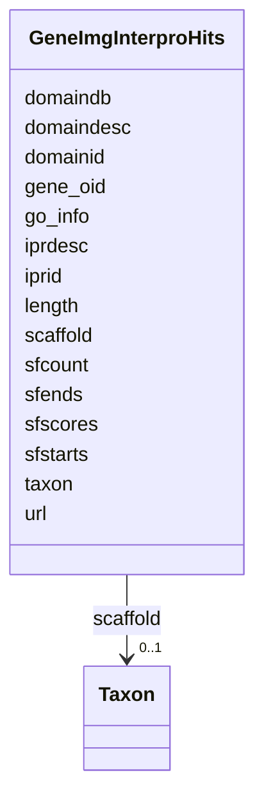

# Class: GeneImgInterproHits 


URI: [img_core_v400:GeneImgInterproHits](https://w3id.org/jgi/img_core_v400/GeneImgInterproHits)





<!-- no inheritance hierarchy -->


## Slots

| Name | Cardinality and Range | Description | Inheritance |
| ---  | --- | --- | --- |
| [gene_oid](gene_oid.md) | 0..1 <br/> [Integer](Integer.md) |  | direct |
| [length](length.md) | 0..1 <br/> [Integer](Integer.md) |  | direct |
| [domaindb](domaindb.md) | 0..1 <br/> [String](String.md) |  | direct |
| [domainid](domainid.md) | 0..1 <br/> [String](String.md) |  | direct |
| [domaindesc](domaindesc.md) | 0..1 <br/> [String](String.md) |  | direct |
| [sfcount](sfcount.md) | 0..1 <br/> [Integer](Integer.md) |  | direct |
| [sfstarts](sfstarts.md) | 0..1 <br/> [Integer](Integer.md) |  | direct |
| [sfends](sfends.md) | 0..1 <br/> [Integer](Integer.md) |  | direct |
| [sfscores](sfscores.md) | 0..1 <br/> [Integer](Integer.md) |  | direct |
| [iprid](iprid.md) | 0..1 <br/> [String](String.md) |  | direct |
| [iprdesc](iprdesc.md) | 0..1 <br/> [String](String.md) |  | direct |
| [go_info](go_info.md) | 0..1 <br/> [String](String.md) |  | direct |
| [url](url.md) | 0..1 <br/> [String](String.md) |  | direct |
| [scaffold](scaffold.md) | 0..1 <br/> [Taxon](Taxon.md) | Foreign key to taxon | direct |
| [taxon](taxon.md) | 0..1 <br/> [Integer](Integer.md) |  | direct |


## Identifier and Mapping Information


### Schema Source


* from schema: https://w3id.org/jgi/img_core_v400


## Mappings

| Mapping Type | Mapped Value |
| ---  | ---  |
| self | img_core_v400:GeneImgInterproHits |
| native | img_core_v400:GeneImgInterproHits |


## LinkML Source

<!-- TODO: investigate https://stackoverflow.com/questions/37606292/how-to-create-tabbed-code-blocks-in-mkdocs-or-sphinx -->

### Direct

<details>
```yaml
name: gene_img_interpro_hits
from_schema: https://w3id.org/jgi/img_core_v400
attributes:
  gene_oid:
    name: gene_oid
    from_schema: https://w3id.org/jgi/img_core_v400
    domain_of:
    - actino_abc_genes
    - delete_genes
    - dt_ht_hits
    - dt_img_gene_prot_pep_sample
    - dt_phylum_dist_genes
    - dt_scog_genes
    - gene
    - gene_aliases
    - gene_biocyc_rxns
    - gene_cathfam
    - gene_cog_groups
    - gene_essential_genes
    - gene_exceptions
    - gene_ext_links
    - gene_feature_tags
    - gene_frag_coords
    - gene_go_terms
    - gene_img_interpro_hits
    - gene_ko_enzymes
    - gene_ko_enzymes_new
    - gene_ko_terms
    - gene_kog_groups
    - gene_notes
    - gene_paralogs
    - gene_pdb_xrefs
    - gene_pfam_families
    - gene_sig_peptides
    - gene_smart
    - gene_superfam
    - gene_tigrfams
    - gene_xref_families
    - kp_pseudo
    - merfs_gene_mapping
    - mv_gene_tmhmm_stats
    - tmp_genes
    range: integer
    required: false
  length:
    name: length
    from_schema: https://w3id.org/jgi/img_core_v400
    rank: 1000
    domain_of:
    - gene_img_interpro_hits
    range: integer
    required: false
  domaindb:
    name: domaindb
    from_schema: https://w3id.org/jgi/img_core_v400
    rank: 1000
    domain_of:
    - gene_img_interpro_hits
    range: string
    required: false
  domainid:
    name: domainid
    from_schema: https://w3id.org/jgi/img_core_v400
    rank: 1000
    domain_of:
    - gene_img_interpro_hits
    range: string
    required: false
  domaindesc:
    name: domaindesc
    from_schema: https://w3id.org/jgi/img_core_v400
    rank: 1000
    domain_of:
    - gene_img_interpro_hits
    range: string
    required: false
  sfcount:
    name: sfcount
    from_schema: https://w3id.org/jgi/img_core_v400
    rank: 1000
    domain_of:
    - gene_img_interpro_hits
    range: integer
    required: false
  sfstarts:
    name: sfstarts
    from_schema: https://w3id.org/jgi/img_core_v400
    rank: 1000
    domain_of:
    - gene_img_interpro_hits
    - gene_tigrfams
    range: integer
    required: false
  sfends:
    name: sfends
    from_schema: https://w3id.org/jgi/img_core_v400
    rank: 1000
    domain_of:
    - gene_img_interpro_hits
    range: integer
    required: false
  sfscores:
    name: sfscores
    from_schema: https://w3id.org/jgi/img_core_v400
    rank: 1000
    domain_of:
    - gene_img_interpro_hits
    - gene_tigrfams
    range: integer
    required: false
  iprid:
    name: iprid
    from_schema: https://w3id.org/jgi/img_core_v400
    rank: 1000
    domain_of:
    - gene_img_interpro_hits
    range: string
    required: false
  iprdesc:
    name: iprdesc
    from_schema: https://w3id.org/jgi/img_core_v400
    rank: 1000
    domain_of:
    - gene_img_interpro_hits
    range: string
    required: false
  go_info:
    name: go_info
    from_schema: https://w3id.org/jgi/img_core_v400
    rank: 1000
    domain_of:
    - gene_img_interpro_hits
    range: string
    required: false
  url:
    name: url
    from_schema: https://w3id.org/jgi/img_core_v400
    rank: 1000
    domain_of:
    - gene_img_interpro_hits
    range: string
    required: false
  scaffold:
    name: scaffold
    description: Foreign key to taxon
    from_schema: https://w3id.org/jgi/img_core_v400
    domain_of:
    - gene
    - gene_biocyc_rxns
    - gene_cathfam
    - gene_cog_groups
    - gene_img_interpro_hits
    - gene_ko_enzymes
    - gene_ko_enzymes_new
    - gene_ko_terms
    - gene_kog_groups
    - gene_pfam_families
    - gene_smart
    - gene_superfam
    - gene_tigrfams
    - gene_xref_families
    - iso_plasmids
    - kp_pseudo
    range: taxon
    required: false
  taxon:
    name: taxon
    from_schema: https://w3id.org/jgi/img_core_v400
    domain_of:
    - cog_species
    - dt_img_gene_prot_pep_sample
    - dt_taxon_node_lite
    - gene
    - gene_biocyc_rxns
    - gene_cathfam
    - gene_cog_groups
    - gene_img_interpro_hits
    - gene_ko_enzymes
    - gene_ko_enzymes_new
    - gene_ko_terms
    - gene_kog_groups
    - gene_pfam_families
    - gene_smart
    - gene_superfam
    - gene_tigrfams
    - gene_xref_families
    - kp_pseudo
    - merfs_gene_mapping
    - paralog_group
    - scaffold
    - scaffold_stats
    - taxon_node_lite
    range: integer
    required: false

```
</details>

### Induced

<details>
```yaml
name: gene_img_interpro_hits
from_schema: https://w3id.org/jgi/img_core_v400
attributes:
  gene_oid:
    name: gene_oid
    from_schema: https://w3id.org/jgi/img_core_v400
    alias: gene_oid
    owner: gene_img_interpro_hits
    domain_of:
    - actino_abc_genes
    - delete_genes
    - dt_ht_hits
    - dt_img_gene_prot_pep_sample
    - dt_phylum_dist_genes
    - dt_scog_genes
    - gene
    - gene_aliases
    - gene_biocyc_rxns
    - gene_cathfam
    - gene_cog_groups
    - gene_essential_genes
    - gene_exceptions
    - gene_ext_links
    - gene_feature_tags
    - gene_frag_coords
    - gene_go_terms
    - gene_img_interpro_hits
    - gene_ko_enzymes
    - gene_ko_enzymes_new
    - gene_ko_terms
    - gene_kog_groups
    - gene_notes
    - gene_paralogs
    - gene_pdb_xrefs
    - gene_pfam_families
    - gene_sig_peptides
    - gene_smart
    - gene_superfam
    - gene_tigrfams
    - gene_xref_families
    - kp_pseudo
    - merfs_gene_mapping
    - mv_gene_tmhmm_stats
    - tmp_genes
    range: integer
    required: false
  length:
    name: length
    from_schema: https://w3id.org/jgi/img_core_v400
    rank: 1000
    alias: length
    owner: gene_img_interpro_hits
    domain_of:
    - gene_img_interpro_hits
    range: integer
    required: false
  domaindb:
    name: domaindb
    from_schema: https://w3id.org/jgi/img_core_v400
    rank: 1000
    alias: domaindb
    owner: gene_img_interpro_hits
    domain_of:
    - gene_img_interpro_hits
    range: string
    required: false
  domainid:
    name: domainid
    from_schema: https://w3id.org/jgi/img_core_v400
    rank: 1000
    alias: domainid
    owner: gene_img_interpro_hits
    domain_of:
    - gene_img_interpro_hits
    range: string
    required: false
  domaindesc:
    name: domaindesc
    from_schema: https://w3id.org/jgi/img_core_v400
    rank: 1000
    alias: domaindesc
    owner: gene_img_interpro_hits
    domain_of:
    - gene_img_interpro_hits
    range: string
    required: false
  sfcount:
    name: sfcount
    from_schema: https://w3id.org/jgi/img_core_v400
    rank: 1000
    alias: sfcount
    owner: gene_img_interpro_hits
    domain_of:
    - gene_img_interpro_hits
    range: integer
    required: false
  sfstarts:
    name: sfstarts
    from_schema: https://w3id.org/jgi/img_core_v400
    rank: 1000
    alias: sfstarts
    owner: gene_img_interpro_hits
    domain_of:
    - gene_img_interpro_hits
    - gene_tigrfams
    range: integer
    required: false
  sfends:
    name: sfends
    from_schema: https://w3id.org/jgi/img_core_v400
    rank: 1000
    alias: sfends
    owner: gene_img_interpro_hits
    domain_of:
    - gene_img_interpro_hits
    range: integer
    required: false
  sfscores:
    name: sfscores
    from_schema: https://w3id.org/jgi/img_core_v400
    rank: 1000
    alias: sfscores
    owner: gene_img_interpro_hits
    domain_of:
    - gene_img_interpro_hits
    - gene_tigrfams
    range: integer
    required: false
  iprid:
    name: iprid
    from_schema: https://w3id.org/jgi/img_core_v400
    rank: 1000
    alias: iprid
    owner: gene_img_interpro_hits
    domain_of:
    - gene_img_interpro_hits
    range: string
    required: false
  iprdesc:
    name: iprdesc
    from_schema: https://w3id.org/jgi/img_core_v400
    rank: 1000
    alias: iprdesc
    owner: gene_img_interpro_hits
    domain_of:
    - gene_img_interpro_hits
    range: string
    required: false
  go_info:
    name: go_info
    from_schema: https://w3id.org/jgi/img_core_v400
    rank: 1000
    alias: go_info
    owner: gene_img_interpro_hits
    domain_of:
    - gene_img_interpro_hits
    range: string
    required: false
  url:
    name: url
    from_schema: https://w3id.org/jgi/img_core_v400
    rank: 1000
    alias: url
    owner: gene_img_interpro_hits
    domain_of:
    - gene_img_interpro_hits
    range: string
    required: false
  scaffold:
    name: scaffold
    description: Foreign key to taxon
    from_schema: https://w3id.org/jgi/img_core_v400
    alias: scaffold
    owner: gene_img_interpro_hits
    domain_of:
    - gene
    - gene_biocyc_rxns
    - gene_cathfam
    - gene_cog_groups
    - gene_img_interpro_hits
    - gene_ko_enzymes
    - gene_ko_enzymes_new
    - gene_ko_terms
    - gene_kog_groups
    - gene_pfam_families
    - gene_smart
    - gene_superfam
    - gene_tigrfams
    - gene_xref_families
    - iso_plasmids
    - kp_pseudo
    range: taxon
    required: false
  taxon:
    name: taxon
    from_schema: https://w3id.org/jgi/img_core_v400
    alias: taxon
    owner: gene_img_interpro_hits
    domain_of:
    - cog_species
    - dt_img_gene_prot_pep_sample
    - dt_taxon_node_lite
    - gene
    - gene_biocyc_rxns
    - gene_cathfam
    - gene_cog_groups
    - gene_img_interpro_hits
    - gene_ko_enzymes
    - gene_ko_enzymes_new
    - gene_ko_terms
    - gene_kog_groups
    - gene_pfam_families
    - gene_smart
    - gene_superfam
    - gene_tigrfams
    - gene_xref_families
    - kp_pseudo
    - merfs_gene_mapping
    - paralog_group
    - scaffold
    - scaffold_stats
    - taxon_node_lite
    range: integer
    required: false

```
</details>