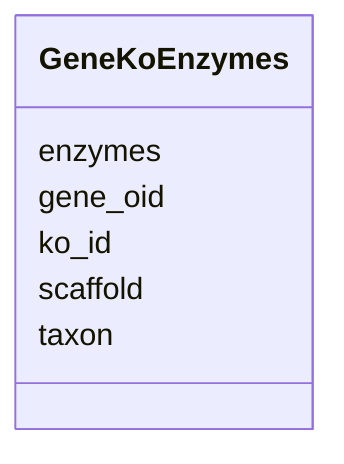

# Class: GeneKoEnzymes 


URI: [img_core_v400:GeneKoEnzymes](https://w3id.org/jgi/img_core_v400/GeneKoEnzymes)





<!-- no inheritance hierarchy -->


## Slots

| Name | Cardinality and Range | Description | Inheritance |
| ---  | --- | --- | --- |
| [gene_oid](gene_oid.md) | 0..1 <br/> [Integer](Integer.md) |  | direct |
| [enzymes](enzymes.md) | 0..1 <br/> [String](String.md) |  | direct |
| [ko_id](ko_id.md) | 0..1 <br/> [String](String.md) |  | direct |
| [taxon](taxon.md) | 0..1 <br/> [Integer](Integer.md) |  | direct |
| [scaffold](scaffold.md) | 0..1 <br/> [Integer](Integer.md) |  | direct |


## Identifier and Mapping Information


### Schema Source


* from schema: https://w3id.org/jgi/img_core_v400


## Mappings

| Mapping Type | Mapped Value |
| ---  | ---  |
| self | img_core_v400:GeneKoEnzymes |
| native | img_core_v400:GeneKoEnzymes |


## LinkML Source

<!-- TODO: investigate https://stackoverflow.com/questions/37606292/how-to-create-tabbed-code-blocks-in-mkdocs-or-sphinx -->

### Direct

<details>
```yaml
name: gene_ko_enzymes
from_schema: https://w3id.org/jgi/img_core_v400
attributes:
  gene_oid:
    name: gene_oid
    from_schema: https://w3id.org/jgi/img_core_v400
    domain_of:
    - actino_abc_genes
    - delete_genes
    - dt_ht_hits
    - dt_img_gene_prot_pep_sample
    - dt_phylum_dist_genes
    - dt_scog_genes
    - gene
    - gene_aliases
    - gene_biocyc_rxns
    - gene_cathfam
    - gene_cog_groups
    - gene_essential_genes
    - gene_exceptions
    - gene_ext_links
    - gene_feature_tags
    - gene_frag_coords
    - gene_go_terms
    - gene_img_interpro_hits
    - gene_ko_enzymes
    - gene_ko_enzymes_new
    - gene_ko_terms
    - gene_kog_groups
    - gene_notes
    - gene_paralogs
    - gene_pdb_xrefs
    - gene_pfam_families
    - gene_sig_peptides
    - gene_smart
    - gene_superfam
    - gene_tigrfams
    - gene_xref_families
    - kp_pseudo
    - merfs_gene_mapping
    - mv_gene_tmhmm_stats
    - tmp_genes
    range: integer
    required: false
  enzymes:
    name: enzymes
    from_schema: https://w3id.org/jgi/img_core_v400
    rank: 1000
    domain_of:
    - gene_ko_enzymes
    - gene_ko_enzymes_new
    - image_roi_enzymes
    - ko_term_enzymes
    - reaction_enzymes
    - tigrfam_enzymes
    range: string
    required: false
  ko_id:
    name: ko_id
    from_schema: https://w3id.org/jgi/img_core_v400
    domain_of:
    - dt_ko
    - dt_ko_ec_cog_pfam
    - gene_ko_enzymes
    - gene_ko_enzymes_new
    - ko2cog
    - ko2ec
    - ko2go
    - ko2module
    - ko2pathway
    - ko2reaction
    - ko2tc
    - ko_term
    - ko_term_classes
    - ko_term_cogs
    - ko_term_enzymes
    - ko_term_go_ids
    - ko_term_modules
    - ko_term_pathways
    - ko_term_reactions
    - ko_term_tc_families
    range: string
    required: false
  taxon:
    name: taxon
    from_schema: https://w3id.org/jgi/img_core_v400
    domain_of:
    - cog_species
    - dt_img_gene_prot_pep_sample
    - dt_taxon_node_lite
    - gene
    - gene_biocyc_rxns
    - gene_cathfam
    - gene_cog_groups
    - gene_img_interpro_hits
    - gene_ko_enzymes
    - gene_ko_enzymes_new
    - gene_ko_terms
    - gene_kog_groups
    - gene_pfam_families
    - gene_smart
    - gene_superfam
    - gene_tigrfams
    - gene_xref_families
    - kp_pseudo
    - merfs_gene_mapping
    - paralog_group
    - scaffold
    - scaffold_stats
    - taxon_node_lite
    range: integer
    required: false
  scaffold:
    name: scaffold
    from_schema: https://w3id.org/jgi/img_core_v400
    domain_of:
    - gene
    - gene_biocyc_rxns
    - gene_cathfam
    - gene_cog_groups
    - gene_img_interpro_hits
    - gene_ko_enzymes
    - gene_ko_enzymes_new
    - gene_ko_terms
    - gene_kog_groups
    - gene_pfam_families
    - gene_smart
    - gene_superfam
    - gene_tigrfams
    - gene_xref_families
    - iso_plasmids
    - kp_pseudo
    range: integer
    required: false

```
</details>

### Induced

<details>
```yaml
name: gene_ko_enzymes
from_schema: https://w3id.org/jgi/img_core_v400
attributes:
  gene_oid:
    name: gene_oid
    from_schema: https://w3id.org/jgi/img_core_v400
    alias: gene_oid
    owner: gene_ko_enzymes
    domain_of:
    - actino_abc_genes
    - delete_genes
    - dt_ht_hits
    - dt_img_gene_prot_pep_sample
    - dt_phylum_dist_genes
    - dt_scog_genes
    - gene
    - gene_aliases
    - gene_biocyc_rxns
    - gene_cathfam
    - gene_cog_groups
    - gene_essential_genes
    - gene_exceptions
    - gene_ext_links
    - gene_feature_tags
    - gene_frag_coords
    - gene_go_terms
    - gene_img_interpro_hits
    - gene_ko_enzymes
    - gene_ko_enzymes_new
    - gene_ko_terms
    - gene_kog_groups
    - gene_notes
    - gene_paralogs
    - gene_pdb_xrefs
    - gene_pfam_families
    - gene_sig_peptides
    - gene_smart
    - gene_superfam
    - gene_tigrfams
    - gene_xref_families
    - kp_pseudo
    - merfs_gene_mapping
    - mv_gene_tmhmm_stats
    - tmp_genes
    range: integer
    required: false
  enzymes:
    name: enzymes
    from_schema: https://w3id.org/jgi/img_core_v400
    rank: 1000
    alias: enzymes
    owner: gene_ko_enzymes
    domain_of:
    - gene_ko_enzymes
    - gene_ko_enzymes_new
    - image_roi_enzymes
    - ko_term_enzymes
    - reaction_enzymes
    - tigrfam_enzymes
    range: string
    required: false
  ko_id:
    name: ko_id
    from_schema: https://w3id.org/jgi/img_core_v400
    alias: ko_id
    owner: gene_ko_enzymes
    domain_of:
    - dt_ko
    - dt_ko_ec_cog_pfam
    - gene_ko_enzymes
    - gene_ko_enzymes_new
    - ko2cog
    - ko2ec
    - ko2go
    - ko2module
    - ko2pathway
    - ko2reaction
    - ko2tc
    - ko_term
    - ko_term_classes
    - ko_term_cogs
    - ko_term_enzymes
    - ko_term_go_ids
    - ko_term_modules
    - ko_term_pathways
    - ko_term_reactions
    - ko_term_tc_families
    range: string
    required: false
  taxon:
    name: taxon
    from_schema: https://w3id.org/jgi/img_core_v400
    alias: taxon
    owner: gene_ko_enzymes
    domain_of:
    - cog_species
    - dt_img_gene_prot_pep_sample
    - dt_taxon_node_lite
    - gene
    - gene_biocyc_rxns
    - gene_cathfam
    - gene_cog_groups
    - gene_img_interpro_hits
    - gene_ko_enzymes
    - gene_ko_enzymes_new
    - gene_ko_terms
    - gene_kog_groups
    - gene_pfam_families
    - gene_smart
    - gene_superfam
    - gene_tigrfams
    - gene_xref_families
    - kp_pseudo
    - merfs_gene_mapping
    - paralog_group
    - scaffold
    - scaffold_stats
    - taxon_node_lite
    range: integer
    required: false
  scaffold:
    name: scaffold
    from_schema: https://w3id.org/jgi/img_core_v400
    alias: scaffold
    owner: gene_ko_enzymes
    domain_of:
    - gene
    - gene_biocyc_rxns
    - gene_cathfam
    - gene_cog_groups
    - gene_img_interpro_hits
    - gene_ko_enzymes
    - gene_ko_enzymes_new
    - gene_ko_terms
    - gene_kog_groups
    - gene_pfam_families
    - gene_smart
    - gene_superfam
    - gene_tigrfams
    - gene_xref_families
    - iso_plasmids
    - kp_pseudo
    range: integer
    required: false

```
</details>