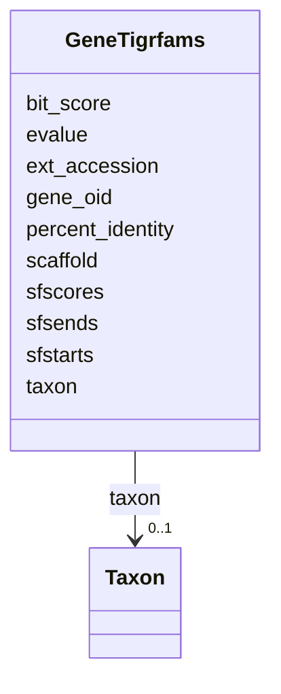

# Class: GeneTigrfams 


URI: [img_core_v400:GeneTigrfams](https://w3id.org/jgi/img_core_v400/GeneTigrfams)





<!-- no inheritance hierarchy -->


## Slots

| Name | Cardinality and Range | Description | Inheritance |
| ---  | --- | --- | --- |
| [gene_oid](gene_oid.md) | 0..1 <br/> [Integer](Integer.md) |  | direct |
| [ext_accession](ext_accession.md) | 0..1 <br/> [String](String.md) |  | direct |
| [sfstarts](sfstarts.md) | 0..1 <br/> [String](String.md) |  | direct |
| [sfsends](sfsends.md) | 0..1 <br/> [String](String.md) |  | direct |
| [sfscores](sfscores.md) | 0..1 <br/> [String](String.md) |  | direct |
| [bit_score](bit_score.md) | 0..1 <br/> [Float](Float.md) |  | direct |
| [percent_identity](percent_identity.md) | 0..1 <br/> [Float](Float.md) |  | direct |
| [evalue](evalue.md) | 0..1 <br/> [Float](Float.md) |  | direct |
| [taxon](taxon.md) | 0..1 <br/> [Taxon](Taxon.md) | Foreign key to taxon | direct |
| [scaffold](scaffold.md) | 0..1 <br/> [Integer](Integer.md) |  | direct |


## Identifier and Mapping Information


### Schema Source


* from schema: https://w3id.org/jgi/img_core_v400


## Mappings

| Mapping Type | Mapped Value |
| ---  | ---  |
| self | img_core_v400:GeneTigrfams |
| native | img_core_v400:GeneTigrfams |


## LinkML Source

<!-- TODO: investigate https://stackoverflow.com/questions/37606292/how-to-create-tabbed-code-blocks-in-mkdocs-or-sphinx -->

### Direct

<details>
```yaml
name: gene_tigrfams
from_schema: https://w3id.org/jgi/img_core_v400
attributes:
  gene_oid:
    name: gene_oid
    from_schema: https://w3id.org/jgi/img_core_v400
    domain_of:
    - actino_abc_genes
    - delete_genes
    - dt_ht_hits
    - dt_img_gene_prot_pep_sample
    - dt_phylum_dist_genes
    - dt_scog_genes
    - gene
    - gene_aliases
    - gene_biocyc_rxns
    - gene_cathfam
    - gene_cog_groups
    - gene_essential_genes
    - gene_exceptions
    - gene_ext_links
    - gene_feature_tags
    - gene_frag_coords
    - gene_go_terms
    - gene_img_interpro_hits
    - gene_ko_enzymes
    - gene_ko_enzymes_new
    - gene_ko_terms
    - gene_kog_groups
    - gene_notes
    - gene_paralogs
    - gene_pdb_xrefs
    - gene_pfam_families
    - gene_sig_peptides
    - gene_smart
    - gene_superfam
    - gene_tigrfams
    - gene_xref_families
    - kp_pseudo
    - merfs_gene_mapping
    - mv_gene_tmhmm_stats
    - tmp_genes
    range: integer
    required: false
  ext_accession:
    name: ext_accession
    from_schema: https://w3id.org/jgi/img_core_v400
    domain_of:
    - alt_transcript
    - compound
    - compound_aliases
    - compound_ext_links
    - gene_tigrfams
    - interpro
    - interpro_go_terms
    - pfam_clan
    - pfam_clan_pfam_families
    - pfam_family
    - pfam_family_cogs
    - pfam_family_ext_links
    - pfam_family_genome_properties
    - reaction
    - reaction_compounds
    - reaction_enzymes
    - reaction_ext_links
    - scaffold
    - tigrfam
    - tigrfam_enzymes
    - tigrfam_genome_properties
    - tigrfam_roles
    range: string
    required: false
  sfstarts:
    name: sfstarts
    from_schema: https://w3id.org/jgi/img_core_v400
    domain_of:
    - gene_img_interpro_hits
    - gene_tigrfams
    range: string
    required: false
  sfsends:
    name: sfsends
    from_schema: https://w3id.org/jgi/img_core_v400
    rank: 1000
    domain_of:
    - gene_tigrfams
    range: string
    required: false
  sfscores:
    name: sfscores
    from_schema: https://w3id.org/jgi/img_core_v400
    domain_of:
    - gene_img_interpro_hits
    - gene_tigrfams
    range: string
    required: false
  bit_score:
    name: bit_score
    from_schema: https://w3id.org/jgi/img_core_v400
    domain_of:
    - dt_phylum_dist_genes
    - gene_cathfam
    - gene_cog_groups
    - gene_ko_terms
    - gene_kog_groups
    - gene_paralogs
    - gene_pfam_families
    - gene_smart
    - gene_superfam
    - gene_tigrfams
    range: float
    required: false
  percent_identity:
    name: percent_identity
    from_schema: https://w3id.org/jgi/img_core_v400
    domain_of:
    - dt_phylum_dist_genes
    - gene_cathfam
    - gene_cog_groups
    - gene_ko_terms
    - gene_kog_groups
    - gene_paralogs
    - gene_pfam_families
    - gene_smart
    - gene_superfam
    - gene_tigrfams
    range: float
    required: false
  evalue:
    name: evalue
    from_schema: https://w3id.org/jgi/img_core_v400
    domain_of:
    - gene_cathfam
    - gene_cog_groups
    - gene_ko_terms
    - gene_kog_groups
    - gene_paralogs
    - gene_pfam_families
    - gene_smart
    - gene_superfam
    - gene_tigrfams
    range: float
    required: false
  taxon:
    name: taxon
    description: Foreign key to taxon
    from_schema: https://w3id.org/jgi/img_core_v400
    domain_of:
    - cog_species
    - dt_img_gene_prot_pep_sample
    - dt_taxon_node_lite
    - gene
    - gene_biocyc_rxns
    - gene_cathfam
    - gene_cog_groups
    - gene_img_interpro_hits
    - gene_ko_enzymes
    - gene_ko_enzymes_new
    - gene_ko_terms
    - gene_kog_groups
    - gene_pfam_families
    - gene_smart
    - gene_superfam
    - gene_tigrfams
    - gene_xref_families
    - kp_pseudo
    - merfs_gene_mapping
    - paralog_group
    - scaffold
    - scaffold_stats
    - taxon_node_lite
    range: taxon
    required: false
  scaffold:
    name: scaffold
    from_schema: https://w3id.org/jgi/img_core_v400
    domain_of:
    - gene
    - gene_biocyc_rxns
    - gene_cathfam
    - gene_cog_groups
    - gene_img_interpro_hits
    - gene_ko_enzymes
    - gene_ko_enzymes_new
    - gene_ko_terms
    - gene_kog_groups
    - gene_pfam_families
    - gene_smart
    - gene_superfam
    - gene_tigrfams
    - gene_xref_families
    - iso_plasmids
    - kp_pseudo
    range: integer
    required: false

```
</details>

### Induced

<details>
```yaml
name: gene_tigrfams
from_schema: https://w3id.org/jgi/img_core_v400
attributes:
  gene_oid:
    name: gene_oid
    from_schema: https://w3id.org/jgi/img_core_v400
    alias: gene_oid
    owner: gene_tigrfams
    domain_of:
    - actino_abc_genes
    - delete_genes
    - dt_ht_hits
    - dt_img_gene_prot_pep_sample
    - dt_phylum_dist_genes
    - dt_scog_genes
    - gene
    - gene_aliases
    - gene_biocyc_rxns
    - gene_cathfam
    - gene_cog_groups
    - gene_essential_genes
    - gene_exceptions
    - gene_ext_links
    - gene_feature_tags
    - gene_frag_coords
    - gene_go_terms
    - gene_img_interpro_hits
    - gene_ko_enzymes
    - gene_ko_enzymes_new
    - gene_ko_terms
    - gene_kog_groups
    - gene_notes
    - gene_paralogs
    - gene_pdb_xrefs
    - gene_pfam_families
    - gene_sig_peptides
    - gene_smart
    - gene_superfam
    - gene_tigrfams
    - gene_xref_families
    - kp_pseudo
    - merfs_gene_mapping
    - mv_gene_tmhmm_stats
    - tmp_genes
    range: integer
    required: false
  ext_accession:
    name: ext_accession
    from_schema: https://w3id.org/jgi/img_core_v400
    alias: ext_accession
    owner: gene_tigrfams
    domain_of:
    - alt_transcript
    - compound
    - compound_aliases
    - compound_ext_links
    - gene_tigrfams
    - interpro
    - interpro_go_terms
    - pfam_clan
    - pfam_clan_pfam_families
    - pfam_family
    - pfam_family_cogs
    - pfam_family_ext_links
    - pfam_family_genome_properties
    - reaction
    - reaction_compounds
    - reaction_enzymes
    - reaction_ext_links
    - scaffold
    - tigrfam
    - tigrfam_enzymes
    - tigrfam_genome_properties
    - tigrfam_roles
    range: string
    required: false
  sfstarts:
    name: sfstarts
    from_schema: https://w3id.org/jgi/img_core_v400
    alias: sfstarts
    owner: gene_tigrfams
    domain_of:
    - gene_img_interpro_hits
    - gene_tigrfams
    range: string
    required: false
  sfsends:
    name: sfsends
    from_schema: https://w3id.org/jgi/img_core_v400
    rank: 1000
    alias: sfsends
    owner: gene_tigrfams
    domain_of:
    - gene_tigrfams
    range: string
    required: false
  sfscores:
    name: sfscores
    from_schema: https://w3id.org/jgi/img_core_v400
    alias: sfscores
    owner: gene_tigrfams
    domain_of:
    - gene_img_interpro_hits
    - gene_tigrfams
    range: string
    required: false
  bit_score:
    name: bit_score
    from_schema: https://w3id.org/jgi/img_core_v400
    alias: bit_score
    owner: gene_tigrfams
    domain_of:
    - dt_phylum_dist_genes
    - gene_cathfam
    - gene_cog_groups
    - gene_ko_terms
    - gene_kog_groups
    - gene_paralogs
    - gene_pfam_families
    - gene_smart
    - gene_superfam
    - gene_tigrfams
    range: float
    required: false
  percent_identity:
    name: percent_identity
    from_schema: https://w3id.org/jgi/img_core_v400
    alias: percent_identity
    owner: gene_tigrfams
    domain_of:
    - dt_phylum_dist_genes
    - gene_cathfam
    - gene_cog_groups
    - gene_ko_terms
    - gene_kog_groups
    - gene_paralogs
    - gene_pfam_families
    - gene_smart
    - gene_superfam
    - gene_tigrfams
    range: float
    required: false
  evalue:
    name: evalue
    from_schema: https://w3id.org/jgi/img_core_v400
    alias: evalue
    owner: gene_tigrfams
    domain_of:
    - gene_cathfam
    - gene_cog_groups
    - gene_ko_terms
    - gene_kog_groups
    - gene_paralogs
    - gene_pfam_families
    - gene_smart
    - gene_superfam
    - gene_tigrfams
    range: float
    required: false
  taxon:
    name: taxon
    description: Foreign key to taxon
    from_schema: https://w3id.org/jgi/img_core_v400
    alias: taxon
    owner: gene_tigrfams
    domain_of:
    - cog_species
    - dt_img_gene_prot_pep_sample
    - dt_taxon_node_lite
    - gene
    - gene_biocyc_rxns
    - gene_cathfam
    - gene_cog_groups
    - gene_img_interpro_hits
    - gene_ko_enzymes
    - gene_ko_enzymes_new
    - gene_ko_terms
    - gene_kog_groups
    - gene_pfam_families
    - gene_smart
    - gene_superfam
    - gene_tigrfams
    - gene_xref_families
    - kp_pseudo
    - merfs_gene_mapping
    - paralog_group
    - scaffold
    - scaffold_stats
    - taxon_node_lite
    range: taxon
    required: false
  scaffold:
    name: scaffold
    from_schema: https://w3id.org/jgi/img_core_v400
    alias: scaffold
    owner: gene_tigrfams
    domain_of:
    - gene
    - gene_biocyc_rxns
    - gene_cathfam
    - gene_cog_groups
    - gene_img_interpro_hits
    - gene_ko_enzymes
    - gene_ko_enzymes_new
    - gene_ko_terms
    - gene_kog_groups
    - gene_pfam_families
    - gene_smart
    - gene_superfam
    - gene_tigrfams
    - gene_xref_families
    - iso_plasmids
    - kp_pseudo
    range: integer
    required: false

```
</details>