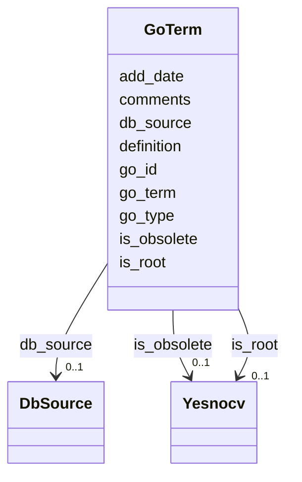

# Class: GoTerm 


URI: [img_core_v400:GoTerm](https://w3id.org/jgi/img_core_v400/GoTerm)





<!-- no inheritance hierarchy -->


## Slots

| Name | Cardinality and Range | Description | Inheritance |
| ---  | --- | --- | --- |
| [go_id](go_id.md) | 0..1 <br/> [String](String.md) |  | direct |
| [go_term](go_term.md) | 0..1 <br/> [String](String.md) |  | direct |
| [go_type](go_type.md) | 0..1 <br/> [String](String.md) |  | direct |
| [definition](definition.md) | 0..1 <br/> [String](String.md) |  | direct |
| [comments](comments.md) | 0..1 <br/> [String](String.md) |  | direct |
| [is_root](is_root.md) | 0..1 <br/> [Yesnocv](Yesnocv.md) | Foreign key to yesnocv | direct |
| [is_obsolete](is_obsolete.md) | 0..1 <br/> [Yesnocv](Yesnocv.md) | Foreign key to yesnocv | direct |
| [db_source](db_source.md) | 0..1 <br/> [DbSource](DbSource.md) | Foreign key to db_source | direct |
| [add_date](add_date.md) | 0..1 <br/> [Datetime](Datetime.md) |  | direct |


## Usages

| used by | used in | type | used |
| ---  | --- | --- | --- |
| [GoGraphPath](GoGraphPath.md) | [term_1](term_1.md) | range | [GoTerm](GoTerm.md) |
| [GoGraphPath](GoGraphPath.md) | [term_2](term_2.md) | range | [GoTerm](GoTerm.md) |
| [GoTermParents](GoTermParents.md) | [go_id](go_id.md) | range | [GoTerm](GoTerm.md) |
| [GoTermParents](GoTermParents.md) | [parent](parent.md) | range | [GoTerm](GoTerm.md) |
| [GoTermSynonyms](GoTermSynonyms.md) | [go_id](go_id.md) | range | [GoTerm](GoTerm.md) |
| [KoTermGoIds](KoTermGoIds.md) | [go_ids](go_ids.md) | range | [GoTerm](GoTerm.md) |


## Identifier and Mapping Information


### Schema Source


* from schema: https://w3id.org/jgi/img_core_v400


## Mappings

| Mapping Type | Mapped Value |
| ---  | ---  |
| self | img_core_v400:GoTerm |
| native | img_core_v400:GoTerm |


## LinkML Source

<!-- TODO: investigate https://stackoverflow.com/questions/37606292/how-to-create-tabbed-code-blocks-in-mkdocs-or-sphinx -->

### Direct

<details>
```yaml
name: go_term
from_schema: https://w3id.org/jgi/img_core_v400
attributes:
  go_id:
    name: go_id
    from_schema: https://w3id.org/jgi/img_core_v400
    domain_of:
    - gene_go_terms
    - go_term
    - go_term_parents
    - go_term_synonyms
    - ko2go
    - pfam2go
    range: string
    required: false
  go_term:
    name: go_term
    from_schema: https://w3id.org/jgi/img_core_v400
    rank: 1000
    domain_of:
    - go_term
    - pfam2go
    range: string
    required: false
  go_type:
    name: go_type
    from_schema: https://w3id.org/jgi/img_core_v400
    domain_of:
    - gene_go_terms
    - go_term
    range: string
    required: false
  definition:
    name: definition
    from_schema: https://w3id.org/jgi/img_core_v400
    domain_of:
    - cog_function
    - go_term
    - img_orf_type
    - kegg_module
    - ko_term
    - kog_function
    - smart
    range: string
    required: false
  comments:
    name: comments
    from_schema: https://w3id.org/jgi/img_core_v400
    domain_of:
    - biocyc_class
    - biocyc_comp
    - biocyc_enzrxn
    - biocyc_pathway_comments
    - biocyc_protein
    - biocyc_reaction
    - enzyme
    - enzyme_transferred
    - gene_sig_peptides
    - go_term
    - pfam_clan
    - pfam_dead
    - pfam_family
    - reaction
    - taxon
    - taxon_prod_vw
    - taxon_replacements
    range: string
    required: false
  is_root:
    name: is_root
    description: Foreign key to yesnocv
    from_schema: https://w3id.org/jgi/img_core_v400
    rank: 1000
    domain_of:
    - go_term
    range: yesnocv
    required: false
  is_obsolete:
    name: is_obsolete
    description: Foreign key to yesnocv
    from_schema: https://w3id.org/jgi/img_core_v400
    rank: 1000
    domain_of:
    - go_term
    range: yesnocv
    required: false
  db_source:
    name: db_source
    description: Foreign key to db_source
    from_schema: https://w3id.org/jgi/img_core_v400
    domain_of:
    - biocyc_comp
    - cog
    - compound
    - go_term
    - kegg_pathway
    - kog
    - pfam_family
    - scaffold
    range: db_source
    required: false
  add_date:
    name: add_date
    from_schema: https://w3id.org/jgi/img_core_v400
    domain_of:
    - bcg_taxons
    - cog
    - cog_function
    - cog_species
    - compound
    - enzyme
    - enzyme_transferred
    - gene
    - gene_biocyc_rxns
    - genome_property
    - go_graph_path
    - go_term
    - image_roi
    - kegg_pathway
    - km_image_roi
    - ko_term
    - kog
    - kog_function
    - paralog_group
    - pfam_clan
    - pfam_family
    - positional_cluster
    - property_step
    - reaction
    - scaffold
    - taxon
    - taxon_prod_vw
    - tigr_role
    - tigrfam
    range: datetime
    required: false

```
</details>

### Induced

<details>
```yaml
name: go_term
from_schema: https://w3id.org/jgi/img_core_v400
attributes:
  go_id:
    name: go_id
    from_schema: https://w3id.org/jgi/img_core_v400
    alias: go_id
    owner: go_term
    domain_of:
    - gene_go_terms
    - go_term
    - go_term_parents
    - go_term_synonyms
    - ko2go
    - pfam2go
    range: string
    required: false
  go_term:
    name: go_term
    from_schema: https://w3id.org/jgi/img_core_v400
    rank: 1000
    alias: go_term
    owner: go_term
    domain_of:
    - go_term
    - pfam2go
    range: string
    required: false
  go_type:
    name: go_type
    from_schema: https://w3id.org/jgi/img_core_v400
    alias: go_type
    owner: go_term
    domain_of:
    - gene_go_terms
    - go_term
    range: string
    required: false
  definition:
    name: definition
    from_schema: https://w3id.org/jgi/img_core_v400
    alias: definition
    owner: go_term
    domain_of:
    - cog_function
    - go_term
    - img_orf_type
    - kegg_module
    - ko_term
    - kog_function
    - smart
    range: string
    required: false
  comments:
    name: comments
    from_schema: https://w3id.org/jgi/img_core_v400
    alias: comments
    owner: go_term
    domain_of:
    - biocyc_class
    - biocyc_comp
    - biocyc_enzrxn
    - biocyc_pathway_comments
    - biocyc_protein
    - biocyc_reaction
    - enzyme
    - enzyme_transferred
    - gene_sig_peptides
    - go_term
    - pfam_clan
    - pfam_dead
    - pfam_family
    - reaction
    - taxon
    - taxon_prod_vw
    - taxon_replacements
    range: string
    required: false
  is_root:
    name: is_root
    description: Foreign key to yesnocv
    from_schema: https://w3id.org/jgi/img_core_v400
    rank: 1000
    alias: is_root
    owner: go_term
    domain_of:
    - go_term
    range: yesnocv
    required: false
  is_obsolete:
    name: is_obsolete
    description: Foreign key to yesnocv
    from_schema: https://w3id.org/jgi/img_core_v400
    rank: 1000
    alias: is_obsolete
    owner: go_term
    domain_of:
    - go_term
    range: yesnocv
    required: false
  db_source:
    name: db_source
    description: Foreign key to db_source
    from_schema: https://w3id.org/jgi/img_core_v400
    alias: db_source
    owner: go_term
    domain_of:
    - biocyc_comp
    - cog
    - compound
    - go_term
    - kegg_pathway
    - kog
    - pfam_family
    - scaffold
    range: db_source
    required: false
  add_date:
    name: add_date
    from_schema: https://w3id.org/jgi/img_core_v400
    alias: add_date
    owner: go_term
    domain_of:
    - bcg_taxons
    - cog
    - cog_function
    - cog_species
    - compound
    - enzyme
    - enzyme_transferred
    - gene
    - gene_biocyc_rxns
    - genome_property
    - go_graph_path
    - go_term
    - image_roi
    - kegg_pathway
    - km_image_roi
    - ko_term
    - kog
    - kog_function
    - paralog_group
    - pfam_clan
    - pfam_family
    - positional_cluster
    - property_step
    - reaction
    - scaffold
    - taxon
    - taxon_prod_vw
    - tigr_role
    - tigrfam
    range: datetime
    required: false

```
</details>