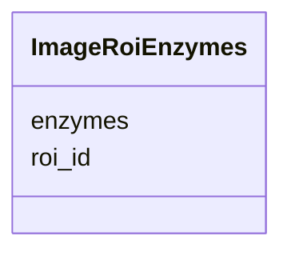

# Class: ImageRoiEnzymes 


URI: [img_core_v400:ImageRoiEnzymes](https://w3id.org/jgi/img_core_v400/ImageRoiEnzymes)





<!-- no inheritance hierarchy -->


## Slots

| Name | Cardinality and Range | Description | Inheritance |
| ---  | --- | --- | --- |
| [roi_id](roi_id.md) | 0..1 <br/> [Integer](Integer.md) |  | direct |
| [enzymes](enzymes.md) | 0..1 <br/> [String](String.md) |  | direct |


## Identifier and Mapping Information


### Schema Source


* from schema: https://w3id.org/jgi/img_core_v400


## Mappings

| Mapping Type | Mapped Value |
| ---  | ---  |
| self | img_core_v400:ImageRoiEnzymes |
| native | img_core_v400:ImageRoiEnzymes |


## LinkML Source

<!-- TODO: investigate https://stackoverflow.com/questions/37606292/how-to-create-tabbed-code-blocks-in-mkdocs-or-sphinx -->

### Direct

<details>
```yaml
name: image_roi_enzymes
from_schema: https://w3id.org/jgi/img_core_v400
attributes:
  roi_id:
    name: roi_id
    from_schema: https://w3id.org/jgi/img_core_v400
    domain_of:
    - image_roi
    - image_roi_compounds
    - image_roi_enzymes
    - image_roi_ko_terms
    - image_roi_reactions
    - km_image_roi
    - km_image_roi_ko_terms
    range: integer
    required: false
  enzymes:
    name: enzymes
    from_schema: https://w3id.org/jgi/img_core_v400
    domain_of:
    - gene_ko_enzymes
    - gene_ko_enzymes_new
    - image_roi_enzymes
    - ko_term_enzymes
    - reaction_enzymes
    - tigrfam_enzymes
    range: string
    required: false

```
</details>

### Induced

<details>
```yaml
name: image_roi_enzymes
from_schema: https://w3id.org/jgi/img_core_v400
attributes:
  roi_id:
    name: roi_id
    from_schema: https://w3id.org/jgi/img_core_v400
    alias: roi_id
    owner: image_roi_enzymes
    domain_of:
    - image_roi
    - image_roi_compounds
    - image_roi_enzymes
    - image_roi_ko_terms
    - image_roi_reactions
    - km_image_roi
    - km_image_roi_ko_terms
    range: integer
    required: false
  enzymes:
    name: enzymes
    from_schema: https://w3id.org/jgi/img_core_v400
    alias: enzymes
    owner: image_roi_enzymes
    domain_of:
    - gene_ko_enzymes
    - gene_ko_enzymes_new
    - image_roi_enzymes
    - ko_term_enzymes
    - reaction_enzymes
    - tigrfam_enzymes
    range: string
    required: false

```
</details>