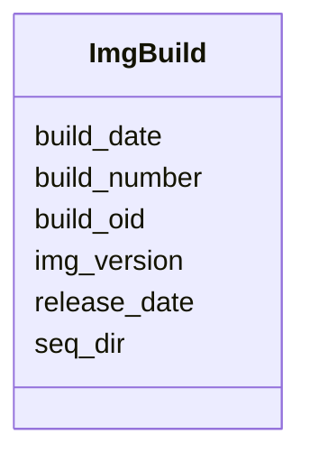

# Class: ImgBuild 


URI: [img_core_v400:ImgBuild](https://w3id.org/jgi/img_core_v400/ImgBuild)





<!-- no inheritance hierarchy -->


## Slots

| Name | Cardinality and Range | Description | Inheritance |
| ---  | --- | --- | --- |
| [build_oid](build_oid.md) | 0..1 <br/> [Integer](Integer.md) |  | direct |
| [build_number](build_number.md) | 0..1 <br/> [Integer](Integer.md) |  | direct |
| [build_date](build_date.md) | 0..1 <br/> [Datetime](Datetime.md) |  | direct |
| [release_date](release_date.md) | 0..1 <br/> [Datetime](Datetime.md) |  | direct |
| [img_version](img_version.md) | 0..1 <br/> [String](String.md) |  | direct |
| [seq_dir](seq_dir.md) | 0..1 <br/> [String](String.md) |  | direct |


## Identifier and Mapping Information


### Schema Source


* from schema: https://w3id.org/jgi/img_core_v400


## Mappings

| Mapping Type | Mapped Value |
| ---  | ---  |
| self | img_core_v400:ImgBuild |
| native | img_core_v400:ImgBuild |


## LinkML Source

<!-- TODO: investigate https://stackoverflow.com/questions/37606292/how-to-create-tabbed-code-blocks-in-mkdocs-or-sphinx -->

### Direct

<details>
```yaml
name: img_build
from_schema: https://w3id.org/jgi/img_core_v400
attributes:
  build_oid:
    name: build_oid
    from_schema: https://w3id.org/jgi/img_core_v400
    rank: 1000
    domain_of:
    - img_build
    range: integer
    required: false
  build_number:
    name: build_number
    from_schema: https://w3id.org/jgi/img_core_v400
    rank: 1000
    domain_of:
    - img_build
    range: integer
    required: false
  build_date:
    name: build_date
    from_schema: https://w3id.org/jgi/img_core_v400
    rank: 1000
    domain_of:
    - img_build
    range: datetime
    required: false
  release_date:
    name: release_date
    from_schema: https://w3id.org/jgi/img_core_v400
    rank: 1000
    domain_of:
    - img_build
    - img_content_history
    - taxon
    - taxon_prod_vw
    - taxon_replacements
    range: datetime
    required: false
  img_version:
    name: img_version
    from_schema: https://w3id.org/jgi/img_core_v400
    rank: 1000
    domain_of:
    - img_build
    - img_content_history
    - taxon
    - taxon_prod_vw
    - taxon_replacements
    range: string
    required: false
  seq_dir:
    name: seq_dir
    from_schema: https://w3id.org/jgi/img_core_v400
    rank: 1000
    domain_of:
    - img_build
    range: string
    required: false

```
</details>

### Induced

<details>
```yaml
name: img_build
from_schema: https://w3id.org/jgi/img_core_v400
attributes:
  build_oid:
    name: build_oid
    from_schema: https://w3id.org/jgi/img_core_v400
    rank: 1000
    alias: build_oid
    owner: img_build
    domain_of:
    - img_build
    range: integer
    required: false
  build_number:
    name: build_number
    from_schema: https://w3id.org/jgi/img_core_v400
    rank: 1000
    alias: build_number
    owner: img_build
    domain_of:
    - img_build
    range: integer
    required: false
  build_date:
    name: build_date
    from_schema: https://w3id.org/jgi/img_core_v400
    rank: 1000
    alias: build_date
    owner: img_build
    domain_of:
    - img_build
    range: datetime
    required: false
  release_date:
    name: release_date
    from_schema: https://w3id.org/jgi/img_core_v400
    rank: 1000
    alias: release_date
    owner: img_build
    domain_of:
    - img_build
    - img_content_history
    - taxon
    - taxon_prod_vw
    - taxon_replacements
    range: datetime
    required: false
  img_version:
    name: img_version
    from_schema: https://w3id.org/jgi/img_core_v400
    rank: 1000
    alias: img_version
    owner: img_build
    domain_of:
    - img_build
    - img_content_history
    - taxon
    - taxon_prod_vw
    - taxon_replacements
    range: string
    required: false
  seq_dir:
    name: seq_dir
    from_schema: https://w3id.org/jgi/img_core_v400
    rank: 1000
    alias: seq_dir
    owner: img_build
    domain_of:
    - img_build
    range: string
    required: false

```
</details>