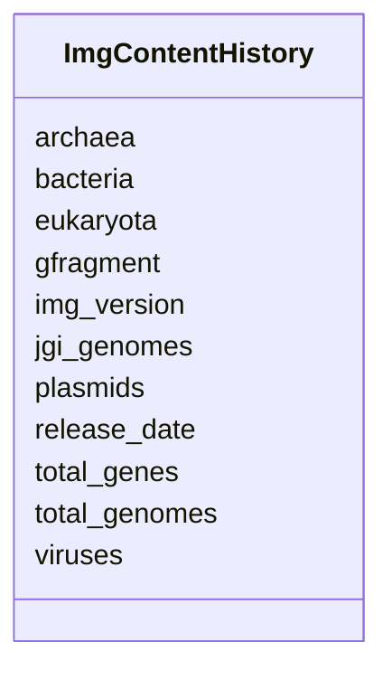

# Class: ImgContentHistory 


URI: [img_core_v400:ImgContentHistory](https://w3id.org/jgi/img_core_v400/ImgContentHistory)





<!-- no inheritance hierarchy -->


## Slots

| Name | Cardinality and Range | Description | Inheritance |
| ---  | --- | --- | --- |
| [img_version](img_version.md) | 0..1 <br/> [String](String.md) |  | direct |
| [release_date](release_date.md) | 0..1 <br/> [Datetime](Datetime.md) |  | direct |
| [bacteria](bacteria.md) | 0..1 <br/> [Integer](Integer.md) |  | direct |
| [archaea](archaea.md) | 0..1 <br/> [Integer](Integer.md) |  | direct |
| [eukaryota](eukaryota.md) | 0..1 <br/> [Integer](Integer.md) |  | direct |
| [plasmids](plasmids.md) | 0..1 <br/> [Integer](Integer.md) |  | direct |
| [viruses](viruses.md) | 0..1 <br/> [Integer](Integer.md) |  | direct |
| [total_genomes](total_genomes.md) | 0..1 <br/> [Integer](Integer.md) |  | direct |
| [total_genes](total_genes.md) | 0..1 <br/> [Integer](Integer.md) |  | direct |
| [jgi_genomes](jgi_genomes.md) | 0..1 <br/> [Integer](Integer.md) |  | direct |
| [gfragment](gfragment.md) | 0..1 <br/> [Integer](Integer.md) |  | direct |


## Identifier and Mapping Information


### Schema Source


* from schema: https://w3id.org/jgi/img_core_v400


## Mappings

| Mapping Type | Mapped Value |
| ---  | ---  |
| self | img_core_v400:ImgContentHistory |
| native | img_core_v400:ImgContentHistory |


## LinkML Source

<!-- TODO: investigate https://stackoverflow.com/questions/37606292/how-to-create-tabbed-code-blocks-in-mkdocs-or-sphinx -->

### Direct

<details>
```yaml
name: img_content_history
from_schema: https://w3id.org/jgi/img_core_v400
attributes:
  img_version:
    name: img_version
    from_schema: https://w3id.org/jgi/img_core_v400
    domain_of:
    - img_build
    - img_content_history
    - taxon
    - taxon_prod_vw
    - taxon_replacements
    range: string
    required: false
  release_date:
    name: release_date
    from_schema: https://w3id.org/jgi/img_core_v400
    domain_of:
    - img_build
    - img_content_history
    - taxon
    - taxon_prod_vw
    - taxon_replacements
    range: datetime
    required: false
  bacteria:
    name: bacteria
    from_schema: https://w3id.org/jgi/img_core_v400
    rank: 1000
    domain_of:
    - img_content_history
    range: integer
    required: false
  archaea:
    name: archaea
    from_schema: https://w3id.org/jgi/img_core_v400
    rank: 1000
    domain_of:
    - img_content_history
    range: integer
    required: false
  eukaryota:
    name: eukaryota
    from_schema: https://w3id.org/jgi/img_core_v400
    rank: 1000
    domain_of:
    - img_content_history
    range: integer
    required: false
  plasmids:
    name: plasmids
    from_schema: https://w3id.org/jgi/img_core_v400
    rank: 1000
    domain_of:
    - img_content_history
    range: integer
    required: false
  viruses:
    name: viruses
    from_schema: https://w3id.org/jgi/img_core_v400
    rank: 1000
    domain_of:
    - img_content_history
    range: integer
    required: false
  total_genomes:
    name: total_genomes
    from_schema: https://w3id.org/jgi/img_core_v400
    rank: 1000
    domain_of:
    - img_content_history
    range: integer
    required: false
  total_genes:
    name: total_genes
    from_schema: https://w3id.org/jgi/img_core_v400
    rank: 1000
    domain_of:
    - img_content_history
    range: integer
    required: false
  jgi_genomes:
    name: jgi_genomes
    from_schema: https://w3id.org/jgi/img_core_v400
    rank: 1000
    domain_of:
    - img_content_history
    range: integer
    required: false
  gfragment:
    name: gfragment
    from_schema: https://w3id.org/jgi/img_core_v400
    rank: 1000
    domain_of:
    - img_content_history
    range: integer
    required: false

```
</details>

### Induced

<details>
```yaml
name: img_content_history
from_schema: https://w3id.org/jgi/img_core_v400
attributes:
  img_version:
    name: img_version
    from_schema: https://w3id.org/jgi/img_core_v400
    alias: img_version
    owner: img_content_history
    domain_of:
    - img_build
    - img_content_history
    - taxon
    - taxon_prod_vw
    - taxon_replacements
    range: string
    required: false
  release_date:
    name: release_date
    from_schema: https://w3id.org/jgi/img_core_v400
    alias: release_date
    owner: img_content_history
    domain_of:
    - img_build
    - img_content_history
    - taxon
    - taxon_prod_vw
    - taxon_replacements
    range: datetime
    required: false
  bacteria:
    name: bacteria
    from_schema: https://w3id.org/jgi/img_core_v400
    rank: 1000
    alias: bacteria
    owner: img_content_history
    domain_of:
    - img_content_history
    range: integer
    required: false
  archaea:
    name: archaea
    from_schema: https://w3id.org/jgi/img_core_v400
    rank: 1000
    alias: archaea
    owner: img_content_history
    domain_of:
    - img_content_history
    range: integer
    required: false
  eukaryota:
    name: eukaryota
    from_schema: https://w3id.org/jgi/img_core_v400
    rank: 1000
    alias: eukaryota
    owner: img_content_history
    domain_of:
    - img_content_history
    range: integer
    required: false
  plasmids:
    name: plasmids
    from_schema: https://w3id.org/jgi/img_core_v400
    rank: 1000
    alias: plasmids
    owner: img_content_history
    domain_of:
    - img_content_history
    range: integer
    required: false
  viruses:
    name: viruses
    from_schema: https://w3id.org/jgi/img_core_v400
    rank: 1000
    alias: viruses
    owner: img_content_history
    domain_of:
    - img_content_history
    range: integer
    required: false
  total_genomes:
    name: total_genomes
    from_schema: https://w3id.org/jgi/img_core_v400
    rank: 1000
    alias: total_genomes
    owner: img_content_history
    domain_of:
    - img_content_history
    range: integer
    required: false
  total_genes:
    name: total_genes
    from_schema: https://w3id.org/jgi/img_core_v400
    rank: 1000
    alias: total_genes
    owner: img_content_history
    domain_of:
    - img_content_history
    range: integer
    required: false
  jgi_genomes:
    name: jgi_genomes
    from_schema: https://w3id.org/jgi/img_core_v400
    rank: 1000
    alias: jgi_genomes
    owner: img_content_history
    domain_of:
    - img_content_history
    range: integer
    required: false
  gfragment:
    name: gfragment
    from_schema: https://w3id.org/jgi/img_core_v400
    rank: 1000
    alias: gfragment
    owner: img_content_history
    domain_of:
    - img_content_history
    range: integer
    required: false

```
</details>