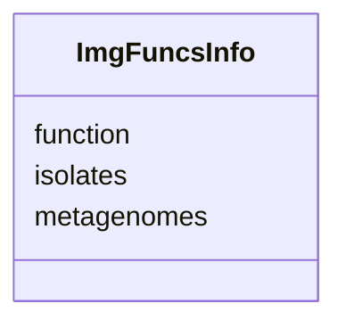

# Class: ImgFuncsInfo 


URI: [img_core_v400:ImgFuncsInfo](https://w3id.org/jgi/img_core_v400/ImgFuncsInfo)





<!-- no inheritance hierarchy -->


## Slots

| Name | Cardinality and Range | Description | Inheritance |
| ---  | --- | --- | --- |
| [function](function.md) | 0..1 <br/> [String](String.md) |  | direct |
| [isolates](isolates.md) | 0..1 <br/> [String](String.md) |  | direct |
| [metagenomes](metagenomes.md) | 0..1 <br/> [String](String.md) |  | direct |


## Identifier and Mapping Information


### Schema Source


* from schema: https://w3id.org/jgi/img_core_v400


## Mappings

| Mapping Type | Mapped Value |
| ---  | ---  |
| self | img_core_v400:ImgFuncsInfo |
| native | img_core_v400:ImgFuncsInfo |


## LinkML Source

<!-- TODO: investigate https://stackoverflow.com/questions/37606292/how-to-create-tabbed-code-blocks-in-mkdocs-or-sphinx -->

### Direct

<details>
```yaml
name: img_funcs_info
from_schema: https://w3id.org/jgi/img_core_v400
attributes:
  function:
    name: function
    from_schema: https://w3id.org/jgi/img_core_v400
    domain_of:
    - cog_pathway
    - img_funcs_info
    - kog_pathway
    range: string
    required: false
  isolates:
    name: isolates
    from_schema: https://w3id.org/jgi/img_core_v400
    rank: 1000
    domain_of:
    - img_funcs_info
    range: string
    required: false
  metagenomes:
    name: metagenomes
    from_schema: https://w3id.org/jgi/img_core_v400
    rank: 1000
    domain_of:
    - img_funcs_info
    range: string
    required: false

```
</details>

### Induced

<details>
```yaml
name: img_funcs_info
from_schema: https://w3id.org/jgi/img_core_v400
attributes:
  function:
    name: function
    from_schema: https://w3id.org/jgi/img_core_v400
    alias: function
    owner: img_funcs_info
    domain_of:
    - cog_pathway
    - img_funcs_info
    - kog_pathway
    range: string
    required: false
  isolates:
    name: isolates
    from_schema: https://w3id.org/jgi/img_core_v400
    rank: 1000
    alias: isolates
    owner: img_funcs_info
    domain_of:
    - img_funcs_info
    range: string
    required: false
  metagenomes:
    name: metagenomes
    from_schema: https://w3id.org/jgi/img_core_v400
    rank: 1000
    alias: metagenomes
    owner: img_funcs_info
    domain_of:
    - img_funcs_info
    range: string
    required: false

```
</details>