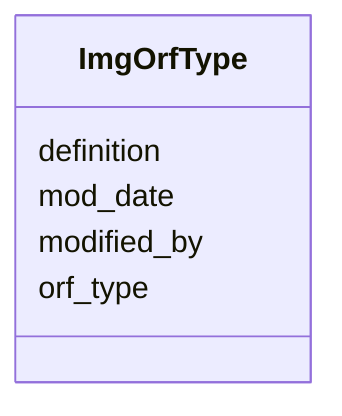

# Class: ImgOrfType 


URI: [img_core_v400:ImgOrfType](https://w3id.org/jgi/img_core_v400/ImgOrfType)





<!-- no inheritance hierarchy -->


## Slots

| Name | Cardinality and Range | Description | Inheritance |
| ---  | --- | --- | --- |
| [orf_type](orf_type.md) | 0..1 <br/> [String](String.md) |  | direct |
| [definition](definition.md) | 0..1 <br/> [String](String.md) |  | direct |
| [mod_date](mod_date.md) | 0..1 <br/> [Datetime](Datetime.md) |  | direct |
| [modified_by](modified_by.md) | 0..1 <br/> [Integer](Integer.md) |  | direct |


## Identifier and Mapping Information


### Schema Source


* from schema: https://w3id.org/jgi/img_core_v400


## Mappings

| Mapping Type | Mapped Value |
| ---  | ---  |
| self | img_core_v400:ImgOrfType |
| native | img_core_v400:ImgOrfType |


## LinkML Source

<!-- TODO: investigate https://stackoverflow.com/questions/37606292/how-to-create-tabbed-code-blocks-in-mkdocs-or-sphinx -->

### Direct

<details>
```yaml
name: img_orf_type
from_schema: https://w3id.org/jgi/img_core_v400
attributes:
  orf_type:
    name: orf_type
    from_schema: https://w3id.org/jgi/img_core_v400
    rank: 1000
    domain_of:
    - img_orf_type
    range: string
    required: false
  definition:
    name: definition
    from_schema: https://w3id.org/jgi/img_core_v400
    domain_of:
    - cog_function
    - go_term
    - img_orf_type
    - kegg_module
    - ko_term
    - kog_function
    - smart
    range: string
    required: false
  mod_date:
    name: mod_date
    from_schema: https://w3id.org/jgi/img_core_v400
    domain_of:
    - gene
    - img_orf_type
    - scaffold_stats
    - taxon
    - taxon_prod_vw
    - taxon_stats
    - taxon_stats_merfs
    - taxon_stats_prod_vw
    range: datetime
    required: false
  modified_by:
    name: modified_by
    from_schema: https://w3id.org/jgi/img_core_v400
    domain_of:
    - gene
    - img_orf_type
    - taxon
    - taxon_prod_vw
    range: integer
    required: false

```
</details>

### Induced

<details>
```yaml
name: img_orf_type
from_schema: https://w3id.org/jgi/img_core_v400
attributes:
  orf_type:
    name: orf_type
    from_schema: https://w3id.org/jgi/img_core_v400
    rank: 1000
    alias: orf_type
    owner: img_orf_type
    domain_of:
    - img_orf_type
    range: string
    required: false
  definition:
    name: definition
    from_schema: https://w3id.org/jgi/img_core_v400
    alias: definition
    owner: img_orf_type
    domain_of:
    - cog_function
    - go_term
    - img_orf_type
    - kegg_module
    - ko_term
    - kog_function
    - smart
    range: string
    required: false
  mod_date:
    name: mod_date
    from_schema: https://w3id.org/jgi/img_core_v400
    alias: mod_date
    owner: img_orf_type
    domain_of:
    - gene
    - img_orf_type
    - scaffold_stats
    - taxon
    - taxon_prod_vw
    - taxon_stats
    - taxon_stats_merfs
    - taxon_stats_prod_vw
    range: datetime
    required: false
  modified_by:
    name: modified_by
    from_schema: https://w3id.org/jgi/img_core_v400
    alias: modified_by
    owner: img_orf_type
    domain_of:
    - gene
    - img_orf_type
    - taxon
    - taxon_prod_vw
    range: integer
    required: false

```
</details>