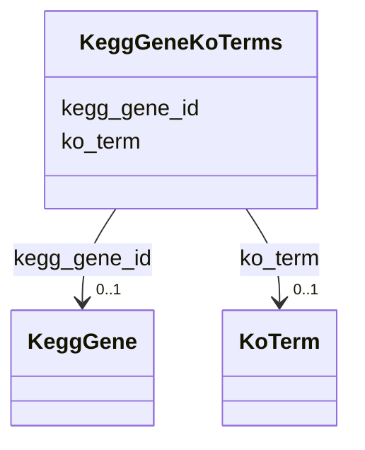

# Class: KeggGeneKoTerms 


URI: [img_core_v400:KeggGeneKoTerms](https://w3id.org/jgi/img_core_v400/KeggGeneKoTerms)





<!-- no inheritance hierarchy -->


## Slots

| Name | Cardinality and Range | Description | Inheritance |
| ---  | --- | --- | --- |
| [kegg_gene_id](kegg_gene_id.md) | 0..1 <br/> [KeggGene](KeggGene.md) | Foreign key to kegg_gene | direct |
| [ko_term](ko_term.md) | 0..1 <br/> [KoTerm](KoTerm.md) | Foreign key to ko_term | direct |


## Identifier and Mapping Information


### Schema Source


* from schema: https://w3id.org/jgi/img_core_v400


## Mappings

| Mapping Type | Mapped Value |
| ---  | ---  |
| self | img_core_v400:KeggGeneKoTerms |
| native | img_core_v400:KeggGeneKoTerms |


## LinkML Source

<!-- TODO: investigate https://stackoverflow.com/questions/37606292/how-to-create-tabbed-code-blocks-in-mkdocs-or-sphinx -->

### Direct

<details>
```yaml
name: kegg_gene_ko_terms
from_schema: https://w3id.org/jgi/img_core_v400
attributes:
  kegg_gene_id:
    name: kegg_gene_id
    description: Foreign key to kegg_gene
    from_schema: https://w3id.org/jgi/img_core_v400
    domain_of:
    - kegg_gene
    - kegg_gene_ko_terms
    - kegg_gene_ncbi_gene_ids
    - kegg_gene_uniprot_ids
    range: kegg_gene
    required: false
  ko_term:
    name: ko_term
    description: Foreign key to ko_term
    from_schema: https://w3id.org/jgi/img_core_v400
    rank: 1000
    domain_of:
    - kegg_gene_ko_terms
    range: ko_term
    required: false

```
</details>

### Induced

<details>
```yaml
name: kegg_gene_ko_terms
from_schema: https://w3id.org/jgi/img_core_v400
attributes:
  kegg_gene_id:
    name: kegg_gene_id
    description: Foreign key to kegg_gene
    from_schema: https://w3id.org/jgi/img_core_v400
    alias: kegg_gene_id
    owner: kegg_gene_ko_terms
    domain_of:
    - kegg_gene
    - kegg_gene_ko_terms
    - kegg_gene_ncbi_gene_ids
    - kegg_gene_uniprot_ids
    range: kegg_gene
    required: false
  ko_term:
    name: ko_term
    description: Foreign key to ko_term
    from_schema: https://w3id.org/jgi/img_core_v400
    rank: 1000
    alias: ko_term
    owner: kegg_gene_ko_terms
    domain_of:
    - kegg_gene_ko_terms
    range: ko_term
    required: false

```
</details>