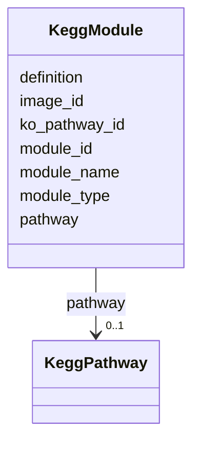

# Class: KeggModule 


URI: [img_core_v400:KeggModule](https://w3id.org/jgi/img_core_v400/KeggModule)





<!-- no inheritance hierarchy -->


## Slots

| Name | Cardinality and Range | Description | Inheritance |
| ---  | --- | --- | --- |
| [module_id](module_id.md) | 0..1 <br/> [String](String.md) |  | direct |
| [module_name](module_name.md) | 0..1 <br/> [String](String.md) |  | direct |
| [module_type](module_type.md) | 0..1 <br/> [String](String.md) |  | direct |
| [definition](definition.md) | 0..1 <br/> [String](String.md) |  | direct |
| [pathway](pathway.md) | 0..1 <br/> [KeggPathway](KeggPathway.md) | Foreign key to kegg_pathway | direct |
| [ko_pathway_id](ko_pathway_id.md) | 0..1 <br/> [String](String.md) |  | direct |
| [image_id](image_id.md) | 0..1 <br/> [String](String.md) |  | direct |


## Usages

| used by | used in | type | used |
| ---  | --- | --- | --- |
| [KeggModuleCompounds](KeggModuleCompounds.md) | [module_id](module_id.md) | range | [KeggModule](KeggModule.md) |
| [KeggModuleKoTerms](KeggModuleKoTerms.md) | [module_id](module_id.md) | range | [KeggModule](KeggModule.md) |
| [KeggModuleReactions](KeggModuleReactions.md) | [module_id](module_id.md) | range | [KeggModule](KeggModule.md) |
| [KeggPathwayModules](KeggPathwayModules.md) | [modules](modules.md) | range | [KeggModule](KeggModule.md) |


## Identifier and Mapping Information


### Schema Source


* from schema: https://w3id.org/jgi/img_core_v400


## Mappings

| Mapping Type | Mapped Value |
| ---  | ---  |
| self | img_core_v400:KeggModule |
| native | img_core_v400:KeggModule |


## LinkML Source

<!-- TODO: investigate https://stackoverflow.com/questions/37606292/how-to-create-tabbed-code-blocks-in-mkdocs-or-sphinx -->

### Direct

<details>
```yaml
name: kegg_module
from_schema: https://w3id.org/jgi/img_core_v400
attributes:
  module_id:
    name: module_id
    from_schema: https://w3id.org/jgi/img_core_v400
    domain_of:
    - dt_taxon_kmodule_mcr
    - kegg_module
    - kegg_module_compounds
    - kegg_module_ko_terms
    - kegg_module_reactions
    - ko2module
    range: string
    required: false
  module_name:
    name: module_name
    from_schema: https://w3id.org/jgi/img_core_v400
    rank: 1000
    domain_of:
    - kegg_module
    range: string
    required: false
  module_type:
    name: module_type
    from_schema: https://w3id.org/jgi/img_core_v400
    rank: 1000
    domain_of:
    - kegg_module
    range: string
    required: false
  definition:
    name: definition
    from_schema: https://w3id.org/jgi/img_core_v400
    domain_of:
    - cog_function
    - go_term
    - img_orf_type
    - kegg_module
    - ko_term
    - kog_function
    - smart
    range: string
    required: false
  pathway:
    name: pathway
    description: Foreign key to kegg_pathway
    from_schema: https://w3id.org/jgi/img_core_v400
    domain_of:
    - image_roi
    - kegg_module
    range: kegg_pathway
    required: false
  ko_pathway_id:
    name: ko_pathway_id
    from_schema: https://w3id.org/jgi/img_core_v400
    rank: 1000
    domain_of:
    - kegg_module
    - kegg_pathway
    - ko_term_classes
    range: string
    required: false
  image_id:
    name: image_id
    from_schema: https://w3id.org/jgi/img_core_v400
    rank: 1000
    domain_of:
    - kegg_module
    - kegg_pathway
    - ko2pathway
    - ko_term_pathways
    range: string
    required: false

```
</details>

### Induced

<details>
```yaml
name: kegg_module
from_schema: https://w3id.org/jgi/img_core_v400
attributes:
  module_id:
    name: module_id
    from_schema: https://w3id.org/jgi/img_core_v400
    alias: module_id
    owner: kegg_module
    domain_of:
    - dt_taxon_kmodule_mcr
    - kegg_module
    - kegg_module_compounds
    - kegg_module_ko_terms
    - kegg_module_reactions
    - ko2module
    range: string
    required: false
  module_name:
    name: module_name
    from_schema: https://w3id.org/jgi/img_core_v400
    rank: 1000
    alias: module_name
    owner: kegg_module
    domain_of:
    - kegg_module
    range: string
    required: false
  module_type:
    name: module_type
    from_schema: https://w3id.org/jgi/img_core_v400
    rank: 1000
    alias: module_type
    owner: kegg_module
    domain_of:
    - kegg_module
    range: string
    required: false
  definition:
    name: definition
    from_schema: https://w3id.org/jgi/img_core_v400
    alias: definition
    owner: kegg_module
    domain_of:
    - cog_function
    - go_term
    - img_orf_type
    - kegg_module
    - ko_term
    - kog_function
    - smart
    range: string
    required: false
  pathway:
    name: pathway
    description: Foreign key to kegg_pathway
    from_schema: https://w3id.org/jgi/img_core_v400
    alias: pathway
    owner: kegg_module
    domain_of:
    - image_roi
    - kegg_module
    range: kegg_pathway
    required: false
  ko_pathway_id:
    name: ko_pathway_id
    from_schema: https://w3id.org/jgi/img_core_v400
    rank: 1000
    alias: ko_pathway_id
    owner: kegg_module
    domain_of:
    - kegg_module
    - kegg_pathway
    - ko_term_classes
    range: string
    required: false
  image_id:
    name: image_id
    from_schema: https://w3id.org/jgi/img_core_v400
    rank: 1000
    alias: image_id
    owner: kegg_module
    domain_of:
    - kegg_module
    - kegg_pathway
    - ko2pathway
    - ko_term_pathways
    range: string
    required: false

```
</details>