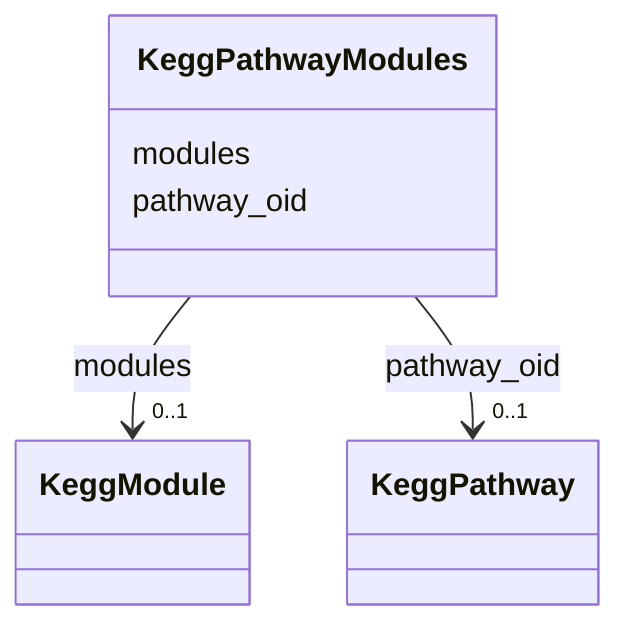

# Class: KeggPathwayModules 


URI: [img_core_v400:KeggPathwayModules](https://w3id.org/jgi/img_core_v400/KeggPathwayModules)





<!-- no inheritance hierarchy -->


## Slots

| Name | Cardinality and Range | Description | Inheritance |
| ---  | --- | --- | --- |
| [pathway_oid](pathway_oid.md) | 0..1 <br/> [KeggPathway](KeggPathway.md) | Foreign key to kegg_pathway | direct |
| [modules](modules.md) | 0..1 <br/> [KeggModule](KeggModule.md) | Foreign key to kegg_module | direct |


## Identifier and Mapping Information


### Schema Source


* from schema: https://w3id.org/jgi/img_core_v400


## Mappings

| Mapping Type | Mapped Value |
| ---  | ---  |
| self | img_core_v400:KeggPathwayModules |
| native | img_core_v400:KeggPathwayModules |


## LinkML Source

<!-- TODO: investigate https://stackoverflow.com/questions/37606292/how-to-create-tabbed-code-blocks-in-mkdocs-or-sphinx -->

### Direct

<details>
```yaml
name: kegg_pathway_modules
from_schema: https://w3id.org/jgi/img_core_v400
attributes:
  pathway_oid:
    name: pathway_oid
    description: Foreign key to kegg_pathway
    from_schema: https://w3id.org/jgi/img_core_v400
    domain_of:
    - kegg_pathway
    - kegg_pathway_modules
    - kegg_pathway_related_pathways
    - ko_term_pathways
    range: kegg_pathway
    required: false
  modules:
    name: modules
    description: Foreign key to kegg_module
    from_schema: https://w3id.org/jgi/img_core_v400
    rank: 1000
    domain_of:
    - kegg_pathway_modules
    - ko_term_modules
    range: kegg_module
    required: false

```
</details>

### Induced

<details>
```yaml
name: kegg_pathway_modules
from_schema: https://w3id.org/jgi/img_core_v400
attributes:
  pathway_oid:
    name: pathway_oid
    description: Foreign key to kegg_pathway
    from_schema: https://w3id.org/jgi/img_core_v400
    alias: pathway_oid
    owner: kegg_pathway_modules
    domain_of:
    - kegg_pathway
    - kegg_pathway_modules
    - kegg_pathway_related_pathways
    - ko_term_pathways
    range: kegg_pathway
    required: false
  modules:
    name: modules
    description: Foreign key to kegg_module
    from_schema: https://w3id.org/jgi/img_core_v400
    rank: 1000
    alias: modules
    owner: kegg_pathway_modules
    domain_of:
    - kegg_pathway_modules
    - ko_term_modules
    range: kegg_module
    required: false

```
</details>