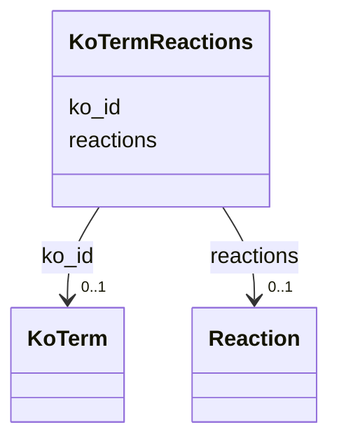

# Class: KoTermReactions 


URI: [img_core_v400:KoTermReactions](https://w3id.org/jgi/img_core_v400/KoTermReactions)





<!-- no inheritance hierarchy -->


## Slots

| Name | Cardinality and Range | Description | Inheritance |
| ---  | --- | --- | --- |
| [ko_id](ko_id.md) | 0..1 <br/> [KoTerm](KoTerm.md) | Foreign key to ko_term | direct |
| [reactions](reactions.md) | 0..1 <br/> [Reaction](Reaction.md) | Foreign key to reaction | direct |


## Identifier and Mapping Information


### Schema Source


* from schema: https://w3id.org/jgi/img_core_v400


## Mappings

| Mapping Type | Mapped Value |
| ---  | ---  |
| self | img_core_v400:KoTermReactions |
| native | img_core_v400:KoTermReactions |


## LinkML Source

<!-- TODO: investigate https://stackoverflow.com/questions/37606292/how-to-create-tabbed-code-blocks-in-mkdocs-or-sphinx -->

### Direct

<details>
```yaml
name: ko_term_reactions
from_schema: https://w3id.org/jgi/img_core_v400
attributes:
  ko_id:
    name: ko_id
    description: Foreign key to ko_term
    from_schema: https://w3id.org/jgi/img_core_v400
    domain_of:
    - dt_ko
    - dt_ko_ec_cog_pfam
    - gene_ko_enzymes
    - gene_ko_enzymes_new
    - ko2cog
    - ko2ec
    - ko2go
    - ko2module
    - ko2pathway
    - ko2reaction
    - ko2tc
    - ko_term
    - ko_term_classes
    - ko_term_cogs
    - ko_term_enzymes
    - ko_term_go_ids
    - ko_term_modules
    - ko_term_pathways
    - ko_term_reactions
    - ko_term_tc_families
    range: ko_term
    required: false
  reactions:
    name: reactions
    description: Foreign key to reaction
    from_schema: https://w3id.org/jgi/img_core_v400
    domain_of:
    - image_roi_reactions
    - kegg_module_reactions
    - ko_term_reactions
    range: reaction
    required: false

```
</details>

### Induced

<details>
```yaml
name: ko_term_reactions
from_schema: https://w3id.org/jgi/img_core_v400
attributes:
  ko_id:
    name: ko_id
    description: Foreign key to ko_term
    from_schema: https://w3id.org/jgi/img_core_v400
    alias: ko_id
    owner: ko_term_reactions
    domain_of:
    - dt_ko
    - dt_ko_ec_cog_pfam
    - gene_ko_enzymes
    - gene_ko_enzymes_new
    - ko2cog
    - ko2ec
    - ko2go
    - ko2module
    - ko2pathway
    - ko2reaction
    - ko2tc
    - ko_term
    - ko_term_classes
    - ko_term_cogs
    - ko_term_enzymes
    - ko_term_go_ids
    - ko_term_modules
    - ko_term_pathways
    - ko_term_reactions
    - ko_term_tc_families
    range: ko_term
    required: false
  reactions:
    name: reactions
    description: Foreign key to reaction
    from_schema: https://w3id.org/jgi/img_core_v400
    alias: reactions
    owner: ko_term_reactions
    domain_of:
    - image_roi_reactions
    - kegg_module_reactions
    - ko_term_reactions
    range: reaction
    required: false

```
</details>