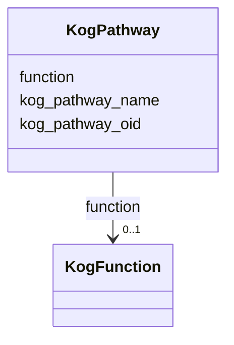

# Class: KogPathway 


URI: [img_core_v400:KogPathway](https://w3id.org/jgi/img_core_v400/KogPathway)





<!-- no inheritance hierarchy -->


## Slots

| Name | Cardinality and Range | Description | Inheritance |
| ---  | --- | --- | --- |
| [kog_pathway_oid](kog_pathway_oid.md) | 0..1 <br/> [Integer](Integer.md) |  | direct |
| [function](function.md) | 0..1 <br/> [KogFunction](KogFunction.md) | Foreign key to kog_function | direct |
| [kog_pathway_name](kog_pathway_name.md) | 0..1 <br/> [String](String.md) |  | direct |


## Usages

| used by | used in | type | used |
| ---  | --- | --- | --- |
| [KogPathwayKogMembers](KogPathwayKogMembers.md) | [kog_pathway_oid](kog_pathway_oid.md) | range | [KogPathway](KogPathway.md) |


## Identifier and Mapping Information


### Schema Source


* from schema: https://w3id.org/jgi/img_core_v400


## Mappings

| Mapping Type | Mapped Value |
| ---  | ---  |
| self | img_core_v400:KogPathway |
| native | img_core_v400:KogPathway |


## LinkML Source

<!-- TODO: investigate https://stackoverflow.com/questions/37606292/how-to-create-tabbed-code-blocks-in-mkdocs-or-sphinx -->

### Direct

<details>
```yaml
name: kog_pathway
from_schema: https://w3id.org/jgi/img_core_v400
attributes:
  kog_pathway_oid:
    name: kog_pathway_oid
    from_schema: https://w3id.org/jgi/img_core_v400
    rank: 1000
    domain_of:
    - kog_pathway
    - kog_pathway_kog_members
    range: integer
    required: false
  function:
    name: function
    description: Foreign key to kog_function
    from_schema: https://w3id.org/jgi/img_core_v400
    domain_of:
    - cog_pathway
    - img_funcs_info
    - kog_pathway
    range: kog_function
    required: false
  kog_pathway_name:
    name: kog_pathway_name
    from_schema: https://w3id.org/jgi/img_core_v400
    rank: 1000
    domain_of:
    - kog_pathway
    range: string
    required: false

```
</details>

### Induced

<details>
```yaml
name: kog_pathway
from_schema: https://w3id.org/jgi/img_core_v400
attributes:
  kog_pathway_oid:
    name: kog_pathway_oid
    from_schema: https://w3id.org/jgi/img_core_v400
    rank: 1000
    alias: kog_pathway_oid
    owner: kog_pathway
    domain_of:
    - kog_pathway
    - kog_pathway_kog_members
    range: integer
    required: false
  function:
    name: function
    description: Foreign key to kog_function
    from_schema: https://w3id.org/jgi/img_core_v400
    alias: function
    owner: kog_pathway
    domain_of:
    - cog_pathway
    - img_funcs_info
    - kog_pathway
    range: kog_function
    required: false
  kog_pathway_name:
    name: kog_pathway_name
    from_schema: https://w3id.org/jgi/img_core_v400
    rank: 1000
    alias: kog_pathway_name
    owner: kog_pathway
    domain_of:
    - kog_pathway
    range: string
    required: false

```
</details>