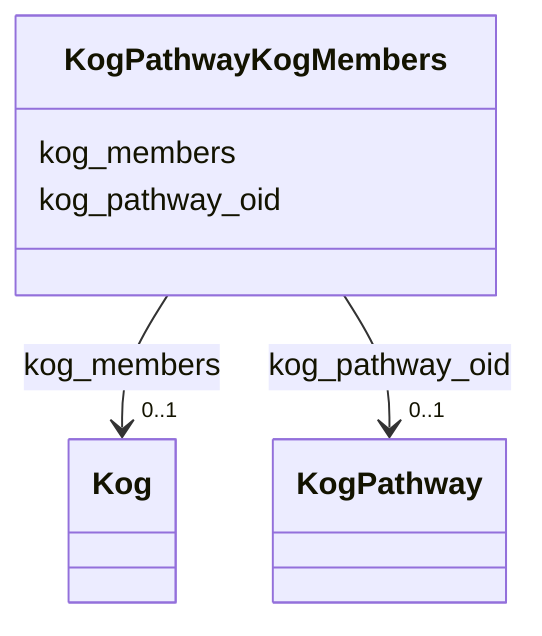

# Class: KogPathwayKogMembers 


URI: [img_core_v400:KogPathwayKogMembers](https://w3id.org/jgi/img_core_v400/KogPathwayKogMembers)





<!-- no inheritance hierarchy -->


## Slots

| Name | Cardinality and Range | Description | Inheritance |
| ---  | --- | --- | --- |
| [kog_pathway_oid](kog_pathway_oid.md) | 0..1 <br/> [KogPathway](KogPathway.md) | Foreign key to kog_pathway | direct |
| [kog_members](kog_members.md) | 0..1 <br/> [Kog](Kog.md) | Foreign key to kog | direct |


## Identifier and Mapping Information


### Schema Source


* from schema: https://w3id.org/jgi/img_core_v400


## Mappings

| Mapping Type | Mapped Value |
| ---  | ---  |
| self | img_core_v400:KogPathwayKogMembers |
| native | img_core_v400:KogPathwayKogMembers |


## LinkML Source

<!-- TODO: investigate https://stackoverflow.com/questions/37606292/how-to-create-tabbed-code-blocks-in-mkdocs-or-sphinx -->

### Direct

<details>
```yaml
name: kog_pathway_kog_members
from_schema: https://w3id.org/jgi/img_core_v400
attributes:
  kog_pathway_oid:
    name: kog_pathway_oid
    description: Foreign key to kog_pathway
    from_schema: https://w3id.org/jgi/img_core_v400
    domain_of:
    - kog_pathway
    - kog_pathway_kog_members
    range: kog_pathway
    required: false
  kog_members:
    name: kog_members
    description: Foreign key to kog
    from_schema: https://w3id.org/jgi/img_core_v400
    rank: 1000
    domain_of:
    - kog_pathway_kog_members
    range: kog
    required: false

```
</details>

### Induced

<details>
```yaml
name: kog_pathway_kog_members
from_schema: https://w3id.org/jgi/img_core_v400
attributes:
  kog_pathway_oid:
    name: kog_pathway_oid
    description: Foreign key to kog_pathway
    from_schema: https://w3id.org/jgi/img_core_v400
    alias: kog_pathway_oid
    owner: kog_pathway_kog_members
    domain_of:
    - kog_pathway
    - kog_pathway_kog_members
    range: kog_pathway
    required: false
  kog_members:
    name: kog_members
    description: Foreign key to kog
    from_schema: https://w3id.org/jgi/img_core_v400
    rank: 1000
    alias: kog_members
    owner: kog_pathway_kog_members
    domain_of:
    - kog_pathway_kog_members
    range: kog
    required: false

```
</details>