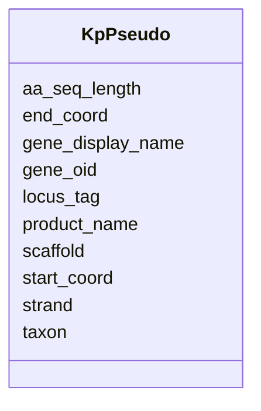

# Class: KpPseudo 


URI: [img_core_v400:KpPseudo](https://w3id.org/jgi/img_core_v400/KpPseudo)





<!-- no inheritance hierarchy -->


## Slots

| Name | Cardinality and Range | Description | Inheritance |
| ---  | --- | --- | --- |
| [gene_oid](gene_oid.md) | 0..1 <br/> [Integer](Integer.md) |  | direct |
| [taxon](taxon.md) | 0..1 <br/> [Integer](Integer.md) |  | direct |
| [scaffold](scaffold.md) | 0..1 <br/> [Integer](Integer.md) |  | direct |
| [start_coord](start_coord.md) | 0..1 <br/> [Integer](Integer.md) |  | direct |
| [end_coord](end_coord.md) | 0..1 <br/> [Integer](Integer.md) |  | direct |
| [strand](strand.md) | 0..1 <br/> [String](String.md) |  | direct |
| [locus_tag](locus_tag.md) | 0..1 <br/> [String](String.md) |  | direct |
| [aa_seq_length](aa_seq_length.md) | 0..1 <br/> [Integer](Integer.md) |  | direct |
| [product_name](product_name.md) | 0..1 <br/> [String](String.md) |  | direct |
| [gene_display_name](gene_display_name.md) | 0..1 <br/> [String](String.md) |  | direct |


## Identifier and Mapping Information


### Schema Source


* from schema: https://w3id.org/jgi/img_core_v400


## Mappings

| Mapping Type | Mapped Value |
| ---  | ---  |
| self | img_core_v400:KpPseudo |
| native | img_core_v400:KpPseudo |


## LinkML Source

<!-- TODO: investigate https://stackoverflow.com/questions/37606292/how-to-create-tabbed-code-blocks-in-mkdocs-or-sphinx -->

### Direct

<details>
```yaml
name: kp_pseudo
from_schema: https://w3id.org/jgi/img_core_v400
attributes:
  gene_oid:
    name: gene_oid
    from_schema: https://w3id.org/jgi/img_core_v400
    domain_of:
    - actino_abc_genes
    - delete_genes
    - dt_ht_hits
    - dt_img_gene_prot_pep_sample
    - dt_phylum_dist_genes
    - dt_scog_genes
    - gene
    - gene_aliases
    - gene_biocyc_rxns
    - gene_cathfam
    - gene_cog_groups
    - gene_essential_genes
    - gene_exceptions
    - gene_ext_links
    - gene_feature_tags
    - gene_frag_coords
    - gene_go_terms
    - gene_img_interpro_hits
    - gene_ko_enzymes
    - gene_ko_enzymes_new
    - gene_ko_terms
    - gene_kog_groups
    - gene_notes
    - gene_paralogs
    - gene_pdb_xrefs
    - gene_pfam_families
    - gene_sig_peptides
    - gene_smart
    - gene_superfam
    - gene_tigrfams
    - gene_xref_families
    - kp_pseudo
    - merfs_gene_mapping
    - mv_gene_tmhmm_stats
    - tmp_genes
    range: integer
    required: false
  taxon:
    name: taxon
    from_schema: https://w3id.org/jgi/img_core_v400
    domain_of:
    - cog_species
    - dt_img_gene_prot_pep_sample
    - dt_taxon_node_lite
    - gene
    - gene_biocyc_rxns
    - gene_cathfam
    - gene_cog_groups
    - gene_img_interpro_hits
    - gene_ko_enzymes
    - gene_ko_enzymes_new
    - gene_ko_terms
    - gene_kog_groups
    - gene_pfam_families
    - gene_smart
    - gene_superfam
    - gene_tigrfams
    - gene_xref_families
    - kp_pseudo
    - merfs_gene_mapping
    - paralog_group
    - scaffold
    - scaffold_stats
    - taxon_node_lite
    range: integer
    required: false
  scaffold:
    name: scaffold
    from_schema: https://w3id.org/jgi/img_core_v400
    domain_of:
    - gene
    - gene_biocyc_rxns
    - gene_cathfam
    - gene_cog_groups
    - gene_img_interpro_hits
    - gene_ko_enzymes
    - gene_ko_enzymes_new
    - gene_ko_terms
    - gene_kog_groups
    - gene_pfam_families
    - gene_smart
    - gene_superfam
    - gene_tigrfams
    - gene_xref_families
    - iso_plasmids
    - kp_pseudo
    range: integer
    required: false
  start_coord:
    name: start_coord
    from_schema: https://w3id.org/jgi/img_core_v400
    domain_of:
    - alt_transcript
    - dt_intergenic
    - gene
    - gene_frag_coords
    - gene_sig_peptides
    - kp_pseudo
    - scaffold_nx_feature
    - scaffold_repeats
    - taxon_crispr_summary
    range: integer
    required: false
  end_coord:
    name: end_coord
    from_schema: https://w3id.org/jgi/img_core_v400
    domain_of:
    - alt_transcript
    - dt_intergenic
    - gene
    - gene_frag_coords
    - gene_sig_peptides
    - kp_pseudo
    - scaffold_nx_feature
    - scaffold_repeats
    - taxon_crispr_summary
    range: integer
    required: false
  strand:
    name: strand
    from_schema: https://w3id.org/jgi/img_core_v400
    domain_of:
    - alt_transcript
    - gene
    - kp_pseudo
    - scaffold_nx_feature
    range: string
    required: false
  locus_tag:
    name: locus_tag
    from_schema: https://w3id.org/jgi/img_core_v400
    domain_of:
    - gene
    - kp_pseudo
    - merfs_gene_mapping
    range: string
    required: false
  aa_seq_length:
    name: aa_seq_length
    from_schema: https://w3id.org/jgi/img_core_v400
    domain_of:
    - alt_transcript
    - gene
    - kegg_gene
    - kp_pseudo
    range: integer
    required: false
  product_name:
    name: product_name
    from_schema: https://w3id.org/jgi/img_core_v400
    domain_of:
    - gene
    - kp_pseudo
    range: string
    required: false
  gene_display_name:
    name: gene_display_name
    from_schema: https://w3id.org/jgi/img_core_v400
    domain_of:
    - dt_img_gene_prot_pep_sample
    - gene
    - kp_pseudo
    range: string
    required: false

```
</details>

### Induced

<details>
```yaml
name: kp_pseudo
from_schema: https://w3id.org/jgi/img_core_v400
attributes:
  gene_oid:
    name: gene_oid
    from_schema: https://w3id.org/jgi/img_core_v400
    alias: gene_oid
    owner: kp_pseudo
    domain_of:
    - actino_abc_genes
    - delete_genes
    - dt_ht_hits
    - dt_img_gene_prot_pep_sample
    - dt_phylum_dist_genes
    - dt_scog_genes
    - gene
    - gene_aliases
    - gene_biocyc_rxns
    - gene_cathfam
    - gene_cog_groups
    - gene_essential_genes
    - gene_exceptions
    - gene_ext_links
    - gene_feature_tags
    - gene_frag_coords
    - gene_go_terms
    - gene_img_interpro_hits
    - gene_ko_enzymes
    - gene_ko_enzymes_new
    - gene_ko_terms
    - gene_kog_groups
    - gene_notes
    - gene_paralogs
    - gene_pdb_xrefs
    - gene_pfam_families
    - gene_sig_peptides
    - gene_smart
    - gene_superfam
    - gene_tigrfams
    - gene_xref_families
    - kp_pseudo
    - merfs_gene_mapping
    - mv_gene_tmhmm_stats
    - tmp_genes
    range: integer
    required: false
  taxon:
    name: taxon
    from_schema: https://w3id.org/jgi/img_core_v400
    alias: taxon
    owner: kp_pseudo
    domain_of:
    - cog_species
    - dt_img_gene_prot_pep_sample
    - dt_taxon_node_lite
    - gene
    - gene_biocyc_rxns
    - gene_cathfam
    - gene_cog_groups
    - gene_img_interpro_hits
    - gene_ko_enzymes
    - gene_ko_enzymes_new
    - gene_ko_terms
    - gene_kog_groups
    - gene_pfam_families
    - gene_smart
    - gene_superfam
    - gene_tigrfams
    - gene_xref_families
    - kp_pseudo
    - merfs_gene_mapping
    - paralog_group
    - scaffold
    - scaffold_stats
    - taxon_node_lite
    range: integer
    required: false
  scaffold:
    name: scaffold
    from_schema: https://w3id.org/jgi/img_core_v400
    alias: scaffold
    owner: kp_pseudo
    domain_of:
    - gene
    - gene_biocyc_rxns
    - gene_cathfam
    - gene_cog_groups
    - gene_img_interpro_hits
    - gene_ko_enzymes
    - gene_ko_enzymes_new
    - gene_ko_terms
    - gene_kog_groups
    - gene_pfam_families
    - gene_smart
    - gene_superfam
    - gene_tigrfams
    - gene_xref_families
    - iso_plasmids
    - kp_pseudo
    range: integer
    required: false
  start_coord:
    name: start_coord
    from_schema: https://w3id.org/jgi/img_core_v400
    alias: start_coord
    owner: kp_pseudo
    domain_of:
    - alt_transcript
    - dt_intergenic
    - gene
    - gene_frag_coords
    - gene_sig_peptides
    - kp_pseudo
    - scaffold_nx_feature
    - scaffold_repeats
    - taxon_crispr_summary
    range: integer
    required: false
  end_coord:
    name: end_coord
    from_schema: https://w3id.org/jgi/img_core_v400
    alias: end_coord
    owner: kp_pseudo
    domain_of:
    - alt_transcript
    - dt_intergenic
    - gene
    - gene_frag_coords
    - gene_sig_peptides
    - kp_pseudo
    - scaffold_nx_feature
    - scaffold_repeats
    - taxon_crispr_summary
    range: integer
    required: false
  strand:
    name: strand
    from_schema: https://w3id.org/jgi/img_core_v400
    alias: strand
    owner: kp_pseudo
    domain_of:
    - alt_transcript
    - gene
    - kp_pseudo
    - scaffold_nx_feature
    range: string
    required: false
  locus_tag:
    name: locus_tag
    from_schema: https://w3id.org/jgi/img_core_v400
    alias: locus_tag
    owner: kp_pseudo
    domain_of:
    - gene
    - kp_pseudo
    - merfs_gene_mapping
    range: string
    required: false
  aa_seq_length:
    name: aa_seq_length
    from_schema: https://w3id.org/jgi/img_core_v400
    alias: aa_seq_length
    owner: kp_pseudo
    domain_of:
    - alt_transcript
    - gene
    - kegg_gene
    - kp_pseudo
    range: integer
    required: false
  product_name:
    name: product_name
    from_schema: https://w3id.org/jgi/img_core_v400
    alias: product_name
    owner: kp_pseudo
    domain_of:
    - gene
    - kp_pseudo
    range: string
    required: false
  gene_display_name:
    name: gene_display_name
    from_schema: https://w3id.org/jgi/img_core_v400
    alias: gene_display_name
    owner: kp_pseudo
    domain_of:
    - dt_img_gene_prot_pep_sample
    - gene
    - kp_pseudo
    range: string
    required: false

```
</details>