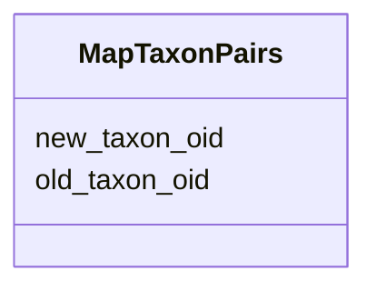

# Class: MapTaxonPairs 


URI: [img_core_v400:MapTaxonPairs](https://w3id.org/jgi/img_core_v400/MapTaxonPairs)





<!-- no inheritance hierarchy -->


## Slots

| Name | Cardinality and Range | Description | Inheritance |
| ---  | --- | --- | --- |
| [new_taxon_oid](new_taxon_oid.md) | 0..1 <br/> [Integer](Integer.md) |  | direct |
| [old_taxon_oid](old_taxon_oid.md) | 0..1 <br/> [Integer](Integer.md) |  | direct |


## Identifier and Mapping Information


### Schema Source


* from schema: https://w3id.org/jgi/img_core_v400


## Mappings

| Mapping Type | Mapped Value |
| ---  | ---  |
| self | img_core_v400:MapTaxonPairs |
| native | img_core_v400:MapTaxonPairs |


## LinkML Source

<!-- TODO: investigate https://stackoverflow.com/questions/37606292/how-to-create-tabbed-code-blocks-in-mkdocs-or-sphinx -->

### Direct

<details>
```yaml
name: map_taxon_pairs
from_schema: https://w3id.org/jgi/img_core_v400
attributes:
  new_taxon_oid:
    name: new_taxon_oid
    from_schema: https://w3id.org/jgi/img_core_v400
    rank: 1000
    domain_of:
    - map_taxon_pairs
    range: integer
    required: false
  old_taxon_oid:
    name: old_taxon_oid
    from_schema: https://w3id.org/jgi/img_core_v400
    domain_of:
    - delete_taxons
    - map_taxon_pairs
    - taxon_replacements
    - taxon_replacements_view
    range: integer
    required: false

```
</details>

### Induced

<details>
```yaml
name: map_taxon_pairs
from_schema: https://w3id.org/jgi/img_core_v400
attributes:
  new_taxon_oid:
    name: new_taxon_oid
    from_schema: https://w3id.org/jgi/img_core_v400
    rank: 1000
    alias: new_taxon_oid
    owner: map_taxon_pairs
    domain_of:
    - map_taxon_pairs
    range: integer
    required: false
  old_taxon_oid:
    name: old_taxon_oid
    from_schema: https://w3id.org/jgi/img_core_v400
    alias: old_taxon_oid
    owner: map_taxon_pairs
    domain_of:
    - delete_taxons
    - map_taxon_pairs
    - taxon_replacements
    - taxon_replacements_view
    range: integer
    required: false

```
</details>