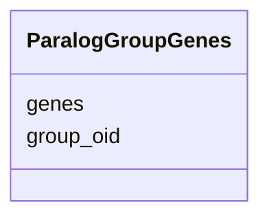

# Class: ParalogGroupGenes 


URI: [img_core_v400:ParalogGroupGenes](https://w3id.org/jgi/img_core_v400/ParalogGroupGenes)





<!-- no inheritance hierarchy -->


## Slots

| Name | Cardinality and Range | Description | Inheritance |
| ---  | --- | --- | --- |
| [group_oid](group_oid.md) | 0..1 <br/> [Integer](Integer.md) |  | direct |
| [genes](genes.md) | 0..1 <br/> [Integer](Integer.md) |  | direct |


## Identifier and Mapping Information


### Schema Source


* from schema: https://w3id.org/jgi/img_core_v400


## Mappings

| Mapping Type | Mapped Value |
| ---  | ---  |
| self | img_core_v400:ParalogGroupGenes |
| native | img_core_v400:ParalogGroupGenes |


## LinkML Source

<!-- TODO: investigate https://stackoverflow.com/questions/37606292/how-to-create-tabbed-code-blocks-in-mkdocs-or-sphinx -->

### Direct

<details>
```yaml
name: paralog_group_genes
from_schema: https://w3id.org/jgi/img_core_v400
attributes:
  group_oid:
    name: group_oid
    from_schema: https://w3id.org/jgi/img_core_v400
    domain_of:
    - actino_cassette
    - actino_cassette_genes
    - paralog_group
    - paralog_group_genes
    - positional_cluster
    - positional_cluster_genes
    range: integer
    required: false
  genes:
    name: genes
    from_schema: https://w3id.org/jgi/img_core_v400
    domain_of:
    - actino_cassette_genes
    - paralog_group_genes
    - positional_cluster_genes
    range: integer
    required: false

```
</details>

### Induced

<details>
```yaml
name: paralog_group_genes
from_schema: https://w3id.org/jgi/img_core_v400
attributes:
  group_oid:
    name: group_oid
    from_schema: https://w3id.org/jgi/img_core_v400
    alias: group_oid
    owner: paralog_group_genes
    domain_of:
    - actino_cassette
    - actino_cassette_genes
    - paralog_group
    - paralog_group_genes
    - positional_cluster
    - positional_cluster_genes
    range: integer
    required: false
  genes:
    name: genes
    from_schema: https://w3id.org/jgi/img_core_v400
    alias: genes
    owner: paralog_group_genes
    domain_of:
    - actino_cassette_genes
    - paralog_group_genes
    - positional_cluster_genes
    range: integer
    required: false

```
</details>