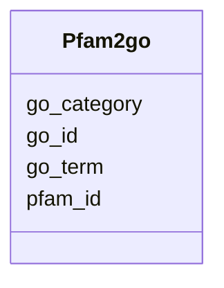

# Class: Pfam2go 


URI: [img_core_v400:Pfam2go](https://w3id.org/jgi/img_core_v400/Pfam2go)





<!-- no inheritance hierarchy -->


## Slots

| Name | Cardinality and Range | Description | Inheritance |
| ---  | --- | --- | --- |
| [pfam_id](pfam_id.md) | 0..1 <br/> [String](String.md) |  | direct |
| [go_id](go_id.md) | 0..1 <br/> [String](String.md) |  | direct |
| [go_term](go_term.md) | 0..1 <br/> [String](String.md) |  | direct |
| [go_category](go_category.md) | 0..1 <br/> [String](String.md) |  | direct |


## Identifier and Mapping Information


### Schema Source


* from schema: https://w3id.org/jgi/img_core_v400


## Mappings

| Mapping Type | Mapped Value |
| ---  | ---  |
| self | img_core_v400:Pfam2go |
| native | img_core_v400:Pfam2go |


## LinkML Source

<!-- TODO: investigate https://stackoverflow.com/questions/37606292/how-to-create-tabbed-code-blocks-in-mkdocs-or-sphinx -->

### Direct

<details>
```yaml
name: pfam2go
from_schema: https://w3id.org/jgi/img_core_v400
attributes:
  pfam_id:
    name: pfam_id
    from_schema: https://w3id.org/jgi/img_core_v400
    domain_of:
    - dt_pfam
    - pfam2go
    range: string
    required: false
  go_id:
    name: go_id
    from_schema: https://w3id.org/jgi/img_core_v400
    domain_of:
    - gene_go_terms
    - go_term
    - go_term_parents
    - go_term_synonyms
    - ko2go
    - pfam2go
    range: string
    required: false
  go_term:
    name: go_term
    from_schema: https://w3id.org/jgi/img_core_v400
    domain_of:
    - go_term
    - pfam2go
    range: string
    required: false
  go_category:
    name: go_category
    from_schema: https://w3id.org/jgi/img_core_v400
    rank: 1000
    domain_of:
    - pfam2go
    range: string
    required: false

```
</details>

### Induced

<details>
```yaml
name: pfam2go
from_schema: https://w3id.org/jgi/img_core_v400
attributes:
  pfam_id:
    name: pfam_id
    from_schema: https://w3id.org/jgi/img_core_v400
    alias: pfam_id
    owner: pfam2go
    domain_of:
    - dt_pfam
    - pfam2go
    range: string
    required: false
  go_id:
    name: go_id
    from_schema: https://w3id.org/jgi/img_core_v400
    alias: go_id
    owner: pfam2go
    domain_of:
    - gene_go_terms
    - go_term
    - go_term_parents
    - go_term_synonyms
    - ko2go
    - pfam2go
    range: string
    required: false
  go_term:
    name: go_term
    from_schema: https://w3id.org/jgi/img_core_v400
    alias: go_term
    owner: pfam2go
    domain_of:
    - go_term
    - pfam2go
    range: string
    required: false
  go_category:
    name: go_category
    from_schema: https://w3id.org/jgi/img_core_v400
    rank: 1000
    alias: go_category
    owner: pfam2go
    domain_of:
    - pfam2go
    range: string
    required: false

```
</details>