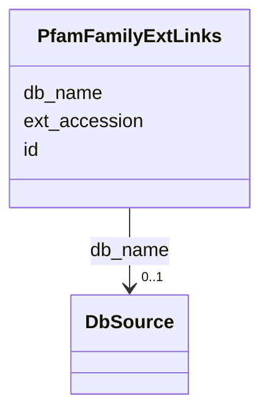

# Class: PfamFamilyExtLinks 


URI: [img_core_v400:PfamFamilyExtLinks](https://w3id.org/jgi/img_core_v400/PfamFamilyExtLinks)





<!-- no inheritance hierarchy -->


## Slots

| Name | Cardinality and Range | Description | Inheritance |
| ---  | --- | --- | --- |
| [ext_accession](ext_accession.md) | 0..1 <br/> [String](String.md) |  | direct |
| [db_name](db_name.md) | 0..1 <br/> [DbSource](DbSource.md) | Foreign key to db_source | direct |
| [id](id.md) | 0..1 <br/> [String](String.md) |  | direct |


## Identifier and Mapping Information


### Schema Source


* from schema: https://w3id.org/jgi/img_core_v400


## Mappings

| Mapping Type | Mapped Value |
| ---  | ---  |
| self | img_core_v400:PfamFamilyExtLinks |
| native | img_core_v400:PfamFamilyExtLinks |


## LinkML Source

<!-- TODO: investigate https://stackoverflow.com/questions/37606292/how-to-create-tabbed-code-blocks-in-mkdocs-or-sphinx -->

### Direct

<details>
```yaml
name: pfam_family_ext_links
from_schema: https://w3id.org/jgi/img_core_v400
attributes:
  ext_accession:
    name: ext_accession
    from_schema: https://w3id.org/jgi/img_core_v400
    domain_of:
    - alt_transcript
    - compound
    - compound_aliases
    - compound_ext_links
    - gene_tigrfams
    - interpro
    - interpro_go_terms
    - pfam_clan
    - pfam_clan_pfam_families
    - pfam_family
    - pfam_family_cogs
    - pfam_family_ext_links
    - pfam_family_genome_properties
    - reaction
    - reaction_compounds
    - reaction_enzymes
    - reaction_ext_links
    - scaffold
    - tigrfam
    - tigrfam_enzymes
    - tigrfam_genome_properties
    - tigrfam_roles
    range: string
    required: false
  db_name:
    name: db_name
    description: Foreign key to db_source
    from_schema: https://w3id.org/jgi/img_core_v400
    domain_of:
    - biocyc_comp_ext_links
    - biocyc_enzrxn_ext_links
    - biocyc_pathway_ext_links
    - biocyc_protein_ext_links
    - biocyc_reaction_ext_links
    - compound_ext_links
    - enzyme_ext_links
    - gene_cathfam
    - gene_ext_links
    - gene_pdb_xrefs
    - gene_smart
    - gene_superfam
    - gene_xref_families
    - pfam_family_ext_links
    - reaction_ext_links
    - scaffold_ext_links
    - taxon_ext_links
    range: db_source
    required: false
  id:
    name: id
    from_schema: https://w3id.org/jgi/img_core_v400
    domain_of:
    - biocyc_comp_ext_links
    - biocyc_enzrxn_ext_links
    - biocyc_pathway_ext_links
    - biocyc_protein_ext_links
    - biocyc_reaction_ext_links
    - compound_ext_links
    - enzyme_ext_links
    - gene_cathfam
    - gene_ext_links
    - gene_pdb_xrefs
    - gene_smart
    - gene_superfam
    - gene_xref_families
    - pfam_family_ext_links
    - reaction_ext_links
    - scaffold_ext_links
    - taxon_ext_links
    range: string
    required: false

```
</details>

### Induced

<details>
```yaml
name: pfam_family_ext_links
from_schema: https://w3id.org/jgi/img_core_v400
attributes:
  ext_accession:
    name: ext_accession
    from_schema: https://w3id.org/jgi/img_core_v400
    alias: ext_accession
    owner: pfam_family_ext_links
    domain_of:
    - alt_transcript
    - compound
    - compound_aliases
    - compound_ext_links
    - gene_tigrfams
    - interpro
    - interpro_go_terms
    - pfam_clan
    - pfam_clan_pfam_families
    - pfam_family
    - pfam_family_cogs
    - pfam_family_ext_links
    - pfam_family_genome_properties
    - reaction
    - reaction_compounds
    - reaction_enzymes
    - reaction_ext_links
    - scaffold
    - tigrfam
    - tigrfam_enzymes
    - tigrfam_genome_properties
    - tigrfam_roles
    range: string
    required: false
  db_name:
    name: db_name
    description: Foreign key to db_source
    from_schema: https://w3id.org/jgi/img_core_v400
    alias: db_name
    owner: pfam_family_ext_links
    domain_of:
    - biocyc_comp_ext_links
    - biocyc_enzrxn_ext_links
    - biocyc_pathway_ext_links
    - biocyc_protein_ext_links
    - biocyc_reaction_ext_links
    - compound_ext_links
    - enzyme_ext_links
    - gene_cathfam
    - gene_ext_links
    - gene_pdb_xrefs
    - gene_smart
    - gene_superfam
    - gene_xref_families
    - pfam_family_ext_links
    - reaction_ext_links
    - scaffold_ext_links
    - taxon_ext_links
    range: db_source
    required: false
  id:
    name: id
    from_schema: https://w3id.org/jgi/img_core_v400
    alias: id
    owner: pfam_family_ext_links
    domain_of:
    - biocyc_comp_ext_links
    - biocyc_enzrxn_ext_links
    - biocyc_pathway_ext_links
    - biocyc_protein_ext_links
    - biocyc_reaction_ext_links
    - compound_ext_links
    - enzyme_ext_links
    - gene_cathfam
    - gene_ext_links
    - gene_pdb_xrefs
    - gene_smart
    - gene_superfam
    - gene_xref_families
    - pfam_family_ext_links
    - reaction_ext_links
    - scaffold_ext_links
    - taxon_ext_links
    range: string
    required: false

```
</details>