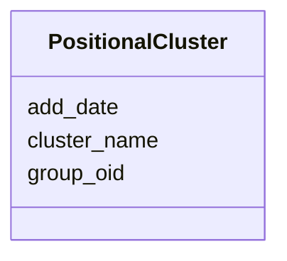

# Class: PositionalCluster 


URI: [img_core_v400:PositionalCluster](https://w3id.org/jgi/img_core_v400/PositionalCluster)





<!-- no inheritance hierarchy -->


## Slots

| Name | Cardinality and Range | Description | Inheritance |
| ---  | --- | --- | --- |
| [group_oid](group_oid.md) | 0..1 <br/> [Integer](Integer.md) |  | direct |
| [cluster_name](cluster_name.md) | 0..1 <br/> [String](String.md) |  | direct |
| [add_date](add_date.md) | 0..1 <br/> [Datetime](Datetime.md) |  | direct |


## Identifier and Mapping Information


### Schema Source


* from schema: https://w3id.org/jgi/img_core_v400


## Mappings

| Mapping Type | Mapped Value |
| ---  | ---  |
| self | img_core_v400:PositionalCluster |
| native | img_core_v400:PositionalCluster |


## LinkML Source

<!-- TODO: investigate https://stackoverflow.com/questions/37606292/how-to-create-tabbed-code-blocks-in-mkdocs-or-sphinx -->

### Direct

<details>
```yaml
name: positional_cluster
from_schema: https://w3id.org/jgi/img_core_v400
attributes:
  group_oid:
    name: group_oid
    from_schema: https://w3id.org/jgi/img_core_v400
    domain_of:
    - actino_cassette
    - actino_cassette_genes
    - paralog_group
    - paralog_group_genes
    - positional_cluster
    - positional_cluster_genes
    range: integer
    required: false
  cluster_name:
    name: cluster_name
    from_schema: https://w3id.org/jgi/img_core_v400
    rank: 1000
    domain_of:
    - positional_cluster
    range: string
    required: false
  add_date:
    name: add_date
    from_schema: https://w3id.org/jgi/img_core_v400
    domain_of:
    - bcg_taxons
    - cog
    - cog_function
    - cog_species
    - compound
    - enzyme
    - enzyme_transferred
    - gene
    - gene_biocyc_rxns
    - genome_property
    - go_graph_path
    - go_term
    - image_roi
    - kegg_pathway
    - km_image_roi
    - ko_term
    - kog
    - kog_function
    - paralog_group
    - pfam_clan
    - pfam_family
    - positional_cluster
    - property_step
    - reaction
    - scaffold
    - taxon
    - taxon_prod_vw
    - tigr_role
    - tigrfam
    range: datetime
    required: false

```
</details>

### Induced

<details>
```yaml
name: positional_cluster
from_schema: https://w3id.org/jgi/img_core_v400
attributes:
  group_oid:
    name: group_oid
    from_schema: https://w3id.org/jgi/img_core_v400
    alias: group_oid
    owner: positional_cluster
    domain_of:
    - actino_cassette
    - actino_cassette_genes
    - paralog_group
    - paralog_group_genes
    - positional_cluster
    - positional_cluster_genes
    range: integer
    required: false
  cluster_name:
    name: cluster_name
    from_schema: https://w3id.org/jgi/img_core_v400
    rank: 1000
    alias: cluster_name
    owner: positional_cluster
    domain_of:
    - positional_cluster
    range: string
    required: false
  add_date:
    name: add_date
    from_schema: https://w3id.org/jgi/img_core_v400
    alias: add_date
    owner: positional_cluster
    domain_of:
    - bcg_taxons
    - cog
    - cog_function
    - cog_species
    - compound
    - enzyme
    - enzyme_transferred
    - gene
    - gene_biocyc_rxns
    - genome_property
    - go_graph_path
    - go_term
    - image_roi
    - kegg_pathway
    - km_image_roi
    - ko_term
    - kog
    - kog_function
    - paralog_group
    - pfam_clan
    - pfam_family
    - positional_cluster
    - property_step
    - reaction
    - scaffold
    - taxon
    - taxon_prod_vw
    - tigr_role
    - tigrfam
    range: datetime
    required: false

```
</details>