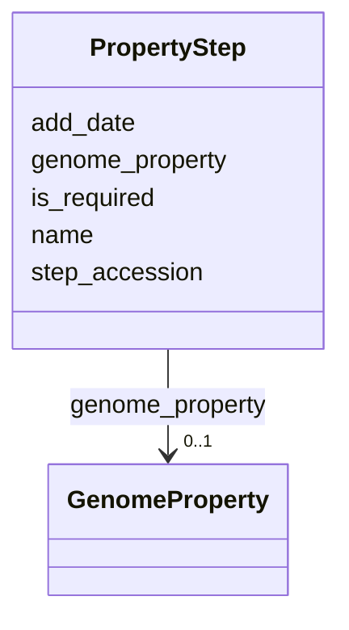

# Class: PropertyStep 


URI: [img_core_v400:PropertyStep](https://w3id.org/jgi/img_core_v400/PropertyStep)





<!-- no inheritance hierarchy -->


## Slots

| Name | Cardinality and Range | Description | Inheritance |
| ---  | --- | --- | --- |
| [step_accession](step_accession.md) | 0..1 <br/> [String](String.md) |  | direct |
| [genome_property](genome_property.md) | 0..1 <br/> [GenomeProperty](GenomeProperty.md) | Foreign key to genome_property | direct |
| [name](name.md) | 0..1 <br/> [String](String.md) |  | direct |
| [is_required](is_required.md) | 0..1 <br/> [Integer](Integer.md) |  | direct |
| [add_date](add_date.md) | 0..1 <br/> [Datetime](Datetime.md) |  | direct |


## Usages

| used by | used in | type | used |
| ---  | --- | --- | --- |
| [PfamFamilyGenomeProperties](PfamFamilyGenomeProperties.md) | [PropertyStep](PropertyStep.md) | range | [PropertyStep](PropertyStep.md) |
| [PropertyStepEvidences](PropertyStepEvidences.md) | [step_accession](step_accession.md) | range | [PropertyStep](PropertyStep.md) |
| [TigrfamGenomeProperties](TigrfamGenomeProperties.md) | [PropertyStep](PropertyStep.md) | range | [PropertyStep](PropertyStep.md) |


## Identifier and Mapping Information


### Schema Source


* from schema: https://w3id.org/jgi/img_core_v400


## Mappings

| Mapping Type | Mapped Value |
| ---  | ---  |
| self | img_core_v400:PropertyStep |
| native | img_core_v400:PropertyStep |


## LinkML Source

<!-- TODO: investigate https://stackoverflow.com/questions/37606292/how-to-create-tabbed-code-blocks-in-mkdocs-or-sphinx -->

### Direct

<details>
```yaml
name: property_step
from_schema: https://w3id.org/jgi/img_core_v400
attributes:
  step_accession:
    name: step_accession
    from_schema: https://w3id.org/jgi/img_core_v400
    rank: 1000
    domain_of:
    - property_step
    - property_step_evidences
    range: string
    required: false
  genome_property:
    name: genome_property
    description: Foreign key to genome_property
    from_schema: https://w3id.org/jgi/img_core_v400
    rank: 1000
    domain_of:
    - property_step
    range: genome_property
    required: false
  name:
    name: name
    from_schema: https://w3id.org/jgi/img_core_v400
    domain_of:
    - alt_transcript
    - cog2014
    - cogfunc2014
    - db_source
    - dt_cog
    - dt_img_term
    - dt_ko
    - dt_pfam
    - dt_tfam
    - exclude_func
    - genome_property
    - interpro
    - pfam_clan
    - pfam_dead
    - pfam_family
    - property_step
    - superfamily
    range: string
    required: false
  is_required:
    name: is_required
    from_schema: https://w3id.org/jgi/img_core_v400
    rank: 1000
    domain_of:
    - property_step
    range: integer
    required: false
  add_date:
    name: add_date
    from_schema: https://w3id.org/jgi/img_core_v400
    domain_of:
    - bcg_taxons
    - cog
    - cog_function
    - cog_species
    - compound
    - enzyme
    - enzyme_transferred
    - gene
    - gene_biocyc_rxns
    - genome_property
    - go_graph_path
    - go_term
    - image_roi
    - kegg_pathway
    - km_image_roi
    - ko_term
    - kog
    - kog_function
    - paralog_group
    - pfam_clan
    - pfam_family
    - positional_cluster
    - property_step
    - reaction
    - scaffold
    - taxon
    - taxon_prod_vw
    - tigr_role
    - tigrfam
    range: datetime
    required: false

```
</details>

### Induced

<details>
```yaml
name: property_step
from_schema: https://w3id.org/jgi/img_core_v400
attributes:
  step_accession:
    name: step_accession
    from_schema: https://w3id.org/jgi/img_core_v400
    rank: 1000
    alias: step_accession
    owner: property_step
    domain_of:
    - property_step
    - property_step_evidences
    range: string
    required: false
  genome_property:
    name: genome_property
    description: Foreign key to genome_property
    from_schema: https://w3id.org/jgi/img_core_v400
    rank: 1000
    alias: genome_property
    owner: property_step
    domain_of:
    - property_step
    range: genome_property
    required: false
  name:
    name: name
    from_schema: https://w3id.org/jgi/img_core_v400
    alias: name
    owner: property_step
    domain_of:
    - alt_transcript
    - cog2014
    - cogfunc2014
    - db_source
    - dt_cog
    - dt_img_term
    - dt_ko
    - dt_pfam
    - dt_tfam
    - exclude_func
    - genome_property
    - interpro
    - pfam_clan
    - pfam_dead
    - pfam_family
    - property_step
    - superfamily
    range: string
    required: false
  is_required:
    name: is_required
    from_schema: https://w3id.org/jgi/img_core_v400
    rank: 1000
    alias: is_required
    owner: property_step
    domain_of:
    - property_step
    range: integer
    required: false
  add_date:
    name: add_date
    from_schema: https://w3id.org/jgi/img_core_v400
    alias: add_date
    owner: property_step
    domain_of:
    - bcg_taxons
    - cog
    - cog_function
    - cog_species
    - compound
    - enzyme
    - enzyme_transferred
    - gene
    - gene_biocyc_rxns
    - genome_property
    - go_graph_path
    - go_term
    - image_roi
    - kegg_pathway
    - km_image_roi
    - ko_term
    - kog
    - kog_function
    - paralog_group
    - pfam_clan
    - pfam_family
    - positional_cluster
    - property_step
    - reaction
    - scaffold
    - taxon
    - taxon_prod_vw
    - tigr_role
    - tigrfam
    range: datetime
    required: false

```
</details>