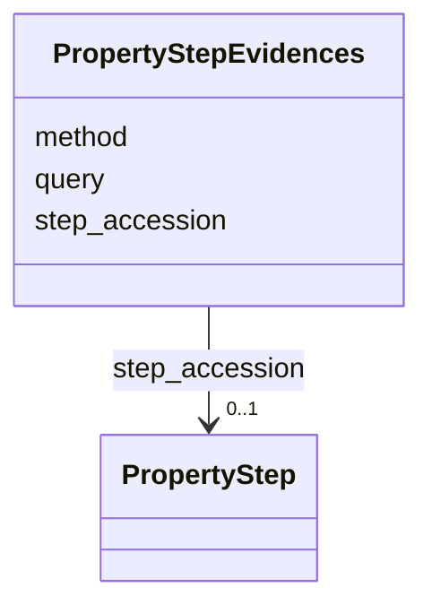

# Class: PropertyStepEvidences 


URI: [img_core_v400:PropertyStepEvidences](https://w3id.org/jgi/img_core_v400/PropertyStepEvidences)





<!-- no inheritance hierarchy -->


## Slots

| Name | Cardinality and Range | Description | Inheritance |
| ---  | --- | --- | --- |
| [step_accession](step_accession.md) | 0..1 <br/> [PropertyStep](PropertyStep.md) | Foreign key to property_step | direct |
| [query](query.md) | 0..1 <br/> [String](String.md) |  | direct |
| [method](method.md) | 0..1 <br/> [String](String.md) |  | direct |


## Identifier and Mapping Information


### Schema Source


* from schema: https://w3id.org/jgi/img_core_v400


## Mappings

| Mapping Type | Mapped Value |
| ---  | ---  |
| self | img_core_v400:PropertyStepEvidences |
| native | img_core_v400:PropertyStepEvidences |


## LinkML Source

<!-- TODO: investigate https://stackoverflow.com/questions/37606292/how-to-create-tabbed-code-blocks-in-mkdocs-or-sphinx -->

### Direct

<details>
```yaml
name: property_step_evidences
from_schema: https://w3id.org/jgi/img_core_v400
attributes:
  step_accession:
    name: step_accession
    description: Foreign key to property_step
    from_schema: https://w3id.org/jgi/img_core_v400
    domain_of:
    - property_step
    - property_step_evidences
    range: property_step
    required: false
  query:
    name: query
    from_schema: https://w3id.org/jgi/img_core_v400
    rank: 1000
    domain_of:
    - property_step_evidences
    range: string
    required: false
  method:
    name: method
    from_schema: https://w3id.org/jgi/img_core_v400
    rank: 1000
    domain_of:
    - property_step_evidences
    range: string
    required: false

```
</details>

### Induced

<details>
```yaml
name: property_step_evidences
from_schema: https://w3id.org/jgi/img_core_v400
attributes:
  step_accession:
    name: step_accession
    description: Foreign key to property_step
    from_schema: https://w3id.org/jgi/img_core_v400
    alias: step_accession
    owner: property_step_evidences
    domain_of:
    - property_step
    - property_step_evidences
    range: property_step
    required: false
  query:
    name: query
    from_schema: https://w3id.org/jgi/img_core_v400
    rank: 1000
    alias: query
    owner: property_step_evidences
    domain_of:
    - property_step_evidences
    range: string
    required: false
  method:
    name: method
    from_schema: https://w3id.org/jgi/img_core_v400
    rank: 1000
    alias: method
    owner: property_step_evidences
    domain_of:
    - property_step_evidences
    range: string
    required: false

```
</details>