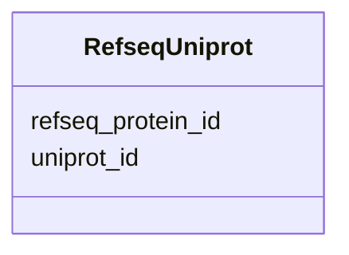

# Class: RefseqUniprot 


URI: [img_core_v400:RefseqUniprot](https://w3id.org/jgi/img_core_v400/RefseqUniprot)





<!-- no inheritance hierarchy -->


## Slots

| Name | Cardinality and Range | Description | Inheritance |
| ---  | --- | --- | --- |
| [refseq_protein_id](refseq_protein_id.md) | 0..1 <br/> [String](String.md) |  | direct |
| [uniprot_id](uniprot_id.md) | 0..1 <br/> [String](String.md) |  | direct |


## Identifier and Mapping Information


### Schema Source


* from schema: https://w3id.org/jgi/img_core_v400


## Mappings

| Mapping Type | Mapped Value |
| ---  | ---  |
| self | img_core_v400:RefseqUniprot |
| native | img_core_v400:RefseqUniprot |


## LinkML Source

<!-- TODO: investigate https://stackoverflow.com/questions/37606292/how-to-create-tabbed-code-blocks-in-mkdocs-or-sphinx -->

### Direct

<details>
```yaml
name: refseq_uniprot
from_schema: https://w3id.org/jgi/img_core_v400
attributes:
  refseq_protein_id:
    name: refseq_protein_id
    from_schema: https://w3id.org/jgi/img_core_v400
    rank: 1000
    domain_of:
    - refseq_uniprot
    range: string
    required: false
  uniprot_id:
    name: uniprot_id
    from_schema: https://w3id.org/jgi/img_core_v400
    domain_of:
    - kegg_gene_uniprot_ids
    - refseq_uniprot
    range: string
    required: false

```
</details>

### Induced

<details>
```yaml
name: refseq_uniprot
from_schema: https://w3id.org/jgi/img_core_v400
attributes:
  refseq_protein_id:
    name: refseq_protein_id
    from_schema: https://w3id.org/jgi/img_core_v400
    rank: 1000
    alias: refseq_protein_id
    owner: refseq_uniprot
    domain_of:
    - refseq_uniprot
    range: string
    required: false
  uniprot_id:
    name: uniprot_id
    from_schema: https://w3id.org/jgi/img_core_v400
    alias: uniprot_id
    owner: refseq_uniprot
    domain_of:
    - kegg_gene_uniprot_ids
    - refseq_uniprot
    range: string
    required: false

```
</details>