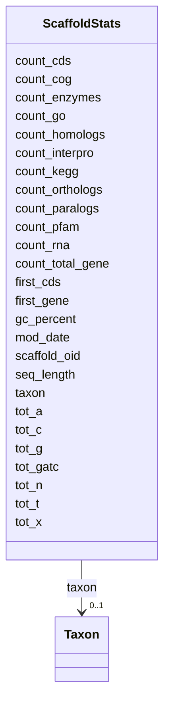

# Class: ScaffoldStats 


URI: [img_core_v400:ScaffoldStats](https://w3id.org/jgi/img_core_v400/ScaffoldStats)





<!-- no inheritance hierarchy -->


## Slots

| Name | Cardinality and Range | Description | Inheritance |
| ---  | --- | --- | --- |
| [scaffold_oid](scaffold_oid.md) | 0..1 <br/> [Integer](Integer.md) |  | direct |
| [seq_length](seq_length.md) | 0..1 <br/> [Integer](Integer.md) |  | direct |
| [tot_gatc](tot_gatc.md) | 0..1 <br/> [Integer](Integer.md) |  | direct |
| [tot_g](tot_g.md) | 0..1 <br/> [Integer](Integer.md) |  | direct |
| [tot_a](tot_a.md) | 0..1 <br/> [Integer](Integer.md) |  | direct |
| [tot_t](tot_t.md) | 0..1 <br/> [Integer](Integer.md) |  | direct |
| [tot_c](tot_c.md) | 0..1 <br/> [Integer](Integer.md) |  | direct |
| [tot_n](tot_n.md) | 0..1 <br/> [Integer](Integer.md) |  | direct |
| [tot_x](tot_x.md) | 0..1 <br/> [Integer](Integer.md) |  | direct |
| [count_cog](count_cog.md) | 0..1 <br/> [Integer](Integer.md) |  | direct |
| [count_kegg](count_kegg.md) | 0..1 <br/> [Integer](Integer.md) |  | direct |
| [count_enzymes](count_enzymes.md) | 0..1 <br/> [Integer](Integer.md) |  | direct |
| [count_go](count_go.md) | 0..1 <br/> [Integer](Integer.md) |  | direct |
| [count_homologs](count_homologs.md) | 0..1 <br/> [Integer](Integer.md) |  | direct |
| [count_orthologs](count_orthologs.md) | 0..1 <br/> [Integer](Integer.md) |  | direct |
| [count_paralogs](count_paralogs.md) | 0..1 <br/> [Integer](Integer.md) |  | direct |
| [count_interpro](count_interpro.md) | 0..1 <br/> [Integer](Integer.md) |  | direct |
| [count_pfam](count_pfam.md) | 0..1 <br/> [Integer](Integer.md) |  | direct |
| [count_cds](count_cds.md) | 0..1 <br/> [Integer](Integer.md) |  | direct |
| [count_rna](count_rna.md) | 0..1 <br/> [Integer](Integer.md) |  | direct |
| [count_total_gene](count_total_gene.md) | 0..1 <br/> [Integer](Integer.md) |  | direct |
| [first_gene](first_gene.md) | 0..1 <br/> [Integer](Integer.md) |  | direct |
| [first_cds](first_cds.md) | 0..1 <br/> [Integer](Integer.md) |  | direct |
| [gc_percent](gc_percent.md) | 0..1 <br/> [Float](Float.md) |  | direct |
| [taxon](taxon.md) | 0..1 <br/> [Taxon](Taxon.md) | Foreign key to taxon | direct |
| [mod_date](mod_date.md) | 0..1 <br/> [Datetime](Datetime.md) |  | direct |


## Identifier and Mapping Information


### Schema Source


* from schema: https://w3id.org/jgi/img_core_v400


## Mappings

| Mapping Type | Mapped Value |
| ---  | ---  |
| self | img_core_v400:ScaffoldStats |
| native | img_core_v400:ScaffoldStats |


## LinkML Source

<!-- TODO: investigate https://stackoverflow.com/questions/37606292/how-to-create-tabbed-code-blocks-in-mkdocs-or-sphinx -->

### Direct

<details>
```yaml
name: scaffold_stats
from_schema: https://w3id.org/jgi/img_core_v400
attributes:
  scaffold_oid:
    name: scaffold_oid
    from_schema: https://w3id.org/jgi/img_core_v400
    domain_of:
    - delete_scaffolds
    - dt_intergenic
    - scaffold
    - scaffold_ext_links
    - scaffold_nx_feature
    - scaffold_repeats
    - scaffold_stats
    range: integer
    required: false
  seq_length:
    name: seq_length
    from_schema: https://w3id.org/jgi/img_core_v400
    domain_of:
    - cog
    - kog
    - pfam_family
    - scaffold_nx_feature
    - scaffold_stats
    range: integer
    required: false
  tot_gatc:
    name: tot_gatc
    from_schema: https://w3id.org/jgi/img_core_v400
    rank: 1000
    domain_of:
    - scaffold_stats
    range: integer
    required: false
  tot_g:
    name: tot_g
    from_schema: https://w3id.org/jgi/img_core_v400
    rank: 1000
    domain_of:
    - scaffold_stats
    range: integer
    required: false
  tot_a:
    name: tot_a
    from_schema: https://w3id.org/jgi/img_core_v400
    rank: 1000
    domain_of:
    - scaffold_stats
    range: integer
    required: false
  tot_t:
    name: tot_t
    from_schema: https://w3id.org/jgi/img_core_v400
    rank: 1000
    domain_of:
    - scaffold_stats
    range: integer
    required: false
  tot_c:
    name: tot_c
    from_schema: https://w3id.org/jgi/img_core_v400
    rank: 1000
    domain_of:
    - scaffold_stats
    range: integer
    required: false
  tot_n:
    name: tot_n
    from_schema: https://w3id.org/jgi/img_core_v400
    rank: 1000
    domain_of:
    - scaffold_stats
    range: integer
    required: false
  tot_x:
    name: tot_x
    from_schema: https://w3id.org/jgi/img_core_v400
    rank: 1000
    domain_of:
    - scaffold_stats
    range: integer
    required: false
  count_cog:
    name: count_cog
    from_schema: https://w3id.org/jgi/img_core_v400
    rank: 1000
    domain_of:
    - scaffold_stats
    range: integer
    required: false
  count_kegg:
    name: count_kegg
    from_schema: https://w3id.org/jgi/img_core_v400
    rank: 1000
    domain_of:
    - scaffold_stats
    range: integer
    required: false
  count_enzymes:
    name: count_enzymes
    from_schema: https://w3id.org/jgi/img_core_v400
    rank: 1000
    domain_of:
    - scaffold_stats
    range: integer
    required: false
  count_go:
    name: count_go
    from_schema: https://w3id.org/jgi/img_core_v400
    rank: 1000
    domain_of:
    - scaffold_stats
    - taxon_stats
    range: integer
    required: false
  count_homologs:
    name: count_homologs
    from_schema: https://w3id.org/jgi/img_core_v400
    rank: 1000
    domain_of:
    - scaffold_stats
    range: integer
    required: false
  count_orthologs:
    name: count_orthologs
    from_schema: https://w3id.org/jgi/img_core_v400
    rank: 1000
    domain_of:
    - scaffold_stats
    range: integer
    required: false
  count_paralogs:
    name: count_paralogs
    from_schema: https://w3id.org/jgi/img_core_v400
    rank: 1000
    domain_of:
    - scaffold_stats
    range: integer
    required: false
  count_interpro:
    name: count_interpro
    from_schema: https://w3id.org/jgi/img_core_v400
    rank: 1000
    domain_of:
    - scaffold_stats
    range: integer
    required: false
  count_pfam:
    name: count_pfam
    from_schema: https://w3id.org/jgi/img_core_v400
    rank: 1000
    domain_of:
    - scaffold_stats
    range: integer
    required: false
  count_cds:
    name: count_cds
    from_schema: https://w3id.org/jgi/img_core_v400
    rank: 1000
    domain_of:
    - scaffold_stats
    range: integer
    required: false
  count_rna:
    name: count_rna
    from_schema: https://w3id.org/jgi/img_core_v400
    rank: 1000
    domain_of:
    - scaffold_stats
    range: integer
    required: false
  count_total_gene:
    name: count_total_gene
    from_schema: https://w3id.org/jgi/img_core_v400
    rank: 1000
    domain_of:
    - scaffold_stats
    range: integer
    required: false
  first_gene:
    name: first_gene
    from_schema: https://w3id.org/jgi/img_core_v400
    rank: 1000
    domain_of:
    - scaffold_stats
    range: integer
    required: false
  first_cds:
    name: first_cds
    from_schema: https://w3id.org/jgi/img_core_v400
    rank: 1000
    domain_of:
    - scaffold_stats
    range: integer
    required: false
  gc_percent:
    name: gc_percent
    from_schema: https://w3id.org/jgi/img_core_v400
    domain_of:
    - gene
    - scaffold_stats
    - taxon_stats
    - taxon_stats_merfs
    - taxon_stats_prod_vw
    range: float
    required: false
  taxon:
    name: taxon
    description: Foreign key to taxon
    from_schema: https://w3id.org/jgi/img_core_v400
    domain_of:
    - cog_species
    - dt_img_gene_prot_pep_sample
    - dt_taxon_node_lite
    - gene
    - gene_biocyc_rxns
    - gene_cathfam
    - gene_cog_groups
    - gene_img_interpro_hits
    - gene_ko_enzymes
    - gene_ko_enzymes_new
    - gene_ko_terms
    - gene_kog_groups
    - gene_pfam_families
    - gene_smart
    - gene_superfam
    - gene_tigrfams
    - gene_xref_families
    - kp_pseudo
    - merfs_gene_mapping
    - paralog_group
    - scaffold
    - scaffold_stats
    - taxon_node_lite
    range: taxon
    required: false
  mod_date:
    name: mod_date
    from_schema: https://w3id.org/jgi/img_core_v400
    domain_of:
    - gene
    - img_orf_type
    - scaffold_stats
    - taxon
    - taxon_prod_vw
    - taxon_stats
    - taxon_stats_merfs
    - taxon_stats_prod_vw
    range: datetime
    required: false

```
</details>

### Induced

<details>
```yaml
name: scaffold_stats
from_schema: https://w3id.org/jgi/img_core_v400
attributes:
  scaffold_oid:
    name: scaffold_oid
    from_schema: https://w3id.org/jgi/img_core_v400
    alias: scaffold_oid
    owner: scaffold_stats
    domain_of:
    - delete_scaffolds
    - dt_intergenic
    - scaffold
    - scaffold_ext_links
    - scaffold_nx_feature
    - scaffold_repeats
    - scaffold_stats
    range: integer
    required: false
  seq_length:
    name: seq_length
    from_schema: https://w3id.org/jgi/img_core_v400
    alias: seq_length
    owner: scaffold_stats
    domain_of:
    - cog
    - kog
    - pfam_family
    - scaffold_nx_feature
    - scaffold_stats
    range: integer
    required: false
  tot_gatc:
    name: tot_gatc
    from_schema: https://w3id.org/jgi/img_core_v400
    rank: 1000
    alias: tot_gatc
    owner: scaffold_stats
    domain_of:
    - scaffold_stats
    range: integer
    required: false
  tot_g:
    name: tot_g
    from_schema: https://w3id.org/jgi/img_core_v400
    rank: 1000
    alias: tot_g
    owner: scaffold_stats
    domain_of:
    - scaffold_stats
    range: integer
    required: false
  tot_a:
    name: tot_a
    from_schema: https://w3id.org/jgi/img_core_v400
    rank: 1000
    alias: tot_a
    owner: scaffold_stats
    domain_of:
    - scaffold_stats
    range: integer
    required: false
  tot_t:
    name: tot_t
    from_schema: https://w3id.org/jgi/img_core_v400
    rank: 1000
    alias: tot_t
    owner: scaffold_stats
    domain_of:
    - scaffold_stats
    range: integer
    required: false
  tot_c:
    name: tot_c
    from_schema: https://w3id.org/jgi/img_core_v400
    rank: 1000
    alias: tot_c
    owner: scaffold_stats
    domain_of:
    - scaffold_stats
    range: integer
    required: false
  tot_n:
    name: tot_n
    from_schema: https://w3id.org/jgi/img_core_v400
    rank: 1000
    alias: tot_n
    owner: scaffold_stats
    domain_of:
    - scaffold_stats
    range: integer
    required: false
  tot_x:
    name: tot_x
    from_schema: https://w3id.org/jgi/img_core_v400
    rank: 1000
    alias: tot_x
    owner: scaffold_stats
    domain_of:
    - scaffold_stats
    range: integer
    required: false
  count_cog:
    name: count_cog
    from_schema: https://w3id.org/jgi/img_core_v400
    rank: 1000
    alias: count_cog
    owner: scaffold_stats
    domain_of:
    - scaffold_stats
    range: integer
    required: false
  count_kegg:
    name: count_kegg
    from_schema: https://w3id.org/jgi/img_core_v400
    rank: 1000
    alias: count_kegg
    owner: scaffold_stats
    domain_of:
    - scaffold_stats
    range: integer
    required: false
  count_enzymes:
    name: count_enzymes
    from_schema: https://w3id.org/jgi/img_core_v400
    rank: 1000
    alias: count_enzymes
    owner: scaffold_stats
    domain_of:
    - scaffold_stats
    range: integer
    required: false
  count_go:
    name: count_go
    from_schema: https://w3id.org/jgi/img_core_v400
    rank: 1000
    alias: count_go
    owner: scaffold_stats
    domain_of:
    - scaffold_stats
    - taxon_stats
    range: integer
    required: false
  count_homologs:
    name: count_homologs
    from_schema: https://w3id.org/jgi/img_core_v400
    rank: 1000
    alias: count_homologs
    owner: scaffold_stats
    domain_of:
    - scaffold_stats
    range: integer
    required: false
  count_orthologs:
    name: count_orthologs
    from_schema: https://w3id.org/jgi/img_core_v400
    rank: 1000
    alias: count_orthologs
    owner: scaffold_stats
    domain_of:
    - scaffold_stats
    range: integer
    required: false
  count_paralogs:
    name: count_paralogs
    from_schema: https://w3id.org/jgi/img_core_v400
    rank: 1000
    alias: count_paralogs
    owner: scaffold_stats
    domain_of:
    - scaffold_stats
    range: integer
    required: false
  count_interpro:
    name: count_interpro
    from_schema: https://w3id.org/jgi/img_core_v400
    rank: 1000
    alias: count_interpro
    owner: scaffold_stats
    domain_of:
    - scaffold_stats
    range: integer
    required: false
  count_pfam:
    name: count_pfam
    from_schema: https://w3id.org/jgi/img_core_v400
    rank: 1000
    alias: count_pfam
    owner: scaffold_stats
    domain_of:
    - scaffold_stats
    range: integer
    required: false
  count_cds:
    name: count_cds
    from_schema: https://w3id.org/jgi/img_core_v400
    rank: 1000
    alias: count_cds
    owner: scaffold_stats
    domain_of:
    - scaffold_stats
    range: integer
    required: false
  count_rna:
    name: count_rna
    from_schema: https://w3id.org/jgi/img_core_v400
    rank: 1000
    alias: count_rna
    owner: scaffold_stats
    domain_of:
    - scaffold_stats
    range: integer
    required: false
  count_total_gene:
    name: count_total_gene
    from_schema: https://w3id.org/jgi/img_core_v400
    rank: 1000
    alias: count_total_gene
    owner: scaffold_stats
    domain_of:
    - scaffold_stats
    range: integer
    required: false
  first_gene:
    name: first_gene
    from_schema: https://w3id.org/jgi/img_core_v400
    rank: 1000
    alias: first_gene
    owner: scaffold_stats
    domain_of:
    - scaffold_stats
    range: integer
    required: false
  first_cds:
    name: first_cds
    from_schema: https://w3id.org/jgi/img_core_v400
    rank: 1000
    alias: first_cds
    owner: scaffold_stats
    domain_of:
    - scaffold_stats
    range: integer
    required: false
  gc_percent:
    name: gc_percent
    from_schema: https://w3id.org/jgi/img_core_v400
    alias: gc_percent
    owner: scaffold_stats
    domain_of:
    - gene
    - scaffold_stats
    - taxon_stats
    - taxon_stats_merfs
    - taxon_stats_prod_vw
    range: float
    required: false
  taxon:
    name: taxon
    description: Foreign key to taxon
    from_schema: https://w3id.org/jgi/img_core_v400
    alias: taxon
    owner: scaffold_stats
    domain_of:
    - cog_species
    - dt_img_gene_prot_pep_sample
    - dt_taxon_node_lite
    - gene
    - gene_biocyc_rxns
    - gene_cathfam
    - gene_cog_groups
    - gene_img_interpro_hits
    - gene_ko_enzymes
    - gene_ko_enzymes_new
    - gene_ko_terms
    - gene_kog_groups
    - gene_pfam_families
    - gene_smart
    - gene_superfam
    - gene_tigrfams
    - gene_xref_families
    - kp_pseudo
    - merfs_gene_mapping
    - paralog_group
    - scaffold
    - scaffold_stats
    - taxon_node_lite
    range: taxon
    required: false
  mod_date:
    name: mod_date
    from_schema: https://w3id.org/jgi/img_core_v400
    alias: mod_date
    owner: scaffold_stats
    domain_of:
    - gene
    - img_orf_type
    - scaffold_stats
    - taxon
    - taxon_prod_vw
    - taxon_stats
    - taxon_stats_merfs
    - taxon_stats_prod_vw
    range: datetime
    required: false

```
</details>