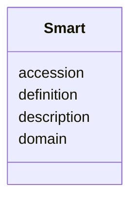

# Class: Smart 


URI: [img_core_v400:Smart](https://w3id.org/jgi/img_core_v400/Smart)





<!-- no inheritance hierarchy -->


## Slots

| Name | Cardinality and Range | Description | Inheritance |
| ---  | --- | --- | --- |
| [domain](domain.md) | 0..1 <br/> [String](String.md) |  | direct |
| [accession](accession.md) | 0..1 <br/> [String](String.md) |  | direct |
| [definition](definition.md) | 0..1 <br/> [String](String.md) |  | direct |
| [description](description.md) | 0..1 <br/> [String](String.md) |  | direct |


## Identifier and Mapping Information


### Schema Source


* from schema: https://w3id.org/jgi/img_core_v400


## Mappings

| Mapping Type | Mapped Value |
| ---  | ---  |
| self | img_core_v400:Smart |
| native | img_core_v400:Smart |


## LinkML Source

<!-- TODO: investigate https://stackoverflow.com/questions/37606292/how-to-create-tabbed-code-blocks-in-mkdocs-or-sphinx -->

### Direct

<details>
```yaml
name: smart
from_schema: https://w3id.org/jgi/img_core_v400
attributes:
  domain:
    name: domain
    from_schema: https://w3id.org/jgi/img_core_v400
    domain_of:
    - dt_phylum_dist_genes
    - dt_phylum_dist_stats
    - imgnr_taxons_062123
    - smart
    - taxon
    - taxon_prod_vw
    - vw_taxon_sc
    range: string
    required: false
  accession:
    name: accession
    from_schema: https://w3id.org/jgi/img_core_v400
    domain_of:
    - cath_funfam
    - smart
    - superfamily
    range: string
    required: false
  definition:
    name: definition
    from_schema: https://w3id.org/jgi/img_core_v400
    domain_of:
    - cog_function
    - go_term
    - img_orf_type
    - kegg_module
    - ko_term
    - kog_function
    - smart
    range: string
    required: false
  description:
    name: description
    from_schema: https://w3id.org/jgi/img_core_v400
    domain_of:
    - alt_transcript
    - cath_funfam
    - cog
    - gene
    - gene_xref_families
    - genome_property
    - kegg_pathway
    - kog
    - pfam_clan
    - pfam_family
    - smart
    - superfamily
    - yesnocv
    range: string
    required: false

```
</details>

### Induced

<details>
```yaml
name: smart
from_schema: https://w3id.org/jgi/img_core_v400
attributes:
  domain:
    name: domain
    from_schema: https://w3id.org/jgi/img_core_v400
    alias: domain
    owner: smart
    domain_of:
    - dt_phylum_dist_genes
    - dt_phylum_dist_stats
    - imgnr_taxons_062123
    - smart
    - taxon
    - taxon_prod_vw
    - vw_taxon_sc
    range: string
    required: false
  accession:
    name: accession
    from_schema: https://w3id.org/jgi/img_core_v400
    alias: accession
    owner: smart
    domain_of:
    - cath_funfam
    - smart
    - superfamily
    range: string
    required: false
  definition:
    name: definition
    from_schema: https://w3id.org/jgi/img_core_v400
    alias: definition
    owner: smart
    domain_of:
    - cog_function
    - go_term
    - img_orf_type
    - kegg_module
    - ko_term
    - kog_function
    - smart
    range: string
    required: false
  description:
    name: description
    from_schema: https://w3id.org/jgi/img_core_v400
    alias: description
    owner: smart
    domain_of:
    - alt_transcript
    - cath_funfam
    - cog
    - gene
    - gene_xref_families
    - genome_property
    - kegg_pathway
    - kog
    - pfam_clan
    - pfam_family
    - smart
    - superfamily
    - yesnocv
    range: string
    required: false

```
</details>