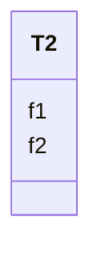

# Class: T2 


URI: [img_core_v400:T2](https://w3id.org/jgi/img_core_v400/T2)





<!-- no inheritance hierarchy -->


## Slots

| Name | Cardinality and Range | Description | Inheritance |
| ---  | --- | --- | --- |
| [f1](f1.md) | 0..1 <br/> [Integer](Integer.md) |  | direct |
| [f2](f2.md) | 0..1 <br/> [String](String.md) |  | direct |


## Identifier and Mapping Information


### Schema Source


* from schema: https://w3id.org/jgi/img_core_v400


## Mappings

| Mapping Type | Mapped Value |
| ---  | ---  |
| self | img_core_v400:T2 |
| native | img_core_v400:T2 |


## LinkML Source

<!-- TODO: investigate https://stackoverflow.com/questions/37606292/how-to-create-tabbed-code-blocks-in-mkdocs-or-sphinx -->

### Direct

<details>
```yaml
name: t2
from_schema: https://w3id.org/jgi/img_core_v400
attributes:
  f1:
    name: f1
    from_schema: https://w3id.org/jgi/img_core_v400
    domain_of:
    - t1
    - t2
    - t3
    range: integer
    required: false
  f2:
    name: f2
    from_schema: https://w3id.org/jgi/img_core_v400
    domain_of:
    - t1
    - t2
    - t3
    range: string
    required: false

```
</details>

### Induced

<details>
```yaml
name: t2
from_schema: https://w3id.org/jgi/img_core_v400
attributes:
  f1:
    name: f1
    from_schema: https://w3id.org/jgi/img_core_v400
    alias: f1
    owner: t2
    domain_of:
    - t1
    - t2
    - t3
    range: integer
    required: false
  f2:
    name: f2
    from_schema: https://w3id.org/jgi/img_core_v400
    alias: f2
    owner: t2
    domain_of:
    - t1
    - t2
    - t3
    range: string
    required: false

```
</details>