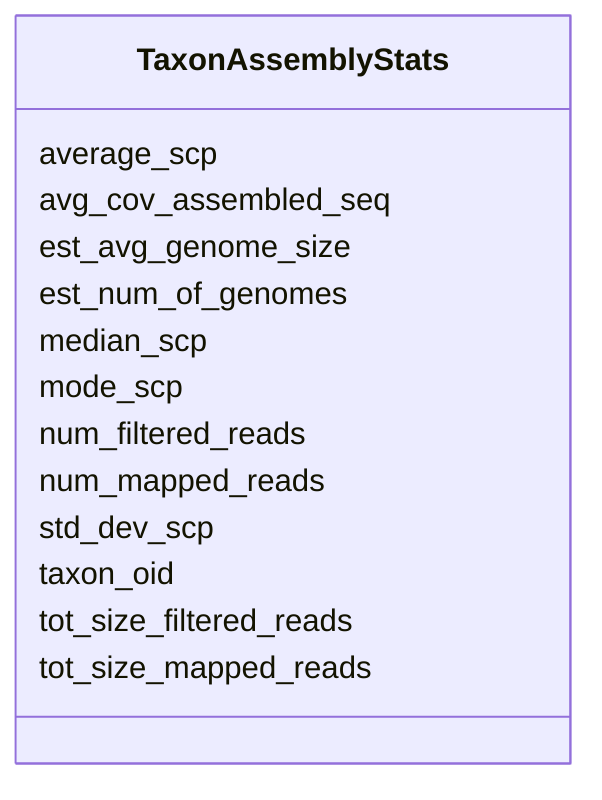

# Class: TaxonAssemblyStats 


URI: [img_core_v400:TaxonAssemblyStats](https://w3id.org/jgi/img_core_v400/TaxonAssemblyStats)





<!-- no inheritance hierarchy -->


## Slots

| Name | Cardinality and Range | Description | Inheritance |
| ---  | --- | --- | --- |
| [num_filtered_reads](num_filtered_reads.md) | 0..1 <br/> [Float](Float.md) |  | direct |
| [num_mapped_reads](num_mapped_reads.md) | 0..1 <br/> [Float](Float.md) |  | direct |
| [tot_size_filtered_reads](tot_size_filtered_reads.md) | 0..1 <br/> [Float](Float.md) |  | direct |
| [tot_size_mapped_reads](tot_size_mapped_reads.md) | 0..1 <br/> [Float](Float.md) |  | direct |
| [avg_cov_assembled_seq](avg_cov_assembled_seq.md) | 0..1 <br/> [Float](Float.md) |  | direct |
| [taxon_oid](taxon_oid.md) | 0..1 <br/> [Integer](Integer.md) |  | direct |
| [average_scp](average_scp.md) | 0..1 <br/> [Float](Float.md) |  | direct |
| [median_scp](median_scp.md) | 0..1 <br/> [Float](Float.md) |  | direct |
| [std_dev_scp](std_dev_scp.md) | 0..1 <br/> [Float](Float.md) |  | direct |
| [mode_scp](mode_scp.md) | 0..1 <br/> [Float](Float.md) |  | direct |
| [est_num_of_genomes](est_num_of_genomes.md) | 0..1 <br/> [Float](Float.md) |  | direct |
| [est_avg_genome_size](est_avg_genome_size.md) | 0..1 <br/> [Float](Float.md) |  | direct |


## Identifier and Mapping Information


### Schema Source


* from schema: https://w3id.org/jgi/img_core_v400


## Mappings

| Mapping Type | Mapped Value |
| ---  | ---  |
| self | img_core_v400:TaxonAssemblyStats |
| native | img_core_v400:TaxonAssemblyStats |


## LinkML Source

<!-- TODO: investigate https://stackoverflow.com/questions/37606292/how-to-create-tabbed-code-blocks-in-mkdocs-or-sphinx -->

### Direct

<details>
```yaml
name: taxon_assembly_stats
from_schema: https://w3id.org/jgi/img_core_v400
attributes:
  num_filtered_reads:
    name: num_filtered_reads
    from_schema: https://w3id.org/jgi/img_core_v400
    rank: 1000
    domain_of:
    - taxon_assembly_stats
    range: float
    required: false
  num_mapped_reads:
    name: num_mapped_reads
    from_schema: https://w3id.org/jgi/img_core_v400
    rank: 1000
    domain_of:
    - taxon_assembly_stats
    range: float
    required: false
  tot_size_filtered_reads:
    name: tot_size_filtered_reads
    from_schema: https://w3id.org/jgi/img_core_v400
    rank: 1000
    domain_of:
    - taxon_assembly_stats
    range: float
    required: false
  tot_size_mapped_reads:
    name: tot_size_mapped_reads
    from_schema: https://w3id.org/jgi/img_core_v400
    rank: 1000
    domain_of:
    - taxon_assembly_stats
    range: float
    required: false
  avg_cov_assembled_seq:
    name: avg_cov_assembled_seq
    from_schema: https://w3id.org/jgi/img_core_v400
    rank: 1000
    domain_of:
    - taxon_assembly_stats
    range: float
    required: false
  taxon_oid:
    name: taxon_oid
    from_schema: https://w3id.org/jgi/img_core_v400
    domain_of:
    - asv5_taxons
    - bcg_taxons
    - dt_all_phylo_taxon_stats
    - dt_cog_stats
    - dt_kog_stats
    - dt_phylo_taxon_stats
    - dt_phylodist_new_taxons
    - dt_phylum_dist_genes
    - dt_phylum_dist_stats
    - dt_scog_genes
    - dt_taxon_kmodule_mcr
    - img_iuig_tarballs_11202023
    - img_umag_bin_tarballs_02062024
    - imgnr_taxons_062123
    - iso_plasmids
    - kp_actino
    - kp_taxons
    - new_taxons
    - new_taxons_batch
    - old_taxons
    - tarball_refresh_taxons
    - taxon
    - taxon_assembly_stats
    - taxon_cathfunfam_count
    - taxon_cog_count
    - taxon_crispr_details
    - taxon_crispr_summary
    - taxon_dw
    - taxon_ec_count
    - taxon_ext_links
    - taxon_gene_prefix
    - taxon_gtdbtk_lineage
    - taxon_ko_count
    - taxon_pfam_count
    - taxon_prod_vw
    - taxon_replacements
    - taxon_replacements_view
    - taxon_scaf_prefix
    - taxon_smart_count
    - taxon_smc_stats
    - taxon_stats
    - taxon_stats_merfs
    - taxon_stats_prod_vw
    - taxon_supfam_count
    - taxon_taxon_scaffold_info
    - taxon_tigr_count
    - vw_gold_taxon
    - vw_taxon_sc
    range: integer
    required: false
  average_scp:
    name: average_scp
    from_schema: https://w3id.org/jgi/img_core_v400
    rank: 1000
    domain_of:
    - taxon_assembly_stats
    range: float
    required: false
  median_scp:
    name: median_scp
    from_schema: https://w3id.org/jgi/img_core_v400
    rank: 1000
    domain_of:
    - taxon_assembly_stats
    range: float
    required: false
  std_dev_scp:
    name: std_dev_scp
    from_schema: https://w3id.org/jgi/img_core_v400
    rank: 1000
    domain_of:
    - taxon_assembly_stats
    range: float
    required: false
  mode_scp:
    name: mode_scp
    from_schema: https://w3id.org/jgi/img_core_v400
    rank: 1000
    domain_of:
    - taxon_assembly_stats
    range: float
    required: false
  est_num_of_genomes:
    name: est_num_of_genomes
    from_schema: https://w3id.org/jgi/img_core_v400
    rank: 1000
    domain_of:
    - taxon_assembly_stats
    range: float
    required: false
  est_avg_genome_size:
    name: est_avg_genome_size
    from_schema: https://w3id.org/jgi/img_core_v400
    rank: 1000
    domain_of:
    - taxon_assembly_stats
    range: float
    required: false

```
</details>

### Induced

<details>
```yaml
name: taxon_assembly_stats
from_schema: https://w3id.org/jgi/img_core_v400
attributes:
  num_filtered_reads:
    name: num_filtered_reads
    from_schema: https://w3id.org/jgi/img_core_v400
    rank: 1000
    alias: num_filtered_reads
    owner: taxon_assembly_stats
    domain_of:
    - taxon_assembly_stats
    range: float
    required: false
  num_mapped_reads:
    name: num_mapped_reads
    from_schema: https://w3id.org/jgi/img_core_v400
    rank: 1000
    alias: num_mapped_reads
    owner: taxon_assembly_stats
    domain_of:
    - taxon_assembly_stats
    range: float
    required: false
  tot_size_filtered_reads:
    name: tot_size_filtered_reads
    from_schema: https://w3id.org/jgi/img_core_v400
    rank: 1000
    alias: tot_size_filtered_reads
    owner: taxon_assembly_stats
    domain_of:
    - taxon_assembly_stats
    range: float
    required: false
  tot_size_mapped_reads:
    name: tot_size_mapped_reads
    from_schema: https://w3id.org/jgi/img_core_v400
    rank: 1000
    alias: tot_size_mapped_reads
    owner: taxon_assembly_stats
    domain_of:
    - taxon_assembly_stats
    range: float
    required: false
  avg_cov_assembled_seq:
    name: avg_cov_assembled_seq
    from_schema: https://w3id.org/jgi/img_core_v400
    rank: 1000
    alias: avg_cov_assembled_seq
    owner: taxon_assembly_stats
    domain_of:
    - taxon_assembly_stats
    range: float
    required: false
  taxon_oid:
    name: taxon_oid
    from_schema: https://w3id.org/jgi/img_core_v400
    alias: taxon_oid
    owner: taxon_assembly_stats
    domain_of:
    - asv5_taxons
    - bcg_taxons
    - dt_all_phylo_taxon_stats
    - dt_cog_stats
    - dt_kog_stats
    - dt_phylo_taxon_stats
    - dt_phylodist_new_taxons
    - dt_phylum_dist_genes
    - dt_phylum_dist_stats
    - dt_scog_genes
    - dt_taxon_kmodule_mcr
    - img_iuig_tarballs_11202023
    - img_umag_bin_tarballs_02062024
    - imgnr_taxons_062123
    - iso_plasmids
    - kp_actino
    - kp_taxons
    - new_taxons
    - new_taxons_batch
    - old_taxons
    - tarball_refresh_taxons
    - taxon
    - taxon_assembly_stats
    - taxon_cathfunfam_count
    - taxon_cog_count
    - taxon_crispr_details
    - taxon_crispr_summary
    - taxon_dw
    - taxon_ec_count
    - taxon_ext_links
    - taxon_gene_prefix
    - taxon_gtdbtk_lineage
    - taxon_ko_count
    - taxon_pfam_count
    - taxon_prod_vw
    - taxon_replacements
    - taxon_replacements_view
    - taxon_scaf_prefix
    - taxon_smart_count
    - taxon_smc_stats
    - taxon_stats
    - taxon_stats_merfs
    - taxon_stats_prod_vw
    - taxon_supfam_count
    - taxon_taxon_scaffold_info
    - taxon_tigr_count
    - vw_gold_taxon
    - vw_taxon_sc
    range: integer
    required: false
  average_scp:
    name: average_scp
    from_schema: https://w3id.org/jgi/img_core_v400
    rank: 1000
    alias: average_scp
    owner: taxon_assembly_stats
    domain_of:
    - taxon_assembly_stats
    range: float
    required: false
  median_scp:
    name: median_scp
    from_schema: https://w3id.org/jgi/img_core_v400
    rank: 1000
    alias: median_scp
    owner: taxon_assembly_stats
    domain_of:
    - taxon_assembly_stats
    range: float
    required: false
  std_dev_scp:
    name: std_dev_scp
    from_schema: https://w3id.org/jgi/img_core_v400
    rank: 1000
    alias: std_dev_scp
    owner: taxon_assembly_stats
    domain_of:
    - taxon_assembly_stats
    range: float
    required: false
  mode_scp:
    name: mode_scp
    from_schema: https://w3id.org/jgi/img_core_v400
    rank: 1000
    alias: mode_scp
    owner: taxon_assembly_stats
    domain_of:
    - taxon_assembly_stats
    range: float
    required: false
  est_num_of_genomes:
    name: est_num_of_genomes
    from_schema: https://w3id.org/jgi/img_core_v400
    rank: 1000
    alias: est_num_of_genomes
    owner: taxon_assembly_stats
    domain_of:
    - taxon_assembly_stats
    range: float
    required: false
  est_avg_genome_size:
    name: est_avg_genome_size
    from_schema: https://w3id.org/jgi/img_core_v400
    rank: 1000
    alias: est_avg_genome_size
    owner: taxon_assembly_stats
    domain_of:
    - taxon_assembly_stats
    range: float
    required: false

```
</details>