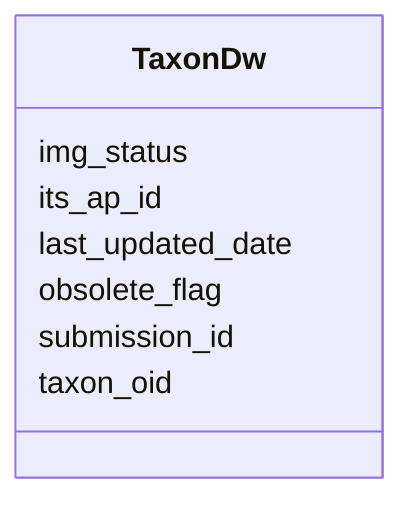

# Class: TaxonDw 


URI: [img_core_v400:TaxonDw](https://w3id.org/jgi/img_core_v400/TaxonDw)





<!-- no inheritance hierarchy -->


## Slots

| Name | Cardinality and Range | Description | Inheritance |
| ---  | --- | --- | --- |
| [its_ap_id](its_ap_id.md) | 0..1 <br/> [Integer](Integer.md) |  | direct |
| [taxon_oid](taxon_oid.md) | 0..1 <br/> [Integer](Integer.md) |  | direct |
| [submission_id](submission_id.md) | 0..1 <br/> [Integer](Integer.md) |  | direct |
| [img_status](img_status.md) | 0..1 <br/> [String](String.md) |  | direct |
| [obsolete_flag](obsolete_flag.md) | 0..1 <br/> [String](String.md) |  | direct |
| [last_updated_date](last_updated_date.md) | 0..1 <br/> [Datetime](Datetime.md) |  | direct |


## Identifier and Mapping Information


### Schema Source


* from schema: https://w3id.org/jgi/img_core_v400


## Mappings

| Mapping Type | Mapped Value |
| ---  | ---  |
| self | img_core_v400:TaxonDw |
| native | img_core_v400:TaxonDw |


## LinkML Source

<!-- TODO: investigate https://stackoverflow.com/questions/37606292/how-to-create-tabbed-code-blocks-in-mkdocs-or-sphinx -->

### Direct

<details>
```yaml
name: taxon_dw
from_schema: https://w3id.org/jgi/img_core_v400
attributes:
  its_ap_id:
    name: its_ap_id
    from_schema: https://w3id.org/jgi/img_core_v400
    domain_of:
    - taxon
    - taxon_dw
    - taxon_prod_vw
    range: integer
    required: false
  taxon_oid:
    name: taxon_oid
    from_schema: https://w3id.org/jgi/img_core_v400
    domain_of:
    - asv5_taxons
    - bcg_taxons
    - dt_all_phylo_taxon_stats
    - dt_cog_stats
    - dt_kog_stats
    - dt_phylo_taxon_stats
    - dt_phylodist_new_taxons
    - dt_phylum_dist_genes
    - dt_phylum_dist_stats
    - dt_scog_genes
    - dt_taxon_kmodule_mcr
    - img_iuig_tarballs_11202023
    - img_umag_bin_tarballs_02062024
    - imgnr_taxons_062123
    - iso_plasmids
    - kp_actino
    - kp_taxons
    - new_taxons
    - new_taxons_batch
    - old_taxons
    - tarball_refresh_taxons
    - taxon
    - taxon_assembly_stats
    - taxon_cathfunfam_count
    - taxon_cog_count
    - taxon_crispr_details
    - taxon_crispr_summary
    - taxon_dw
    - taxon_ec_count
    - taxon_ext_links
    - taxon_gene_prefix
    - taxon_gtdbtk_lineage
    - taxon_ko_count
    - taxon_pfam_count
    - taxon_prod_vw
    - taxon_replacements
    - taxon_replacements_view
    - taxon_scaf_prefix
    - taxon_smart_count
    - taxon_smc_stats
    - taxon_stats
    - taxon_stats_merfs
    - taxon_stats_prod_vw
    - taxon_supfam_count
    - taxon_taxon_scaffold_info
    - taxon_tigr_count
    - vw_gold_taxon
    - vw_taxon_sc
    range: integer
    required: false
  submission_id:
    name: submission_id
    from_schema: https://w3id.org/jgi/img_core_v400
    domain_of:
    - taxon
    - taxon_dw
    - taxon_prod_vw
    range: integer
    required: false
  img_status:
    name: img_status
    from_schema: https://w3id.org/jgi/img_core_v400
    rank: 1000
    domain_of:
    - taxon_dw
    range: string
    required: false
  obsolete_flag:
    name: obsolete_flag
    from_schema: https://w3id.org/jgi/img_core_v400
    domain_of:
    - gene
    - taxon
    - taxon_dw
    - taxon_prod_vw
    - vw_taxon_sc
    range: string
    required: false
  last_updated_date:
    name: last_updated_date
    from_schema: https://w3id.org/jgi/img_core_v400
    rank: 1000
    domain_of:
    - taxon_dw
    range: datetime
    required: false

```
</details>

### Induced

<details>
```yaml
name: taxon_dw
from_schema: https://w3id.org/jgi/img_core_v400
attributes:
  its_ap_id:
    name: its_ap_id
    from_schema: https://w3id.org/jgi/img_core_v400
    alias: its_ap_id
    owner: taxon_dw
    domain_of:
    - taxon
    - taxon_dw
    - taxon_prod_vw
    range: integer
    required: false
  taxon_oid:
    name: taxon_oid
    from_schema: https://w3id.org/jgi/img_core_v400
    alias: taxon_oid
    owner: taxon_dw
    domain_of:
    - asv5_taxons
    - bcg_taxons
    - dt_all_phylo_taxon_stats
    - dt_cog_stats
    - dt_kog_stats
    - dt_phylo_taxon_stats
    - dt_phylodist_new_taxons
    - dt_phylum_dist_genes
    - dt_phylum_dist_stats
    - dt_scog_genes
    - dt_taxon_kmodule_mcr
    - img_iuig_tarballs_11202023
    - img_umag_bin_tarballs_02062024
    - imgnr_taxons_062123
    - iso_plasmids
    - kp_actino
    - kp_taxons
    - new_taxons
    - new_taxons_batch
    - old_taxons
    - tarball_refresh_taxons
    - taxon
    - taxon_assembly_stats
    - taxon_cathfunfam_count
    - taxon_cog_count
    - taxon_crispr_details
    - taxon_crispr_summary
    - taxon_dw
    - taxon_ec_count
    - taxon_ext_links
    - taxon_gene_prefix
    - taxon_gtdbtk_lineage
    - taxon_ko_count
    - taxon_pfam_count
    - taxon_prod_vw
    - taxon_replacements
    - taxon_replacements_view
    - taxon_scaf_prefix
    - taxon_smart_count
    - taxon_smc_stats
    - taxon_stats
    - taxon_stats_merfs
    - taxon_stats_prod_vw
    - taxon_supfam_count
    - taxon_taxon_scaffold_info
    - taxon_tigr_count
    - vw_gold_taxon
    - vw_taxon_sc
    range: integer
    required: false
  submission_id:
    name: submission_id
    from_schema: https://w3id.org/jgi/img_core_v400
    alias: submission_id
    owner: taxon_dw
    domain_of:
    - taxon
    - taxon_dw
    - taxon_prod_vw
    range: integer
    required: false
  img_status:
    name: img_status
    from_schema: https://w3id.org/jgi/img_core_v400
    rank: 1000
    alias: img_status
    owner: taxon_dw
    domain_of:
    - taxon_dw
    range: string
    required: false
  obsolete_flag:
    name: obsolete_flag
    from_schema: https://w3id.org/jgi/img_core_v400
    alias: obsolete_flag
    owner: taxon_dw
    domain_of:
    - gene
    - taxon
    - taxon_dw
    - taxon_prod_vw
    - vw_taxon_sc
    range: string
    required: false
  last_updated_date:
    name: last_updated_date
    from_schema: https://w3id.org/jgi/img_core_v400
    rank: 1000
    alias: last_updated_date
    owner: taxon_dw
    domain_of:
    - taxon_dw
    range: datetime
    required: false

```
</details>