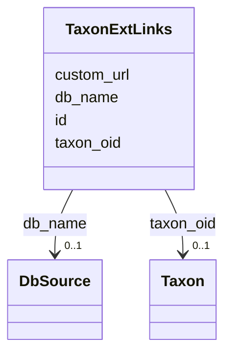

# Class: TaxonExtLinks 


URI: [img_core_v400:TaxonExtLinks](https://w3id.org/jgi/img_core_v400/TaxonExtLinks)





<!-- no inheritance hierarchy -->


## Slots

| Name | Cardinality and Range | Description | Inheritance |
| ---  | --- | --- | --- |
| [taxon_oid](taxon_oid.md) | 0..1 <br/> [Taxon](Taxon.md) | Foreign key to taxon | direct |
| [db_name](db_name.md) | 0..1 <br/> [DbSource](DbSource.md) | Foreign key to db_source | direct |
| [id](id.md) | 0..1 <br/> [String](String.md) |  | direct |
| [custom_url](custom_url.md) | 0..1 <br/> [String](String.md) |  | direct |


## Identifier and Mapping Information


### Schema Source


* from schema: https://w3id.org/jgi/img_core_v400


## Mappings

| Mapping Type | Mapped Value |
| ---  | ---  |
| self | img_core_v400:TaxonExtLinks |
| native | img_core_v400:TaxonExtLinks |


## LinkML Source

<!-- TODO: investigate https://stackoverflow.com/questions/37606292/how-to-create-tabbed-code-blocks-in-mkdocs-or-sphinx -->

### Direct

<details>
```yaml
name: taxon_ext_links
from_schema: https://w3id.org/jgi/img_core_v400
attributes:
  taxon_oid:
    name: taxon_oid
    description: Foreign key to taxon
    from_schema: https://w3id.org/jgi/img_core_v400
    domain_of:
    - asv5_taxons
    - bcg_taxons
    - dt_all_phylo_taxon_stats
    - dt_cog_stats
    - dt_kog_stats
    - dt_phylo_taxon_stats
    - dt_phylodist_new_taxons
    - dt_phylum_dist_genes
    - dt_phylum_dist_stats
    - dt_scog_genes
    - dt_taxon_kmodule_mcr
    - img_iuig_tarballs_11202023
    - img_umag_bin_tarballs_02062024
    - imgnr_taxons_062123
    - iso_plasmids
    - kp_actino
    - kp_taxons
    - new_taxons
    - new_taxons_batch
    - old_taxons
    - tarball_refresh_taxons
    - taxon
    - taxon_assembly_stats
    - taxon_cathfunfam_count
    - taxon_cog_count
    - taxon_crispr_details
    - taxon_crispr_summary
    - taxon_dw
    - taxon_ec_count
    - taxon_ext_links
    - taxon_gene_prefix
    - taxon_gtdbtk_lineage
    - taxon_ko_count
    - taxon_pfam_count
    - taxon_prod_vw
    - taxon_replacements
    - taxon_replacements_view
    - taxon_scaf_prefix
    - taxon_smart_count
    - taxon_smc_stats
    - taxon_stats
    - taxon_stats_merfs
    - taxon_stats_prod_vw
    - taxon_supfam_count
    - taxon_taxon_scaffold_info
    - taxon_tigr_count
    - vw_gold_taxon
    - vw_taxon_sc
    range: taxon
    required: false
  db_name:
    name: db_name
    description: Foreign key to db_source
    from_schema: https://w3id.org/jgi/img_core_v400
    domain_of:
    - biocyc_comp_ext_links
    - biocyc_enzrxn_ext_links
    - biocyc_pathway_ext_links
    - biocyc_protein_ext_links
    - biocyc_reaction_ext_links
    - compound_ext_links
    - enzyme_ext_links
    - gene_cathfam
    - gene_ext_links
    - gene_pdb_xrefs
    - gene_smart
    - gene_superfam
    - gene_xref_families
    - pfam_family_ext_links
    - reaction_ext_links
    - scaffold_ext_links
    - taxon_ext_links
    range: db_source
    required: false
  id:
    name: id
    from_schema: https://w3id.org/jgi/img_core_v400
    domain_of:
    - biocyc_comp_ext_links
    - biocyc_enzrxn_ext_links
    - biocyc_pathway_ext_links
    - biocyc_protein_ext_links
    - biocyc_reaction_ext_links
    - compound_ext_links
    - enzyme_ext_links
    - gene_cathfam
    - gene_ext_links
    - gene_pdb_xrefs
    - gene_smart
    - gene_superfam
    - gene_xref_families
    - pfam_family_ext_links
    - reaction_ext_links
    - scaffold_ext_links
    - taxon_ext_links
    range: string
    required: false
  custom_url:
    name: custom_url
    from_schema: https://w3id.org/jgi/img_core_v400
    domain_of:
    - gene_ext_links
    - scaffold_ext_links
    - taxon_ext_links
    range: string
    required: false

```
</details>

### Induced

<details>
```yaml
name: taxon_ext_links
from_schema: https://w3id.org/jgi/img_core_v400
attributes:
  taxon_oid:
    name: taxon_oid
    description: Foreign key to taxon
    from_schema: https://w3id.org/jgi/img_core_v400
    alias: taxon_oid
    owner: taxon_ext_links
    domain_of:
    - asv5_taxons
    - bcg_taxons
    - dt_all_phylo_taxon_stats
    - dt_cog_stats
    - dt_kog_stats
    - dt_phylo_taxon_stats
    - dt_phylodist_new_taxons
    - dt_phylum_dist_genes
    - dt_phylum_dist_stats
    - dt_scog_genes
    - dt_taxon_kmodule_mcr
    - img_iuig_tarballs_11202023
    - img_umag_bin_tarballs_02062024
    - imgnr_taxons_062123
    - iso_plasmids
    - kp_actino
    - kp_taxons
    - new_taxons
    - new_taxons_batch
    - old_taxons
    - tarball_refresh_taxons
    - taxon
    - taxon_assembly_stats
    - taxon_cathfunfam_count
    - taxon_cog_count
    - taxon_crispr_details
    - taxon_crispr_summary
    - taxon_dw
    - taxon_ec_count
    - taxon_ext_links
    - taxon_gene_prefix
    - taxon_gtdbtk_lineage
    - taxon_ko_count
    - taxon_pfam_count
    - taxon_prod_vw
    - taxon_replacements
    - taxon_replacements_view
    - taxon_scaf_prefix
    - taxon_smart_count
    - taxon_smc_stats
    - taxon_stats
    - taxon_stats_merfs
    - taxon_stats_prod_vw
    - taxon_supfam_count
    - taxon_taxon_scaffold_info
    - taxon_tigr_count
    - vw_gold_taxon
    - vw_taxon_sc
    range: taxon
    required: false
  db_name:
    name: db_name
    description: Foreign key to db_source
    from_schema: https://w3id.org/jgi/img_core_v400
    alias: db_name
    owner: taxon_ext_links
    domain_of:
    - biocyc_comp_ext_links
    - biocyc_enzrxn_ext_links
    - biocyc_pathway_ext_links
    - biocyc_protein_ext_links
    - biocyc_reaction_ext_links
    - compound_ext_links
    - enzyme_ext_links
    - gene_cathfam
    - gene_ext_links
    - gene_pdb_xrefs
    - gene_smart
    - gene_superfam
    - gene_xref_families
    - pfam_family_ext_links
    - reaction_ext_links
    - scaffold_ext_links
    - taxon_ext_links
    range: db_source
    required: false
  id:
    name: id
    from_schema: https://w3id.org/jgi/img_core_v400
    alias: id
    owner: taxon_ext_links
    domain_of:
    - biocyc_comp_ext_links
    - biocyc_enzrxn_ext_links
    - biocyc_pathway_ext_links
    - biocyc_protein_ext_links
    - biocyc_reaction_ext_links
    - compound_ext_links
    - enzyme_ext_links
    - gene_cathfam
    - gene_ext_links
    - gene_pdb_xrefs
    - gene_smart
    - gene_superfam
    - gene_xref_families
    - pfam_family_ext_links
    - reaction_ext_links
    - scaffold_ext_links
    - taxon_ext_links
    range: string
    required: false
  custom_url:
    name: custom_url
    from_schema: https://w3id.org/jgi/img_core_v400
    alias: custom_url
    owner: taxon_ext_links
    domain_of:
    - gene_ext_links
    - scaffold_ext_links
    - taxon_ext_links
    range: string
    required: false

```
</details>