# Class: TaxonProdVw 


URI: [img_core_v400:TaxonProdVw](https://w3id.org/jgi/img_core_v400/TaxonProdVw)

```mermaid
 classDiagram
    class TaxonProdVw
    click TaxonProdVw href "../TaxonProdVw/"
      TaxonProdVw : add_date
        
      TaxonProdVw : analysis_product_name
        
      TaxonProdVw : analysis_project_id
        
      TaxonProdVw : analysis_project_type
        
      TaxonProdVw : ani_species
        
      TaxonProdVw : combined_sample_flag
        
      TaxonProdVw : comments
        
      TaxonProdVw : domain
        
      TaxonProdVw : family
        
      TaxonProdVw : funding_agency
        
      TaxonProdVw : genome_completion
        
      TaxonProdVw : genome_type
        
      TaxonProdVw : genus
        
      TaxonProdVw : gram_stain
        
      TaxonProdVw : has_coverage
        
      TaxonProdVw : high_quality_flag
        
      TaxonProdVw : host_ncbi_taxon_id
        
      TaxonProdVw : img_version
        
      TaxonProdVw : in_file
        
      TaxonProdVw : ir_class
        
      TaxonProdVw : ir_order
        
      TaxonProdVw : is_big_euk
        
      TaxonProdVw : is_pangenome
        
      TaxonProdVw : is_public
        
      TaxonProdVw : is_replaced
        
      TaxonProdVw : its_ap_id
        
      TaxonProdVw : jgi_project_id
        
      TaxonProdVw : jgi_rnd_flag
        
      TaxonProdVw : jgi_species_code
        
      TaxonProdVw : mod_date
        
      TaxonProdVw : modified_by
        
      TaxonProdVw : ncbi_species_code
        
      TaxonProdVw : ncbi_taxon_id
        
      TaxonProdVw : obsolete_flag
        
      TaxonProdVw : phylodist_date
        
      TaxonProdVw : phylodist_method
        
      TaxonProdVw : phylum
        
      TaxonProdVw : proposal_name
        
      TaxonProdVw : release_date
        
      TaxonProdVw : sample_gold_id
        
      TaxonProdVw : seq_center
        
      TaxonProdVw : seq_status
        
      TaxonProdVw : sequencing_gold_id
        
      TaxonProdVw : species
        
      TaxonProdVw : strain
        
      TaxonProdVw : study_gold_id
        
      TaxonProdVw : submission_id
        
      TaxonProdVw : taxon_display_name
        
      TaxonProdVw : taxon_oid
        
      
```





<!-- no inheritance hierarchy -->


## Slots

| Name | Cardinality and Range | Description | Inheritance |
| ---  | --- | --- | --- |
| [taxon_oid](taxon_oid.md) | 0..1 <br/> [Integer](Integer.md) |  | direct |
| [genus](genus.md) | 0..1 <br/> [String](String.md) |  | direct |
| [species](species.md) | 0..1 <br/> [String](String.md) |  | direct |
| [strain](strain.md) | 0..1 <br/> [String](String.md) |  | direct |
| [taxon_display_name](taxon_display_name.md) | 0..1 <br/> [String](String.md) |  | direct |
| [ncbi_taxon_id](ncbi_taxon_id.md) | 0..1 <br/> [Integer](Integer.md) |  | direct |
| [domain](domain.md) | 0..1 <br/> [String](String.md) |  | direct |
| [phylum](phylum.md) | 0..1 <br/> [String](String.md) |  | direct |
| [ir_class](ir_class.md) | 0..1 <br/> [String](String.md) |  | direct |
| [ir_order](ir_order.md) | 0..1 <br/> [String](String.md) |  | direct |
| [family](family.md) | 0..1 <br/> [String](String.md) |  | direct |
| [jgi_species_code](jgi_species_code.md) | 0..1 <br/> [String](String.md) |  | direct |
| [comments](comments.md) | 0..1 <br/> [String](String.md) |  | direct |
| [seq_status](seq_status.md) | 0..1 <br/> [String](String.md) |  | direct |
| [seq_center](seq_center.md) | 0..1 <br/> [String](String.md) |  | direct |
| [is_public](is_public.md) | 0..1 <br/> [String](String.md) |  | direct |
| [is_replaced](is_replaced.md) | 0..1 <br/> [String](String.md) |  | direct |
| [funding_agency](funding_agency.md) | 0..1 <br/> [String](String.md) |  | direct |
| [jgi_project_id](jgi_project_id.md) | 0..1 <br/> [Integer](Integer.md) |  | direct |
| [img_version](img_version.md) | 0..1 <br/> [String](String.md) |  | direct |
| [ncbi_species_code](ncbi_species_code.md) | 0..1 <br/> [String](String.md) |  | direct |
| [release_date](release_date.md) | 0..1 <br/> [Datetime](Datetime.md) |  | direct |
| [add_date](add_date.md) | 0..1 <br/> [Datetime](Datetime.md) |  | direct |
| [is_big_euk](is_big_euk.md) | 0..1 <br/> [String](String.md) |  | direct |
| [host_ncbi_taxon_id](host_ncbi_taxon_id.md) | 0..1 <br/> [Integer](Integer.md) |  | direct |
| [mod_date](mod_date.md) | 0..1 <br/> [Datetime](Datetime.md) |  | direct |
| [modified_by](modified_by.md) | 0..1 <br/> [Integer](Integer.md) |  | direct |
| [genome_type](genome_type.md) | 0..1 <br/> [String](String.md) |  | direct |
| [gram_stain](gram_stain.md) | 0..1 <br/> [String](String.md) |  | direct |
| [obsolete_flag](obsolete_flag.md) | 0..1 <br/> [String](String.md) |  | direct |
| [is_pangenome](is_pangenome.md) | 0..1 <br/> [String](String.md) |  | direct |
| [submission_id](submission_id.md) | 0..1 <br/> [Integer](Integer.md) |  | direct |
| [phylodist_date](phylodist_date.md) | 0..1 <br/> [Datetime](Datetime.md) |  | direct |
| [proposal_name](proposal_name.md) | 0..1 <br/> [String](String.md) |  | direct |
| [sample_gold_id](sample_gold_id.md) | 0..1 <br/> [String](String.md) |  | direct |
| [phylodist_method](phylodist_method.md) | 0..1 <br/> [String](String.md) |  | direct |
| [in_file](in_file.md) | 0..1 <br/> [String](String.md) |  | direct |
| [combined_sample_flag](combined_sample_flag.md) | 0..1 <br/> [String](String.md) |  | direct |
| [high_quality_flag](high_quality_flag.md) | 0..1 <br/> [String](String.md) |  | direct |
| [analysis_project_id](analysis_project_id.md) | 0..1 <br/> [String](String.md) |  | direct |
| [ani_species](ani_species.md) | 0..1 <br/> [String](String.md) |  | direct |
| [study_gold_id](study_gold_id.md) | 0..1 <br/> [String](String.md) |  | direct |
| [sequencing_gold_id](sequencing_gold_id.md) | 0..1 <br/> [String](String.md) |  | direct |
| [genome_completion](genome_completion.md) | 0..1 <br/> [Float](Float.md) |  | direct |
| [its_ap_id](its_ap_id.md) | 0..1 <br/> [Integer](Integer.md) |  | direct |
| [analysis_product_name](analysis_product_name.md) | 0..1 <br/> [String](String.md) |  | direct |
| [analysis_project_type](analysis_project_type.md) | 0..1 <br/> [String](String.md) |  | direct |
| [jgi_rnd_flag](jgi_rnd_flag.md) | 0..1 <br/> [String](String.md) |  | direct |
| [has_coverage](has_coverage.md) | 0..1 <br/> [String](String.md) |  | direct |


## Identifier and Mapping Information


### Schema Source


* from schema: https://w3id.org/jgi/img_core_v400


## Mappings

| Mapping Type | Mapped Value |
| ---  | ---  |
| self | img_core_v400:TaxonProdVw |
| native | img_core_v400:TaxonProdVw |


## LinkML Source

<!-- TODO: investigate https://stackoverflow.com/questions/37606292/how-to-create-tabbed-code-blocks-in-mkdocs-or-sphinx -->

### Direct

<details>
```yaml
name: taxon_prod_vw
from_schema: https://w3id.org/jgi/img_core_v400
attributes:
  taxon_oid:
    name: taxon_oid
    from_schema: https://w3id.org/jgi/img_core_v400
    domain_of:
    - asv5_taxons
    - bcg_taxons
    - dt_all_phylo_taxon_stats
    - dt_cog_stats
    - dt_kog_stats
    - dt_phylo_taxon_stats
    - dt_phylodist_new_taxons
    - dt_phylum_dist_genes
    - dt_phylum_dist_stats
    - dt_scog_genes
    - dt_taxon_kmodule_mcr
    - img_iuig_tarballs_11202023
    - img_umag_bin_tarballs_02062024
    - imgnr_taxons_062123
    - iso_plasmids
    - kp_actino
    - kp_taxons
    - new_taxons
    - new_taxons_batch
    - old_taxons
    - tarball_refresh_taxons
    - taxon
    - taxon_assembly_stats
    - taxon_cathfunfam_count
    - taxon_cog_count
    - taxon_crispr_details
    - taxon_crispr_summary
    - taxon_dw
    - taxon_ec_count
    - taxon_ext_links
    - taxon_gene_prefix
    - taxon_gtdbtk_lineage
    - taxon_ko_count
    - taxon_pfam_count
    - taxon_prod_vw
    - taxon_replacements
    - taxon_replacements_view
    - taxon_scaf_prefix
    - taxon_smart_count
    - taxon_smc_stats
    - taxon_stats
    - taxon_stats_merfs
    - taxon_stats_prod_vw
    - taxon_supfam_count
    - taxon_taxon_scaffold_info
    - taxon_tigr_count
    - vw_gold_taxon
    - vw_taxon_sc
    range: integer
    required: false
  genus:
    name: genus
    from_schema: https://w3id.org/jgi/img_core_v400
    domain_of:
    - imgnr_taxons_062123
    - taxon
    - taxon_prod_vw
    - vw_gold_taxon
    range: string
    required: false
  species:
    name: species
    from_schema: https://w3id.org/jgi/img_core_v400
    domain_of:
    - imgnr_taxons_062123
    - taxon
    - taxon_prod_vw
    - vw_gold_taxon
    range: string
    required: false
  strain:
    name: strain
    from_schema: https://w3id.org/jgi/img_core_v400
    domain_of:
    - taxon
    - taxon_prod_vw
    - vw_gold_taxon
    range: string
    required: false
  taxon_display_name:
    name: taxon_display_name
    from_schema: https://w3id.org/jgi/img_core_v400
    domain_of:
    - imgnr_taxons_062123
    - taxon
    - taxon_prod_vw
    - vw_gold_taxon
    - vw_taxon_sc
    range: string
    required: false
  ncbi_taxon_id:
    name: ncbi_taxon_id
    from_schema: https://w3id.org/jgi/img_core_v400
    domain_of:
    - taxon
    - taxon_prod_vw
    - vw_gold_taxon
    range: integer
    required: false
  domain:
    name: domain
    from_schema: https://w3id.org/jgi/img_core_v400
    domain_of:
    - dt_phylum_dist_genes
    - dt_phylum_dist_stats
    - imgnr_taxons_062123
    - smart
    - taxon
    - taxon_prod_vw
    - vw_taxon_sc
    range: string
    required: false
  phylum:
    name: phylum
    from_schema: https://w3id.org/jgi/img_core_v400
    domain_of:
    - dt_phylum_dist_genes
    - dt_phylum_dist_stats
    - imgnr_taxons_062123
    - taxon
    - taxon_prod_vw
    range: string
    required: false
  ir_class:
    name: ir_class
    from_schema: https://w3id.org/jgi/img_core_v400
    domain_of:
    - dt_phylum_dist_genes
    - dt_phylum_dist_stats
    - imgnr_taxons_062123
    - taxon
    - taxon_prod_vw
    range: string
    required: false
  ir_order:
    name: ir_order
    from_schema: https://w3id.org/jgi/img_core_v400
    domain_of:
    - imgnr_taxons_062123
    - taxon
    - taxon_prod_vw
    range: string
    required: false
  family:
    name: family
    from_schema: https://w3id.org/jgi/img_core_v400
    domain_of:
    - compound
    - imgnr_taxons_062123
    - taxon
    - taxon_prod_vw
    range: string
    required: false
  jgi_species_code:
    name: jgi_species_code
    from_schema: https://w3id.org/jgi/img_core_v400
    domain_of:
    - taxon
    - taxon_prod_vw
    range: string
    required: false
  comments:
    name: comments
    from_schema: https://w3id.org/jgi/img_core_v400
    domain_of:
    - biocyc_class
    - biocyc_comp
    - biocyc_enzrxn
    - biocyc_pathway_comments
    - biocyc_protein
    - biocyc_reaction
    - enzyme
    - enzyme_transferred
    - gene_sig_peptides
    - go_term
    - pfam_clan
    - pfam_dead
    - pfam_family
    - reaction
    - taxon
    - taxon_prod_vw
    - taxon_replacements
    range: string
    required: false
  seq_status:
    name: seq_status
    from_schema: https://w3id.org/jgi/img_core_v400
    domain_of:
    - taxon
    - taxon_prod_vw
    range: string
    required: false
  seq_center:
    name: seq_center
    from_schema: https://w3id.org/jgi/img_core_v400
    domain_of:
    - taxon
    - taxon_prod_vw
    range: string
    required: false
  is_public:
    name: is_public
    from_schema: https://w3id.org/jgi/img_core_v400
    domain_of:
    - taxon
    - taxon_prod_vw
    range: string
    required: false
  is_replaced:
    name: is_replaced
    from_schema: https://w3id.org/jgi/img_core_v400
    domain_of:
    - taxon
    - taxon_prod_vw
    range: string
    required: false
  funding_agency:
    name: funding_agency
    from_schema: https://w3id.org/jgi/img_core_v400
    domain_of:
    - taxon
    - taxon_prod_vw
    range: string
    required: false
  jgi_project_id:
    name: jgi_project_id
    from_schema: https://w3id.org/jgi/img_core_v400
    domain_of:
    - taxon
    - taxon_prod_vw
    range: integer
    required: false
  img_version:
    name: img_version
    from_schema: https://w3id.org/jgi/img_core_v400
    domain_of:
    - img_build
    - img_content_history
    - taxon
    - taxon_prod_vw
    - taxon_replacements
    range: string
    required: false
  ncbi_species_code:
    name: ncbi_species_code
    from_schema: https://w3id.org/jgi/img_core_v400
    domain_of:
    - taxon
    - taxon_prod_vw
    range: string
    required: false
  release_date:
    name: release_date
    from_schema: https://w3id.org/jgi/img_core_v400
    domain_of:
    - img_build
    - img_content_history
    - taxon
    - taxon_prod_vw
    - taxon_replacements
    range: datetime
    required: false
  add_date:
    name: add_date
    from_schema: https://w3id.org/jgi/img_core_v400
    domain_of:
    - bcg_taxons
    - cog
    - cog_function
    - cog_species
    - compound
    - enzyme
    - enzyme_transferred
    - gene
    - gene_biocyc_rxns
    - genome_property
    - go_graph_path
    - go_term
    - image_roi
    - kegg_pathway
    - km_image_roi
    - ko_term
    - kog
    - kog_function
    - paralog_group
    - pfam_clan
    - pfam_family
    - positional_cluster
    - property_step
    - reaction
    - scaffold
    - taxon
    - taxon_prod_vw
    - tigr_role
    - tigrfam
    range: datetime
    required: false
  is_big_euk:
    name: is_big_euk
    from_schema: https://w3id.org/jgi/img_core_v400
    domain_of:
    - taxon
    - taxon_prod_vw
    range: string
    required: false
  host_ncbi_taxon_id:
    name: host_ncbi_taxon_id
    from_schema: https://w3id.org/jgi/img_core_v400
    domain_of:
    - taxon
    - taxon_prod_vw
    range: integer
    required: false
  mod_date:
    name: mod_date
    from_schema: https://w3id.org/jgi/img_core_v400
    domain_of:
    - gene
    - img_orf_type
    - scaffold_stats
    - taxon
    - taxon_prod_vw
    - taxon_stats
    - taxon_stats_merfs
    - taxon_stats_prod_vw
    range: datetime
    required: false
  modified_by:
    name: modified_by
    from_schema: https://w3id.org/jgi/img_core_v400
    domain_of:
    - gene
    - img_orf_type
    - taxon
    - taxon_prod_vw
    range: integer
    required: false
  genome_type:
    name: genome_type
    from_schema: https://w3id.org/jgi/img_core_v400
    domain_of:
    - taxon
    - taxon_prod_vw
    - vw_gold_taxon
    range: string
    required: false
  gram_stain:
    name: gram_stain
    from_schema: https://w3id.org/jgi/img_core_v400
    domain_of:
    - taxon
    - taxon_prod_vw
    - vw_gold_taxon
    range: string
    required: false
  obsolete_flag:
    name: obsolete_flag
    from_schema: https://w3id.org/jgi/img_core_v400
    domain_of:
    - gene
    - taxon
    - taxon_dw
    - taxon_prod_vw
    - vw_taxon_sc
    range: string
    required: false
  is_pangenome:
    name: is_pangenome
    from_schema: https://w3id.org/jgi/img_core_v400
    domain_of:
    - taxon
    - taxon_prod_vw
    range: string
    required: false
  submission_id:
    name: submission_id
    from_schema: https://w3id.org/jgi/img_core_v400
    domain_of:
    - taxon
    - taxon_dw
    - taxon_prod_vw
    range: integer
    required: false
  phylodist_date:
    name: phylodist_date
    from_schema: https://w3id.org/jgi/img_core_v400
    domain_of:
    - taxon
    - taxon_prod_vw
    range: datetime
    required: false
  proposal_name:
    name: proposal_name
    from_schema: https://w3id.org/jgi/img_core_v400
    domain_of:
    - taxon
    - taxon_prod_vw
    range: string
    required: false
  sample_gold_id:
    name: sample_gold_id
    from_schema: https://w3id.org/jgi/img_core_v400
    domain_of:
    - taxon
    - taxon_prod_vw
    range: string
    required: false
  phylodist_method:
    name: phylodist_method
    from_schema: https://w3id.org/jgi/img_core_v400
    domain_of:
    - taxon
    - taxon_prod_vw
    range: string
    required: false
  in_file:
    name: in_file
    from_schema: https://w3id.org/jgi/img_core_v400
    domain_of:
    - taxon
    - taxon_prod_vw
    range: string
    required: false
  combined_sample_flag:
    name: combined_sample_flag
    from_schema: https://w3id.org/jgi/img_core_v400
    domain_of:
    - taxon
    - taxon_prod_vw
    - vw_gold_taxon
    range: string
    required: false
  high_quality_flag:
    name: high_quality_flag
    from_schema: https://w3id.org/jgi/img_core_v400
    domain_of:
    - taxon
    - taxon_prod_vw
    range: string
    required: false
  analysis_project_id:
    name: analysis_project_id
    from_schema: https://w3id.org/jgi/img_core_v400
    domain_of:
    - taxon
    - taxon_prod_vw
    - vw_gold_taxon
    range: string
    required: false
  ani_species:
    name: ani_species
    from_schema: https://w3id.org/jgi/img_core_v400
    domain_of:
    - taxon
    - taxon_prod_vw
    range: string
    required: false
  study_gold_id:
    name: study_gold_id
    from_schema: https://w3id.org/jgi/img_core_v400
    domain_of:
    - taxon
    - taxon_prod_vw
    - vw_gold_taxon
    range: string
    required: false
  sequencing_gold_id:
    name: sequencing_gold_id
    from_schema: https://w3id.org/jgi/img_core_v400
    domain_of:
    - taxon
    - taxon_prod_vw
    - vw_gold_taxon
    range: string
    required: false
  genome_completion:
    name: genome_completion
    from_schema: https://w3id.org/jgi/img_core_v400
    domain_of:
    - taxon
    - taxon_prod_vw
    range: float
    required: false
  its_ap_id:
    name: its_ap_id
    from_schema: https://w3id.org/jgi/img_core_v400
    domain_of:
    - taxon
    - taxon_dw
    - taxon_prod_vw
    range: integer
    required: false
  analysis_product_name:
    name: analysis_product_name
    from_schema: https://w3id.org/jgi/img_core_v400
    domain_of:
    - taxon
    - taxon_prod_vw
    range: string
    required: false
  analysis_project_type:
    name: analysis_project_type
    from_schema: https://w3id.org/jgi/img_core_v400
    domain_of:
    - taxon
    - taxon_prod_vw
    - vw_gold_taxon
    range: string
    required: false
  jgi_rnd_flag:
    name: jgi_rnd_flag
    from_schema: https://w3id.org/jgi/img_core_v400
    domain_of:
    - taxon
    - taxon_prod_vw
    range: string
    required: false
  has_coverage:
    name: has_coverage
    from_schema: https://w3id.org/jgi/img_core_v400
    domain_of:
    - taxon
    - taxon_prod_vw
    range: string
    required: false

```
</details>

### Induced

<details>
```yaml
name: taxon_prod_vw
from_schema: https://w3id.org/jgi/img_core_v400
attributes:
  taxon_oid:
    name: taxon_oid
    from_schema: https://w3id.org/jgi/img_core_v400
    alias: taxon_oid
    owner: taxon_prod_vw
    domain_of:
    - asv5_taxons
    - bcg_taxons
    - dt_all_phylo_taxon_stats
    - dt_cog_stats
    - dt_kog_stats
    - dt_phylo_taxon_stats
    - dt_phylodist_new_taxons
    - dt_phylum_dist_genes
    - dt_phylum_dist_stats
    - dt_scog_genes
    - dt_taxon_kmodule_mcr
    - img_iuig_tarballs_11202023
    - img_umag_bin_tarballs_02062024
    - imgnr_taxons_062123
    - iso_plasmids
    - kp_actino
    - kp_taxons
    - new_taxons
    - new_taxons_batch
    - old_taxons
    - tarball_refresh_taxons
    - taxon
    - taxon_assembly_stats
    - taxon_cathfunfam_count
    - taxon_cog_count
    - taxon_crispr_details
    - taxon_crispr_summary
    - taxon_dw
    - taxon_ec_count
    - taxon_ext_links
    - taxon_gene_prefix
    - taxon_gtdbtk_lineage
    - taxon_ko_count
    - taxon_pfam_count
    - taxon_prod_vw
    - taxon_replacements
    - taxon_replacements_view
    - taxon_scaf_prefix
    - taxon_smart_count
    - taxon_smc_stats
    - taxon_stats
    - taxon_stats_merfs
    - taxon_stats_prod_vw
    - taxon_supfam_count
    - taxon_taxon_scaffold_info
    - taxon_tigr_count
    - vw_gold_taxon
    - vw_taxon_sc
    range: integer
    required: false
  genus:
    name: genus
    from_schema: https://w3id.org/jgi/img_core_v400
    alias: genus
    owner: taxon_prod_vw
    domain_of:
    - imgnr_taxons_062123
    - taxon
    - taxon_prod_vw
    - vw_gold_taxon
    range: string
    required: false
  species:
    name: species
    from_schema: https://w3id.org/jgi/img_core_v400
    alias: species
    owner: taxon_prod_vw
    domain_of:
    - imgnr_taxons_062123
    - taxon
    - taxon_prod_vw
    - vw_gold_taxon
    range: string
    required: false
  strain:
    name: strain
    from_schema: https://w3id.org/jgi/img_core_v400
    alias: strain
    owner: taxon_prod_vw
    domain_of:
    - taxon
    - taxon_prod_vw
    - vw_gold_taxon
    range: string
    required: false
  taxon_display_name:
    name: taxon_display_name
    from_schema: https://w3id.org/jgi/img_core_v400
    alias: taxon_display_name
    owner: taxon_prod_vw
    domain_of:
    - imgnr_taxons_062123
    - taxon
    - taxon_prod_vw
    - vw_gold_taxon
    - vw_taxon_sc
    range: string
    required: false
  ncbi_taxon_id:
    name: ncbi_taxon_id
    from_schema: https://w3id.org/jgi/img_core_v400
    alias: ncbi_taxon_id
    owner: taxon_prod_vw
    domain_of:
    - taxon
    - taxon_prod_vw
    - vw_gold_taxon
    range: integer
    required: false
  domain:
    name: domain
    from_schema: https://w3id.org/jgi/img_core_v400
    alias: domain
    owner: taxon_prod_vw
    domain_of:
    - dt_phylum_dist_genes
    - dt_phylum_dist_stats
    - imgnr_taxons_062123
    - smart
    - taxon
    - taxon_prod_vw
    - vw_taxon_sc
    range: string
    required: false
  phylum:
    name: phylum
    from_schema: https://w3id.org/jgi/img_core_v400
    alias: phylum
    owner: taxon_prod_vw
    domain_of:
    - dt_phylum_dist_genes
    - dt_phylum_dist_stats
    - imgnr_taxons_062123
    - taxon
    - taxon_prod_vw
    range: string
    required: false
  ir_class:
    name: ir_class
    from_schema: https://w3id.org/jgi/img_core_v400
    alias: ir_class
    owner: taxon_prod_vw
    domain_of:
    - dt_phylum_dist_genes
    - dt_phylum_dist_stats
    - imgnr_taxons_062123
    - taxon
    - taxon_prod_vw
    range: string
    required: false
  ir_order:
    name: ir_order
    from_schema: https://w3id.org/jgi/img_core_v400
    alias: ir_order
    owner: taxon_prod_vw
    domain_of:
    - imgnr_taxons_062123
    - taxon
    - taxon_prod_vw
    range: string
    required: false
  family:
    name: family
    from_schema: https://w3id.org/jgi/img_core_v400
    alias: family
    owner: taxon_prod_vw
    domain_of:
    - compound
    - imgnr_taxons_062123
    - taxon
    - taxon_prod_vw
    range: string
    required: false
  jgi_species_code:
    name: jgi_species_code
    from_schema: https://w3id.org/jgi/img_core_v400
    alias: jgi_species_code
    owner: taxon_prod_vw
    domain_of:
    - taxon
    - taxon_prod_vw
    range: string
    required: false
  comments:
    name: comments
    from_schema: https://w3id.org/jgi/img_core_v400
    alias: comments
    owner: taxon_prod_vw
    domain_of:
    - biocyc_class
    - biocyc_comp
    - biocyc_enzrxn
    - biocyc_pathway_comments
    - biocyc_protein
    - biocyc_reaction
    - enzyme
    - enzyme_transferred
    - gene_sig_peptides
    - go_term
    - pfam_clan
    - pfam_dead
    - pfam_family
    - reaction
    - taxon
    - taxon_prod_vw
    - taxon_replacements
    range: string
    required: false
  seq_status:
    name: seq_status
    from_schema: https://w3id.org/jgi/img_core_v400
    alias: seq_status
    owner: taxon_prod_vw
    domain_of:
    - taxon
    - taxon_prod_vw
    range: string
    required: false
  seq_center:
    name: seq_center
    from_schema: https://w3id.org/jgi/img_core_v400
    alias: seq_center
    owner: taxon_prod_vw
    domain_of:
    - taxon
    - taxon_prod_vw
    range: string
    required: false
  is_public:
    name: is_public
    from_schema: https://w3id.org/jgi/img_core_v400
    alias: is_public
    owner: taxon_prod_vw
    domain_of:
    - taxon
    - taxon_prod_vw
    range: string
    required: false
  is_replaced:
    name: is_replaced
    from_schema: https://w3id.org/jgi/img_core_v400
    alias: is_replaced
    owner: taxon_prod_vw
    domain_of:
    - taxon
    - taxon_prod_vw
    range: string
    required: false
  funding_agency:
    name: funding_agency
    from_schema: https://w3id.org/jgi/img_core_v400
    alias: funding_agency
    owner: taxon_prod_vw
    domain_of:
    - taxon
    - taxon_prod_vw
    range: string
    required: false
  jgi_project_id:
    name: jgi_project_id
    from_schema: https://w3id.org/jgi/img_core_v400
    alias: jgi_project_id
    owner: taxon_prod_vw
    domain_of:
    - taxon
    - taxon_prod_vw
    range: integer
    required: false
  img_version:
    name: img_version
    from_schema: https://w3id.org/jgi/img_core_v400
    alias: img_version
    owner: taxon_prod_vw
    domain_of:
    - img_build
    - img_content_history
    - taxon
    - taxon_prod_vw
    - taxon_replacements
    range: string
    required: false
  ncbi_species_code:
    name: ncbi_species_code
    from_schema: https://w3id.org/jgi/img_core_v400
    alias: ncbi_species_code
    owner: taxon_prod_vw
    domain_of:
    - taxon
    - taxon_prod_vw
    range: string
    required: false
  release_date:
    name: release_date
    from_schema: https://w3id.org/jgi/img_core_v400
    alias: release_date
    owner: taxon_prod_vw
    domain_of:
    - img_build
    - img_content_history
    - taxon
    - taxon_prod_vw
    - taxon_replacements
    range: datetime
    required: false
  add_date:
    name: add_date
    from_schema: https://w3id.org/jgi/img_core_v400
    alias: add_date
    owner: taxon_prod_vw
    domain_of:
    - bcg_taxons
    - cog
    - cog_function
    - cog_species
    - compound
    - enzyme
    - enzyme_transferred
    - gene
    - gene_biocyc_rxns
    - genome_property
    - go_graph_path
    - go_term
    - image_roi
    - kegg_pathway
    - km_image_roi
    - ko_term
    - kog
    - kog_function
    - paralog_group
    - pfam_clan
    - pfam_family
    - positional_cluster
    - property_step
    - reaction
    - scaffold
    - taxon
    - taxon_prod_vw
    - tigr_role
    - tigrfam
    range: datetime
    required: false
  is_big_euk:
    name: is_big_euk
    from_schema: https://w3id.org/jgi/img_core_v400
    alias: is_big_euk
    owner: taxon_prod_vw
    domain_of:
    - taxon
    - taxon_prod_vw
    range: string
    required: false
  host_ncbi_taxon_id:
    name: host_ncbi_taxon_id
    from_schema: https://w3id.org/jgi/img_core_v400
    alias: host_ncbi_taxon_id
    owner: taxon_prod_vw
    domain_of:
    - taxon
    - taxon_prod_vw
    range: integer
    required: false
  mod_date:
    name: mod_date
    from_schema: https://w3id.org/jgi/img_core_v400
    alias: mod_date
    owner: taxon_prod_vw
    domain_of:
    - gene
    - img_orf_type
    - scaffold_stats
    - taxon
    - taxon_prod_vw
    - taxon_stats
    - taxon_stats_merfs
    - taxon_stats_prod_vw
    range: datetime
    required: false
  modified_by:
    name: modified_by
    from_schema: https://w3id.org/jgi/img_core_v400
    alias: modified_by
    owner: taxon_prod_vw
    domain_of:
    - gene
    - img_orf_type
    - taxon
    - taxon_prod_vw
    range: integer
    required: false
  genome_type:
    name: genome_type
    from_schema: https://w3id.org/jgi/img_core_v400
    alias: genome_type
    owner: taxon_prod_vw
    domain_of:
    - taxon
    - taxon_prod_vw
    - vw_gold_taxon
    range: string
    required: false
  gram_stain:
    name: gram_stain
    from_schema: https://w3id.org/jgi/img_core_v400
    alias: gram_stain
    owner: taxon_prod_vw
    domain_of:
    - taxon
    - taxon_prod_vw
    - vw_gold_taxon
    range: string
    required: false
  obsolete_flag:
    name: obsolete_flag
    from_schema: https://w3id.org/jgi/img_core_v400
    alias: obsolete_flag
    owner: taxon_prod_vw
    domain_of:
    - gene
    - taxon
    - taxon_dw
    - taxon_prod_vw
    - vw_taxon_sc
    range: string
    required: false
  is_pangenome:
    name: is_pangenome
    from_schema: https://w3id.org/jgi/img_core_v400
    alias: is_pangenome
    owner: taxon_prod_vw
    domain_of:
    - taxon
    - taxon_prod_vw
    range: string
    required: false
  submission_id:
    name: submission_id
    from_schema: https://w3id.org/jgi/img_core_v400
    alias: submission_id
    owner: taxon_prod_vw
    domain_of:
    - taxon
    - taxon_dw
    - taxon_prod_vw
    range: integer
    required: false
  phylodist_date:
    name: phylodist_date
    from_schema: https://w3id.org/jgi/img_core_v400
    alias: phylodist_date
    owner: taxon_prod_vw
    domain_of:
    - taxon
    - taxon_prod_vw
    range: datetime
    required: false
  proposal_name:
    name: proposal_name
    from_schema: https://w3id.org/jgi/img_core_v400
    alias: proposal_name
    owner: taxon_prod_vw
    domain_of:
    - taxon
    - taxon_prod_vw
    range: string
    required: false
  sample_gold_id:
    name: sample_gold_id
    from_schema: https://w3id.org/jgi/img_core_v400
    alias: sample_gold_id
    owner: taxon_prod_vw
    domain_of:
    - taxon
    - taxon_prod_vw
    range: string
    required: false
  phylodist_method:
    name: phylodist_method
    from_schema: https://w3id.org/jgi/img_core_v400
    alias: phylodist_method
    owner: taxon_prod_vw
    domain_of:
    - taxon
    - taxon_prod_vw
    range: string
    required: false
  in_file:
    name: in_file
    from_schema: https://w3id.org/jgi/img_core_v400
    alias: in_file
    owner: taxon_prod_vw
    domain_of:
    - taxon
    - taxon_prod_vw
    range: string
    required: false
  combined_sample_flag:
    name: combined_sample_flag
    from_schema: https://w3id.org/jgi/img_core_v400
    alias: combined_sample_flag
    owner: taxon_prod_vw
    domain_of:
    - taxon
    - taxon_prod_vw
    - vw_gold_taxon
    range: string
    required: false
  high_quality_flag:
    name: high_quality_flag
    from_schema: https://w3id.org/jgi/img_core_v400
    alias: high_quality_flag
    owner: taxon_prod_vw
    domain_of:
    - taxon
    - taxon_prod_vw
    range: string
    required: false
  analysis_project_id:
    name: analysis_project_id
    from_schema: https://w3id.org/jgi/img_core_v400
    alias: analysis_project_id
    owner: taxon_prod_vw
    domain_of:
    - taxon
    - taxon_prod_vw
    - vw_gold_taxon
    range: string
    required: false
  ani_species:
    name: ani_species
    from_schema: https://w3id.org/jgi/img_core_v400
    alias: ani_species
    owner: taxon_prod_vw
    domain_of:
    - taxon
    - taxon_prod_vw
    range: string
    required: false
  study_gold_id:
    name: study_gold_id
    from_schema: https://w3id.org/jgi/img_core_v400
    alias: study_gold_id
    owner: taxon_prod_vw
    domain_of:
    - taxon
    - taxon_prod_vw
    - vw_gold_taxon
    range: string
    required: false
  sequencing_gold_id:
    name: sequencing_gold_id
    from_schema: https://w3id.org/jgi/img_core_v400
    alias: sequencing_gold_id
    owner: taxon_prod_vw
    domain_of:
    - taxon
    - taxon_prod_vw
    - vw_gold_taxon
    range: string
    required: false
  genome_completion:
    name: genome_completion
    from_schema: https://w3id.org/jgi/img_core_v400
    alias: genome_completion
    owner: taxon_prod_vw
    domain_of:
    - taxon
    - taxon_prod_vw
    range: float
    required: false
  its_ap_id:
    name: its_ap_id
    from_schema: https://w3id.org/jgi/img_core_v400
    alias: its_ap_id
    owner: taxon_prod_vw
    domain_of:
    - taxon
    - taxon_dw
    - taxon_prod_vw
    range: integer
    required: false
  analysis_product_name:
    name: analysis_product_name
    from_schema: https://w3id.org/jgi/img_core_v400
    alias: analysis_product_name
    owner: taxon_prod_vw
    domain_of:
    - taxon
    - taxon_prod_vw
    range: string
    required: false
  analysis_project_type:
    name: analysis_project_type
    from_schema: https://w3id.org/jgi/img_core_v400
    alias: analysis_project_type
    owner: taxon_prod_vw
    domain_of:
    - taxon
    - taxon_prod_vw
    - vw_gold_taxon
    range: string
    required: false
  jgi_rnd_flag:
    name: jgi_rnd_flag
    from_schema: https://w3id.org/jgi/img_core_v400
    alias: jgi_rnd_flag
    owner: taxon_prod_vw
    domain_of:
    - taxon
    - taxon_prod_vw
    range: string
    required: false
  has_coverage:
    name: has_coverage
    from_schema: https://w3id.org/jgi/img_core_v400
    alias: has_coverage
    owner: taxon_prod_vw
    domain_of:
    - taxon
    - taxon_prod_vw
    range: string
    required: false

```
</details>