# Class: TaxonStatsMerfs 


URI: [img_core_v400:TaxonStatsMerfs](https://w3id.org/jgi/img_core_v400/TaxonStatsMerfs)

```mermaid
 classDiagram
    class TaxonStatsMerfs
    click TaxonStatsMerfs href "../TaxonStatsMerfs/"
      TaxonStatsMerfs : avg_gene_length
        
      TaxonStatsMerfs : bin_count
        
      TaxonStatsMerfs : cds_genes
        
      TaxonStatsMerfs : cds_genes_pc
        
      TaxonStatsMerfs : cog_clusters
        
      TaxonStatsMerfs : crispr_count
        
      TaxonStatsMerfs : datatype
        
      TaxonStatsMerfs : euk_bin_count
        
      TaxonStatsMerfs : euk_semibin_count
        
      TaxonStatsMerfs : gc_percent
        
      TaxonStatsMerfs : genes_in_biosynthetic
        
      TaxonStatsMerfs : genes_in_biosynthetic_pc
        
      TaxonStatsMerfs : genes_in_cathfunfam
        
      TaxonStatsMerfs : genes_in_cathfunfam_pc
        
      TaxonStatsMerfs : genes_in_cog
        
      TaxonStatsMerfs : genes_in_cog_pc
        
      TaxonStatsMerfs : genes_in_enzymes
        
      TaxonStatsMerfs : genes_in_enzymes_pc
        
      TaxonStatsMerfs : genes_in_kegg
        
      TaxonStatsMerfs : genes_in_kegg_pc
        
      TaxonStatsMerfs : genes_in_ko
        
      TaxonStatsMerfs : genes_in_ko_pc
        
      TaxonStatsMerfs : genes_in_metacyc
        
      TaxonStatsMerfs : genes_in_metacyc_pc
        
      TaxonStatsMerfs : genes_in_pfam
        
      TaxonStatsMerfs : genes_in_pfam_pc
        
      TaxonStatsMerfs : genes_in_smart
        
      TaxonStatsMerfs : genes_in_smart_pc
        
      TaxonStatsMerfs : genes_in_supfam
        
      TaxonStatsMerfs : genes_in_supfam_pc
        
      TaxonStatsMerfs : genes_in_tigrfam
        
      TaxonStatsMerfs : genes_in_tigrfam_pc
        
      TaxonStatsMerfs : genes_not_in_kegg
        
      TaxonStatsMerfs : genes_not_in_kegg_pc
        
      TaxonStatsMerfs : genes_not_in_ko
        
      TaxonStatsMerfs : genes_not_in_ko_pc
        
      TaxonStatsMerfs : genes_not_in_metacyc
        
      TaxonStatsMerfs : genes_not_in_metacyc_pc
        
      TaxonStatsMerfs : genes_w_func_pred
        
      TaxonStatsMerfs : genes_w_func_pred_pc
        
      TaxonStatsMerfs : mod_date
        
      TaxonStatsMerfs : n_scaffolds
        
      TaxonStatsMerfs : other_rna_genes
        
      TaxonStatsMerfs : other_rna_genes_pc
        
      TaxonStatsMerfs : pfam_clusters
        
      TaxonStatsMerfs : predicted_plasmid_contigs
        
      TaxonStatsMerfs : predicted_viral_contigs
        
      TaxonStatsMerfs : rna_genes
        
      TaxonStatsMerfs : rna_genes_pc
        
      TaxonStatsMerfs : rrna16s_genes
        
      TaxonStatsMerfs : rrna16s_genes_pc
        
      TaxonStatsMerfs : rrna18s_genes
        
      TaxonStatsMerfs : rrna18s_genes_pc
        
      TaxonStatsMerfs : rrna23s_genes
        
      TaxonStatsMerfs : rrna23s_genes_pc
        
      TaxonStatsMerfs : rrna28s_genes
        
      TaxonStatsMerfs : rrna28s_genes_pc
        
      TaxonStatsMerfs : rrna5s_genes
        
      TaxonStatsMerfs : rrna5s_genes_pc
        
      TaxonStatsMerfs : rrna_genes
        
      TaxonStatsMerfs : rrna_genes_pc
        
      TaxonStatsMerfs : scaffolds_2kb
        
      TaxonStatsMerfs : scaffolds_4kb
        
      TaxonStatsMerfs : semibin_count
        
      TaxonStatsMerfs : smc_bcgs
        
      TaxonStatsMerfs : taxon_oid
        
      TaxonStatsMerfs : tigrfam_clusters
        
      TaxonStatsMerfs : total_bases
        
      TaxonStatsMerfs : total_biosynthetic
        
      TaxonStatsMerfs : total_coding_bases
        
      TaxonStatsMerfs : total_gc
        
      TaxonStatsMerfs : total_gene_count
        
      TaxonStatsMerfs : trna_genes
        
      TaxonStatsMerfs : trna_genes_pc
        
      
```





<!-- no inheritance hierarchy -->


## Slots

| Name | Cardinality and Range | Description | Inheritance |
| ---  | --- | --- | --- |
| [taxon_oid](taxon_oid.md) | 0..1 <br/> [Integer](Integer.md) |  | direct |
| [total_gene_count](total_gene_count.md) | 0..1 <br/> [Integer](Integer.md) |  | direct |
| [cds_genes](cds_genes.md) | 0..1 <br/> [Integer](Integer.md) |  | direct |
| [cds_genes_pc](cds_genes_pc.md) | 0..1 <br/> [Float](Float.md) |  | direct |
| [rna_genes](rna_genes.md) | 0..1 <br/> [Integer](Integer.md) |  | direct |
| [rna_genes_pc](rna_genes_pc.md) | 0..1 <br/> [Float](Float.md) |  | direct |
| [rrna_genes](rrna_genes.md) | 0..1 <br/> [Integer](Integer.md) |  | direct |
| [rrna_genes_pc](rrna_genes_pc.md) | 0..1 <br/> [Float](Float.md) |  | direct |
| [rrna5s_genes](rrna5s_genes.md) | 0..1 <br/> [Integer](Integer.md) |  | direct |
| [rrna5s_genes_pc](rrna5s_genes_pc.md) | 0..1 <br/> [Float](Float.md) |  | direct |
| [rrna16s_genes](rrna16s_genes.md) | 0..1 <br/> [Integer](Integer.md) |  | direct |
| [rrna16s_genes_pc](rrna16s_genes_pc.md) | 0..1 <br/> [Float](Float.md) |  | direct |
| [rrna23s_genes](rrna23s_genes.md) | 0..1 <br/> [Integer](Integer.md) |  | direct |
| [rrna23s_genes_pc](rrna23s_genes_pc.md) | 0..1 <br/> [Float](Float.md) |  | direct |
| [trna_genes](trna_genes.md) | 0..1 <br/> [Integer](Integer.md) |  | direct |
| [trna_genes_pc](trna_genes_pc.md) | 0..1 <br/> [Float](Float.md) |  | direct |
| [other_rna_genes](other_rna_genes.md) | 0..1 <br/> [Integer](Integer.md) |  | direct |
| [other_rna_genes_pc](other_rna_genes_pc.md) | 0..1 <br/> [Float](Float.md) |  | direct |
| [genes_w_func_pred](genes_w_func_pred.md) | 0..1 <br/> [Integer](Integer.md) |  | direct |
| [genes_w_func_pred_pc](genes_w_func_pred_pc.md) | 0..1 <br/> [Float](Float.md) |  | direct |
| [genes_in_enzymes](genes_in_enzymes.md) | 0..1 <br/> [Integer](Integer.md) |  | direct |
| [genes_in_enzymes_pc](genes_in_enzymes_pc.md) | 0..1 <br/> [Float](Float.md) |  | direct |
| [genes_in_kegg](genes_in_kegg.md) | 0..1 <br/> [Integer](Integer.md) |  | direct |
| [genes_in_kegg_pc](genes_in_kegg_pc.md) | 0..1 <br/> [Float](Float.md) |  | direct |
| [genes_not_in_kegg](genes_not_in_kegg.md) | 0..1 <br/> [Integer](Integer.md) |  | direct |
| [genes_not_in_kegg_pc](genes_not_in_kegg_pc.md) | 0..1 <br/> [Float](Float.md) |  | direct |
| [genes_in_cog](genes_in_cog.md) | 0..1 <br/> [Integer](Integer.md) |  | direct |
| [genes_in_cog_pc](genes_in_cog_pc.md) | 0..1 <br/> [Float](Float.md) |  | direct |
| [genes_in_pfam](genes_in_pfam.md) | 0..1 <br/> [Integer](Integer.md) |  | direct |
| [genes_in_pfam_pc](genes_in_pfam_pc.md) | 0..1 <br/> [Float](Float.md) |  | direct |
| [pfam_clusters](pfam_clusters.md) | 0..1 <br/> [Integer](Integer.md) |  | direct |
| [n_scaffolds](n_scaffolds.md) | 0..1 <br/> [Integer](Integer.md) |  | direct |
| [total_coding_bases](total_coding_bases.md) | 0..1 <br/> [Integer](Integer.md) |  | direct |
| [total_gc](total_gc.md) | 0..1 <br/> [Integer](Integer.md) |  | direct |
| [gc_percent](gc_percent.md) | 0..1 <br/> [Float](Float.md) |  | direct |
| [total_bases](total_bases.md) | 0..1 <br/> [Integer](Integer.md) |  | direct |
| [mod_date](mod_date.md) | 0..1 <br/> [Datetime](Datetime.md) |  | direct |
| [rrna18s_genes](rrna18s_genes.md) | 0..1 <br/> [Integer](Integer.md) |  | direct |
| [rrna18s_genes_pc](rrna18s_genes_pc.md) | 0..1 <br/> [Float](Float.md) |  | direct |
| [rrna28s_genes](rrna28s_genes.md) | 0..1 <br/> [Integer](Integer.md) |  | direct |
| [rrna28s_genes_pc](rrna28s_genes_pc.md) | 0..1 <br/> [Float](Float.md) |  | direct |
| [avg_gene_length](avg_gene_length.md) | 0..1 <br/> [Float](Float.md) |  | direct |
| [cog_clusters](cog_clusters.md) | 0..1 <br/> [Integer](Integer.md) |  | direct |
| [genes_in_metacyc](genes_in_metacyc.md) | 0..1 <br/> [Integer](Integer.md) |  | direct |
| [genes_in_metacyc_pc](genes_in_metacyc_pc.md) | 0..1 <br/> [Float](Float.md) |  | direct |
| [genes_not_in_metacyc](genes_not_in_metacyc.md) | 0..1 <br/> [Integer](Integer.md) |  | direct |
| [genes_not_in_metacyc_pc](genes_not_in_metacyc_pc.md) | 0..1 <br/> [Float](Float.md) |  | direct |
| [genes_in_ko](genes_in_ko.md) | 0..1 <br/> [Integer](Integer.md) |  | direct |
| [genes_in_ko_pc](genes_in_ko_pc.md) | 0..1 <br/> [Float](Float.md) |  | direct |
| [genes_not_in_ko](genes_not_in_ko.md) | 0..1 <br/> [Integer](Integer.md) |  | direct |
| [genes_not_in_ko_pc](genes_not_in_ko_pc.md) | 0..1 <br/> [Float](Float.md) |  | direct |
| [crispr_count](crispr_count.md) | 0..1 <br/> [Integer](Integer.md) |  | direct |
| [genes_in_biosynthetic](genes_in_biosynthetic.md) | 0..1 <br/> [Float](Float.md) |  | direct |
| [genes_in_biosynthetic_pc](genes_in_biosynthetic_pc.md) | 0..1 <br/> [Float](Float.md) |  | direct |
| [total_biosynthetic](total_biosynthetic.md) | 0..1 <br/> [Integer](Integer.md) |  | direct |
| [datatype](datatype.md) | 0..1 <br/> [String](String.md) |  | direct |
| [genes_in_tigrfam](genes_in_tigrfam.md) | 0..1 <br/> [Integer](Integer.md) |  | direct |
| [tigrfam_clusters](tigrfam_clusters.md) | 0..1 <br/> [Integer](Integer.md) |  | direct |
| [genes_in_tigrfam_pc](genes_in_tigrfam_pc.md) | 0..1 <br/> [Integer](Integer.md) |  | direct |
| [bin_count](bin_count.md) | 0..1 <br/> [Integer](Integer.md) |  | direct |
| [genes_in_smart](genes_in_smart.md) | 0..1 <br/> [Integer](Integer.md) |  | direct |
| [genes_in_smart_pc](genes_in_smart_pc.md) | 0..1 <br/> [Float](Float.md) |  | direct |
| [genes_in_supfam](genes_in_supfam.md) | 0..1 <br/> [Integer](Integer.md) |  | direct |
| [genes_in_supfam_pc](genes_in_supfam_pc.md) | 0..1 <br/> [Float](Float.md) |  | direct |
| [genes_in_cathfunfam](genes_in_cathfunfam.md) | 0..1 <br/> [Integer](Integer.md) |  | direct |
| [genes_in_cathfunfam_pc](genes_in_cathfunfam_pc.md) | 0..1 <br/> [Float](Float.md) |  | direct |
| [predicted_viral_contigs](predicted_viral_contigs.md) | 0..1 <br/> [Integer](Integer.md) |  | direct |
| [scaffolds_2kb](scaffolds_2kb.md) | 0..1 <br/> [Integer](Integer.md) |  | direct |
| [scaffolds_4kb](scaffolds_4kb.md) | 0..1 <br/> [Integer](Integer.md) |  | direct |
| [predicted_plasmid_contigs](predicted_plasmid_contigs.md) | 0..1 <br/> [Integer](Integer.md) |  | direct |
| [euk_bin_count](euk_bin_count.md) | 0..1 <br/> [Integer](Integer.md) |  | direct |
| [smc_bcgs](smc_bcgs.md) | 0..1 <br/> [Integer](Integer.md) |  | direct |
| [semibin_count](semibin_count.md) | 0..1 <br/> [Integer](Integer.md) |  | direct |
| [euk_semibin_count](euk_semibin_count.md) | 0..1 <br/> [Integer](Integer.md) |  | direct |


## Identifier and Mapping Information


### Schema Source


* from schema: https://w3id.org/jgi/img_core_v400


## Mappings

| Mapping Type | Mapped Value |
| ---  | ---  |
| self | img_core_v400:TaxonStatsMerfs |
| native | img_core_v400:TaxonStatsMerfs |


## LinkML Source

<!-- TODO: investigate https://stackoverflow.com/questions/37606292/how-to-create-tabbed-code-blocks-in-mkdocs-or-sphinx -->

### Direct

<details>
```yaml
name: taxon_stats_merfs
from_schema: https://w3id.org/jgi/img_core_v400
attributes:
  taxon_oid:
    name: taxon_oid
    from_schema: https://w3id.org/jgi/img_core_v400
    domain_of:
    - asv5_taxons
    - bcg_taxons
    - dt_all_phylo_taxon_stats
    - dt_cog_stats
    - dt_kog_stats
    - dt_phylo_taxon_stats
    - dt_phylodist_new_taxons
    - dt_phylum_dist_genes
    - dt_phylum_dist_stats
    - dt_scog_genes
    - dt_taxon_kmodule_mcr
    - img_iuig_tarballs_11202023
    - img_umag_bin_tarballs_02062024
    - imgnr_taxons_062123
    - iso_plasmids
    - kp_actino
    - kp_taxons
    - new_taxons
    - new_taxons_batch
    - old_taxons
    - tarball_refresh_taxons
    - taxon
    - taxon_assembly_stats
    - taxon_cathfunfam_count
    - taxon_cog_count
    - taxon_crispr_details
    - taxon_crispr_summary
    - taxon_dw
    - taxon_ec_count
    - taxon_ext_links
    - taxon_gene_prefix
    - taxon_gtdbtk_lineage
    - taxon_ko_count
    - taxon_pfam_count
    - taxon_prod_vw
    - taxon_replacements
    - taxon_replacements_view
    - taxon_scaf_prefix
    - taxon_smart_count
    - taxon_smc_stats
    - taxon_stats
    - taxon_stats_merfs
    - taxon_stats_prod_vw
    - taxon_supfam_count
    - taxon_taxon_scaffold_info
    - taxon_tigr_count
    - vw_gold_taxon
    - vw_taxon_sc
    range: integer
    required: false
  total_gene_count:
    name: total_gene_count
    from_schema: https://w3id.org/jgi/img_core_v400
    domain_of:
    - taxon_stats
    - taxon_stats_merfs
    - taxon_stats_prod_vw
    range: integer
    required: false
  cds_genes:
    name: cds_genes
    from_schema: https://w3id.org/jgi/img_core_v400
    domain_of:
    - taxon_stats
    - taxon_stats_merfs
    - taxon_stats_prod_vw
    range: integer
    required: false
  cds_genes_pc:
    name: cds_genes_pc
    from_schema: https://w3id.org/jgi/img_core_v400
    domain_of:
    - taxon_stats
    - taxon_stats_merfs
    - taxon_stats_prod_vw
    range: float
    required: false
  rna_genes:
    name: rna_genes
    from_schema: https://w3id.org/jgi/img_core_v400
    domain_of:
    - taxon_stats
    - taxon_stats_merfs
    - taxon_stats_prod_vw
    range: integer
    required: false
  rna_genes_pc:
    name: rna_genes_pc
    from_schema: https://w3id.org/jgi/img_core_v400
    domain_of:
    - taxon_stats
    - taxon_stats_merfs
    - taxon_stats_prod_vw
    range: float
    required: false
  rrna_genes:
    name: rrna_genes
    from_schema: https://w3id.org/jgi/img_core_v400
    domain_of:
    - taxon_stats
    - taxon_stats_merfs
    - taxon_stats_prod_vw
    range: integer
    required: false
  rrna_genes_pc:
    name: rrna_genes_pc
    from_schema: https://w3id.org/jgi/img_core_v400
    domain_of:
    - taxon_stats
    - taxon_stats_merfs
    - taxon_stats_prod_vw
    range: float
    required: false
  rrna5s_genes:
    name: rrna5s_genes
    from_schema: https://w3id.org/jgi/img_core_v400
    domain_of:
    - taxon_stats
    - taxon_stats_merfs
    - taxon_stats_prod_vw
    range: integer
    required: false
  rrna5s_genes_pc:
    name: rrna5s_genes_pc
    from_schema: https://w3id.org/jgi/img_core_v400
    domain_of:
    - taxon_stats
    - taxon_stats_merfs
    - taxon_stats_prod_vw
    range: float
    required: false
  rrna16s_genes:
    name: rrna16s_genes
    from_schema: https://w3id.org/jgi/img_core_v400
    domain_of:
    - taxon_stats
    - taxon_stats_merfs
    - taxon_stats_prod_vw
    range: integer
    required: false
  rrna16s_genes_pc:
    name: rrna16s_genes_pc
    from_schema: https://w3id.org/jgi/img_core_v400
    domain_of:
    - taxon_stats
    - taxon_stats_merfs
    - taxon_stats_prod_vw
    range: float
    required: false
  rrna23s_genes:
    name: rrna23s_genes
    from_schema: https://w3id.org/jgi/img_core_v400
    domain_of:
    - taxon_stats
    - taxon_stats_merfs
    - taxon_stats_prod_vw
    range: integer
    required: false
  rrna23s_genes_pc:
    name: rrna23s_genes_pc
    from_schema: https://w3id.org/jgi/img_core_v400
    domain_of:
    - taxon_stats
    - taxon_stats_merfs
    - taxon_stats_prod_vw
    range: float
    required: false
  trna_genes:
    name: trna_genes
    from_schema: https://w3id.org/jgi/img_core_v400
    domain_of:
    - taxon_stats
    - taxon_stats_merfs
    - taxon_stats_prod_vw
    range: integer
    required: false
  trna_genes_pc:
    name: trna_genes_pc
    from_schema: https://w3id.org/jgi/img_core_v400
    domain_of:
    - taxon_stats
    - taxon_stats_merfs
    - taxon_stats_prod_vw
    range: float
    required: false
  other_rna_genes:
    name: other_rna_genes
    from_schema: https://w3id.org/jgi/img_core_v400
    domain_of:
    - taxon_stats
    - taxon_stats_merfs
    - taxon_stats_prod_vw
    range: integer
    required: false
  other_rna_genes_pc:
    name: other_rna_genes_pc
    from_schema: https://w3id.org/jgi/img_core_v400
    domain_of:
    - taxon_stats
    - taxon_stats_merfs
    - taxon_stats_prod_vw
    range: float
    required: false
  genes_w_func_pred:
    name: genes_w_func_pred
    from_schema: https://w3id.org/jgi/img_core_v400
    domain_of:
    - taxon_stats
    - taxon_stats_merfs
    - taxon_stats_prod_vw
    range: integer
    required: false
  genes_w_func_pred_pc:
    name: genes_w_func_pred_pc
    from_schema: https://w3id.org/jgi/img_core_v400
    domain_of:
    - taxon_stats
    - taxon_stats_merfs
    - taxon_stats_prod_vw
    range: float
    required: false
  genes_in_enzymes:
    name: genes_in_enzymes
    from_schema: https://w3id.org/jgi/img_core_v400
    domain_of:
    - taxon_stats
    - taxon_stats_merfs
    - taxon_stats_prod_vw
    range: integer
    required: false
  genes_in_enzymes_pc:
    name: genes_in_enzymes_pc
    from_schema: https://w3id.org/jgi/img_core_v400
    domain_of:
    - taxon_stats
    - taxon_stats_merfs
    - taxon_stats_prod_vw
    range: float
    required: false
  genes_in_kegg:
    name: genes_in_kegg
    from_schema: https://w3id.org/jgi/img_core_v400
    domain_of:
    - taxon_stats
    - taxon_stats_merfs
    - taxon_stats_prod_vw
    range: integer
    required: false
  genes_in_kegg_pc:
    name: genes_in_kegg_pc
    from_schema: https://w3id.org/jgi/img_core_v400
    domain_of:
    - taxon_stats
    - taxon_stats_merfs
    - taxon_stats_prod_vw
    range: float
    required: false
  genes_not_in_kegg:
    name: genes_not_in_kegg
    from_schema: https://w3id.org/jgi/img_core_v400
    domain_of:
    - taxon_stats
    - taxon_stats_merfs
    - taxon_stats_prod_vw
    range: integer
    required: false
  genes_not_in_kegg_pc:
    name: genes_not_in_kegg_pc
    from_schema: https://w3id.org/jgi/img_core_v400
    domain_of:
    - taxon_stats
    - taxon_stats_merfs
    - taxon_stats_prod_vw
    range: float
    required: false
  genes_in_cog:
    name: genes_in_cog
    from_schema: https://w3id.org/jgi/img_core_v400
    domain_of:
    - taxon_stats
    - taxon_stats_merfs
    - taxon_stats_prod_vw
    range: integer
    required: false
  genes_in_cog_pc:
    name: genes_in_cog_pc
    from_schema: https://w3id.org/jgi/img_core_v400
    domain_of:
    - taxon_stats
    - taxon_stats_merfs
    - taxon_stats_prod_vw
    range: float
    required: false
  genes_in_pfam:
    name: genes_in_pfam
    from_schema: https://w3id.org/jgi/img_core_v400
    domain_of:
    - taxon_stats
    - taxon_stats_merfs
    - taxon_stats_prod_vw
    range: integer
    required: false
  genes_in_pfam_pc:
    name: genes_in_pfam_pc
    from_schema: https://w3id.org/jgi/img_core_v400
    domain_of:
    - taxon_stats
    - taxon_stats_merfs
    - taxon_stats_prod_vw
    range: float
    required: false
  pfam_clusters:
    name: pfam_clusters
    from_schema: https://w3id.org/jgi/img_core_v400
    domain_of:
    - taxon_stats
    - taxon_stats_merfs
    - taxon_stats_prod_vw
    range: integer
    required: false
  n_scaffolds:
    name: n_scaffolds
    from_schema: https://w3id.org/jgi/img_core_v400
    domain_of:
    - taxon_smc_stats
    - taxon_stats
    - taxon_stats_merfs
    - taxon_stats_prod_vw
    range: integer
    required: false
  total_coding_bases:
    name: total_coding_bases
    from_schema: https://w3id.org/jgi/img_core_v400
    domain_of:
    - taxon_stats
    - taxon_stats_merfs
    - taxon_stats_prod_vw
    range: integer
    required: false
  total_gc:
    name: total_gc
    from_schema: https://w3id.org/jgi/img_core_v400
    domain_of:
    - taxon_stats
    - taxon_stats_merfs
    - taxon_stats_prod_vw
    range: integer
    required: false
  gc_percent:
    name: gc_percent
    from_schema: https://w3id.org/jgi/img_core_v400
    domain_of:
    - gene
    - scaffold_stats
    - taxon_stats
    - taxon_stats_merfs
    - taxon_stats_prod_vw
    range: float
    required: false
  total_bases:
    name: total_bases
    from_schema: https://w3id.org/jgi/img_core_v400
    domain_of:
    - taxon_stats
    - taxon_stats_merfs
    - taxon_stats_prod_vw
    range: integer
    required: false
  mod_date:
    name: mod_date
    from_schema: https://w3id.org/jgi/img_core_v400
    domain_of:
    - gene
    - img_orf_type
    - scaffold_stats
    - taxon
    - taxon_prod_vw
    - taxon_stats
    - taxon_stats_merfs
    - taxon_stats_prod_vw
    range: datetime
    required: false
  rrna18s_genes:
    name: rrna18s_genes
    from_schema: https://w3id.org/jgi/img_core_v400
    domain_of:
    - taxon_stats
    - taxon_stats_merfs
    - taxon_stats_prod_vw
    range: integer
    required: false
  rrna18s_genes_pc:
    name: rrna18s_genes_pc
    from_schema: https://w3id.org/jgi/img_core_v400
    domain_of:
    - taxon_stats
    - taxon_stats_merfs
    - taxon_stats_prod_vw
    range: float
    required: false
  rrna28s_genes:
    name: rrna28s_genes
    from_schema: https://w3id.org/jgi/img_core_v400
    domain_of:
    - taxon_stats
    - taxon_stats_merfs
    - taxon_stats_prod_vw
    range: integer
    required: false
  rrna28s_genes_pc:
    name: rrna28s_genes_pc
    from_schema: https://w3id.org/jgi/img_core_v400
    domain_of:
    - taxon_stats
    - taxon_stats_merfs
    - taxon_stats_prod_vw
    range: float
    required: false
  avg_gene_length:
    name: avg_gene_length
    from_schema: https://w3id.org/jgi/img_core_v400
    rank: 1000
    domain_of:
    - taxon_stats_merfs
    range: float
    required: false
  cog_clusters:
    name: cog_clusters
    from_schema: https://w3id.org/jgi/img_core_v400
    domain_of:
    - taxon_stats
    - taxon_stats_merfs
    - taxon_stats_prod_vw
    range: integer
    required: false
  genes_in_metacyc:
    name: genes_in_metacyc
    from_schema: https://w3id.org/jgi/img_core_v400
    domain_of:
    - taxon_stats
    - taxon_stats_merfs
    - taxon_stats_prod_vw
    range: integer
    required: false
  genes_in_metacyc_pc:
    name: genes_in_metacyc_pc
    from_schema: https://w3id.org/jgi/img_core_v400
    domain_of:
    - taxon_stats
    - taxon_stats_merfs
    - taxon_stats_prod_vw
    range: float
    required: false
  genes_not_in_metacyc:
    name: genes_not_in_metacyc
    from_schema: https://w3id.org/jgi/img_core_v400
    domain_of:
    - taxon_stats
    - taxon_stats_merfs
    - taxon_stats_prod_vw
    range: integer
    required: false
  genes_not_in_metacyc_pc:
    name: genes_not_in_metacyc_pc
    from_schema: https://w3id.org/jgi/img_core_v400
    domain_of:
    - taxon_stats
    - taxon_stats_merfs
    - taxon_stats_prod_vw
    range: float
    required: false
  genes_in_ko:
    name: genes_in_ko
    from_schema: https://w3id.org/jgi/img_core_v400
    domain_of:
    - taxon_stats
    - taxon_stats_merfs
    - taxon_stats_prod_vw
    range: integer
    required: false
  genes_in_ko_pc:
    name: genes_in_ko_pc
    from_schema: https://w3id.org/jgi/img_core_v400
    domain_of:
    - taxon_stats
    - taxon_stats_merfs
    - taxon_stats_prod_vw
    range: float
    required: false
  genes_not_in_ko:
    name: genes_not_in_ko
    from_schema: https://w3id.org/jgi/img_core_v400
    domain_of:
    - taxon_stats
    - taxon_stats_merfs
    - taxon_stats_prod_vw
    range: integer
    required: false
  genes_not_in_ko_pc:
    name: genes_not_in_ko_pc
    from_schema: https://w3id.org/jgi/img_core_v400
    domain_of:
    - taxon_stats
    - taxon_stats_merfs
    - taxon_stats_prod_vw
    range: float
    required: false
  crispr_count:
    name: crispr_count
    from_schema: https://w3id.org/jgi/img_core_v400
    domain_of:
    - taxon_stats
    - taxon_stats_merfs
    - taxon_stats_prod_vw
    range: integer
    required: false
  genes_in_biosynthetic:
    name: genes_in_biosynthetic
    from_schema: https://w3id.org/jgi/img_core_v400
    rank: 1000
    domain_of:
    - taxon_stats_merfs
    range: float
    required: false
  genes_in_biosynthetic_pc:
    name: genes_in_biosynthetic_pc
    from_schema: https://w3id.org/jgi/img_core_v400
    rank: 1000
    domain_of:
    - taxon_stats_merfs
    range: float
    required: false
  total_biosynthetic:
    name: total_biosynthetic
    from_schema: https://w3id.org/jgi/img_core_v400
    rank: 1000
    domain_of:
    - taxon_stats_merfs
    range: integer
    required: false
  datatype:
    name: datatype
    from_schema: https://w3id.org/jgi/img_core_v400
    rank: 1000
    domain_of:
    - taxon_stats_merfs
    range: string
    required: false
  genes_in_tigrfam:
    name: genes_in_tigrfam
    from_schema: https://w3id.org/jgi/img_core_v400
    domain_of:
    - taxon_stats
    - taxon_stats_merfs
    - taxon_stats_prod_vw
    range: integer
    required: false
  tigrfam_clusters:
    name: tigrfam_clusters
    from_schema: https://w3id.org/jgi/img_core_v400
    domain_of:
    - taxon_stats
    - taxon_stats_merfs
    - taxon_stats_prod_vw
    range: integer
    required: false
  genes_in_tigrfam_pc:
    name: genes_in_tigrfam_pc
    from_schema: https://w3id.org/jgi/img_core_v400
    domain_of:
    - taxon_stats
    - taxon_stats_merfs
    - taxon_stats_prod_vw
    range: integer
    required: false
  bin_count:
    name: bin_count
    from_schema: https://w3id.org/jgi/img_core_v400
    rank: 1000
    domain_of:
    - taxon_stats_merfs
    range: integer
    required: false
  genes_in_smart:
    name: genes_in_smart
    from_schema: https://w3id.org/jgi/img_core_v400
    domain_of:
    - taxon_stats
    - taxon_stats_merfs
    - taxon_stats_prod_vw
    range: integer
    required: false
  genes_in_smart_pc:
    name: genes_in_smart_pc
    from_schema: https://w3id.org/jgi/img_core_v400
    domain_of:
    - taxon_stats
    - taxon_stats_merfs
    - taxon_stats_prod_vw
    range: float
    required: false
  genes_in_supfam:
    name: genes_in_supfam
    from_schema: https://w3id.org/jgi/img_core_v400
    domain_of:
    - taxon_stats
    - taxon_stats_merfs
    - taxon_stats_prod_vw
    range: integer
    required: false
  genes_in_supfam_pc:
    name: genes_in_supfam_pc
    from_schema: https://w3id.org/jgi/img_core_v400
    domain_of:
    - taxon_stats
    - taxon_stats_merfs
    - taxon_stats_prod_vw
    range: float
    required: false
  genes_in_cathfunfam:
    name: genes_in_cathfunfam
    from_schema: https://w3id.org/jgi/img_core_v400
    domain_of:
    - taxon_stats
    - taxon_stats_merfs
    - taxon_stats_prod_vw
    range: integer
    required: false
  genes_in_cathfunfam_pc:
    name: genes_in_cathfunfam_pc
    from_schema: https://w3id.org/jgi/img_core_v400
    domain_of:
    - taxon_stats
    - taxon_stats_merfs
    - taxon_stats_prod_vw
    range: float
    required: false
  predicted_viral_contigs:
    name: predicted_viral_contigs
    from_schema: https://w3id.org/jgi/img_core_v400
    rank: 1000
    domain_of:
    - taxon_stats_merfs
    range: integer
    required: false
  scaffolds_2kb:
    name: scaffolds_2kb
    from_schema: https://w3id.org/jgi/img_core_v400
    rank: 1000
    domain_of:
    - taxon_stats_merfs
    range: integer
    required: false
  scaffolds_4kb:
    name: scaffolds_4kb
    from_schema: https://w3id.org/jgi/img_core_v400
    rank: 1000
    domain_of:
    - taxon_stats_merfs
    range: integer
    required: false
  predicted_plasmid_contigs:
    name: predicted_plasmid_contigs
    from_schema: https://w3id.org/jgi/img_core_v400
    domain_of:
    - taxon_stats
    - taxon_stats_merfs
    - taxon_stats_prod_vw
    range: integer
    required: false
  euk_bin_count:
    name: euk_bin_count
    from_schema: https://w3id.org/jgi/img_core_v400
    rank: 1000
    domain_of:
    - taxon_stats_merfs
    range: integer
    required: false
  smc_bcgs:
    name: smc_bcgs
    from_schema: https://w3id.org/jgi/img_core_v400
    domain_of:
    - taxon_stats
    - taxon_stats_merfs
    range: integer
    required: false
  semibin_count:
    name: semibin_count
    from_schema: https://w3id.org/jgi/img_core_v400
    rank: 1000
    domain_of:
    - taxon_stats_merfs
    range: integer
    required: false
  euk_semibin_count:
    name: euk_semibin_count
    from_schema: https://w3id.org/jgi/img_core_v400
    rank: 1000
    domain_of:
    - taxon_stats_merfs
    range: integer
    required: false

```
</details>

### Induced

<details>
```yaml
name: taxon_stats_merfs
from_schema: https://w3id.org/jgi/img_core_v400
attributes:
  taxon_oid:
    name: taxon_oid
    from_schema: https://w3id.org/jgi/img_core_v400
    alias: taxon_oid
    owner: taxon_stats_merfs
    domain_of:
    - asv5_taxons
    - bcg_taxons
    - dt_all_phylo_taxon_stats
    - dt_cog_stats
    - dt_kog_stats
    - dt_phylo_taxon_stats
    - dt_phylodist_new_taxons
    - dt_phylum_dist_genes
    - dt_phylum_dist_stats
    - dt_scog_genes
    - dt_taxon_kmodule_mcr
    - img_iuig_tarballs_11202023
    - img_umag_bin_tarballs_02062024
    - imgnr_taxons_062123
    - iso_plasmids
    - kp_actino
    - kp_taxons
    - new_taxons
    - new_taxons_batch
    - old_taxons
    - tarball_refresh_taxons
    - taxon
    - taxon_assembly_stats
    - taxon_cathfunfam_count
    - taxon_cog_count
    - taxon_crispr_details
    - taxon_crispr_summary
    - taxon_dw
    - taxon_ec_count
    - taxon_ext_links
    - taxon_gene_prefix
    - taxon_gtdbtk_lineage
    - taxon_ko_count
    - taxon_pfam_count
    - taxon_prod_vw
    - taxon_replacements
    - taxon_replacements_view
    - taxon_scaf_prefix
    - taxon_smart_count
    - taxon_smc_stats
    - taxon_stats
    - taxon_stats_merfs
    - taxon_stats_prod_vw
    - taxon_supfam_count
    - taxon_taxon_scaffold_info
    - taxon_tigr_count
    - vw_gold_taxon
    - vw_taxon_sc
    range: integer
    required: false
  total_gene_count:
    name: total_gene_count
    from_schema: https://w3id.org/jgi/img_core_v400
    alias: total_gene_count
    owner: taxon_stats_merfs
    domain_of:
    - taxon_stats
    - taxon_stats_merfs
    - taxon_stats_prod_vw
    range: integer
    required: false
  cds_genes:
    name: cds_genes
    from_schema: https://w3id.org/jgi/img_core_v400
    alias: cds_genes
    owner: taxon_stats_merfs
    domain_of:
    - taxon_stats
    - taxon_stats_merfs
    - taxon_stats_prod_vw
    range: integer
    required: false
  cds_genes_pc:
    name: cds_genes_pc
    from_schema: https://w3id.org/jgi/img_core_v400
    alias: cds_genes_pc
    owner: taxon_stats_merfs
    domain_of:
    - taxon_stats
    - taxon_stats_merfs
    - taxon_stats_prod_vw
    range: float
    required: false
  rna_genes:
    name: rna_genes
    from_schema: https://w3id.org/jgi/img_core_v400
    alias: rna_genes
    owner: taxon_stats_merfs
    domain_of:
    - taxon_stats
    - taxon_stats_merfs
    - taxon_stats_prod_vw
    range: integer
    required: false
  rna_genes_pc:
    name: rna_genes_pc
    from_schema: https://w3id.org/jgi/img_core_v400
    alias: rna_genes_pc
    owner: taxon_stats_merfs
    domain_of:
    - taxon_stats
    - taxon_stats_merfs
    - taxon_stats_prod_vw
    range: float
    required: false
  rrna_genes:
    name: rrna_genes
    from_schema: https://w3id.org/jgi/img_core_v400
    alias: rrna_genes
    owner: taxon_stats_merfs
    domain_of:
    - taxon_stats
    - taxon_stats_merfs
    - taxon_stats_prod_vw
    range: integer
    required: false
  rrna_genes_pc:
    name: rrna_genes_pc
    from_schema: https://w3id.org/jgi/img_core_v400
    alias: rrna_genes_pc
    owner: taxon_stats_merfs
    domain_of:
    - taxon_stats
    - taxon_stats_merfs
    - taxon_stats_prod_vw
    range: float
    required: false
  rrna5s_genes:
    name: rrna5s_genes
    from_schema: https://w3id.org/jgi/img_core_v400
    alias: rrna5s_genes
    owner: taxon_stats_merfs
    domain_of:
    - taxon_stats
    - taxon_stats_merfs
    - taxon_stats_prod_vw
    range: integer
    required: false
  rrna5s_genes_pc:
    name: rrna5s_genes_pc
    from_schema: https://w3id.org/jgi/img_core_v400
    alias: rrna5s_genes_pc
    owner: taxon_stats_merfs
    domain_of:
    - taxon_stats
    - taxon_stats_merfs
    - taxon_stats_prod_vw
    range: float
    required: false
  rrna16s_genes:
    name: rrna16s_genes
    from_schema: https://w3id.org/jgi/img_core_v400
    alias: rrna16s_genes
    owner: taxon_stats_merfs
    domain_of:
    - taxon_stats
    - taxon_stats_merfs
    - taxon_stats_prod_vw
    range: integer
    required: false
  rrna16s_genes_pc:
    name: rrna16s_genes_pc
    from_schema: https://w3id.org/jgi/img_core_v400
    alias: rrna16s_genes_pc
    owner: taxon_stats_merfs
    domain_of:
    - taxon_stats
    - taxon_stats_merfs
    - taxon_stats_prod_vw
    range: float
    required: false
  rrna23s_genes:
    name: rrna23s_genes
    from_schema: https://w3id.org/jgi/img_core_v400
    alias: rrna23s_genes
    owner: taxon_stats_merfs
    domain_of:
    - taxon_stats
    - taxon_stats_merfs
    - taxon_stats_prod_vw
    range: integer
    required: false
  rrna23s_genes_pc:
    name: rrna23s_genes_pc
    from_schema: https://w3id.org/jgi/img_core_v400
    alias: rrna23s_genes_pc
    owner: taxon_stats_merfs
    domain_of:
    - taxon_stats
    - taxon_stats_merfs
    - taxon_stats_prod_vw
    range: float
    required: false
  trna_genes:
    name: trna_genes
    from_schema: https://w3id.org/jgi/img_core_v400
    alias: trna_genes
    owner: taxon_stats_merfs
    domain_of:
    - taxon_stats
    - taxon_stats_merfs
    - taxon_stats_prod_vw
    range: integer
    required: false
  trna_genes_pc:
    name: trna_genes_pc
    from_schema: https://w3id.org/jgi/img_core_v400
    alias: trna_genes_pc
    owner: taxon_stats_merfs
    domain_of:
    - taxon_stats
    - taxon_stats_merfs
    - taxon_stats_prod_vw
    range: float
    required: false
  other_rna_genes:
    name: other_rna_genes
    from_schema: https://w3id.org/jgi/img_core_v400
    alias: other_rna_genes
    owner: taxon_stats_merfs
    domain_of:
    - taxon_stats
    - taxon_stats_merfs
    - taxon_stats_prod_vw
    range: integer
    required: false
  other_rna_genes_pc:
    name: other_rna_genes_pc
    from_schema: https://w3id.org/jgi/img_core_v400
    alias: other_rna_genes_pc
    owner: taxon_stats_merfs
    domain_of:
    - taxon_stats
    - taxon_stats_merfs
    - taxon_stats_prod_vw
    range: float
    required: false
  genes_w_func_pred:
    name: genes_w_func_pred
    from_schema: https://w3id.org/jgi/img_core_v400
    alias: genes_w_func_pred
    owner: taxon_stats_merfs
    domain_of:
    - taxon_stats
    - taxon_stats_merfs
    - taxon_stats_prod_vw
    range: integer
    required: false
  genes_w_func_pred_pc:
    name: genes_w_func_pred_pc
    from_schema: https://w3id.org/jgi/img_core_v400
    alias: genes_w_func_pred_pc
    owner: taxon_stats_merfs
    domain_of:
    - taxon_stats
    - taxon_stats_merfs
    - taxon_stats_prod_vw
    range: float
    required: false
  genes_in_enzymes:
    name: genes_in_enzymes
    from_schema: https://w3id.org/jgi/img_core_v400
    alias: genes_in_enzymes
    owner: taxon_stats_merfs
    domain_of:
    - taxon_stats
    - taxon_stats_merfs
    - taxon_stats_prod_vw
    range: integer
    required: false
  genes_in_enzymes_pc:
    name: genes_in_enzymes_pc
    from_schema: https://w3id.org/jgi/img_core_v400
    alias: genes_in_enzymes_pc
    owner: taxon_stats_merfs
    domain_of:
    - taxon_stats
    - taxon_stats_merfs
    - taxon_stats_prod_vw
    range: float
    required: false
  genes_in_kegg:
    name: genes_in_kegg
    from_schema: https://w3id.org/jgi/img_core_v400
    alias: genes_in_kegg
    owner: taxon_stats_merfs
    domain_of:
    - taxon_stats
    - taxon_stats_merfs
    - taxon_stats_prod_vw
    range: integer
    required: false
  genes_in_kegg_pc:
    name: genes_in_kegg_pc
    from_schema: https://w3id.org/jgi/img_core_v400
    alias: genes_in_kegg_pc
    owner: taxon_stats_merfs
    domain_of:
    - taxon_stats
    - taxon_stats_merfs
    - taxon_stats_prod_vw
    range: float
    required: false
  genes_not_in_kegg:
    name: genes_not_in_kegg
    from_schema: https://w3id.org/jgi/img_core_v400
    alias: genes_not_in_kegg
    owner: taxon_stats_merfs
    domain_of:
    - taxon_stats
    - taxon_stats_merfs
    - taxon_stats_prod_vw
    range: integer
    required: false
  genes_not_in_kegg_pc:
    name: genes_not_in_kegg_pc
    from_schema: https://w3id.org/jgi/img_core_v400
    alias: genes_not_in_kegg_pc
    owner: taxon_stats_merfs
    domain_of:
    - taxon_stats
    - taxon_stats_merfs
    - taxon_stats_prod_vw
    range: float
    required: false
  genes_in_cog:
    name: genes_in_cog
    from_schema: https://w3id.org/jgi/img_core_v400
    alias: genes_in_cog
    owner: taxon_stats_merfs
    domain_of:
    - taxon_stats
    - taxon_stats_merfs
    - taxon_stats_prod_vw
    range: integer
    required: false
  genes_in_cog_pc:
    name: genes_in_cog_pc
    from_schema: https://w3id.org/jgi/img_core_v400
    alias: genes_in_cog_pc
    owner: taxon_stats_merfs
    domain_of:
    - taxon_stats
    - taxon_stats_merfs
    - taxon_stats_prod_vw
    range: float
    required: false
  genes_in_pfam:
    name: genes_in_pfam
    from_schema: https://w3id.org/jgi/img_core_v400
    alias: genes_in_pfam
    owner: taxon_stats_merfs
    domain_of:
    - taxon_stats
    - taxon_stats_merfs
    - taxon_stats_prod_vw
    range: integer
    required: false
  genes_in_pfam_pc:
    name: genes_in_pfam_pc
    from_schema: https://w3id.org/jgi/img_core_v400
    alias: genes_in_pfam_pc
    owner: taxon_stats_merfs
    domain_of:
    - taxon_stats
    - taxon_stats_merfs
    - taxon_stats_prod_vw
    range: float
    required: false
  pfam_clusters:
    name: pfam_clusters
    from_schema: https://w3id.org/jgi/img_core_v400
    alias: pfam_clusters
    owner: taxon_stats_merfs
    domain_of:
    - taxon_stats
    - taxon_stats_merfs
    - taxon_stats_prod_vw
    range: integer
    required: false
  n_scaffolds:
    name: n_scaffolds
    from_schema: https://w3id.org/jgi/img_core_v400
    alias: n_scaffolds
    owner: taxon_stats_merfs
    domain_of:
    - taxon_smc_stats
    - taxon_stats
    - taxon_stats_merfs
    - taxon_stats_prod_vw
    range: integer
    required: false
  total_coding_bases:
    name: total_coding_bases
    from_schema: https://w3id.org/jgi/img_core_v400
    alias: total_coding_bases
    owner: taxon_stats_merfs
    domain_of:
    - taxon_stats
    - taxon_stats_merfs
    - taxon_stats_prod_vw
    range: integer
    required: false
  total_gc:
    name: total_gc
    from_schema: https://w3id.org/jgi/img_core_v400
    alias: total_gc
    owner: taxon_stats_merfs
    domain_of:
    - taxon_stats
    - taxon_stats_merfs
    - taxon_stats_prod_vw
    range: integer
    required: false
  gc_percent:
    name: gc_percent
    from_schema: https://w3id.org/jgi/img_core_v400
    alias: gc_percent
    owner: taxon_stats_merfs
    domain_of:
    - gene
    - scaffold_stats
    - taxon_stats
    - taxon_stats_merfs
    - taxon_stats_prod_vw
    range: float
    required: false
  total_bases:
    name: total_bases
    from_schema: https://w3id.org/jgi/img_core_v400
    alias: total_bases
    owner: taxon_stats_merfs
    domain_of:
    - taxon_stats
    - taxon_stats_merfs
    - taxon_stats_prod_vw
    range: integer
    required: false
  mod_date:
    name: mod_date
    from_schema: https://w3id.org/jgi/img_core_v400
    alias: mod_date
    owner: taxon_stats_merfs
    domain_of:
    - gene
    - img_orf_type
    - scaffold_stats
    - taxon
    - taxon_prod_vw
    - taxon_stats
    - taxon_stats_merfs
    - taxon_stats_prod_vw
    range: datetime
    required: false
  rrna18s_genes:
    name: rrna18s_genes
    from_schema: https://w3id.org/jgi/img_core_v400
    alias: rrna18s_genes
    owner: taxon_stats_merfs
    domain_of:
    - taxon_stats
    - taxon_stats_merfs
    - taxon_stats_prod_vw
    range: integer
    required: false
  rrna18s_genes_pc:
    name: rrna18s_genes_pc
    from_schema: https://w3id.org/jgi/img_core_v400
    alias: rrna18s_genes_pc
    owner: taxon_stats_merfs
    domain_of:
    - taxon_stats
    - taxon_stats_merfs
    - taxon_stats_prod_vw
    range: float
    required: false
  rrna28s_genes:
    name: rrna28s_genes
    from_schema: https://w3id.org/jgi/img_core_v400
    alias: rrna28s_genes
    owner: taxon_stats_merfs
    domain_of:
    - taxon_stats
    - taxon_stats_merfs
    - taxon_stats_prod_vw
    range: integer
    required: false
  rrna28s_genes_pc:
    name: rrna28s_genes_pc
    from_schema: https://w3id.org/jgi/img_core_v400
    alias: rrna28s_genes_pc
    owner: taxon_stats_merfs
    domain_of:
    - taxon_stats
    - taxon_stats_merfs
    - taxon_stats_prod_vw
    range: float
    required: false
  avg_gene_length:
    name: avg_gene_length
    from_schema: https://w3id.org/jgi/img_core_v400
    rank: 1000
    alias: avg_gene_length
    owner: taxon_stats_merfs
    domain_of:
    - taxon_stats_merfs
    range: float
    required: false
  cog_clusters:
    name: cog_clusters
    from_schema: https://w3id.org/jgi/img_core_v400
    alias: cog_clusters
    owner: taxon_stats_merfs
    domain_of:
    - taxon_stats
    - taxon_stats_merfs
    - taxon_stats_prod_vw
    range: integer
    required: false
  genes_in_metacyc:
    name: genes_in_metacyc
    from_schema: https://w3id.org/jgi/img_core_v400
    alias: genes_in_metacyc
    owner: taxon_stats_merfs
    domain_of:
    - taxon_stats
    - taxon_stats_merfs
    - taxon_stats_prod_vw
    range: integer
    required: false
  genes_in_metacyc_pc:
    name: genes_in_metacyc_pc
    from_schema: https://w3id.org/jgi/img_core_v400
    alias: genes_in_metacyc_pc
    owner: taxon_stats_merfs
    domain_of:
    - taxon_stats
    - taxon_stats_merfs
    - taxon_stats_prod_vw
    range: float
    required: false
  genes_not_in_metacyc:
    name: genes_not_in_metacyc
    from_schema: https://w3id.org/jgi/img_core_v400
    alias: genes_not_in_metacyc
    owner: taxon_stats_merfs
    domain_of:
    - taxon_stats
    - taxon_stats_merfs
    - taxon_stats_prod_vw
    range: integer
    required: false
  genes_not_in_metacyc_pc:
    name: genes_not_in_metacyc_pc
    from_schema: https://w3id.org/jgi/img_core_v400
    alias: genes_not_in_metacyc_pc
    owner: taxon_stats_merfs
    domain_of:
    - taxon_stats
    - taxon_stats_merfs
    - taxon_stats_prod_vw
    range: float
    required: false
  genes_in_ko:
    name: genes_in_ko
    from_schema: https://w3id.org/jgi/img_core_v400
    alias: genes_in_ko
    owner: taxon_stats_merfs
    domain_of:
    - taxon_stats
    - taxon_stats_merfs
    - taxon_stats_prod_vw
    range: integer
    required: false
  genes_in_ko_pc:
    name: genes_in_ko_pc
    from_schema: https://w3id.org/jgi/img_core_v400
    alias: genes_in_ko_pc
    owner: taxon_stats_merfs
    domain_of:
    - taxon_stats
    - taxon_stats_merfs
    - taxon_stats_prod_vw
    range: float
    required: false
  genes_not_in_ko:
    name: genes_not_in_ko
    from_schema: https://w3id.org/jgi/img_core_v400
    alias: genes_not_in_ko
    owner: taxon_stats_merfs
    domain_of:
    - taxon_stats
    - taxon_stats_merfs
    - taxon_stats_prod_vw
    range: integer
    required: false
  genes_not_in_ko_pc:
    name: genes_not_in_ko_pc
    from_schema: https://w3id.org/jgi/img_core_v400
    alias: genes_not_in_ko_pc
    owner: taxon_stats_merfs
    domain_of:
    - taxon_stats
    - taxon_stats_merfs
    - taxon_stats_prod_vw
    range: float
    required: false
  crispr_count:
    name: crispr_count
    from_schema: https://w3id.org/jgi/img_core_v400
    alias: crispr_count
    owner: taxon_stats_merfs
    domain_of:
    - taxon_stats
    - taxon_stats_merfs
    - taxon_stats_prod_vw
    range: integer
    required: false
  genes_in_biosynthetic:
    name: genes_in_biosynthetic
    from_schema: https://w3id.org/jgi/img_core_v400
    rank: 1000
    alias: genes_in_biosynthetic
    owner: taxon_stats_merfs
    domain_of:
    - taxon_stats_merfs
    range: float
    required: false
  genes_in_biosynthetic_pc:
    name: genes_in_biosynthetic_pc
    from_schema: https://w3id.org/jgi/img_core_v400
    rank: 1000
    alias: genes_in_biosynthetic_pc
    owner: taxon_stats_merfs
    domain_of:
    - taxon_stats_merfs
    range: float
    required: false
  total_biosynthetic:
    name: total_biosynthetic
    from_schema: https://w3id.org/jgi/img_core_v400
    rank: 1000
    alias: total_biosynthetic
    owner: taxon_stats_merfs
    domain_of:
    - taxon_stats_merfs
    range: integer
    required: false
  datatype:
    name: datatype
    from_schema: https://w3id.org/jgi/img_core_v400
    rank: 1000
    alias: datatype
    owner: taxon_stats_merfs
    domain_of:
    - taxon_stats_merfs
    range: string
    required: false
  genes_in_tigrfam:
    name: genes_in_tigrfam
    from_schema: https://w3id.org/jgi/img_core_v400
    alias: genes_in_tigrfam
    owner: taxon_stats_merfs
    domain_of:
    - taxon_stats
    - taxon_stats_merfs
    - taxon_stats_prod_vw
    range: integer
    required: false
  tigrfam_clusters:
    name: tigrfam_clusters
    from_schema: https://w3id.org/jgi/img_core_v400
    alias: tigrfam_clusters
    owner: taxon_stats_merfs
    domain_of:
    - taxon_stats
    - taxon_stats_merfs
    - taxon_stats_prod_vw
    range: integer
    required: false
  genes_in_tigrfam_pc:
    name: genes_in_tigrfam_pc
    from_schema: https://w3id.org/jgi/img_core_v400
    alias: genes_in_tigrfam_pc
    owner: taxon_stats_merfs
    domain_of:
    - taxon_stats
    - taxon_stats_merfs
    - taxon_stats_prod_vw
    range: integer
    required: false
  bin_count:
    name: bin_count
    from_schema: https://w3id.org/jgi/img_core_v400
    rank: 1000
    alias: bin_count
    owner: taxon_stats_merfs
    domain_of:
    - taxon_stats_merfs
    range: integer
    required: false
  genes_in_smart:
    name: genes_in_smart
    from_schema: https://w3id.org/jgi/img_core_v400
    alias: genes_in_smart
    owner: taxon_stats_merfs
    domain_of:
    - taxon_stats
    - taxon_stats_merfs
    - taxon_stats_prod_vw
    range: integer
    required: false
  genes_in_smart_pc:
    name: genes_in_smart_pc
    from_schema: https://w3id.org/jgi/img_core_v400
    alias: genes_in_smart_pc
    owner: taxon_stats_merfs
    domain_of:
    - taxon_stats
    - taxon_stats_merfs
    - taxon_stats_prod_vw
    range: float
    required: false
  genes_in_supfam:
    name: genes_in_supfam
    from_schema: https://w3id.org/jgi/img_core_v400
    alias: genes_in_supfam
    owner: taxon_stats_merfs
    domain_of:
    - taxon_stats
    - taxon_stats_merfs
    - taxon_stats_prod_vw
    range: integer
    required: false
  genes_in_supfam_pc:
    name: genes_in_supfam_pc
    from_schema: https://w3id.org/jgi/img_core_v400
    alias: genes_in_supfam_pc
    owner: taxon_stats_merfs
    domain_of:
    - taxon_stats
    - taxon_stats_merfs
    - taxon_stats_prod_vw
    range: float
    required: false
  genes_in_cathfunfam:
    name: genes_in_cathfunfam
    from_schema: https://w3id.org/jgi/img_core_v400
    alias: genes_in_cathfunfam
    owner: taxon_stats_merfs
    domain_of:
    - taxon_stats
    - taxon_stats_merfs
    - taxon_stats_prod_vw
    range: integer
    required: false
  genes_in_cathfunfam_pc:
    name: genes_in_cathfunfam_pc
    from_schema: https://w3id.org/jgi/img_core_v400
    alias: genes_in_cathfunfam_pc
    owner: taxon_stats_merfs
    domain_of:
    - taxon_stats
    - taxon_stats_merfs
    - taxon_stats_prod_vw
    range: float
    required: false
  predicted_viral_contigs:
    name: predicted_viral_contigs
    from_schema: https://w3id.org/jgi/img_core_v400
    rank: 1000
    alias: predicted_viral_contigs
    owner: taxon_stats_merfs
    domain_of:
    - taxon_stats_merfs
    range: integer
    required: false
  scaffolds_2kb:
    name: scaffolds_2kb
    from_schema: https://w3id.org/jgi/img_core_v400
    rank: 1000
    alias: scaffolds_2kb
    owner: taxon_stats_merfs
    domain_of:
    - taxon_stats_merfs
    range: integer
    required: false
  scaffolds_4kb:
    name: scaffolds_4kb
    from_schema: https://w3id.org/jgi/img_core_v400
    rank: 1000
    alias: scaffolds_4kb
    owner: taxon_stats_merfs
    domain_of:
    - taxon_stats_merfs
    range: integer
    required: false
  predicted_plasmid_contigs:
    name: predicted_plasmid_contigs
    from_schema: https://w3id.org/jgi/img_core_v400
    alias: predicted_plasmid_contigs
    owner: taxon_stats_merfs
    domain_of:
    - taxon_stats
    - taxon_stats_merfs
    - taxon_stats_prod_vw
    range: integer
    required: false
  euk_bin_count:
    name: euk_bin_count
    from_schema: https://w3id.org/jgi/img_core_v400
    rank: 1000
    alias: euk_bin_count
    owner: taxon_stats_merfs
    domain_of:
    - taxon_stats_merfs
    range: integer
    required: false
  smc_bcgs:
    name: smc_bcgs
    from_schema: https://w3id.org/jgi/img_core_v400
    alias: smc_bcgs
    owner: taxon_stats_merfs
    domain_of:
    - taxon_stats
    - taxon_stats_merfs
    range: integer
    required: false
  semibin_count:
    name: semibin_count
    from_schema: https://w3id.org/jgi/img_core_v400
    rank: 1000
    alias: semibin_count
    owner: taxon_stats_merfs
    domain_of:
    - taxon_stats_merfs
    range: integer
    required: false
  euk_semibin_count:
    name: euk_semibin_count
    from_schema: https://w3id.org/jgi/img_core_v400
    rank: 1000
    alias: euk_semibin_count
    owner: taxon_stats_merfs
    domain_of:
    - taxon_stats_merfs
    range: integer
    required: false

```
</details>