# Class: VwGoldTaxon 


URI: [img_core_v400:VwGoldTaxon](https://w3id.org/jgi/img_core_v400/VwGoldTaxon)

```mermaid
 classDiagram
    class VwGoldTaxon
    click VwGoldTaxon href "../VwGoldTaxon/"
      VwGoldTaxon : altitude
        
      VwGoldTaxon : analysis_project_id
        
      VwGoldTaxon : analysis_project_type
        
      VwGoldTaxon : biotic_rel
        
      VwGoldTaxon : cell_shape
        
      VwGoldTaxon : chlorophyll_concentration
        
      VwGoldTaxon : clade
        
      VwGoldTaxon : combined_sample_flag
        
      VwGoldTaxon : culture_type
        
      VwGoldTaxon : depth
        
      VwGoldTaxon : ecosystem
        
      VwGoldTaxon : ecosystem_category
        
      VwGoldTaxon : ecosystem_subtype
        
      VwGoldTaxon : ecosystem_type
        
      VwGoldTaxon : ecotype
        
      VwGoldTaxon : genome_type
        
      VwGoldTaxon : genus
        
      VwGoldTaxon : geo_location
        
      VwGoldTaxon : gold_id
        
      VwGoldTaxon : gram_stain
        
      VwGoldTaxon : host_gender
        
      VwGoldTaxon : host_name
        
      VwGoldTaxon : host_ncbi_taxid
        
      VwGoldTaxon : img_class
        
      VwGoldTaxon : img_domain
        
      VwGoldTaxon : img_family
        
      VwGoldTaxon : img_order
        
      VwGoldTaxon : img_phylum
        
      VwGoldTaxon : latitude
        
      VwGoldTaxon : longhurst_code
        
      VwGoldTaxon : longhurst_description
        
      VwGoldTaxon : longitude
        
      VwGoldTaxon : motility
        
      VwGoldTaxon : ncbi_class
        
      VwGoldTaxon : ncbi_family
        
      VwGoldTaxon : ncbi_genus
        
      VwGoldTaxon : ncbi_kingdom
        
      VwGoldTaxon : ncbi_order
        
      VwGoldTaxon : ncbi_phylum
        
      VwGoldTaxon : ncbi_species
        
      VwGoldTaxon : ncbi_taxon_id
        
      VwGoldTaxon : nitrate_concentration
        
      VwGoldTaxon : oxygen_concentration
        
      VwGoldTaxon : oxygen_req
        
      VwGoldTaxon : ph
        
      VwGoldTaxon : pp_subset
        
      VwGoldTaxon : pressure
        
      VwGoldTaxon : proport_isolation
        
      VwGoldTaxon : proport_ocean
        
      VwGoldTaxon : proport_station
        
      VwGoldTaxon : proport_woa_dissolved_oxygen
        
      VwGoldTaxon : proport_woa_nitrate
        
      VwGoldTaxon : proport_woa_phosphate
        
      VwGoldTaxon : proport_woa_salinity
        
      VwGoldTaxon : proport_woa_silicate
        
      VwGoldTaxon : proport_woa_temperature
        
      VwGoldTaxon : salinity
        
      VwGoldTaxon : salinity_concentration
        
      VwGoldTaxon : sample_collect_temp
        
      VwGoldTaxon : sequencing_gold_id
        
      VwGoldTaxon : species
        
      VwGoldTaxon : specific_ecosystem
        
      VwGoldTaxon : sporulation
        
      VwGoldTaxon : strain
        
      VwGoldTaxon : study_gold_id
        
      VwGoldTaxon : taxon_display_name
        
      VwGoldTaxon : taxon_oid
        
      VwGoldTaxon : temp_range
        
      VwGoldTaxon : uncultured_type
        
      
```





<!-- no inheritance hierarchy -->


## Slots

| Name | Cardinality and Range | Description | Inheritance |
| ---  | --- | --- | --- |
| [img_domain](img_domain.md) | 0..1 <br/> [String](String.md) |  | direct |
| [img_class](img_class.md) | 0..1 <br/> [String](String.md) |  | direct |
| [img_order](img_order.md) | 0..1 <br/> [String](String.md) |  | direct |
| [img_phylum](img_phylum.md) | 0..1 <br/> [String](String.md) |  | direct |
| [img_family](img_family.md) | 0..1 <br/> [String](String.md) |  | direct |
| [genus](genus.md) | 0..1 <br/> [String](String.md) |  | direct |
| [species](species.md) | 0..1 <br/> [String](String.md) |  | direct |
| [ncbi_kingdom](ncbi_kingdom.md) | 0..1 <br/> [String](String.md) |  | direct |
| [ncbi_class](ncbi_class.md) | 0..1 <br/> [String](String.md) |  | direct |
| [ncbi_order](ncbi_order.md) | 0..1 <br/> [String](String.md) |  | direct |
| [ncbi_phylum](ncbi_phylum.md) | 0..1 <br/> [String](String.md) |  | direct |
| [ncbi_family](ncbi_family.md) | 0..1 <br/> [String](String.md) |  | direct |
| [ncbi_genus](ncbi_genus.md) | 0..1 <br/> [String](String.md) |  | direct |
| [ncbi_species](ncbi_species.md) | 0..1 <br/> [String](String.md) |  | direct |
| [altitude](altitude.md) | 0..1 <br/> [String](String.md) |  | direct |
| [analysis_project_id](analysis_project_id.md) | 0..1 <br/> [String](String.md) |  | direct |
| [analysis_project_type](analysis_project_type.md) | 0..1 <br/> [String](String.md) |  | direct |
| [biotic_rel](biotic_rel.md) | 0..1 <br/> [String](String.md) |  | direct |
| [cell_shape](cell_shape.md) | 0..1 <br/> [String](String.md) |  | direct |
| [chlorophyll_concentration](chlorophyll_concentration.md) | 0..1 <br/> [String](String.md) |  | direct |
| [clade](clade.md) | 0..1 <br/> [String](String.md) |  | direct |
| [combined_sample_flag](combined_sample_flag.md) | 0..1 <br/> [String](String.md) |  | direct |
| [depth](depth.md) | 0..1 <br/> [String](String.md) |  | direct |
| [ecosystem_category](ecosystem_category.md) | 0..1 <br/> [String](String.md) |  | direct |
| [ecosystem_subtype](ecosystem_subtype.md) | 0..1 <br/> [String](String.md) |  | direct |
| [ecosystem_type](ecosystem_type.md) | 0..1 <br/> [String](String.md) |  | direct |
| [ecosystem](ecosystem.md) | 0..1 <br/> [String](String.md) |  | direct |
| [ecotype](ecotype.md) | 0..1 <br/> [String](String.md) |  | direct |
| [genome_type](genome_type.md) | 0..1 <br/> [String](String.md) |  | direct |
| [geo_location](geo_location.md) | 0..1 <br/> [String](String.md) |  | direct |
| [gold_id](gold_id.md) | 0..1 <br/> [String](String.md) |  | direct |
| [host_name](host_name.md) | 0..1 <br/> [String](String.md) |  | direct |
| [host_gender](host_gender.md) | 0..1 <br/> [String](String.md) |  | direct |
| [host_ncbi_taxid](host_ncbi_taxid.md) | 0..1 <br/> [Integer](Integer.md) |  | direct |
| [latitude](latitude.md) | 0..1 <br/> [String](String.md) |  | direct |
| [longhurst_code](longhurst_code.md) | 0..1 <br/> [String](String.md) |  | direct |
| [longhurst_description](longhurst_description.md) | 0..1 <br/> [String](String.md) |  | direct |
| [longitude](longitude.md) | 0..1 <br/> [String](String.md) |  | direct |
| [motility](motility.md) | 0..1 <br/> [String](String.md) |  | direct |
| [nitrate_concentration](nitrate_concentration.md) | 0..1 <br/> [String](String.md) |  | direct |
| [oxygen_concentration](oxygen_concentration.md) | 0..1 <br/> [String](String.md) |  | direct |
| [oxygen_req](oxygen_req.md) | 0..1 <br/> [String](String.md) |  | direct |
| [ph](ph.md) | 0..1 <br/> [String](String.md) |  | direct |
| [pressure](pressure.md) | 0..1 <br/> [String](String.md) |  | direct |
| [proport_isolation](proport_isolation.md) | 0..1 <br/> [String](String.md) |  | direct |
| [proport_ocean](proport_ocean.md) | 0..1 <br/> [String](String.md) |  | direct |
| [proport_station](proport_station.md) | 0..1 <br/> [String](String.md) |  | direct |
| [proport_woa_dissolved_oxygen](proport_woa_dissolved_oxygen.md) | 0..1 <br/> [Float](Float.md) |  | direct |
| [proport_woa_nitrate](proport_woa_nitrate.md) | 0..1 <br/> [Float](Float.md) |  | direct |
| [proport_woa_phosphate](proport_woa_phosphate.md) | 0..1 <br/> [Float](Float.md) |  | direct |
| [proport_woa_salinity](proport_woa_salinity.md) | 0..1 <br/> [Float](Float.md) |  | direct |
| [proport_woa_silicate](proport_woa_silicate.md) | 0..1 <br/> [Float](Float.md) |  | direct |
| [proport_woa_temperature](proport_woa_temperature.md) | 0..1 <br/> [Float](Float.md) |  | direct |
| [salinity_concentration](salinity_concentration.md) | 0..1 <br/> [String](String.md) |  | direct |
| [salinity](salinity.md) | 0..1 <br/> [String](String.md) |  | direct |
| [sample_collect_temp](sample_collect_temp.md) | 0..1 <br/> [String](String.md) |  | direct |
| [sequencing_gold_id](sequencing_gold_id.md) | 0..1 <br/> [String](String.md) |  | direct |
| [specific_ecosystem](specific_ecosystem.md) | 0..1 <br/> [String](String.md) |  | direct |
| [sporulation](sporulation.md) | 0..1 <br/> [String](String.md) |  | direct |
| [study_gold_id](study_gold_id.md) | 0..1 <br/> [String](String.md) |  | direct |
| [taxon_display_name](taxon_display_name.md) | 0..1 <br/> [String](String.md) |  | direct |
| [taxon_oid](taxon_oid.md) | 0..1 <br/> [Integer](Integer.md) |  | direct |
| [gram_stain](gram_stain.md) | 0..1 <br/> [String](String.md) |  | direct |
| [ncbi_taxon_id](ncbi_taxon_id.md) | 0..1 <br/> [Integer](Integer.md) |  | direct |
| [strain](strain.md) | 0..1 <br/> [String](String.md) |  | direct |
| [temp_range](temp_range.md) | 0..1 <br/> [String](String.md) |  | direct |
| [uncultured_type](uncultured_type.md) | 0..1 <br/> [String](String.md) |  | direct |
| [pp_subset](pp_subset.md) | 0..1 <br/> [String](String.md) |  | direct |
| [culture_type](culture_type.md) | 0..1 <br/> [String](String.md) |  | direct |


## Identifier and Mapping Information


### Schema Source


* from schema: https://w3id.org/jgi/img_core_v400


## Mappings

| Mapping Type | Mapped Value |
| ---  | ---  |
| self | img_core_v400:VwGoldTaxon |
| native | img_core_v400:VwGoldTaxon |


## LinkML Source

<!-- TODO: investigate https://stackoverflow.com/questions/37606292/how-to-create-tabbed-code-blocks-in-mkdocs-or-sphinx -->

### Direct

<details>
```yaml
name: vw_gold_taxon
from_schema: https://w3id.org/jgi/img_core_v400
attributes:
  img_domain:
    name: img_domain
    from_schema: https://w3id.org/jgi/img_core_v400
    rank: 1000
    domain_of:
    - vw_gold_taxon
    range: string
    required: false
  img_class:
    name: img_class
    from_schema: https://w3id.org/jgi/img_core_v400
    rank: 1000
    domain_of:
    - vw_gold_taxon
    range: string
    required: false
  img_order:
    name: img_order
    from_schema: https://w3id.org/jgi/img_core_v400
    rank: 1000
    domain_of:
    - vw_gold_taxon
    range: string
    required: false
  img_phylum:
    name: img_phylum
    from_schema: https://w3id.org/jgi/img_core_v400
    rank: 1000
    domain_of:
    - vw_gold_taxon
    range: string
    required: false
  img_family:
    name: img_family
    from_schema: https://w3id.org/jgi/img_core_v400
    rank: 1000
    domain_of:
    - vw_gold_taxon
    range: string
    required: false
  genus:
    name: genus
    from_schema: https://w3id.org/jgi/img_core_v400
    domain_of:
    - imgnr_taxons_062123
    - taxon
    - taxon_prod_vw
    - vw_gold_taxon
    range: string
    required: false
  species:
    name: species
    from_schema: https://w3id.org/jgi/img_core_v400
    domain_of:
    - imgnr_taxons_062123
    - taxon
    - taxon_prod_vw
    - vw_gold_taxon
    range: string
    required: false
  ncbi_kingdom:
    name: ncbi_kingdom
    from_schema: https://w3id.org/jgi/img_core_v400
    rank: 1000
    domain_of:
    - vw_gold_taxon
    range: string
    required: false
  ncbi_class:
    name: ncbi_class
    from_schema: https://w3id.org/jgi/img_core_v400
    rank: 1000
    domain_of:
    - vw_gold_taxon
    range: string
    required: false
  ncbi_order:
    name: ncbi_order
    from_schema: https://w3id.org/jgi/img_core_v400
    rank: 1000
    domain_of:
    - vw_gold_taxon
    range: string
    required: false
  ncbi_phylum:
    name: ncbi_phylum
    from_schema: https://w3id.org/jgi/img_core_v400
    rank: 1000
    domain_of:
    - vw_gold_taxon
    range: string
    required: false
  ncbi_family:
    name: ncbi_family
    from_schema: https://w3id.org/jgi/img_core_v400
    rank: 1000
    domain_of:
    - vw_gold_taxon
    range: string
    required: false
  ncbi_genus:
    name: ncbi_genus
    from_schema: https://w3id.org/jgi/img_core_v400
    rank: 1000
    domain_of:
    - vw_gold_taxon
    range: string
    required: false
  ncbi_species:
    name: ncbi_species
    from_schema: https://w3id.org/jgi/img_core_v400
    rank: 1000
    domain_of:
    - vw_gold_taxon
    range: string
    required: false
  altitude:
    name: altitude
    from_schema: https://w3id.org/jgi/img_core_v400
    rank: 1000
    domain_of:
    - vw_gold_taxon
    range: string
    required: false
  analysis_project_id:
    name: analysis_project_id
    from_schema: https://w3id.org/jgi/img_core_v400
    domain_of:
    - taxon
    - taxon_prod_vw
    - vw_gold_taxon
    range: string
    required: false
  analysis_project_type:
    name: analysis_project_type
    from_schema: https://w3id.org/jgi/img_core_v400
    domain_of:
    - taxon
    - taxon_prod_vw
    - vw_gold_taxon
    range: string
    required: false
  biotic_rel:
    name: biotic_rel
    from_schema: https://w3id.org/jgi/img_core_v400
    rank: 1000
    domain_of:
    - vw_gold_taxon
    range: string
    required: false
  cell_shape:
    name: cell_shape
    from_schema: https://w3id.org/jgi/img_core_v400
    rank: 1000
    domain_of:
    - vw_gold_taxon
    range: string
    required: false
  chlorophyll_concentration:
    name: chlorophyll_concentration
    from_schema: https://w3id.org/jgi/img_core_v400
    rank: 1000
    domain_of:
    - vw_gold_taxon
    range: string
    required: false
  clade:
    name: clade
    from_schema: https://w3id.org/jgi/img_core_v400
    rank: 1000
    domain_of:
    - vw_gold_taxon
    range: string
    required: false
  combined_sample_flag:
    name: combined_sample_flag
    from_schema: https://w3id.org/jgi/img_core_v400
    domain_of:
    - taxon
    - taxon_prod_vw
    - vw_gold_taxon
    range: string
    required: false
  depth:
    name: depth
    from_schema: https://w3id.org/jgi/img_core_v400
    rank: 1000
    domain_of:
    - vw_gold_taxon
    range: string
    required: false
  ecosystem_category:
    name: ecosystem_category
    from_schema: https://w3id.org/jgi/img_core_v400
    rank: 1000
    domain_of:
    - vw_gold_taxon
    range: string
    required: false
  ecosystem_subtype:
    name: ecosystem_subtype
    from_schema: https://w3id.org/jgi/img_core_v400
    rank: 1000
    domain_of:
    - vw_gold_taxon
    range: string
    required: false
  ecosystem_type:
    name: ecosystem_type
    from_schema: https://w3id.org/jgi/img_core_v400
    rank: 1000
    domain_of:
    - vw_gold_taxon
    range: string
    required: false
  ecosystem:
    name: ecosystem
    from_schema: https://w3id.org/jgi/img_core_v400
    rank: 1000
    domain_of:
    - vw_gold_taxon
    range: string
    required: false
  ecotype:
    name: ecotype
    from_schema: https://w3id.org/jgi/img_core_v400
    rank: 1000
    domain_of:
    - vw_gold_taxon
    range: string
    required: false
  genome_type:
    name: genome_type
    from_schema: https://w3id.org/jgi/img_core_v400
    domain_of:
    - taxon
    - taxon_prod_vw
    - vw_gold_taxon
    range: string
    required: false
  geo_location:
    name: geo_location
    from_schema: https://w3id.org/jgi/img_core_v400
    rank: 1000
    domain_of:
    - vw_gold_taxon
    range: string
    required: false
  gold_id:
    name: gold_id
    from_schema: https://w3id.org/jgi/img_core_v400
    rank: 1000
    domain_of:
    - vw_gold_taxon
    range: string
    required: false
  host_name:
    name: host_name
    from_schema: https://w3id.org/jgi/img_core_v400
    rank: 1000
    domain_of:
    - vw_gold_taxon
    range: string
    required: false
  host_gender:
    name: host_gender
    from_schema: https://w3id.org/jgi/img_core_v400
    rank: 1000
    domain_of:
    - vw_gold_taxon
    range: string
    required: false
  host_ncbi_taxid:
    name: host_ncbi_taxid
    from_schema: https://w3id.org/jgi/img_core_v400
    rank: 1000
    domain_of:
    - vw_gold_taxon
    range: integer
    required: false
  latitude:
    name: latitude
    from_schema: https://w3id.org/jgi/img_core_v400
    rank: 1000
    domain_of:
    - vw_gold_taxon
    range: string
    required: false
  longhurst_code:
    name: longhurst_code
    from_schema: https://w3id.org/jgi/img_core_v400
    rank: 1000
    domain_of:
    - vw_gold_taxon
    range: string
    required: false
  longhurst_description:
    name: longhurst_description
    from_schema: https://w3id.org/jgi/img_core_v400
    rank: 1000
    domain_of:
    - vw_gold_taxon
    range: string
    required: false
  longitude:
    name: longitude
    from_schema: https://w3id.org/jgi/img_core_v400
    rank: 1000
    domain_of:
    - vw_gold_taxon
    range: string
    required: false
  motility:
    name: motility
    from_schema: https://w3id.org/jgi/img_core_v400
    rank: 1000
    domain_of:
    - vw_gold_taxon
    range: string
    required: false
  nitrate_concentration:
    name: nitrate_concentration
    from_schema: https://w3id.org/jgi/img_core_v400
    rank: 1000
    domain_of:
    - vw_gold_taxon
    range: string
    required: false
  oxygen_concentration:
    name: oxygen_concentration
    from_schema: https://w3id.org/jgi/img_core_v400
    rank: 1000
    domain_of:
    - vw_gold_taxon
    range: string
    required: false
  oxygen_req:
    name: oxygen_req
    from_schema: https://w3id.org/jgi/img_core_v400
    rank: 1000
    domain_of:
    - vw_gold_taxon
    range: string
    required: false
  ph:
    name: ph
    from_schema: https://w3id.org/jgi/img_core_v400
    rank: 1000
    domain_of:
    - vw_gold_taxon
    range: string
    required: false
  pressure:
    name: pressure
    from_schema: https://w3id.org/jgi/img_core_v400
    rank: 1000
    domain_of:
    - vw_gold_taxon
    range: string
    required: false
  proport_isolation:
    name: proport_isolation
    from_schema: https://w3id.org/jgi/img_core_v400
    rank: 1000
    domain_of:
    - vw_gold_taxon
    range: string
    required: false
  proport_ocean:
    name: proport_ocean
    from_schema: https://w3id.org/jgi/img_core_v400
    rank: 1000
    domain_of:
    - vw_gold_taxon
    range: string
    required: false
  proport_station:
    name: proport_station
    from_schema: https://w3id.org/jgi/img_core_v400
    rank: 1000
    domain_of:
    - vw_gold_taxon
    range: string
    required: false
  proport_woa_dissolved_oxygen:
    name: proport_woa_dissolved_oxygen
    from_schema: https://w3id.org/jgi/img_core_v400
    rank: 1000
    domain_of:
    - vw_gold_taxon
    range: float
    required: false
  proport_woa_nitrate:
    name: proport_woa_nitrate
    from_schema: https://w3id.org/jgi/img_core_v400
    rank: 1000
    domain_of:
    - vw_gold_taxon
    range: float
    required: false
  proport_woa_phosphate:
    name: proport_woa_phosphate
    from_schema: https://w3id.org/jgi/img_core_v400
    rank: 1000
    domain_of:
    - vw_gold_taxon
    range: float
    required: false
  proport_woa_salinity:
    name: proport_woa_salinity
    from_schema: https://w3id.org/jgi/img_core_v400
    rank: 1000
    domain_of:
    - vw_gold_taxon
    range: float
    required: false
  proport_woa_silicate:
    name: proport_woa_silicate
    from_schema: https://w3id.org/jgi/img_core_v400
    rank: 1000
    domain_of:
    - vw_gold_taxon
    range: float
    required: false
  proport_woa_temperature:
    name: proport_woa_temperature
    from_schema: https://w3id.org/jgi/img_core_v400
    rank: 1000
    domain_of:
    - vw_gold_taxon
    range: float
    required: false
  salinity_concentration:
    name: salinity_concentration
    from_schema: https://w3id.org/jgi/img_core_v400
    rank: 1000
    domain_of:
    - vw_gold_taxon
    range: string
    required: false
  salinity:
    name: salinity
    from_schema: https://w3id.org/jgi/img_core_v400
    rank: 1000
    domain_of:
    - vw_gold_taxon
    range: string
    required: false
  sample_collect_temp:
    name: sample_collect_temp
    from_schema: https://w3id.org/jgi/img_core_v400
    rank: 1000
    domain_of:
    - vw_gold_taxon
    range: string
    required: false
  sequencing_gold_id:
    name: sequencing_gold_id
    from_schema: https://w3id.org/jgi/img_core_v400
    domain_of:
    - taxon
    - taxon_prod_vw
    - vw_gold_taxon
    range: string
    required: false
  specific_ecosystem:
    name: specific_ecosystem
    from_schema: https://w3id.org/jgi/img_core_v400
    rank: 1000
    domain_of:
    - vw_gold_taxon
    range: string
    required: false
  sporulation:
    name: sporulation
    from_schema: https://w3id.org/jgi/img_core_v400
    rank: 1000
    domain_of:
    - vw_gold_taxon
    range: string
    required: false
  study_gold_id:
    name: study_gold_id
    from_schema: https://w3id.org/jgi/img_core_v400
    domain_of:
    - taxon
    - taxon_prod_vw
    - vw_gold_taxon
    range: string
    required: false
  taxon_display_name:
    name: taxon_display_name
    from_schema: https://w3id.org/jgi/img_core_v400
    domain_of:
    - imgnr_taxons_062123
    - taxon
    - taxon_prod_vw
    - vw_gold_taxon
    - vw_taxon_sc
    range: string
    required: false
  taxon_oid:
    name: taxon_oid
    from_schema: https://w3id.org/jgi/img_core_v400
    domain_of:
    - asv5_taxons
    - bcg_taxons
    - dt_all_phylo_taxon_stats
    - dt_cog_stats
    - dt_kog_stats
    - dt_phylo_taxon_stats
    - dt_phylodist_new_taxons
    - dt_phylum_dist_genes
    - dt_phylum_dist_stats
    - dt_scog_genes
    - dt_taxon_kmodule_mcr
    - img_iuig_tarballs_11202023
    - img_umag_bin_tarballs_02062024
    - imgnr_taxons_062123
    - iso_plasmids
    - kp_actino
    - kp_taxons
    - new_taxons
    - new_taxons_batch
    - old_taxons
    - tarball_refresh_taxons
    - taxon
    - taxon_assembly_stats
    - taxon_cathfunfam_count
    - taxon_cog_count
    - taxon_crispr_details
    - taxon_crispr_summary
    - taxon_dw
    - taxon_ec_count
    - taxon_ext_links
    - taxon_gene_prefix
    - taxon_gtdbtk_lineage
    - taxon_ko_count
    - taxon_pfam_count
    - taxon_prod_vw
    - taxon_replacements
    - taxon_replacements_view
    - taxon_scaf_prefix
    - taxon_smart_count
    - taxon_smc_stats
    - taxon_stats
    - taxon_stats_merfs
    - taxon_stats_prod_vw
    - taxon_supfam_count
    - taxon_taxon_scaffold_info
    - taxon_tigr_count
    - vw_gold_taxon
    - vw_taxon_sc
    range: integer
    required: false
  gram_stain:
    name: gram_stain
    from_schema: https://w3id.org/jgi/img_core_v400
    domain_of:
    - taxon
    - taxon_prod_vw
    - vw_gold_taxon
    range: string
    required: false
  ncbi_taxon_id:
    name: ncbi_taxon_id
    from_schema: https://w3id.org/jgi/img_core_v400
    domain_of:
    - taxon
    - taxon_prod_vw
    - vw_gold_taxon
    range: integer
    required: false
  strain:
    name: strain
    from_schema: https://w3id.org/jgi/img_core_v400
    domain_of:
    - taxon
    - taxon_prod_vw
    - vw_gold_taxon
    range: string
    required: false
  temp_range:
    name: temp_range
    from_schema: https://w3id.org/jgi/img_core_v400
    rank: 1000
    domain_of:
    - vw_gold_taxon
    range: string
    required: false
  uncultured_type:
    name: uncultured_type
    from_schema: https://w3id.org/jgi/img_core_v400
    rank: 1000
    domain_of:
    - vw_gold_taxon
    range: string
    required: false
  pp_subset:
    name: pp_subset
    from_schema: https://w3id.org/jgi/img_core_v400
    rank: 1000
    domain_of:
    - vw_gold_taxon
    range: string
    required: false
  culture_type:
    name: culture_type
    from_schema: https://w3id.org/jgi/img_core_v400
    rank: 1000
    domain_of:
    - vw_gold_taxon
    range: string
    required: false

```
</details>

### Induced

<details>
```yaml
name: vw_gold_taxon
from_schema: https://w3id.org/jgi/img_core_v400
attributes:
  img_domain:
    name: img_domain
    from_schema: https://w3id.org/jgi/img_core_v400
    rank: 1000
    alias: img_domain
    owner: vw_gold_taxon
    domain_of:
    - vw_gold_taxon
    range: string
    required: false
  img_class:
    name: img_class
    from_schema: https://w3id.org/jgi/img_core_v400
    rank: 1000
    alias: img_class
    owner: vw_gold_taxon
    domain_of:
    - vw_gold_taxon
    range: string
    required: false
  img_order:
    name: img_order
    from_schema: https://w3id.org/jgi/img_core_v400
    rank: 1000
    alias: img_order
    owner: vw_gold_taxon
    domain_of:
    - vw_gold_taxon
    range: string
    required: false
  img_phylum:
    name: img_phylum
    from_schema: https://w3id.org/jgi/img_core_v400
    rank: 1000
    alias: img_phylum
    owner: vw_gold_taxon
    domain_of:
    - vw_gold_taxon
    range: string
    required: false
  img_family:
    name: img_family
    from_schema: https://w3id.org/jgi/img_core_v400
    rank: 1000
    alias: img_family
    owner: vw_gold_taxon
    domain_of:
    - vw_gold_taxon
    range: string
    required: false
  genus:
    name: genus
    from_schema: https://w3id.org/jgi/img_core_v400
    alias: genus
    owner: vw_gold_taxon
    domain_of:
    - imgnr_taxons_062123
    - taxon
    - taxon_prod_vw
    - vw_gold_taxon
    range: string
    required: false
  species:
    name: species
    from_schema: https://w3id.org/jgi/img_core_v400
    alias: species
    owner: vw_gold_taxon
    domain_of:
    - imgnr_taxons_062123
    - taxon
    - taxon_prod_vw
    - vw_gold_taxon
    range: string
    required: false
  ncbi_kingdom:
    name: ncbi_kingdom
    from_schema: https://w3id.org/jgi/img_core_v400
    rank: 1000
    alias: ncbi_kingdom
    owner: vw_gold_taxon
    domain_of:
    - vw_gold_taxon
    range: string
    required: false
  ncbi_class:
    name: ncbi_class
    from_schema: https://w3id.org/jgi/img_core_v400
    rank: 1000
    alias: ncbi_class
    owner: vw_gold_taxon
    domain_of:
    - vw_gold_taxon
    range: string
    required: false
  ncbi_order:
    name: ncbi_order
    from_schema: https://w3id.org/jgi/img_core_v400
    rank: 1000
    alias: ncbi_order
    owner: vw_gold_taxon
    domain_of:
    - vw_gold_taxon
    range: string
    required: false
  ncbi_phylum:
    name: ncbi_phylum
    from_schema: https://w3id.org/jgi/img_core_v400
    rank: 1000
    alias: ncbi_phylum
    owner: vw_gold_taxon
    domain_of:
    - vw_gold_taxon
    range: string
    required: false
  ncbi_family:
    name: ncbi_family
    from_schema: https://w3id.org/jgi/img_core_v400
    rank: 1000
    alias: ncbi_family
    owner: vw_gold_taxon
    domain_of:
    - vw_gold_taxon
    range: string
    required: false
  ncbi_genus:
    name: ncbi_genus
    from_schema: https://w3id.org/jgi/img_core_v400
    rank: 1000
    alias: ncbi_genus
    owner: vw_gold_taxon
    domain_of:
    - vw_gold_taxon
    range: string
    required: false
  ncbi_species:
    name: ncbi_species
    from_schema: https://w3id.org/jgi/img_core_v400
    rank: 1000
    alias: ncbi_species
    owner: vw_gold_taxon
    domain_of:
    - vw_gold_taxon
    range: string
    required: false
  altitude:
    name: altitude
    from_schema: https://w3id.org/jgi/img_core_v400
    rank: 1000
    alias: altitude
    owner: vw_gold_taxon
    domain_of:
    - vw_gold_taxon
    range: string
    required: false
  analysis_project_id:
    name: analysis_project_id
    from_schema: https://w3id.org/jgi/img_core_v400
    alias: analysis_project_id
    owner: vw_gold_taxon
    domain_of:
    - taxon
    - taxon_prod_vw
    - vw_gold_taxon
    range: string
    required: false
  analysis_project_type:
    name: analysis_project_type
    from_schema: https://w3id.org/jgi/img_core_v400
    alias: analysis_project_type
    owner: vw_gold_taxon
    domain_of:
    - taxon
    - taxon_prod_vw
    - vw_gold_taxon
    range: string
    required: false
  biotic_rel:
    name: biotic_rel
    from_schema: https://w3id.org/jgi/img_core_v400
    rank: 1000
    alias: biotic_rel
    owner: vw_gold_taxon
    domain_of:
    - vw_gold_taxon
    range: string
    required: false
  cell_shape:
    name: cell_shape
    from_schema: https://w3id.org/jgi/img_core_v400
    rank: 1000
    alias: cell_shape
    owner: vw_gold_taxon
    domain_of:
    - vw_gold_taxon
    range: string
    required: false
  chlorophyll_concentration:
    name: chlorophyll_concentration
    from_schema: https://w3id.org/jgi/img_core_v400
    rank: 1000
    alias: chlorophyll_concentration
    owner: vw_gold_taxon
    domain_of:
    - vw_gold_taxon
    range: string
    required: false
  clade:
    name: clade
    from_schema: https://w3id.org/jgi/img_core_v400
    rank: 1000
    alias: clade
    owner: vw_gold_taxon
    domain_of:
    - vw_gold_taxon
    range: string
    required: false
  combined_sample_flag:
    name: combined_sample_flag
    from_schema: https://w3id.org/jgi/img_core_v400
    alias: combined_sample_flag
    owner: vw_gold_taxon
    domain_of:
    - taxon
    - taxon_prod_vw
    - vw_gold_taxon
    range: string
    required: false
  depth:
    name: depth
    from_schema: https://w3id.org/jgi/img_core_v400
    rank: 1000
    alias: depth
    owner: vw_gold_taxon
    domain_of:
    - vw_gold_taxon
    range: string
    required: false
  ecosystem_category:
    name: ecosystem_category
    from_schema: https://w3id.org/jgi/img_core_v400
    rank: 1000
    alias: ecosystem_category
    owner: vw_gold_taxon
    domain_of:
    - vw_gold_taxon
    range: string
    required: false
  ecosystem_subtype:
    name: ecosystem_subtype
    from_schema: https://w3id.org/jgi/img_core_v400
    rank: 1000
    alias: ecosystem_subtype
    owner: vw_gold_taxon
    domain_of:
    - vw_gold_taxon
    range: string
    required: false
  ecosystem_type:
    name: ecosystem_type
    from_schema: https://w3id.org/jgi/img_core_v400
    rank: 1000
    alias: ecosystem_type
    owner: vw_gold_taxon
    domain_of:
    - vw_gold_taxon
    range: string
    required: false
  ecosystem:
    name: ecosystem
    from_schema: https://w3id.org/jgi/img_core_v400
    rank: 1000
    alias: ecosystem
    owner: vw_gold_taxon
    domain_of:
    - vw_gold_taxon
    range: string
    required: false
  ecotype:
    name: ecotype
    from_schema: https://w3id.org/jgi/img_core_v400
    rank: 1000
    alias: ecotype
    owner: vw_gold_taxon
    domain_of:
    - vw_gold_taxon
    range: string
    required: false
  genome_type:
    name: genome_type
    from_schema: https://w3id.org/jgi/img_core_v400
    alias: genome_type
    owner: vw_gold_taxon
    domain_of:
    - taxon
    - taxon_prod_vw
    - vw_gold_taxon
    range: string
    required: false
  geo_location:
    name: geo_location
    from_schema: https://w3id.org/jgi/img_core_v400
    rank: 1000
    alias: geo_location
    owner: vw_gold_taxon
    domain_of:
    - vw_gold_taxon
    range: string
    required: false
  gold_id:
    name: gold_id
    from_schema: https://w3id.org/jgi/img_core_v400
    rank: 1000
    alias: gold_id
    owner: vw_gold_taxon
    domain_of:
    - vw_gold_taxon
    range: string
    required: false
  host_name:
    name: host_name
    from_schema: https://w3id.org/jgi/img_core_v400
    rank: 1000
    alias: host_name
    owner: vw_gold_taxon
    domain_of:
    - vw_gold_taxon
    range: string
    required: false
  host_gender:
    name: host_gender
    from_schema: https://w3id.org/jgi/img_core_v400
    rank: 1000
    alias: host_gender
    owner: vw_gold_taxon
    domain_of:
    - vw_gold_taxon
    range: string
    required: false
  host_ncbi_taxid:
    name: host_ncbi_taxid
    from_schema: https://w3id.org/jgi/img_core_v400
    rank: 1000
    alias: host_ncbi_taxid
    owner: vw_gold_taxon
    domain_of:
    - vw_gold_taxon
    range: integer
    required: false
  latitude:
    name: latitude
    from_schema: https://w3id.org/jgi/img_core_v400
    rank: 1000
    alias: latitude
    owner: vw_gold_taxon
    domain_of:
    - vw_gold_taxon
    range: string
    required: false
  longhurst_code:
    name: longhurst_code
    from_schema: https://w3id.org/jgi/img_core_v400
    rank: 1000
    alias: longhurst_code
    owner: vw_gold_taxon
    domain_of:
    - vw_gold_taxon
    range: string
    required: false
  longhurst_description:
    name: longhurst_description
    from_schema: https://w3id.org/jgi/img_core_v400
    rank: 1000
    alias: longhurst_description
    owner: vw_gold_taxon
    domain_of:
    - vw_gold_taxon
    range: string
    required: false
  longitude:
    name: longitude
    from_schema: https://w3id.org/jgi/img_core_v400
    rank: 1000
    alias: longitude
    owner: vw_gold_taxon
    domain_of:
    - vw_gold_taxon
    range: string
    required: false
  motility:
    name: motility
    from_schema: https://w3id.org/jgi/img_core_v400
    rank: 1000
    alias: motility
    owner: vw_gold_taxon
    domain_of:
    - vw_gold_taxon
    range: string
    required: false
  nitrate_concentration:
    name: nitrate_concentration
    from_schema: https://w3id.org/jgi/img_core_v400
    rank: 1000
    alias: nitrate_concentration
    owner: vw_gold_taxon
    domain_of:
    - vw_gold_taxon
    range: string
    required: false
  oxygen_concentration:
    name: oxygen_concentration
    from_schema: https://w3id.org/jgi/img_core_v400
    rank: 1000
    alias: oxygen_concentration
    owner: vw_gold_taxon
    domain_of:
    - vw_gold_taxon
    range: string
    required: false
  oxygen_req:
    name: oxygen_req
    from_schema: https://w3id.org/jgi/img_core_v400
    rank: 1000
    alias: oxygen_req
    owner: vw_gold_taxon
    domain_of:
    - vw_gold_taxon
    range: string
    required: false
  ph:
    name: ph
    from_schema: https://w3id.org/jgi/img_core_v400
    rank: 1000
    alias: ph
    owner: vw_gold_taxon
    domain_of:
    - vw_gold_taxon
    range: string
    required: false
  pressure:
    name: pressure
    from_schema: https://w3id.org/jgi/img_core_v400
    rank: 1000
    alias: pressure
    owner: vw_gold_taxon
    domain_of:
    - vw_gold_taxon
    range: string
    required: false
  proport_isolation:
    name: proport_isolation
    from_schema: https://w3id.org/jgi/img_core_v400
    rank: 1000
    alias: proport_isolation
    owner: vw_gold_taxon
    domain_of:
    - vw_gold_taxon
    range: string
    required: false
  proport_ocean:
    name: proport_ocean
    from_schema: https://w3id.org/jgi/img_core_v400
    rank: 1000
    alias: proport_ocean
    owner: vw_gold_taxon
    domain_of:
    - vw_gold_taxon
    range: string
    required: false
  proport_station:
    name: proport_station
    from_schema: https://w3id.org/jgi/img_core_v400
    rank: 1000
    alias: proport_station
    owner: vw_gold_taxon
    domain_of:
    - vw_gold_taxon
    range: string
    required: false
  proport_woa_dissolved_oxygen:
    name: proport_woa_dissolved_oxygen
    from_schema: https://w3id.org/jgi/img_core_v400
    rank: 1000
    alias: proport_woa_dissolved_oxygen
    owner: vw_gold_taxon
    domain_of:
    - vw_gold_taxon
    range: float
    required: false
  proport_woa_nitrate:
    name: proport_woa_nitrate
    from_schema: https://w3id.org/jgi/img_core_v400
    rank: 1000
    alias: proport_woa_nitrate
    owner: vw_gold_taxon
    domain_of:
    - vw_gold_taxon
    range: float
    required: false
  proport_woa_phosphate:
    name: proport_woa_phosphate
    from_schema: https://w3id.org/jgi/img_core_v400
    rank: 1000
    alias: proport_woa_phosphate
    owner: vw_gold_taxon
    domain_of:
    - vw_gold_taxon
    range: float
    required: false
  proport_woa_salinity:
    name: proport_woa_salinity
    from_schema: https://w3id.org/jgi/img_core_v400
    rank: 1000
    alias: proport_woa_salinity
    owner: vw_gold_taxon
    domain_of:
    - vw_gold_taxon
    range: float
    required: false
  proport_woa_silicate:
    name: proport_woa_silicate
    from_schema: https://w3id.org/jgi/img_core_v400
    rank: 1000
    alias: proport_woa_silicate
    owner: vw_gold_taxon
    domain_of:
    - vw_gold_taxon
    range: float
    required: false
  proport_woa_temperature:
    name: proport_woa_temperature
    from_schema: https://w3id.org/jgi/img_core_v400
    rank: 1000
    alias: proport_woa_temperature
    owner: vw_gold_taxon
    domain_of:
    - vw_gold_taxon
    range: float
    required: false
  salinity_concentration:
    name: salinity_concentration
    from_schema: https://w3id.org/jgi/img_core_v400
    rank: 1000
    alias: salinity_concentration
    owner: vw_gold_taxon
    domain_of:
    - vw_gold_taxon
    range: string
    required: false
  salinity:
    name: salinity
    from_schema: https://w3id.org/jgi/img_core_v400
    rank: 1000
    alias: salinity
    owner: vw_gold_taxon
    domain_of:
    - vw_gold_taxon
    range: string
    required: false
  sample_collect_temp:
    name: sample_collect_temp
    from_schema: https://w3id.org/jgi/img_core_v400
    rank: 1000
    alias: sample_collect_temp
    owner: vw_gold_taxon
    domain_of:
    - vw_gold_taxon
    range: string
    required: false
  sequencing_gold_id:
    name: sequencing_gold_id
    from_schema: https://w3id.org/jgi/img_core_v400
    alias: sequencing_gold_id
    owner: vw_gold_taxon
    domain_of:
    - taxon
    - taxon_prod_vw
    - vw_gold_taxon
    range: string
    required: false
  specific_ecosystem:
    name: specific_ecosystem
    from_schema: https://w3id.org/jgi/img_core_v400
    rank: 1000
    alias: specific_ecosystem
    owner: vw_gold_taxon
    domain_of:
    - vw_gold_taxon
    range: string
    required: false
  sporulation:
    name: sporulation
    from_schema: https://w3id.org/jgi/img_core_v400
    rank: 1000
    alias: sporulation
    owner: vw_gold_taxon
    domain_of:
    - vw_gold_taxon
    range: string
    required: false
  study_gold_id:
    name: study_gold_id
    from_schema: https://w3id.org/jgi/img_core_v400
    alias: study_gold_id
    owner: vw_gold_taxon
    domain_of:
    - taxon
    - taxon_prod_vw
    - vw_gold_taxon
    range: string
    required: false
  taxon_display_name:
    name: taxon_display_name
    from_schema: https://w3id.org/jgi/img_core_v400
    alias: taxon_display_name
    owner: vw_gold_taxon
    domain_of:
    - imgnr_taxons_062123
    - taxon
    - taxon_prod_vw
    - vw_gold_taxon
    - vw_taxon_sc
    range: string
    required: false
  taxon_oid:
    name: taxon_oid
    from_schema: https://w3id.org/jgi/img_core_v400
    alias: taxon_oid
    owner: vw_gold_taxon
    domain_of:
    - asv5_taxons
    - bcg_taxons
    - dt_all_phylo_taxon_stats
    - dt_cog_stats
    - dt_kog_stats
    - dt_phylo_taxon_stats
    - dt_phylodist_new_taxons
    - dt_phylum_dist_genes
    - dt_phylum_dist_stats
    - dt_scog_genes
    - dt_taxon_kmodule_mcr
    - img_iuig_tarballs_11202023
    - img_umag_bin_tarballs_02062024
    - imgnr_taxons_062123
    - iso_plasmids
    - kp_actino
    - kp_taxons
    - new_taxons
    - new_taxons_batch
    - old_taxons
    - tarball_refresh_taxons
    - taxon
    - taxon_assembly_stats
    - taxon_cathfunfam_count
    - taxon_cog_count
    - taxon_crispr_details
    - taxon_crispr_summary
    - taxon_dw
    - taxon_ec_count
    - taxon_ext_links
    - taxon_gene_prefix
    - taxon_gtdbtk_lineage
    - taxon_ko_count
    - taxon_pfam_count
    - taxon_prod_vw
    - taxon_replacements
    - taxon_replacements_view
    - taxon_scaf_prefix
    - taxon_smart_count
    - taxon_smc_stats
    - taxon_stats
    - taxon_stats_merfs
    - taxon_stats_prod_vw
    - taxon_supfam_count
    - taxon_taxon_scaffold_info
    - taxon_tigr_count
    - vw_gold_taxon
    - vw_taxon_sc
    range: integer
    required: false
  gram_stain:
    name: gram_stain
    from_schema: https://w3id.org/jgi/img_core_v400
    alias: gram_stain
    owner: vw_gold_taxon
    domain_of:
    - taxon
    - taxon_prod_vw
    - vw_gold_taxon
    range: string
    required: false
  ncbi_taxon_id:
    name: ncbi_taxon_id
    from_schema: https://w3id.org/jgi/img_core_v400
    alias: ncbi_taxon_id
    owner: vw_gold_taxon
    domain_of:
    - taxon
    - taxon_prod_vw
    - vw_gold_taxon
    range: integer
    required: false
  strain:
    name: strain
    from_schema: https://w3id.org/jgi/img_core_v400
    alias: strain
    owner: vw_gold_taxon
    domain_of:
    - taxon
    - taxon_prod_vw
    - vw_gold_taxon
    range: string
    required: false
  temp_range:
    name: temp_range
    from_schema: https://w3id.org/jgi/img_core_v400
    rank: 1000
    alias: temp_range
    owner: vw_gold_taxon
    domain_of:
    - vw_gold_taxon
    range: string
    required: false
  uncultured_type:
    name: uncultured_type
    from_schema: https://w3id.org/jgi/img_core_v400
    rank: 1000
    alias: uncultured_type
    owner: vw_gold_taxon
    domain_of:
    - vw_gold_taxon
    range: string
    required: false
  pp_subset:
    name: pp_subset
    from_schema: https://w3id.org/jgi/img_core_v400
    rank: 1000
    alias: pp_subset
    owner: vw_gold_taxon
    domain_of:
    - vw_gold_taxon
    range: string
    required: false
  culture_type:
    name: culture_type
    from_schema: https://w3id.org/jgi/img_core_v400
    rank: 1000
    alias: culture_type
    owner: vw_gold_taxon
    domain_of:
    - vw_gold_taxon
    range: string
    required: false

```
</details>