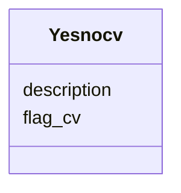

# Class: Yesnocv 


URI: [img_core_v400:Yesnocv](https://w3id.org/jgi/img_core_v400/Yesnocv)





<!-- no inheritance hierarchy -->


## Slots

| Name | Cardinality and Range | Description | Inheritance |
| ---  | --- | --- | --- |
| [flag_cv](flag_cv.md) | 0..1 <br/> [String](String.md) |  | direct |
| [description](description.md) | 0..1 <br/> [String](String.md) |  | direct |


## Usages

| used by | used in | type | used |
| ---  | --- | --- | --- |
| [BiocycReaction](BiocycReaction.md) | [is_official_ec](is_official_ec.md) | range | [Yesnocv](Yesnocv.md) |
| [BiocycReaction](BiocycReaction.md) | [is_orphan](is_orphan.md) | range | [Yesnocv](Yesnocv.md) |
| [BiocycReaction](BiocycReaction.md) | [is_spontaneous](is_spontaneous.md) | range | [Yesnocv](Yesnocv.md) |
| [GeneEssentialGenes](GeneEssentialGenes.md) | [essentiality](essentiality.md) | range | [Yesnocv](Yesnocv.md) |
| [GoTerm](GoTerm.md) | [is_root](is_root.md) | range | [Yesnocv](Yesnocv.md) |
| [GoTerm](GoTerm.md) | [is_obsolete](is_obsolete.md) | range | [Yesnocv](Yesnocv.md) |
| [Taxon](Taxon.md) | [is_public](is_public.md) | range | [Yesnocv](Yesnocv.md) |
| [Taxon](Taxon.md) | [is_replaced](is_replaced.md) | range | [Yesnocv](Yesnocv.md) |
| [Taxon](Taxon.md) | [is_big_euk](is_big_euk.md) | range | [Yesnocv](Yesnocv.md) |
| [Taxon](Taxon.md) | [obsolete_flag](obsolete_flag.md) | range | [Yesnocv](Yesnocv.md) |
| [Taxon](Taxon.md) | [is_pangenome](is_pangenome.md) | range | [Yesnocv](Yesnocv.md) |
| [Taxon](Taxon.md) | [in_file](in_file.md) | range | [Yesnocv](Yesnocv.md) |


## Identifier and Mapping Information


### Schema Source


* from schema: https://w3id.org/jgi/img_core_v400


## Mappings

| Mapping Type | Mapped Value |
| ---  | ---  |
| self | img_core_v400:Yesnocv |
| native | img_core_v400:Yesnocv |


## LinkML Source

<!-- TODO: investigate https://stackoverflow.com/questions/37606292/how-to-create-tabbed-code-blocks-in-mkdocs-or-sphinx -->

### Direct

<details>
```yaml
name: yesnocv
from_schema: https://w3id.org/jgi/img_core_v400
attributes:
  flag_cv:
    name: flag_cv
    from_schema: https://w3id.org/jgi/img_core_v400
    rank: 1000
    domain_of:
    - yesnocv
    range: string
    required: false
  description:
    name: description
    from_schema: https://w3id.org/jgi/img_core_v400
    domain_of:
    - alt_transcript
    - cath_funfam
    - cog
    - gene
    - gene_xref_families
    - genome_property
    - kegg_pathway
    - kog
    - pfam_clan
    - pfam_family
    - smart
    - superfamily
    - yesnocv
    range: string
    required: false

```
</details>

### Induced

<details>
```yaml
name: yesnocv
from_schema: https://w3id.org/jgi/img_core_v400
attributes:
  flag_cv:
    name: flag_cv
    from_schema: https://w3id.org/jgi/img_core_v400
    rank: 1000
    alias: flag_cv
    owner: yesnocv
    domain_of:
    - yesnocv
    range: string
    required: false
  description:
    name: description
    from_schema: https://w3id.org/jgi/img_core_v400
    alias: description
    owner: yesnocv
    domain_of:
    - alt_transcript
    - cath_funfam
    - cog
    - gene
    - gene_xref_families
    - genome_property
    - kegg_pathway
    - kog
    - pfam_clan
    - pfam_family
    - smart
    - superfamily
    - yesnocv
    range: string
    required: false

```
</details>