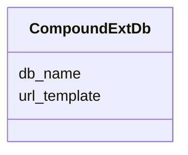

# Class: CompoundExtDb 


URI: [img_ext:CompoundExtDb](https://w3id.org/jgi/img_ext/CompoundExtDb)





<!-- no inheritance hierarchy -->


## Slots

| Name | Cardinality and Range | Description | Inheritance |
| ---  | --- | --- | --- |
| [db_name](db_name.md) | 0..1 <br/> [String](String.md) |  | direct |
| [url_template](url_template.md) | 0..1 <br/> [String](String.md) |  | direct |


## Identifier and Mapping Information


### Schema Source


* from schema: https://w3id.org/jgi/img_ext


## Mappings

| Mapping Type | Mapped Value |
| ---  | ---  |
| self | img_ext:CompoundExtDb |
| native | img_ext:CompoundExtDb |


## LinkML Source

<!-- TODO: investigate https://stackoverflow.com/questions/37606292/how-to-create-tabbed-code-blocks-in-mkdocs-or-sphinx -->

### Direct

<details>
```yaml
name: compound_ext_db
from_schema: https://w3id.org/jgi/img_ext
attributes:
  db_name:
    name: db_name
    from_schema: https://w3id.org/jgi/img_ext
    domain_of:
    - bc_ext_links
    - compound_ext_db
    - img_compound_ext_links
    - img_reaction_ext_links
    range: string
    required: false
  url_template:
    name: url_template
    from_schema: https://w3id.org/jgi/img_ext
    rank: 1000
    domain_of:
    - compound_ext_db
    range: string
    required: false

```
</details>

### Induced

<details>
```yaml
name: compound_ext_db
from_schema: https://w3id.org/jgi/img_ext
attributes:
  db_name:
    name: db_name
    from_schema: https://w3id.org/jgi/img_ext
    alias: db_name
    owner: compound_ext_db
    domain_of:
    - bc_ext_links
    - compound_ext_db
    - img_compound_ext_links
    - img_reaction_ext_links
    range: string
    required: false
  url_template:
    name: url_template
    from_schema: https://w3id.org/jgi/img_ext
    rank: 1000
    alias: url_template
    owner: compound_ext_db
    domain_of:
    - compound_ext_db
    range: string
    required: false

```
</details>