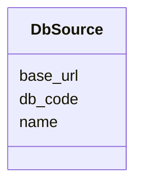

# Class: DbSource 


URI: [img_ext:DbSource](https://w3id.org/jgi/img_ext/DbSource)





<!-- no inheritance hierarchy -->


## Slots

| Name | Cardinality and Range | Description | Inheritance |
| ---  | --- | --- | --- |
| [db_code](db_code.md) | 0..1 <br/> [String](String.md) |  | direct |
| [name](name.md) | 0..1 <br/> [String](String.md) |  | direct |
| [base_url](base_url.md) | 0..1 <br/> [String](String.md) |  | direct |


## Usages

| used by | used in | type | used |
| ---  | --- | --- | --- |
| [ImgCompound](ImgCompound.md) | [DbSource](DbSource.md) | range | [DbSource](DbSource.md) |
| [ImgCompoundExtLinks](ImgCompoundExtLinks.md) | [db_name](db_name.md) | range | [DbSource](DbSource.md) |
| [ImgReactionExtLinks](ImgReactionExtLinks.md) | [db_name](db_name.md) | range | [DbSource](DbSource.md) |


## Identifier and Mapping Information


### Schema Source


* from schema: https://w3id.org/jgi/img_ext


## Mappings

| Mapping Type | Mapped Value |
| ---  | ---  |
| self | img_ext:DbSource |
| native | img_ext:DbSource |


## LinkML Source

<!-- TODO: investigate https://stackoverflow.com/questions/37606292/how-to-create-tabbed-code-blocks-in-mkdocs-or-sphinx -->

### Direct

<details>
```yaml
name: db_source
from_schema: https://w3id.org/jgi/img_ext
attributes:
  db_code:
    name: db_code
    from_schema: https://w3id.org/jgi/img_ext
    rank: 1000
    domain_of:
    - db_source
    range: string
    required: false
  name:
    name: name
    from_schema: https://w3id.org/jgi/img_ext
    rank: 1000
    domain_of:
    - db_source
    - mesh_dtree
    - np_activity_cv
    - phenotype_rule
    - public_set
    range: string
    required: false
  base_url:
    name: base_url
    from_schema: https://w3id.org/jgi/img_ext
    rank: 1000
    domain_of:
    - db_source
    range: string
    required: false

```
</details>

### Induced

<details>
```yaml
name: db_source
from_schema: https://w3id.org/jgi/img_ext
attributes:
  db_code:
    name: db_code
    from_schema: https://w3id.org/jgi/img_ext
    rank: 1000
    alias: db_code
    owner: db_source
    domain_of:
    - db_source
    range: string
    required: false
  name:
    name: name
    from_schema: https://w3id.org/jgi/img_ext
    rank: 1000
    alias: name
    owner: db_source
    domain_of:
    - db_source
    - mesh_dtree
    - np_activity_cv
    - phenotype_rule
    - public_set
    range: string
    required: false
  base_url:
    name: base_url
    from_schema: https://w3id.org/jgi/img_ext
    rank: 1000
    alias: base_url
    owner: db_source
    domain_of:
    - db_source
    range: string
    required: false

```
</details>