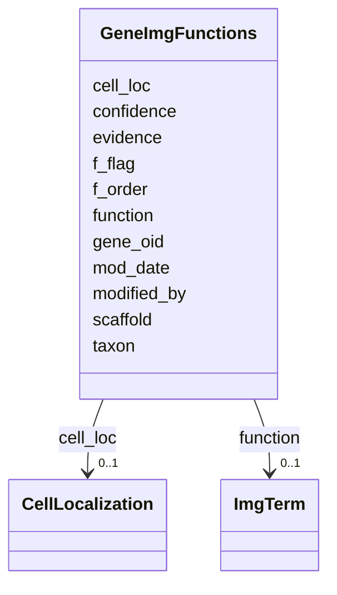

# Class: GeneImgFunctions 


URI: [img_ext:GeneImgFunctions](https://w3id.org/jgi/img_ext/GeneImgFunctions)





<!-- no inheritance hierarchy -->


## Slots

| Name | Cardinality and Range | Description | Inheritance |
| ---  | --- | --- | --- |
| [gene_oid](gene_oid.md) | 0..1 <br/> [Integer](Integer.md) |  | direct |
| [function](function.md) | 0..1 <br/> [ImgTerm](ImgTerm.md) | Foreign key to img_term | direct |
| [f_order](f_order.md) | 0..1 <br/> [Integer](Integer.md) |  | direct |
| [evidence](evidence.md) | 0..1 <br/> [String](String.md) |  | direct |
| [confidence](confidence.md) | 0..1 <br/> [String](String.md) |  | direct |
| [mod_date](mod_date.md) | 0..1 <br/> [Datetime](Datetime.md) |  | direct |
| [modified_by](modified_by.md) | 0..1 <br/> [Integer](Integer.md) |  | direct |
| [cell_loc](cell_loc.md) | 0..1 <br/> [CellLocalization](CellLocalization.md) | Foreign key to cell_localization | direct |
| [f_flag](f_flag.md) | 0..1 <br/> [String](String.md) |  | direct |
| [taxon](taxon.md) | 0..1 <br/> [Float](Float.md) |  | direct |
| [scaffold](scaffold.md) | 0..1 <br/> [Float](Float.md) |  | direct |


## Identifier and Mapping Information


### Schema Source


* from schema: https://w3id.org/jgi/img_ext


## Mappings

| Mapping Type | Mapped Value |
| ---  | ---  |
| self | img_ext:GeneImgFunctions |
| native | img_ext:GeneImgFunctions |


## LinkML Source

<!-- TODO: investigate https://stackoverflow.com/questions/37606292/how-to-create-tabbed-code-blocks-in-mkdocs-or-sphinx -->

### Direct

<details>
```yaml
name: gene_img_functions
from_schema: https://w3id.org/jgi/img_ext
attributes:
  gene_oid:
    name: gene_oid
    from_schema: https://w3id.org/jgi/img_ext
    domain_of:
    - gene_function_history
    - gene_history
    - gene_img_functions
    - gene_myimg_functions
    - gene_myimg_groups
    range: integer
    required: false
  function:
    name: function
    description: Foreign key to img_term
    from_schema: https://w3id.org/jgi/img_ext
    rank: 1000
    domain_of:
    - gene_img_functions
    range: img_term
    required: false
  f_order:
    name: f_order
    from_schema: https://w3id.org/jgi/img_ext
    rank: 1000
    domain_of:
    - gene_img_functions
    range: integer
    required: false
  evidence:
    name: evidence
    from_schema: https://w3id.org/jgi/img_ext
    rank: 1000
    domain_of:
    - gene_img_functions
    - img_pathway_assertions
    - img_pathway_taxons
    - mygene_terms
    - natural_product
    - pathway_network_taxons
    range: string
    required: false
  confidence:
    name: confidence
    from_schema: https://w3id.org/jgi/img_ext
    rank: 1000
    domain_of:
    - gene_img_functions
    - img_pathway_taxons
    - pathway_network_taxons
    range: string
    required: false
  mod_date:
    name: mod_date
    from_schema: https://w3id.org/jgi/img_ext
    domain_of:
    - cell_localization
    - gene_img_functions
    - gene_myimg_functions
    - img_compound
    - img_compound_kegg_compounds
    - img_parts_list
    - img_parts_list_backup
    - img_pathway
    - img_pathway_assertions
    - img_pathway_taxons
    - img_reaction
    - img_term
    - img_term_synonyms
    - mygene
    - mygene_terms
    - myimg_bio_cluster_np
    - myimg_job
    - natural_product
    - np_biosynthesis_source
    - pathway_network
    - pathway_network_img_pathways
    - pathway_network_parents
    - pathway_network_parts_lists
    - pathway_network_taxons
    - phenotype_rule
    - phenotype_rule_taxons
    range: datetime
    required: false
  modified_by:
    name: modified_by
    from_schema: https://w3id.org/jgi/img_ext
    domain_of:
    - cell_localization
    - gene_img_functions
    - gene_myimg_functions
    - img_compound
    - img_compound_kegg_compounds
    - img_parts_list
    - img_parts_list_backup
    - img_pathway
    - img_pathway_assertions
    - img_pathway_taxons
    - img_reaction
    - img_term
    - img_term_synonyms
    - mygene
    - mygene_terms
    - myimg_bio_cluster_np
    - myimg_job
    - natural_product
    - np_biosynthesis_source
    - pathway_network
    - pathway_network_img_pathways
    - pathway_network_parents
    - pathway_network_parts_lists
    - pathway_network_taxons
    - phenotype_rule
    - phenotype_rule_taxons
    range: integer
    required: false
  cell_loc:
    name: cell_loc
    description: Foreign key to cell_localization
    from_schema: https://w3id.org/jgi/img_ext
    rank: 1000
    domain_of:
    - gene_img_functions
    range: cell_localization
    required: false
  f_flag:
    name: f_flag
    from_schema: https://w3id.org/jgi/img_ext
    rank: 1000
    domain_of:
    - gene_img_functions
    range: string
    required: false
  taxon:
    name: taxon
    from_schema: https://w3id.org/jgi/img_ext
    domain_of:
    - gene_function_history
    - gene_history
    - gene_img_functions
    - img_pathway_assertions
    - img_pathway_taxons
    - mygene
    - natural_product
    - pathway_network_taxons
    - phenotype_rule_taxons
    range: float
    required: false
  scaffold:
    name: scaffold
    from_schema: https://w3id.org/jgi/img_ext
    rank: 1000
    domain_of:
    - gene_img_functions
    - mygene
    range: float
    required: false

```
</details>

### Induced

<details>
```yaml
name: gene_img_functions
from_schema: https://w3id.org/jgi/img_ext
attributes:
  gene_oid:
    name: gene_oid
    from_schema: https://w3id.org/jgi/img_ext
    alias: gene_oid
    owner: gene_img_functions
    domain_of:
    - gene_function_history
    - gene_history
    - gene_img_functions
    - gene_myimg_functions
    - gene_myimg_groups
    range: integer
    required: false
  function:
    name: function
    description: Foreign key to img_term
    from_schema: https://w3id.org/jgi/img_ext
    rank: 1000
    alias: function
    owner: gene_img_functions
    domain_of:
    - gene_img_functions
    range: img_term
    required: false
  f_order:
    name: f_order
    from_schema: https://w3id.org/jgi/img_ext
    rank: 1000
    alias: f_order
    owner: gene_img_functions
    domain_of:
    - gene_img_functions
    range: integer
    required: false
  evidence:
    name: evidence
    from_schema: https://w3id.org/jgi/img_ext
    rank: 1000
    alias: evidence
    owner: gene_img_functions
    domain_of:
    - gene_img_functions
    - img_pathway_assertions
    - img_pathway_taxons
    - mygene_terms
    - natural_product
    - pathway_network_taxons
    range: string
    required: false
  confidence:
    name: confidence
    from_schema: https://w3id.org/jgi/img_ext
    rank: 1000
    alias: confidence
    owner: gene_img_functions
    domain_of:
    - gene_img_functions
    - img_pathway_taxons
    - pathway_network_taxons
    range: string
    required: false
  mod_date:
    name: mod_date
    from_schema: https://w3id.org/jgi/img_ext
    alias: mod_date
    owner: gene_img_functions
    domain_of:
    - cell_localization
    - gene_img_functions
    - gene_myimg_functions
    - img_compound
    - img_compound_kegg_compounds
    - img_parts_list
    - img_parts_list_backup
    - img_pathway
    - img_pathway_assertions
    - img_pathway_taxons
    - img_reaction
    - img_term
    - img_term_synonyms
    - mygene
    - mygene_terms
    - myimg_bio_cluster_np
    - myimg_job
    - natural_product
    - np_biosynthesis_source
    - pathway_network
    - pathway_network_img_pathways
    - pathway_network_parents
    - pathway_network_parts_lists
    - pathway_network_taxons
    - phenotype_rule
    - phenotype_rule_taxons
    range: datetime
    required: false
  modified_by:
    name: modified_by
    from_schema: https://w3id.org/jgi/img_ext
    alias: modified_by
    owner: gene_img_functions
    domain_of:
    - cell_localization
    - gene_img_functions
    - gene_myimg_functions
    - img_compound
    - img_compound_kegg_compounds
    - img_parts_list
    - img_parts_list_backup
    - img_pathway
    - img_pathway_assertions
    - img_pathway_taxons
    - img_reaction
    - img_term
    - img_term_synonyms
    - mygene
    - mygene_terms
    - myimg_bio_cluster_np
    - myimg_job
    - natural_product
    - np_biosynthesis_source
    - pathway_network
    - pathway_network_img_pathways
    - pathway_network_parents
    - pathway_network_parts_lists
    - pathway_network_taxons
    - phenotype_rule
    - phenotype_rule_taxons
    range: integer
    required: false
  cell_loc:
    name: cell_loc
    description: Foreign key to cell_localization
    from_schema: https://w3id.org/jgi/img_ext
    rank: 1000
    alias: cell_loc
    owner: gene_img_functions
    domain_of:
    - gene_img_functions
    range: cell_localization
    required: false
  f_flag:
    name: f_flag
    from_schema: https://w3id.org/jgi/img_ext
    rank: 1000
    alias: f_flag
    owner: gene_img_functions
    domain_of:
    - gene_img_functions
    range: string
    required: false
  taxon:
    name: taxon
    from_schema: https://w3id.org/jgi/img_ext
    alias: taxon
    owner: gene_img_functions
    domain_of:
    - gene_function_history
    - gene_history
    - gene_img_functions
    - img_pathway_assertions
    - img_pathway_taxons
    - mygene
    - natural_product
    - pathway_network_taxons
    - phenotype_rule_taxons
    range: float
    required: false
  scaffold:
    name: scaffold
    from_schema: https://w3id.org/jgi/img_ext
    rank: 1000
    alias: scaffold
    owner: gene_img_functions
    domain_of:
    - gene_img_functions
    - mygene
    range: float
    required: false

```
</details>