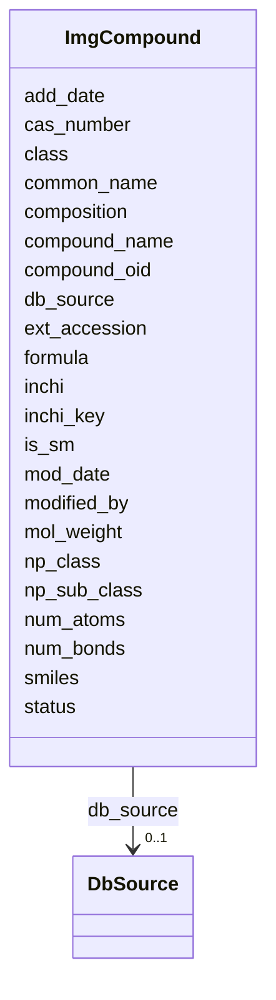

# Class: ImgCompound 


URI: [img_ext:ImgCompound](https://w3id.org/jgi/img_ext/ImgCompound)





<!-- no inheritance hierarchy -->


## Slots

| Name | Cardinality and Range | Description | Inheritance |
| ---  | --- | --- | --- |
| [compound_oid](compound_oid.md) | 0..1 <br/> [Integer](Integer.md) |  | direct |
| [ext_accession](ext_accession.md) | 0..1 <br/> [String](String.md) |  | direct |
| [db_source](db_source.md) | 0..1 <br/> [DbSource](DbSource.md) | Foreign key to db_source | direct |
| [compound_name](compound_name.md) | 0..1 <br/> [String](String.md) |  | direct |
| [common_name](common_name.md) | 0..1 <br/> [String](String.md) |  | direct |
| [class](class.md) | 0..1 <br/> [String](String.md) |  | direct |
| [composition](composition.md) | 0..1 <br/> [String](String.md) |  | direct |
| [formula](formula.md) | 0..1 <br/> [String](String.md) |  | direct |
| [cas_number](cas_number.md) | 0..1 <br/> [String](String.md) |  | direct |
| [status](status.md) | 0..1 <br/> [String](String.md) |  | direct |
| [add_date](add_date.md) | 0..1 <br/> [Datetime](Datetime.md) |  | direct |
| [mod_date](mod_date.md) | 0..1 <br/> [Datetime](Datetime.md) |  | direct |
| [modified_by](modified_by.md) | 0..1 <br/> [Integer](Integer.md) |  | direct |
| [mol_weight](mol_weight.md) | 0..1 <br/> [Float](Float.md) |  | direct |
| [num_atoms](num_atoms.md) | 0..1 <br/> [Float](Float.md) |  | direct |
| [np_class](np_class.md) | 0..1 <br/> [String](String.md) |  | direct |
| [np_sub_class](np_sub_class.md) | 0..1 <br/> [String](String.md) |  | direct |
| [smiles](smiles.md) | 0..1 <br/> [String](String.md) |  | direct |
| [inchi](inchi.md) | 0..1 <br/> [String](String.md) |  | direct |
| [inchi_key](inchi_key.md) | 0..1 <br/> [String](String.md) |  | direct |
| [num_bonds](num_bonds.md) | 0..1 <br/> [Float](Float.md) |  | direct |
| [is_sm](is_sm.md) | 0..1 <br/> [String](String.md) |  | direct |


## Usages

| used by | used in | type | used |
| ---  | --- | --- | --- |
| [ImgCompoundAliases](ImgCompoundAliases.md) | [compound_oid](compound_oid.md) | range | [ImgCompound](ImgCompound.md) |
| [ImgCompoundExtLinks](ImgCompoundExtLinks.md) | [compound_oid](compound_oid.md) | range | [ImgCompound](ImgCompound.md) |
| [ImgCompoundKeggCompounds](ImgCompoundKeggCompounds.md) | [compound_oid](compound_oid.md) | range | [ImgCompound](ImgCompound.md) |
| [ImgPathwayCComponents](ImgPathwayCComponents.md) | [compound](compound.md) | range | [ImgCompound](ImgCompound.md) |
| [ImgReactionCComponents](ImgReactionCComponents.md) | [compound](compound.md) | range | [ImgCompound](ImgCompound.md) |
| [PathwayNetworkCComponents](PathwayNetworkCComponents.md) | [compound](compound.md) | range | [ImgCompound](ImgCompound.md) |


## Identifier and Mapping Information


### Schema Source


* from schema: https://w3id.org/jgi/img_ext


## Mappings

| Mapping Type | Mapped Value |
| ---  | ---  |
| self | img_ext:ImgCompound |
| native | img_ext:ImgCompound |


## LinkML Source

<!-- TODO: investigate https://stackoverflow.com/questions/37606292/how-to-create-tabbed-code-blocks-in-mkdocs-or-sphinx -->

### Direct

<details>
```yaml
name: img_compound
from_schema: https://w3id.org/jgi/img_ext
attributes:
  compound_oid:
    name: compound_oid
    from_schema: https://w3id.org/jgi/img_ext
    rank: 1000
    domain_of:
    - img_compound
    - img_compound_activity
    - img_compound_aliases
    - img_compound_ext_links
    - img_compound_kegg_compounds
    - img_compound_meshd_tree
    - myimg_bio_cluster_np
    - natural_product
    - np_biosynthesis_source
    range: integer
    required: false
  ext_accession:
    name: ext_accession
    from_schema: https://w3id.org/jgi/img_ext
    rank: 1000
    domain_of:
    - img_compound
    range: string
    required: false
  db_source:
    name: db_source
    description: Foreign key to db_source
    from_schema: https://w3id.org/jgi/img_ext
    rank: 1000
    domain_of:
    - img_compound
    range: db_source
    required: false
  compound_name:
    name: compound_name
    from_schema: https://w3id.org/jgi/img_ext
    rank: 1000
    domain_of:
    - img_compound
    range: string
    required: false
  common_name:
    name: common_name
    from_schema: https://w3id.org/jgi/img_ext
    rank: 1000
    domain_of:
    - img_compound
    range: string
    required: false
  class:
    name: class
    from_schema: https://w3id.org/jgi/img_ext
    rank: 1000
    domain_of:
    - img_compound
    range: string
    required: false
  composition:
    name: composition
    from_schema: https://w3id.org/jgi/img_ext
    rank: 1000
    domain_of:
    - img_compound
    range: string
    required: false
  formula:
    name: formula
    from_schema: https://w3id.org/jgi/img_ext
    rank: 1000
    domain_of:
    - img_compound
    range: string
    required: false
  cas_number:
    name: cas_number
    from_schema: https://w3id.org/jgi/img_ext
    rank: 1000
    domain_of:
    - img_compound
    range: string
    required: false
  status:
    name: status
    from_schema: https://w3id.org/jgi/img_ext
    rank: 1000
    domain_of:
    - img_compound
    - img_pathway_assertions
    - img_pathway_taxons
    - myimg_job
    range: string
    required: false
  add_date:
    name: add_date
    from_schema: https://w3id.org/jgi/img_ext
    domain_of:
    - gene_function_history
    - gene_history
    - img_compound
    - img_parts_list
    - img_parts_list_backup
    - img_parts_list_history
    - img_pathway
    - img_pathway_history
    - img_reaction
    - img_term
    - img_term_history
    - img_term_synonyms
    - mygene
    - myimg_job
    - pathway_network
    - phenotype_rule
    - public_set
    range: datetime
    required: false
  mod_date:
    name: mod_date
    from_schema: https://w3id.org/jgi/img_ext
    domain_of:
    - cell_localization
    - gene_img_functions
    - gene_myimg_functions
    - img_compound
    - img_compound_kegg_compounds
    - img_parts_list
    - img_parts_list_backup
    - img_pathway
    - img_pathway_assertions
    - img_pathway_taxons
    - img_reaction
    - img_term
    - img_term_synonyms
    - mygene
    - mygene_terms
    - myimg_bio_cluster_np
    - myimg_job
    - natural_product
    - np_biosynthesis_source
    - pathway_network
    - pathway_network_img_pathways
    - pathway_network_parents
    - pathway_network_parts_lists
    - pathway_network_taxons
    - phenotype_rule
    - phenotype_rule_taxons
    range: datetime
    required: false
  modified_by:
    name: modified_by
    from_schema: https://w3id.org/jgi/img_ext
    domain_of:
    - cell_localization
    - gene_img_functions
    - gene_myimg_functions
    - img_compound
    - img_compound_kegg_compounds
    - img_parts_list
    - img_parts_list_backup
    - img_pathway
    - img_pathway_assertions
    - img_pathway_taxons
    - img_reaction
    - img_term
    - img_term_synonyms
    - mygene
    - mygene_terms
    - myimg_bio_cluster_np
    - myimg_job
    - natural_product
    - np_biosynthesis_source
    - pathway_network
    - pathway_network_img_pathways
    - pathway_network_parents
    - pathway_network_parts_lists
    - pathway_network_taxons
    - phenotype_rule
    - phenotype_rule_taxons
    range: integer
    required: false
  mol_weight:
    name: mol_weight
    from_schema: https://w3id.org/jgi/img_ext
    rank: 1000
    domain_of:
    - img_compound
    range: float
    required: false
  num_atoms:
    name: num_atoms
    from_schema: https://w3id.org/jgi/img_ext
    rank: 1000
    domain_of:
    - img_compound
    range: float
    required: false
  np_class:
    name: np_class
    from_schema: https://w3id.org/jgi/img_ext
    rank: 1000
    domain_of:
    - img_compound
    range: string
    required: false
  np_sub_class:
    name: np_sub_class
    from_schema: https://w3id.org/jgi/img_ext
    rank: 1000
    domain_of:
    - img_compound
    range: string
    required: false
  smiles:
    name: smiles
    from_schema: https://w3id.org/jgi/img_ext
    rank: 1000
    domain_of:
    - img_compound
    range: string
    required: false
  inchi:
    name: inchi
    from_schema: https://w3id.org/jgi/img_ext
    rank: 1000
    domain_of:
    - img_compound
    range: string
    required: false
  inchi_key:
    name: inchi_key
    from_schema: https://w3id.org/jgi/img_ext
    rank: 1000
    domain_of:
    - img_compound
    range: string
    required: false
  num_bonds:
    name: num_bonds
    from_schema: https://w3id.org/jgi/img_ext
    rank: 1000
    domain_of:
    - img_compound
    range: float
    required: false
  is_sm:
    name: is_sm
    from_schema: https://w3id.org/jgi/img_ext
    rank: 1000
    domain_of:
    - img_compound
    range: string
    required: false

```
</details>

### Induced

<details>
```yaml
name: img_compound
from_schema: https://w3id.org/jgi/img_ext
attributes:
  compound_oid:
    name: compound_oid
    from_schema: https://w3id.org/jgi/img_ext
    rank: 1000
    alias: compound_oid
    owner: img_compound
    domain_of:
    - img_compound
    - img_compound_activity
    - img_compound_aliases
    - img_compound_ext_links
    - img_compound_kegg_compounds
    - img_compound_meshd_tree
    - myimg_bio_cluster_np
    - natural_product
    - np_biosynthesis_source
    range: integer
    required: false
  ext_accession:
    name: ext_accession
    from_schema: https://w3id.org/jgi/img_ext
    rank: 1000
    alias: ext_accession
    owner: img_compound
    domain_of:
    - img_compound
    range: string
    required: false
  db_source:
    name: db_source
    description: Foreign key to db_source
    from_schema: https://w3id.org/jgi/img_ext
    rank: 1000
    alias: db_source
    owner: img_compound
    domain_of:
    - img_compound
    range: db_source
    required: false
  compound_name:
    name: compound_name
    from_schema: https://w3id.org/jgi/img_ext
    rank: 1000
    alias: compound_name
    owner: img_compound
    domain_of:
    - img_compound
    range: string
    required: false
  common_name:
    name: common_name
    from_schema: https://w3id.org/jgi/img_ext
    rank: 1000
    alias: common_name
    owner: img_compound
    domain_of:
    - img_compound
    range: string
    required: false
  class:
    name: class
    from_schema: https://w3id.org/jgi/img_ext
    rank: 1000
    alias: class
    owner: img_compound
    domain_of:
    - img_compound
    range: string
    required: false
  composition:
    name: composition
    from_schema: https://w3id.org/jgi/img_ext
    rank: 1000
    alias: composition
    owner: img_compound
    domain_of:
    - img_compound
    range: string
    required: false
  formula:
    name: formula
    from_schema: https://w3id.org/jgi/img_ext
    rank: 1000
    alias: formula
    owner: img_compound
    domain_of:
    - img_compound
    range: string
    required: false
  cas_number:
    name: cas_number
    from_schema: https://w3id.org/jgi/img_ext
    rank: 1000
    alias: cas_number
    owner: img_compound
    domain_of:
    - img_compound
    range: string
    required: false
  status:
    name: status
    from_schema: https://w3id.org/jgi/img_ext
    rank: 1000
    alias: status
    owner: img_compound
    domain_of:
    - img_compound
    - img_pathway_assertions
    - img_pathway_taxons
    - myimg_job
    range: string
    required: false
  add_date:
    name: add_date
    from_schema: https://w3id.org/jgi/img_ext
    alias: add_date
    owner: img_compound
    domain_of:
    - gene_function_history
    - gene_history
    - img_compound
    - img_parts_list
    - img_parts_list_backup
    - img_parts_list_history
    - img_pathway
    - img_pathway_history
    - img_reaction
    - img_term
    - img_term_history
    - img_term_synonyms
    - mygene
    - myimg_job
    - pathway_network
    - phenotype_rule
    - public_set
    range: datetime
    required: false
  mod_date:
    name: mod_date
    from_schema: https://w3id.org/jgi/img_ext
    alias: mod_date
    owner: img_compound
    domain_of:
    - cell_localization
    - gene_img_functions
    - gene_myimg_functions
    - img_compound
    - img_compound_kegg_compounds
    - img_parts_list
    - img_parts_list_backup
    - img_pathway
    - img_pathway_assertions
    - img_pathway_taxons
    - img_reaction
    - img_term
    - img_term_synonyms
    - mygene
    - mygene_terms
    - myimg_bio_cluster_np
    - myimg_job
    - natural_product
    - np_biosynthesis_source
    - pathway_network
    - pathway_network_img_pathways
    - pathway_network_parents
    - pathway_network_parts_lists
    - pathway_network_taxons
    - phenotype_rule
    - phenotype_rule_taxons
    range: datetime
    required: false
  modified_by:
    name: modified_by
    from_schema: https://w3id.org/jgi/img_ext
    alias: modified_by
    owner: img_compound
    domain_of:
    - cell_localization
    - gene_img_functions
    - gene_myimg_functions
    - img_compound
    - img_compound_kegg_compounds
    - img_parts_list
    - img_parts_list_backup
    - img_pathway
    - img_pathway_assertions
    - img_pathway_taxons
    - img_reaction
    - img_term
    - img_term_synonyms
    - mygene
    - mygene_terms
    - myimg_bio_cluster_np
    - myimg_job
    - natural_product
    - np_biosynthesis_source
    - pathway_network
    - pathway_network_img_pathways
    - pathway_network_parents
    - pathway_network_parts_lists
    - pathway_network_taxons
    - phenotype_rule
    - phenotype_rule_taxons
    range: integer
    required: false
  mol_weight:
    name: mol_weight
    from_schema: https://w3id.org/jgi/img_ext
    rank: 1000
    alias: mol_weight
    owner: img_compound
    domain_of:
    - img_compound
    range: float
    required: false
  num_atoms:
    name: num_atoms
    from_schema: https://w3id.org/jgi/img_ext
    rank: 1000
    alias: num_atoms
    owner: img_compound
    domain_of:
    - img_compound
    range: float
    required: false
  np_class:
    name: np_class
    from_schema: https://w3id.org/jgi/img_ext
    rank: 1000
    alias: np_class
    owner: img_compound
    domain_of:
    - img_compound
    range: string
    required: false
  np_sub_class:
    name: np_sub_class
    from_schema: https://w3id.org/jgi/img_ext
    rank: 1000
    alias: np_sub_class
    owner: img_compound
    domain_of:
    - img_compound
    range: string
    required: false
  smiles:
    name: smiles
    from_schema: https://w3id.org/jgi/img_ext
    rank: 1000
    alias: smiles
    owner: img_compound
    domain_of:
    - img_compound
    range: string
    required: false
  inchi:
    name: inchi
    from_schema: https://w3id.org/jgi/img_ext
    rank: 1000
    alias: inchi
    owner: img_compound
    domain_of:
    - img_compound
    range: string
    required: false
  inchi_key:
    name: inchi_key
    from_schema: https://w3id.org/jgi/img_ext
    rank: 1000
    alias: inchi_key
    owner: img_compound
    domain_of:
    - img_compound
    range: string
    required: false
  num_bonds:
    name: num_bonds
    from_schema: https://w3id.org/jgi/img_ext
    rank: 1000
    alias: num_bonds
    owner: img_compound
    domain_of:
    - img_compound
    range: float
    required: false
  is_sm:
    name: is_sm
    from_schema: https://w3id.org/jgi/img_ext
    rank: 1000
    alias: is_sm
    owner: img_compound
    domain_of:
    - img_compound
    range: string
    required: false

```
</details>