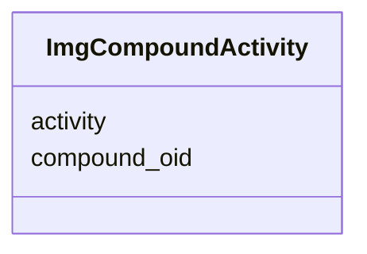

# Class: ImgCompoundActivity 


URI: [img_ext:ImgCompoundActivity](https://w3id.org/jgi/img_ext/ImgCompoundActivity)





<!-- no inheritance hierarchy -->


## Slots

| Name | Cardinality and Range | Description | Inheritance |
| ---  | --- | --- | --- |
| [compound_oid](compound_oid.md) | 0..1 <br/> [Integer](Integer.md) |  | direct |
| [activity](activity.md) | 0..1 <br/> [String](String.md) |  | direct |


## Identifier and Mapping Information


### Schema Source


* from schema: https://w3id.org/jgi/img_ext


## Mappings

| Mapping Type | Mapped Value |
| ---  | ---  |
| self | img_ext:ImgCompoundActivity |
| native | img_ext:ImgCompoundActivity |


## LinkML Source

<!-- TODO: investigate https://stackoverflow.com/questions/37606292/how-to-create-tabbed-code-blocks-in-mkdocs-or-sphinx -->

### Direct

<details>
```yaml
name: img_compound_activity
from_schema: https://w3id.org/jgi/img_ext
attributes:
  compound_oid:
    name: compound_oid
    from_schema: https://w3id.org/jgi/img_ext
    domain_of:
    - img_compound
    - img_compound_activity
    - img_compound_aliases
    - img_compound_ext_links
    - img_compound_kegg_compounds
    - img_compound_meshd_tree
    - myimg_bio_cluster_np
    - natural_product
    - np_biosynthesis_source
    range: integer
    required: false
  activity:
    name: activity
    from_schema: https://w3id.org/jgi/img_ext
    rank: 1000
    domain_of:
    - img_compound_activity
    - natural_product
    range: string
    required: false

```
</details>

### Induced

<details>
```yaml
name: img_compound_activity
from_schema: https://w3id.org/jgi/img_ext
attributes:
  compound_oid:
    name: compound_oid
    from_schema: https://w3id.org/jgi/img_ext
    alias: compound_oid
    owner: img_compound_activity
    domain_of:
    - img_compound
    - img_compound_activity
    - img_compound_aliases
    - img_compound_ext_links
    - img_compound_kegg_compounds
    - img_compound_meshd_tree
    - myimg_bio_cluster_np
    - natural_product
    - np_biosynthesis_source
    range: integer
    required: false
  activity:
    name: activity
    from_schema: https://w3id.org/jgi/img_ext
    rank: 1000
    alias: activity
    owner: img_compound_activity
    domain_of:
    - img_compound_activity
    - natural_product
    range: string
    required: false

```
</details>