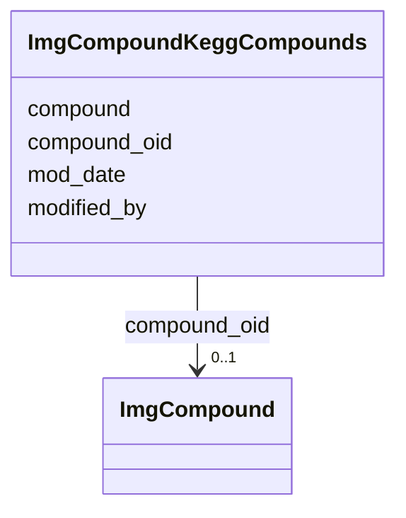

# Class: ImgCompoundKeggCompounds 


URI: [img_ext:ImgCompoundKeggCompounds](https://w3id.org/jgi/img_ext/ImgCompoundKeggCompounds)





<!-- no inheritance hierarchy -->


## Slots

| Name | Cardinality and Range | Description | Inheritance |
| ---  | --- | --- | --- |
| [compound_oid](compound_oid.md) | 0..1 <br/> [ImgCompound](ImgCompound.md) | Foreign key to img_compound | direct |
| [compound](compound.md) | 0..1 <br/> [String](String.md) |  | direct |
| [mod_date](mod_date.md) | 0..1 <br/> [Datetime](Datetime.md) |  | direct |
| [modified_by](modified_by.md) | 0..1 <br/> [Integer](Integer.md) |  | direct |


## Identifier and Mapping Information


### Schema Source


* from schema: https://w3id.org/jgi/img_ext


## Mappings

| Mapping Type | Mapped Value |
| ---  | ---  |
| self | img_ext:ImgCompoundKeggCompounds |
| native | img_ext:ImgCompoundKeggCompounds |


## LinkML Source

<!-- TODO: investigate https://stackoverflow.com/questions/37606292/how-to-create-tabbed-code-blocks-in-mkdocs-or-sphinx -->

### Direct

<details>
```yaml
name: img_compound_kegg_compounds
from_schema: https://w3id.org/jgi/img_ext
attributes:
  compound_oid:
    name: compound_oid
    description: Foreign key to img_compound
    from_schema: https://w3id.org/jgi/img_ext
    domain_of:
    - img_compound
    - img_compound_activity
    - img_compound_aliases
    - img_compound_ext_links
    - img_compound_kegg_compounds
    - img_compound_meshd_tree
    - myimg_bio_cluster_np
    - natural_product
    - np_biosynthesis_source
    range: img_compound
    required: false
  compound:
    name: compound
    from_schema: https://w3id.org/jgi/img_ext
    rank: 1000
    domain_of:
    - img_compound_kegg_compounds
    - img_pathway_c_components
    - img_reaction_c_components
    - pathway_network_c_components
    range: string
    required: false
  mod_date:
    name: mod_date
    from_schema: https://w3id.org/jgi/img_ext
    domain_of:
    - cell_localization
    - gene_img_functions
    - gene_myimg_functions
    - img_compound
    - img_compound_kegg_compounds
    - img_parts_list
    - img_parts_list_backup
    - img_pathway
    - img_pathway_assertions
    - img_pathway_taxons
    - img_reaction
    - img_term
    - img_term_synonyms
    - mygene
    - mygene_terms
    - myimg_bio_cluster_np
    - myimg_job
    - natural_product
    - np_biosynthesis_source
    - pathway_network
    - pathway_network_img_pathways
    - pathway_network_parents
    - pathway_network_parts_lists
    - pathway_network_taxons
    - phenotype_rule
    - phenotype_rule_taxons
    range: datetime
    required: false
  modified_by:
    name: modified_by
    from_schema: https://w3id.org/jgi/img_ext
    domain_of:
    - cell_localization
    - gene_img_functions
    - gene_myimg_functions
    - img_compound
    - img_compound_kegg_compounds
    - img_parts_list
    - img_parts_list_backup
    - img_pathway
    - img_pathway_assertions
    - img_pathway_taxons
    - img_reaction
    - img_term
    - img_term_synonyms
    - mygene
    - mygene_terms
    - myimg_bio_cluster_np
    - myimg_job
    - natural_product
    - np_biosynthesis_source
    - pathway_network
    - pathway_network_img_pathways
    - pathway_network_parents
    - pathway_network_parts_lists
    - pathway_network_taxons
    - phenotype_rule
    - phenotype_rule_taxons
    range: integer
    required: false

```
</details>

### Induced

<details>
```yaml
name: img_compound_kegg_compounds
from_schema: https://w3id.org/jgi/img_ext
attributes:
  compound_oid:
    name: compound_oid
    description: Foreign key to img_compound
    from_schema: https://w3id.org/jgi/img_ext
    alias: compound_oid
    owner: img_compound_kegg_compounds
    domain_of:
    - img_compound
    - img_compound_activity
    - img_compound_aliases
    - img_compound_ext_links
    - img_compound_kegg_compounds
    - img_compound_meshd_tree
    - myimg_bio_cluster_np
    - natural_product
    - np_biosynthesis_source
    range: img_compound
    required: false
  compound:
    name: compound
    from_schema: https://w3id.org/jgi/img_ext
    rank: 1000
    alias: compound
    owner: img_compound_kegg_compounds
    domain_of:
    - img_compound_kegg_compounds
    - img_pathway_c_components
    - img_reaction_c_components
    - pathway_network_c_components
    range: string
    required: false
  mod_date:
    name: mod_date
    from_schema: https://w3id.org/jgi/img_ext
    alias: mod_date
    owner: img_compound_kegg_compounds
    domain_of:
    - cell_localization
    - gene_img_functions
    - gene_myimg_functions
    - img_compound
    - img_compound_kegg_compounds
    - img_parts_list
    - img_parts_list_backup
    - img_pathway
    - img_pathway_assertions
    - img_pathway_taxons
    - img_reaction
    - img_term
    - img_term_synonyms
    - mygene
    - mygene_terms
    - myimg_bio_cluster_np
    - myimg_job
    - natural_product
    - np_biosynthesis_source
    - pathway_network
    - pathway_network_img_pathways
    - pathway_network_parents
    - pathway_network_parts_lists
    - pathway_network_taxons
    - phenotype_rule
    - phenotype_rule_taxons
    range: datetime
    required: false
  modified_by:
    name: modified_by
    from_schema: https://w3id.org/jgi/img_ext
    alias: modified_by
    owner: img_compound_kegg_compounds
    domain_of:
    - cell_localization
    - gene_img_functions
    - gene_myimg_functions
    - img_compound
    - img_compound_kegg_compounds
    - img_parts_list
    - img_parts_list_backup
    - img_pathway
    - img_pathway_assertions
    - img_pathway_taxons
    - img_reaction
    - img_term
    - img_term_synonyms
    - mygene
    - mygene_terms
    - myimg_bio_cluster_np
    - myimg_job
    - natural_product
    - np_biosynthesis_source
    - pathway_network
    - pathway_network_img_pathways
    - pathway_network_parents
    - pathway_network_parts_lists
    - pathway_network_taxons
    - phenotype_rule
    - phenotype_rule_taxons
    range: integer
    required: false

```
</details>