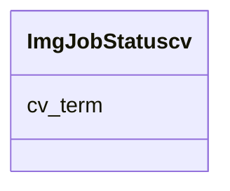

# Class: ImgJobStatuscv 


URI: [img_ext:ImgJobStatuscv](https://w3id.org/jgi/img_ext/ImgJobStatuscv)





<!-- no inheritance hierarchy -->


## Slots

| Name | Cardinality and Range | Description | Inheritance |
| ---  | --- | --- | --- |
| [cv_term](cv_term.md) | 0..1 <br/> [String](String.md) |  | direct |


## Usages

| used by | used in | type | used |
| ---  | --- | --- | --- |
| [MyimgJob](MyimgJob.md) | [status](status.md) | range | [ImgJobStatuscv](ImgJobStatuscv.md) |


## Identifier and Mapping Information


### Schema Source


* from schema: https://w3id.org/jgi/img_ext


## Mappings

| Mapping Type | Mapped Value |
| ---  | ---  |
| self | img_ext:ImgJobStatuscv |
| native | img_ext:ImgJobStatuscv |


## LinkML Source

<!-- TODO: investigate https://stackoverflow.com/questions/37606292/how-to-create-tabbed-code-blocks-in-mkdocs-or-sphinx -->

### Direct

<details>
```yaml
name: img_job_statuscv
from_schema: https://w3id.org/jgi/img_ext
attributes:
  cv_term:
    name: cv_term
    from_schema: https://w3id.org/jgi/img_ext
    domain_of:
    - img_job_paramcv
    - img_job_statuscv
    - img_job_typecv
    - np_activity_cv
    range: string
    required: false

```
</details>

### Induced

<details>
```yaml
name: img_job_statuscv
from_schema: https://w3id.org/jgi/img_ext
attributes:
  cv_term:
    name: cv_term
    from_schema: https://w3id.org/jgi/img_ext
    alias: cv_term
    owner: img_job_statuscv
    domain_of:
    - img_job_paramcv
    - img_job_statuscv
    - img_job_typecv
    - np_activity_cv
    range: string
    required: false

```
</details>