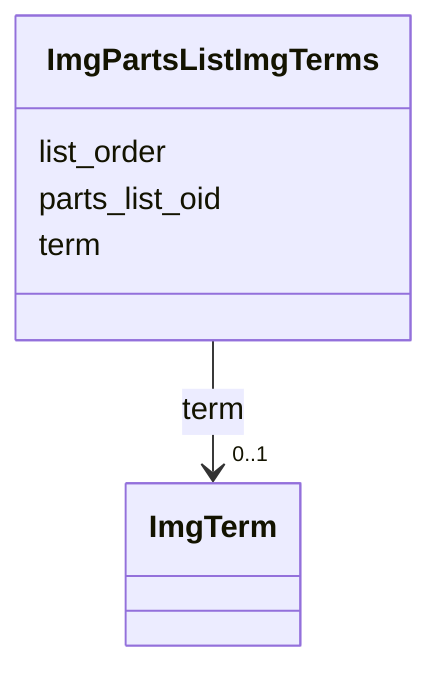

# Class: ImgPartsListImgTerms 


URI: [img_ext:ImgPartsListImgTerms](https://w3id.org/jgi/img_ext/ImgPartsListImgTerms)





<!-- no inheritance hierarchy -->


## Slots

| Name | Cardinality and Range | Description | Inheritance |
| ---  | --- | --- | --- |
| [parts_list_oid](parts_list_oid.md) | 0..1 <br/> [Integer](Integer.md) |  | direct |
| [list_order](list_order.md) | 0..1 <br/> [Integer](Integer.md) |  | direct |
| [term](term.md) | 0..1 <br/> [ImgTerm](ImgTerm.md) | Foreign key to img_term | direct |


## Identifier and Mapping Information


### Schema Source


* from schema: https://w3id.org/jgi/img_ext


## Mappings

| Mapping Type | Mapped Value |
| ---  | ---  |
| self | img_ext:ImgPartsListImgTerms |
| native | img_ext:ImgPartsListImgTerms |


## LinkML Source

<!-- TODO: investigate https://stackoverflow.com/questions/37606292/how-to-create-tabbed-code-blocks-in-mkdocs-or-sphinx -->

### Direct

<details>
```yaml
name: img_parts_list_img_terms
from_schema: https://w3id.org/jgi/img_ext
attributes:
  parts_list_oid:
    name: parts_list_oid
    from_schema: https://w3id.org/jgi/img_ext
    domain_of:
    - img_parts_list
    - img_parts_list_backup
    - img_parts_list_history
    - img_parts_list_img_terms
    range: integer
    required: false
  list_order:
    name: list_order
    from_schema: https://w3id.org/jgi/img_ext
    rank: 1000
    domain_of:
    - img_parts_list_img_terms
    range: integer
    required: false
  term:
    name: term
    description: Foreign key to img_term
    from_schema: https://w3id.org/jgi/img_ext
    rank: 1000
    domain_of:
    - img_parts_list_img_terms
    - img_pathway_t_components
    - img_reaction_t_components
    - img_term
    - img_term_history
    - pathway_network_t_components
    range: img_term
    required: false

```
</details>

### Induced

<details>
```yaml
name: img_parts_list_img_terms
from_schema: https://w3id.org/jgi/img_ext
attributes:
  parts_list_oid:
    name: parts_list_oid
    from_schema: https://w3id.org/jgi/img_ext
    alias: parts_list_oid
    owner: img_parts_list_img_terms
    domain_of:
    - img_parts_list
    - img_parts_list_backup
    - img_parts_list_history
    - img_parts_list_img_terms
    range: integer
    required: false
  list_order:
    name: list_order
    from_schema: https://w3id.org/jgi/img_ext
    rank: 1000
    alias: list_order
    owner: img_parts_list_img_terms
    domain_of:
    - img_parts_list_img_terms
    range: integer
    required: false
  term:
    name: term
    description: Foreign key to img_term
    from_schema: https://w3id.org/jgi/img_ext
    rank: 1000
    alias: term
    owner: img_parts_list_img_terms
    domain_of:
    - img_parts_list_img_terms
    - img_pathway_t_components
    - img_reaction_t_components
    - img_term
    - img_term_history
    - pathway_network_t_components
    range: img_term
    required: false

```
</details>