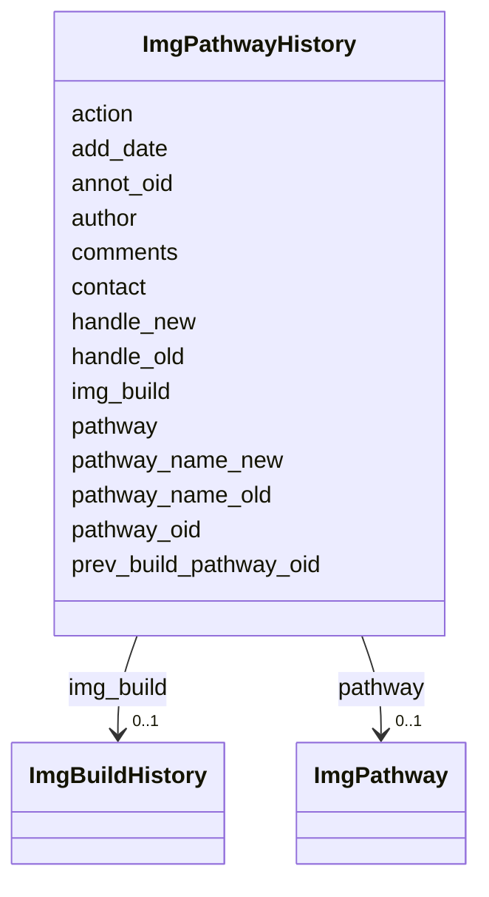

# Class: ImgPathwayHistory 


URI: [img_ext:ImgPathwayHistory](https://w3id.org/jgi/img_ext/ImgPathwayHistory)





<!-- no inheritance hierarchy -->


## Slots

| Name | Cardinality and Range | Description | Inheritance |
| ---  | --- | --- | --- |
| [annot_oid](annot_oid.md) | 0..1 <br/> [Integer](Integer.md) |  | direct |
| [author](author.md) | 0..1 <br/> [String](String.md) |  | direct |
| [contact](contact.md) | 0..1 <br/> [Integer](Integer.md) |  | direct |
| [img_build](img_build.md) | 0..1 <br/> [ImgBuildHistory](ImgBuildHistory.md) | Foreign key to img_build_history | direct |
| [pathway_oid](pathway_oid.md) | 0..1 <br/> [Integer](Integer.md) |  | direct |
| [pathway](pathway.md) | 0..1 <br/> [ImgPathway](ImgPathway.md) | Foreign key to img_pathway | direct |
| [prev_build_pathway_oid](prev_build_pathway_oid.md) | 0..1 <br/> [Integer](Integer.md) |  | direct |
| [pathway_name_old](pathway_name_old.md) | 0..1 <br/> [String](String.md) |  | direct |
| [handle_old](handle_old.md) | 0..1 <br/> [String](String.md) |  | direct |
| [pathway_name_new](pathway_name_new.md) | 0..1 <br/> [String](String.md) |  | direct |
| [handle_new](handle_new.md) | 0..1 <br/> [String](String.md) |  | direct |
| [action](action.md) | 0..1 <br/> [String](String.md) |  | direct |
| [comments](comments.md) | 0..1 <br/> [String](String.md) |  | direct |
| [add_date](add_date.md) | 0..1 <br/> [Datetime](Datetime.md) |  | direct |


## Identifier and Mapping Information


### Schema Source


* from schema: https://w3id.org/jgi/img_ext


## Mappings

| Mapping Type | Mapped Value |
| ---  | ---  |
| self | img_ext:ImgPathwayHistory |
| native | img_ext:ImgPathwayHistory |


## LinkML Source

<!-- TODO: investigate https://stackoverflow.com/questions/37606292/how-to-create-tabbed-code-blocks-in-mkdocs-or-sphinx -->

### Direct

<details>
```yaml
name: img_pathway_history
from_schema: https://w3id.org/jgi/img_ext
attributes:
  annot_oid:
    name: annot_oid
    from_schema: https://w3id.org/jgi/img_ext
    domain_of:
    - gene_function_history
    - gene_history
    - img_parts_list_history
    - img_pathway_history
    - img_term_history
    range: integer
    required: false
  author:
    name: author
    from_schema: https://w3id.org/jgi/img_ext
    domain_of:
    - gene_function_history
    - gene_history
    - img_parts_list_history
    - img_pathway_history
    - img_term_history
    range: string
    required: false
  contact:
    name: contact
    from_schema: https://w3id.org/jgi/img_ext
    domain_of:
    - gene_function_history
    - gene_history
    - img_parts_list_history
    - img_pathway_history
    - img_term_history
    - myimg_job
    range: integer
    required: false
  img_build:
    name: img_build
    description: Foreign key to img_build_history
    from_schema: https://w3id.org/jgi/img_ext
    domain_of:
    - gene_function_history
    - gene_history
    - img_parts_list_history
    - img_pathway_history
    - img_term_history
    range: img_build_history
    required: false
  pathway_oid:
    name: pathway_oid
    from_schema: https://w3id.org/jgi/img_ext
    domain_of:
    - img_pathway
    - img_pathway_assertions
    - img_pathway_c_components
    - img_pathway_history
    - img_pathway_reactions
    - img_pathway_t_components
    - img_pathway_taxons
    range: integer
    required: false
  pathway:
    name: pathway
    description: Foreign key to img_pathway
    from_schema: https://w3id.org/jgi/img_ext
    rank: 1000
    domain_of:
    - img_pathway_history
    - img_reaction_assoc_paths
    - pathway_network_img_pathways
    range: img_pathway
    required: false
  prev_build_pathway_oid:
    name: prev_build_pathway_oid
    from_schema: https://w3id.org/jgi/img_ext
    rank: 1000
    domain_of:
    - img_pathway_history
    range: integer
    required: false
  pathway_name_old:
    name: pathway_name_old
    from_schema: https://w3id.org/jgi/img_ext
    rank: 1000
    domain_of:
    - img_pathway_history
    range: string
    required: false
  handle_old:
    name: handle_old
    from_schema: https://w3id.org/jgi/img_ext
    rank: 1000
    domain_of:
    - img_pathway_history
    range: string
    required: false
  pathway_name_new:
    name: pathway_name_new
    from_schema: https://w3id.org/jgi/img_ext
    rank: 1000
    domain_of:
    - img_pathway_history
    range: string
    required: false
  handle_new:
    name: handle_new
    from_schema: https://w3id.org/jgi/img_ext
    rank: 1000
    domain_of:
    - img_pathway_history
    range: string
    required: false
  action:
    name: action
    from_schema: https://w3id.org/jgi/img_ext
    domain_of:
    - gene_function_history
    - gene_history
    - img_parts_list_history
    - img_pathway_history
    - img_term_history
    range: string
    required: false
  comments:
    name: comments
    from_schema: https://w3id.org/jgi/img_ext
    domain_of:
    - gene_function_history
    - gene_history
    - img_parts_list_history
    - img_pathway_assertions
    - img_pathway_history
    - img_reaction
    - img_reaction_assoc_networks
    - img_reaction_assoc_paths
    - img_reaction_assoc_rxns
    - img_term
    - img_term_history
    - myimg_bio_cluster_np
    - myimg_job
    - pathway_network
    range: string
    required: false
  add_date:
    name: add_date
    from_schema: https://w3id.org/jgi/img_ext
    domain_of:
    - gene_function_history
    - gene_history
    - img_compound
    - img_parts_list
    - img_parts_list_backup
    - img_parts_list_history
    - img_pathway
    - img_pathway_history
    - img_reaction
    - img_term
    - img_term_history
    - img_term_synonyms
    - mygene
    - myimg_job
    - pathway_network
    - phenotype_rule
    - public_set
    range: datetime
    required: false

```
</details>

### Induced

<details>
```yaml
name: img_pathway_history
from_schema: https://w3id.org/jgi/img_ext
attributes:
  annot_oid:
    name: annot_oid
    from_schema: https://w3id.org/jgi/img_ext
    alias: annot_oid
    owner: img_pathway_history
    domain_of:
    - gene_function_history
    - gene_history
    - img_parts_list_history
    - img_pathway_history
    - img_term_history
    range: integer
    required: false
  author:
    name: author
    from_schema: https://w3id.org/jgi/img_ext
    alias: author
    owner: img_pathway_history
    domain_of:
    - gene_function_history
    - gene_history
    - img_parts_list_history
    - img_pathway_history
    - img_term_history
    range: string
    required: false
  contact:
    name: contact
    from_schema: https://w3id.org/jgi/img_ext
    alias: contact
    owner: img_pathway_history
    domain_of:
    - gene_function_history
    - gene_history
    - img_parts_list_history
    - img_pathway_history
    - img_term_history
    - myimg_job
    range: integer
    required: false
  img_build:
    name: img_build
    description: Foreign key to img_build_history
    from_schema: https://w3id.org/jgi/img_ext
    alias: img_build
    owner: img_pathway_history
    domain_of:
    - gene_function_history
    - gene_history
    - img_parts_list_history
    - img_pathway_history
    - img_term_history
    range: img_build_history
    required: false
  pathway_oid:
    name: pathway_oid
    from_schema: https://w3id.org/jgi/img_ext
    alias: pathway_oid
    owner: img_pathway_history
    domain_of:
    - img_pathway
    - img_pathway_assertions
    - img_pathway_c_components
    - img_pathway_history
    - img_pathway_reactions
    - img_pathway_t_components
    - img_pathway_taxons
    range: integer
    required: false
  pathway:
    name: pathway
    description: Foreign key to img_pathway
    from_schema: https://w3id.org/jgi/img_ext
    rank: 1000
    alias: pathway
    owner: img_pathway_history
    domain_of:
    - img_pathway_history
    - img_reaction_assoc_paths
    - pathway_network_img_pathways
    range: img_pathway
    required: false
  prev_build_pathway_oid:
    name: prev_build_pathway_oid
    from_schema: https://w3id.org/jgi/img_ext
    rank: 1000
    alias: prev_build_pathway_oid
    owner: img_pathway_history
    domain_of:
    - img_pathway_history
    range: integer
    required: false
  pathway_name_old:
    name: pathway_name_old
    from_schema: https://w3id.org/jgi/img_ext
    rank: 1000
    alias: pathway_name_old
    owner: img_pathway_history
    domain_of:
    - img_pathway_history
    range: string
    required: false
  handle_old:
    name: handle_old
    from_schema: https://w3id.org/jgi/img_ext
    rank: 1000
    alias: handle_old
    owner: img_pathway_history
    domain_of:
    - img_pathway_history
    range: string
    required: false
  pathway_name_new:
    name: pathway_name_new
    from_schema: https://w3id.org/jgi/img_ext
    rank: 1000
    alias: pathway_name_new
    owner: img_pathway_history
    domain_of:
    - img_pathway_history
    range: string
    required: false
  handle_new:
    name: handle_new
    from_schema: https://w3id.org/jgi/img_ext
    rank: 1000
    alias: handle_new
    owner: img_pathway_history
    domain_of:
    - img_pathway_history
    range: string
    required: false
  action:
    name: action
    from_schema: https://w3id.org/jgi/img_ext
    alias: action
    owner: img_pathway_history
    domain_of:
    - gene_function_history
    - gene_history
    - img_parts_list_history
    - img_pathway_history
    - img_term_history
    range: string
    required: false
  comments:
    name: comments
    from_schema: https://w3id.org/jgi/img_ext
    alias: comments
    owner: img_pathway_history
    domain_of:
    - gene_function_history
    - gene_history
    - img_parts_list_history
    - img_pathway_assertions
    - img_pathway_history
    - img_reaction
    - img_reaction_assoc_networks
    - img_reaction_assoc_paths
    - img_reaction_assoc_rxns
    - img_term
    - img_term_history
    - myimg_bio_cluster_np
    - myimg_job
    - pathway_network
    range: string
    required: false
  add_date:
    name: add_date
    from_schema: https://w3id.org/jgi/img_ext
    alias: add_date
    owner: img_pathway_history
    domain_of:
    - gene_function_history
    - gene_history
    - img_compound
    - img_parts_list
    - img_parts_list_backup
    - img_parts_list_history
    - img_pathway
    - img_pathway_history
    - img_reaction
    - img_term
    - img_term_history
    - img_term_synonyms
    - mygene
    - myimg_job
    - pathway_network
    - phenotype_rule
    - public_set
    range: datetime
    required: false

```
</details>