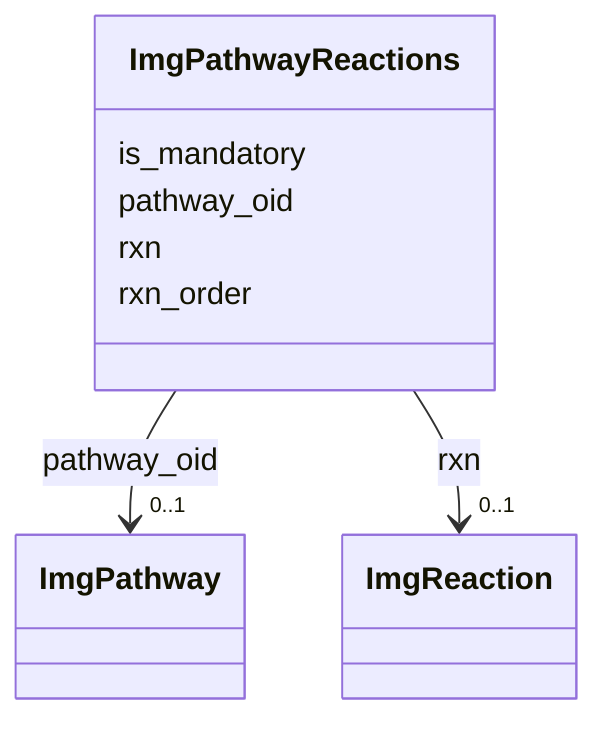

# Class: ImgPathwayReactions 


URI: [img_ext:ImgPathwayReactions](https://w3id.org/jgi/img_ext/ImgPathwayReactions)





<!-- no inheritance hierarchy -->


## Slots

| Name | Cardinality and Range | Description | Inheritance |
| ---  | --- | --- | --- |
| [pathway_oid](pathway_oid.md) | 0..1 <br/> [ImgPathway](ImgPathway.md) | Foreign key to img_pathway | direct |
| [rxn_order](rxn_order.md) | 0..1 <br/> [Integer](Integer.md) |  | direct |
| [is_mandatory](is_mandatory.md) | 0..1 <br/> [String](String.md) |  | direct |
| [rxn](rxn.md) | 0..1 <br/> [ImgReaction](ImgReaction.md) | Foreign key to img_reaction | direct |


## Identifier and Mapping Information


### Schema Source


* from schema: https://w3id.org/jgi/img_ext


## Mappings

| Mapping Type | Mapped Value |
| ---  | ---  |
| self | img_ext:ImgPathwayReactions |
| native | img_ext:ImgPathwayReactions |


## LinkML Source

<!-- TODO: investigate https://stackoverflow.com/questions/37606292/how-to-create-tabbed-code-blocks-in-mkdocs-or-sphinx -->

### Direct

<details>
```yaml
name: img_pathway_reactions
from_schema: https://w3id.org/jgi/img_ext
attributes:
  pathway_oid:
    name: pathway_oid
    description: Foreign key to img_pathway
    from_schema: https://w3id.org/jgi/img_ext
    domain_of:
    - img_pathway
    - img_pathway_assertions
    - img_pathway_c_components
    - img_pathway_history
    - img_pathway_reactions
    - img_pathway_t_components
    - img_pathway_taxons
    range: img_pathway
    required: false
  rxn_order:
    name: rxn_order
    from_schema: https://w3id.org/jgi/img_ext
    rank: 1000
    domain_of:
    - img_pathway_reactions
    range: integer
    required: false
  is_mandatory:
    name: is_mandatory
    from_schema: https://w3id.org/jgi/img_ext
    rank: 1000
    domain_of:
    - img_pathway_reactions
    range: string
    required: false
  rxn:
    name: rxn
    description: Foreign key to img_reaction
    from_schema: https://w3id.org/jgi/img_ext
    rank: 1000
    domain_of:
    - img_pathway_reactions
    - img_reaction_assoc_rxns
    range: img_reaction
    required: false

```
</details>

### Induced

<details>
```yaml
name: img_pathway_reactions
from_schema: https://w3id.org/jgi/img_ext
attributes:
  pathway_oid:
    name: pathway_oid
    description: Foreign key to img_pathway
    from_schema: https://w3id.org/jgi/img_ext
    alias: pathway_oid
    owner: img_pathway_reactions
    domain_of:
    - img_pathway
    - img_pathway_assertions
    - img_pathway_c_components
    - img_pathway_history
    - img_pathway_reactions
    - img_pathway_t_components
    - img_pathway_taxons
    range: img_pathway
    required: false
  rxn_order:
    name: rxn_order
    from_schema: https://w3id.org/jgi/img_ext
    rank: 1000
    alias: rxn_order
    owner: img_pathway_reactions
    domain_of:
    - img_pathway_reactions
    range: integer
    required: false
  is_mandatory:
    name: is_mandatory
    from_schema: https://w3id.org/jgi/img_ext
    rank: 1000
    alias: is_mandatory
    owner: img_pathway_reactions
    domain_of:
    - img_pathway_reactions
    range: string
    required: false
  rxn:
    name: rxn
    description: Foreign key to img_reaction
    from_schema: https://w3id.org/jgi/img_ext
    rank: 1000
    alias: rxn
    owner: img_pathway_reactions
    domain_of:
    - img_pathway_reactions
    - img_reaction_assoc_rxns
    range: img_reaction
    required: false

```
</details>