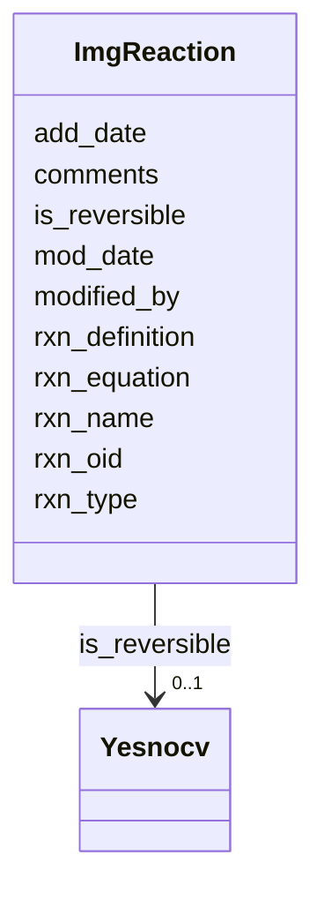

# Class: ImgReaction 


URI: [img_ext:ImgReaction](https://w3id.org/jgi/img_ext/ImgReaction)





<!-- no inheritance hierarchy -->


## Slots

| Name | Cardinality and Range | Description | Inheritance |
| ---  | --- | --- | --- |
| [rxn_oid](rxn_oid.md) | 0..1 <br/> [Integer](Integer.md) |  | direct |
| [rxn_name](rxn_name.md) | 0..1 <br/> [String](String.md) |  | direct |
| [rxn_definition](rxn_definition.md) | 0..1 <br/> [String](String.md) |  | direct |
| [rxn_equation](rxn_equation.md) | 0..1 <br/> [String](String.md) |  | direct |
| [is_reversible](is_reversible.md) | 0..1 <br/> [Yesnocv](Yesnocv.md) | Foreign key to yesnocv | direct |
| [comments](comments.md) | 0..1 <br/> [String](String.md) |  | direct |
| [add_date](add_date.md) | 0..1 <br/> [Datetime](Datetime.md) |  | direct |
| [mod_date](mod_date.md) | 0..1 <br/> [Datetime](Datetime.md) |  | direct |
| [modified_by](modified_by.md) | 0..1 <br/> [Integer](Integer.md) |  | direct |
| [rxn_type](rxn_type.md) | 0..1 <br/> [String](String.md) |  | direct |


## Usages

| used by | used in | type | used |
| ---  | --- | --- | --- |
| [ImgPathwayReactions](ImgPathwayReactions.md) | [rxn](rxn.md) | range | [ImgReaction](ImgReaction.md) |
| [ImgReactionAssocNetworks](ImgReactionAssocNetworks.md) | [rxn_oid](rxn_oid.md) | range | [ImgReaction](ImgReaction.md) |
| [ImgReactionAssocPaths](ImgReactionAssocPaths.md) | [rxn_oid](rxn_oid.md) | range | [ImgReaction](ImgReaction.md) |
| [ImgReactionAssocRxns](ImgReactionAssocRxns.md) | [rxn_oid](rxn_oid.md) | range | [ImgReaction](ImgReaction.md) |
| [ImgReactionAssocRxns](ImgReactionAssocRxns.md) | [rxn](rxn.md) | range | [ImgReaction](ImgReaction.md) |
| [ImgReactionCComponents](ImgReactionCComponents.md) | [rxn_oid](rxn_oid.md) | range | [ImgReaction](ImgReaction.md) |
| [ImgReactionCatalysts](ImgReactionCatalysts.md) | [rxn_oid](rxn_oid.md) | range | [ImgReaction](ImgReaction.md) |
| [ImgReactionExtLinks](ImgReactionExtLinks.md) | [rxn_oid](rxn_oid.md) | range | [ImgReaction](ImgReaction.md) |
| [ImgReactionTComponents](ImgReactionTComponents.md) | [rxn_oid](rxn_oid.md) | range | [ImgReaction](ImgReaction.md) |


## Identifier and Mapping Information


### Schema Source


* from schema: https://w3id.org/jgi/img_ext


## Mappings

| Mapping Type | Mapped Value |
| ---  | ---  |
| self | img_ext:ImgReaction |
| native | img_ext:ImgReaction |


## LinkML Source

<!-- TODO: investigate https://stackoverflow.com/questions/37606292/how-to-create-tabbed-code-blocks-in-mkdocs-or-sphinx -->

### Direct

<details>
```yaml
name: img_reaction
from_schema: https://w3id.org/jgi/img_ext
attributes:
  rxn_oid:
    name: rxn_oid
    from_schema: https://w3id.org/jgi/img_ext
    rank: 1000
    domain_of:
    - img_reaction
    - img_reaction_assoc_networks
    - img_reaction_assoc_paths
    - img_reaction_assoc_rxns
    - img_reaction_c_components
    - img_reaction_catalysts
    - img_reaction_ext_links
    - img_reaction_t_components
    range: integer
    required: false
  rxn_name:
    name: rxn_name
    from_schema: https://w3id.org/jgi/img_ext
    rank: 1000
    domain_of:
    - img_reaction
    range: string
    required: false
  rxn_definition:
    name: rxn_definition
    from_schema: https://w3id.org/jgi/img_ext
    rank: 1000
    domain_of:
    - img_reaction
    range: string
    required: false
  rxn_equation:
    name: rxn_equation
    from_schema: https://w3id.org/jgi/img_ext
    rank: 1000
    domain_of:
    - img_reaction
    range: string
    required: false
  is_reversible:
    name: is_reversible
    description: Foreign key to yesnocv
    from_schema: https://w3id.org/jgi/img_ext
    rank: 1000
    domain_of:
    - img_reaction
    range: yesnocv
    required: false
  comments:
    name: comments
    from_schema: https://w3id.org/jgi/img_ext
    domain_of:
    - gene_function_history
    - gene_history
    - img_parts_list_history
    - img_pathway_assertions
    - img_pathway_history
    - img_reaction
    - img_reaction_assoc_networks
    - img_reaction_assoc_paths
    - img_reaction_assoc_rxns
    - img_term
    - img_term_history
    - myimg_bio_cluster_np
    - myimg_job
    - pathway_network
    range: string
    required: false
  add_date:
    name: add_date
    from_schema: https://w3id.org/jgi/img_ext
    domain_of:
    - gene_function_history
    - gene_history
    - img_compound
    - img_parts_list
    - img_parts_list_backup
    - img_parts_list_history
    - img_pathway
    - img_pathway_history
    - img_reaction
    - img_term
    - img_term_history
    - img_term_synonyms
    - mygene
    - myimg_job
    - pathway_network
    - phenotype_rule
    - public_set
    range: datetime
    required: false
  mod_date:
    name: mod_date
    from_schema: https://w3id.org/jgi/img_ext
    domain_of:
    - cell_localization
    - gene_img_functions
    - gene_myimg_functions
    - img_compound
    - img_compound_kegg_compounds
    - img_parts_list
    - img_parts_list_backup
    - img_pathway
    - img_pathway_assertions
    - img_pathway_taxons
    - img_reaction
    - img_term
    - img_term_synonyms
    - mygene
    - mygene_terms
    - myimg_bio_cluster_np
    - myimg_job
    - natural_product
    - np_biosynthesis_source
    - pathway_network
    - pathway_network_img_pathways
    - pathway_network_parents
    - pathway_network_parts_lists
    - pathway_network_taxons
    - phenotype_rule
    - phenotype_rule_taxons
    range: datetime
    required: false
  modified_by:
    name: modified_by
    from_schema: https://w3id.org/jgi/img_ext
    domain_of:
    - cell_localization
    - gene_img_functions
    - gene_myimg_functions
    - img_compound
    - img_compound_kegg_compounds
    - img_parts_list
    - img_parts_list_backup
    - img_pathway
    - img_pathway_assertions
    - img_pathway_taxons
    - img_reaction
    - img_term
    - img_term_synonyms
    - mygene
    - mygene_terms
    - myimg_bio_cluster_np
    - myimg_job
    - natural_product
    - np_biosynthesis_source
    - pathway_network
    - pathway_network_img_pathways
    - pathway_network_parents
    - pathway_network_parts_lists
    - pathway_network_taxons
    - phenotype_rule
    - phenotype_rule_taxons
    range: integer
    required: false
  rxn_type:
    name: rxn_type
    from_schema: https://w3id.org/jgi/img_ext
    rank: 1000
    domain_of:
    - img_reaction
    range: string
    required: false

```
</details>

### Induced

<details>
```yaml
name: img_reaction
from_schema: https://w3id.org/jgi/img_ext
attributes:
  rxn_oid:
    name: rxn_oid
    from_schema: https://w3id.org/jgi/img_ext
    rank: 1000
    alias: rxn_oid
    owner: img_reaction
    domain_of:
    - img_reaction
    - img_reaction_assoc_networks
    - img_reaction_assoc_paths
    - img_reaction_assoc_rxns
    - img_reaction_c_components
    - img_reaction_catalysts
    - img_reaction_ext_links
    - img_reaction_t_components
    range: integer
    required: false
  rxn_name:
    name: rxn_name
    from_schema: https://w3id.org/jgi/img_ext
    rank: 1000
    alias: rxn_name
    owner: img_reaction
    domain_of:
    - img_reaction
    range: string
    required: false
  rxn_definition:
    name: rxn_definition
    from_schema: https://w3id.org/jgi/img_ext
    rank: 1000
    alias: rxn_definition
    owner: img_reaction
    domain_of:
    - img_reaction
    range: string
    required: false
  rxn_equation:
    name: rxn_equation
    from_schema: https://w3id.org/jgi/img_ext
    rank: 1000
    alias: rxn_equation
    owner: img_reaction
    domain_of:
    - img_reaction
    range: string
    required: false
  is_reversible:
    name: is_reversible
    description: Foreign key to yesnocv
    from_schema: https://w3id.org/jgi/img_ext
    rank: 1000
    alias: is_reversible
    owner: img_reaction
    domain_of:
    - img_reaction
    range: yesnocv
    required: false
  comments:
    name: comments
    from_schema: https://w3id.org/jgi/img_ext
    alias: comments
    owner: img_reaction
    domain_of:
    - gene_function_history
    - gene_history
    - img_parts_list_history
    - img_pathway_assertions
    - img_pathway_history
    - img_reaction
    - img_reaction_assoc_networks
    - img_reaction_assoc_paths
    - img_reaction_assoc_rxns
    - img_term
    - img_term_history
    - myimg_bio_cluster_np
    - myimg_job
    - pathway_network
    range: string
    required: false
  add_date:
    name: add_date
    from_schema: https://w3id.org/jgi/img_ext
    alias: add_date
    owner: img_reaction
    domain_of:
    - gene_function_history
    - gene_history
    - img_compound
    - img_parts_list
    - img_parts_list_backup
    - img_parts_list_history
    - img_pathway
    - img_pathway_history
    - img_reaction
    - img_term
    - img_term_history
    - img_term_synonyms
    - mygene
    - myimg_job
    - pathway_network
    - phenotype_rule
    - public_set
    range: datetime
    required: false
  mod_date:
    name: mod_date
    from_schema: https://w3id.org/jgi/img_ext
    alias: mod_date
    owner: img_reaction
    domain_of:
    - cell_localization
    - gene_img_functions
    - gene_myimg_functions
    - img_compound
    - img_compound_kegg_compounds
    - img_parts_list
    - img_parts_list_backup
    - img_pathway
    - img_pathway_assertions
    - img_pathway_taxons
    - img_reaction
    - img_term
    - img_term_synonyms
    - mygene
    - mygene_terms
    - myimg_bio_cluster_np
    - myimg_job
    - natural_product
    - np_biosynthesis_source
    - pathway_network
    - pathway_network_img_pathways
    - pathway_network_parents
    - pathway_network_parts_lists
    - pathway_network_taxons
    - phenotype_rule
    - phenotype_rule_taxons
    range: datetime
    required: false
  modified_by:
    name: modified_by
    from_schema: https://w3id.org/jgi/img_ext
    alias: modified_by
    owner: img_reaction
    domain_of:
    - cell_localization
    - gene_img_functions
    - gene_myimg_functions
    - img_compound
    - img_compound_kegg_compounds
    - img_parts_list
    - img_parts_list_backup
    - img_pathway
    - img_pathway_assertions
    - img_pathway_taxons
    - img_reaction
    - img_term
    - img_term_synonyms
    - mygene
    - mygene_terms
    - myimg_bio_cluster_np
    - myimg_job
    - natural_product
    - np_biosynthesis_source
    - pathway_network
    - pathway_network_img_pathways
    - pathway_network_parents
    - pathway_network_parts_lists
    - pathway_network_taxons
    - phenotype_rule
    - phenotype_rule_taxons
    range: integer
    required: false
  rxn_type:
    name: rxn_type
    from_schema: https://w3id.org/jgi/img_ext
    rank: 1000
    alias: rxn_type
    owner: img_reaction
    domain_of:
    - img_reaction
    range: string
    required: false

```
</details>