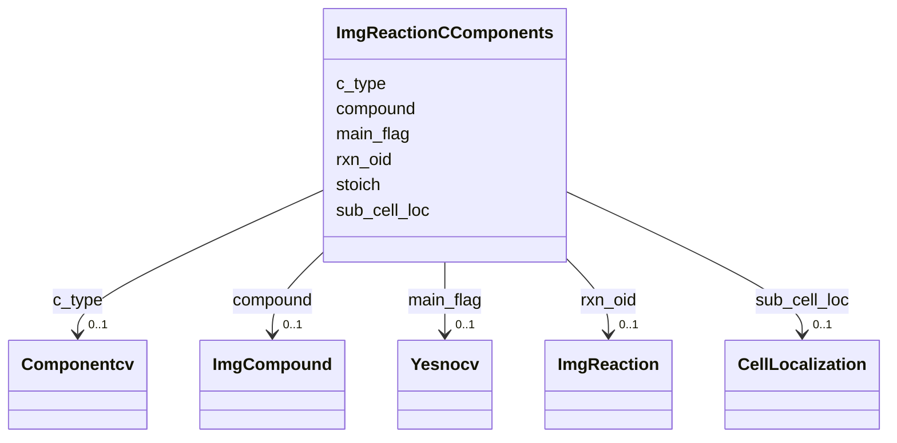

# Class: ImgReactionCComponents 


URI: [img_ext:ImgReactionCComponents](https://w3id.org/jgi/img_ext/ImgReactionCComponents)





<!-- no inheritance hierarchy -->


## Slots

| Name | Cardinality and Range | Description | Inheritance |
| ---  | --- | --- | --- |
| [rxn_oid](rxn_oid.md) | 0..1 <br/> [ImgReaction](ImgReaction.md) | Foreign key to img_reaction | direct |
| [c_type](c_type.md) | 0..1 <br/> [Componentcv](Componentcv.md) | Foreign key to componentcv | direct |
| [stoich](stoich.md) | 0..1 <br/> [Integer](Integer.md) |  | direct |
| [compound](compound.md) | 0..1 <br/> [ImgCompound](ImgCompound.md) | Foreign key to img_compound | direct |
| [main_flag](main_flag.md) | 0..1 <br/> [Yesnocv](Yesnocv.md) | Foreign key to yesnocv | direct |
| [sub_cell_loc](sub_cell_loc.md) | 0..1 <br/> [CellLocalization](CellLocalization.md) | Foreign key to cell_localization | direct |


## Identifier and Mapping Information


### Schema Source


* from schema: https://w3id.org/jgi/img_ext


## Mappings

| Mapping Type | Mapped Value |
| ---  | ---  |
| self | img_ext:ImgReactionCComponents |
| native | img_ext:ImgReactionCComponents |


## LinkML Source

<!-- TODO: investigate https://stackoverflow.com/questions/37606292/how-to-create-tabbed-code-blocks-in-mkdocs-or-sphinx -->

### Direct

<details>
```yaml
name: img_reaction_c_components
from_schema: https://w3id.org/jgi/img_ext
attributes:
  rxn_oid:
    name: rxn_oid
    description: Foreign key to img_reaction
    from_schema: https://w3id.org/jgi/img_ext
    domain_of:
    - img_reaction
    - img_reaction_assoc_networks
    - img_reaction_assoc_paths
    - img_reaction_assoc_rxns
    - img_reaction_c_components
    - img_reaction_catalysts
    - img_reaction_ext_links
    - img_reaction_t_components
    range: img_reaction
    required: false
  c_type:
    name: c_type
    description: Foreign key to componentcv
    from_schema: https://w3id.org/jgi/img_ext
    domain_of:
    - img_pathway_c_components
    - img_pathway_t_components
    - img_reaction_c_components
    - img_reaction_t_components
    - pathway_network_c_components
    - pathway_network_t_components
    range: componentcv
    required: false
  stoich:
    name: stoich
    from_schema: https://w3id.org/jgi/img_ext
    domain_of:
    - img_pathway_c_components
    - img_pathway_t_components
    - img_reaction_c_components
    - img_reaction_t_components
    - pathway_network_c_components
    - pathway_network_t_components
    range: integer
    required: false
  compound:
    name: compound
    description: Foreign key to img_compound
    from_schema: https://w3id.org/jgi/img_ext
    domain_of:
    - img_compound_kegg_compounds
    - img_pathway_c_components
    - img_reaction_c_components
    - pathway_network_c_components
    range: img_compound
    required: false
  main_flag:
    name: main_flag
    description: Foreign key to yesnocv
    from_schema: https://w3id.org/jgi/img_ext
    domain_of:
    - img_pathway_c_components
    - img_pathway_t_components
    - img_reaction_c_components
    - img_reaction_t_components
    - pathway_network_c_components
    - pathway_network_t_components
    range: yesnocv
    required: false
  sub_cell_loc:
    name: sub_cell_loc
    description: Foreign key to cell_localization
    from_schema: https://w3id.org/jgi/img_ext
    rank: 1000
    domain_of:
    - img_reaction_c_components
    - img_reaction_t_components
    range: cell_localization
    required: false

```
</details>

### Induced

<details>
```yaml
name: img_reaction_c_components
from_schema: https://w3id.org/jgi/img_ext
attributes:
  rxn_oid:
    name: rxn_oid
    description: Foreign key to img_reaction
    from_schema: https://w3id.org/jgi/img_ext
    alias: rxn_oid
    owner: img_reaction_c_components
    domain_of:
    - img_reaction
    - img_reaction_assoc_networks
    - img_reaction_assoc_paths
    - img_reaction_assoc_rxns
    - img_reaction_c_components
    - img_reaction_catalysts
    - img_reaction_ext_links
    - img_reaction_t_components
    range: img_reaction
    required: false
  c_type:
    name: c_type
    description: Foreign key to componentcv
    from_schema: https://w3id.org/jgi/img_ext
    alias: c_type
    owner: img_reaction_c_components
    domain_of:
    - img_pathway_c_components
    - img_pathway_t_components
    - img_reaction_c_components
    - img_reaction_t_components
    - pathway_network_c_components
    - pathway_network_t_components
    range: componentcv
    required: false
  stoich:
    name: stoich
    from_schema: https://w3id.org/jgi/img_ext
    alias: stoich
    owner: img_reaction_c_components
    domain_of:
    - img_pathway_c_components
    - img_pathway_t_components
    - img_reaction_c_components
    - img_reaction_t_components
    - pathway_network_c_components
    - pathway_network_t_components
    range: integer
    required: false
  compound:
    name: compound
    description: Foreign key to img_compound
    from_schema: https://w3id.org/jgi/img_ext
    alias: compound
    owner: img_reaction_c_components
    domain_of:
    - img_compound_kegg_compounds
    - img_pathway_c_components
    - img_reaction_c_components
    - pathway_network_c_components
    range: img_compound
    required: false
  main_flag:
    name: main_flag
    description: Foreign key to yesnocv
    from_schema: https://w3id.org/jgi/img_ext
    alias: main_flag
    owner: img_reaction_c_components
    domain_of:
    - img_pathway_c_components
    - img_pathway_t_components
    - img_reaction_c_components
    - img_reaction_t_components
    - pathway_network_c_components
    - pathway_network_t_components
    range: yesnocv
    required: false
  sub_cell_loc:
    name: sub_cell_loc
    description: Foreign key to cell_localization
    from_schema: https://w3id.org/jgi/img_ext
    rank: 1000
    alias: sub_cell_loc
    owner: img_reaction_c_components
    domain_of:
    - img_reaction_c_components
    - img_reaction_t_components
    range: cell_localization
    required: false

```
</details>