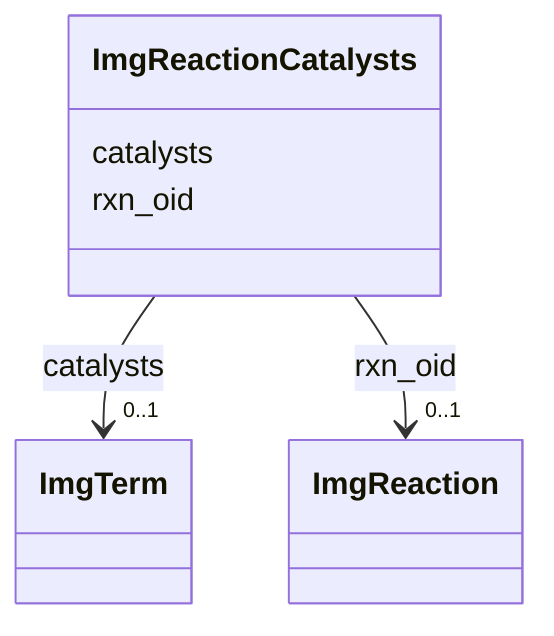

# Class: ImgReactionCatalysts 


URI: [img_ext:ImgReactionCatalysts](https://w3id.org/jgi/img_ext/ImgReactionCatalysts)





<!-- no inheritance hierarchy -->


## Slots

| Name | Cardinality and Range | Description | Inheritance |
| ---  | --- | --- | --- |
| [rxn_oid](rxn_oid.md) | 0..1 <br/> [ImgReaction](ImgReaction.md) | Foreign key to img_reaction | direct |
| [catalysts](catalysts.md) | 0..1 <br/> [ImgTerm](ImgTerm.md) | Foreign key to img_term | direct |


## Identifier and Mapping Information


### Schema Source


* from schema: https://w3id.org/jgi/img_ext


## Mappings

| Mapping Type | Mapped Value |
| ---  | ---  |
| self | img_ext:ImgReactionCatalysts |
| native | img_ext:ImgReactionCatalysts |


## LinkML Source

<!-- TODO: investigate https://stackoverflow.com/questions/37606292/how-to-create-tabbed-code-blocks-in-mkdocs-or-sphinx -->

### Direct

<details>
```yaml
name: img_reaction_catalysts
from_schema: https://w3id.org/jgi/img_ext
attributes:
  rxn_oid:
    name: rxn_oid
    description: Foreign key to img_reaction
    from_schema: https://w3id.org/jgi/img_ext
    domain_of:
    - img_reaction
    - img_reaction_assoc_networks
    - img_reaction_assoc_paths
    - img_reaction_assoc_rxns
    - img_reaction_c_components
    - img_reaction_catalysts
    - img_reaction_ext_links
    - img_reaction_t_components
    range: img_reaction
    required: false
  catalysts:
    name: catalysts
    description: Foreign key to img_term
    from_schema: https://w3id.org/jgi/img_ext
    rank: 1000
    domain_of:
    - img_reaction_catalysts
    range: img_term
    required: false

```
</details>

### Induced

<details>
```yaml
name: img_reaction_catalysts
from_schema: https://w3id.org/jgi/img_ext
attributes:
  rxn_oid:
    name: rxn_oid
    description: Foreign key to img_reaction
    from_schema: https://w3id.org/jgi/img_ext
    alias: rxn_oid
    owner: img_reaction_catalysts
    domain_of:
    - img_reaction
    - img_reaction_assoc_networks
    - img_reaction_assoc_paths
    - img_reaction_assoc_rxns
    - img_reaction_c_components
    - img_reaction_catalysts
    - img_reaction_ext_links
    - img_reaction_t_components
    range: img_reaction
    required: false
  catalysts:
    name: catalysts
    description: Foreign key to img_term
    from_schema: https://w3id.org/jgi/img_ext
    rank: 1000
    alias: catalysts
    owner: img_reaction_catalysts
    domain_of:
    - img_reaction_catalysts
    range: img_term
    required: false

```
</details>