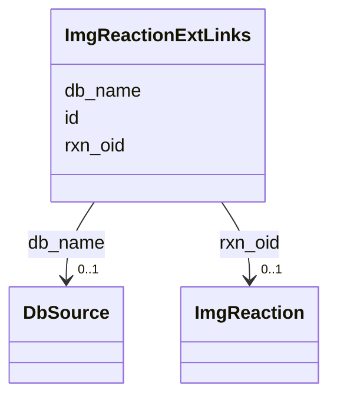

# Class: ImgReactionExtLinks 


URI: [img_ext:ImgReactionExtLinks](https://w3id.org/jgi/img_ext/ImgReactionExtLinks)





<!-- no inheritance hierarchy -->


## Slots

| Name | Cardinality and Range | Description | Inheritance |
| ---  | --- | --- | --- |
| [rxn_oid](rxn_oid.md) | 0..1 <br/> [ImgReaction](ImgReaction.md) | Foreign key to img_reaction | direct |
| [db_name](db_name.md) | 0..1 <br/> [DbSource](DbSource.md) | Foreign key to db_source | direct |
| [id](id.md) | 0..1 <br/> [String](String.md) |  | direct |


## Identifier and Mapping Information


### Schema Source


* from schema: https://w3id.org/jgi/img_ext


## Mappings

| Mapping Type | Mapped Value |
| ---  | ---  |
| self | img_ext:ImgReactionExtLinks |
| native | img_ext:ImgReactionExtLinks |


## LinkML Source

<!-- TODO: investigate https://stackoverflow.com/questions/37606292/how-to-create-tabbed-code-blocks-in-mkdocs-or-sphinx -->

### Direct

<details>
```yaml
name: img_reaction_ext_links
from_schema: https://w3id.org/jgi/img_ext
attributes:
  rxn_oid:
    name: rxn_oid
    description: Foreign key to img_reaction
    from_schema: https://w3id.org/jgi/img_ext
    domain_of:
    - img_reaction
    - img_reaction_assoc_networks
    - img_reaction_assoc_paths
    - img_reaction_assoc_rxns
    - img_reaction_c_components
    - img_reaction_catalysts
    - img_reaction_ext_links
    - img_reaction_t_components
    range: img_reaction
    required: false
  db_name:
    name: db_name
    description: Foreign key to db_source
    from_schema: https://w3id.org/jgi/img_ext
    domain_of:
    - bc_ext_links
    - compound_ext_db
    - img_compound_ext_links
    - img_reaction_ext_links
    range: db_source
    required: false
  id:
    name: id
    from_schema: https://w3id.org/jgi/img_ext
    domain_of:
    - bc_ext_links
    - img_compound_ext_links
    - img_reaction_ext_links
    range: string
    required: false

```
</details>

### Induced

<details>
```yaml
name: img_reaction_ext_links
from_schema: https://w3id.org/jgi/img_ext
attributes:
  rxn_oid:
    name: rxn_oid
    description: Foreign key to img_reaction
    from_schema: https://w3id.org/jgi/img_ext
    alias: rxn_oid
    owner: img_reaction_ext_links
    domain_of:
    - img_reaction
    - img_reaction_assoc_networks
    - img_reaction_assoc_paths
    - img_reaction_assoc_rxns
    - img_reaction_c_components
    - img_reaction_catalysts
    - img_reaction_ext_links
    - img_reaction_t_components
    range: img_reaction
    required: false
  db_name:
    name: db_name
    description: Foreign key to db_source
    from_schema: https://w3id.org/jgi/img_ext
    alias: db_name
    owner: img_reaction_ext_links
    domain_of:
    - bc_ext_links
    - compound_ext_db
    - img_compound_ext_links
    - img_reaction_ext_links
    range: db_source
    required: false
  id:
    name: id
    from_schema: https://w3id.org/jgi/img_ext
    alias: id
    owner: img_reaction_ext_links
    domain_of:
    - bc_ext_links
    - img_compound_ext_links
    - img_reaction_ext_links
    range: string
    required: false

```
</details>