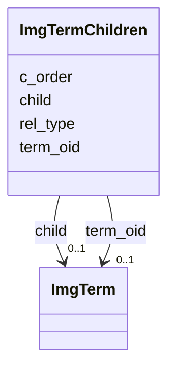

# Class: ImgTermChildren 


URI: [img_ext:ImgTermChildren](https://w3id.org/jgi/img_ext/ImgTermChildren)





<!-- no inheritance hierarchy -->


## Slots

| Name | Cardinality and Range | Description | Inheritance |
| ---  | --- | --- | --- |
| [term_oid](term_oid.md) | 0..1 <br/> [ImgTerm](ImgTerm.md) | Foreign key to img_term | direct |
| [child](child.md) | 0..1 <br/> [ImgTerm](ImgTerm.md) | Foreign key to img_term | direct |
| [rel_type](rel_type.md) | 0..1 <br/> [Integer](Integer.md) |  | direct |
| [c_order](c_order.md) | 0..1 <br/> [Integer](Integer.md) |  | direct |


## Identifier and Mapping Information


### Schema Source


* from schema: https://w3id.org/jgi/img_ext


## Mappings

| Mapping Type | Mapped Value |
| ---  | ---  |
| self | img_ext:ImgTermChildren |
| native | img_ext:ImgTermChildren |


## LinkML Source

<!-- TODO: investigate https://stackoverflow.com/questions/37606292/how-to-create-tabbed-code-blocks-in-mkdocs-or-sphinx -->

### Direct

<details>
```yaml
name: img_term_children
from_schema: https://w3id.org/jgi/img_ext
attributes:
  term_oid:
    name: term_oid
    description: Foreign key to img_term
    from_schema: https://w3id.org/jgi/img_ext
    domain_of:
    - img_term
    - img_term_children
    - img_term_enzymes
    - img_term_history
    - img_term_synonyms
    - mygene_terms
    range: img_term
    required: false
  child:
    name: child
    description: Foreign key to img_term
    from_schema: https://w3id.org/jgi/img_ext
    rank: 1000
    domain_of:
    - img_term_children
    range: img_term
    required: false
  rel_type:
    name: rel_type
    from_schema: https://w3id.org/jgi/img_ext
    rank: 1000
    domain_of:
    - img_term_children
    range: integer
    required: false
  c_order:
    name: c_order
    from_schema: https://w3id.org/jgi/img_ext
    rank: 1000
    domain_of:
    - img_term_children
    range: integer
    required: false

```
</details>

### Induced

<details>
```yaml
name: img_term_children
from_schema: https://w3id.org/jgi/img_ext
attributes:
  term_oid:
    name: term_oid
    description: Foreign key to img_term
    from_schema: https://w3id.org/jgi/img_ext
    alias: term_oid
    owner: img_term_children
    domain_of:
    - img_term
    - img_term_children
    - img_term_enzymes
    - img_term_history
    - img_term_synonyms
    - mygene_terms
    range: img_term
    required: false
  child:
    name: child
    description: Foreign key to img_term
    from_schema: https://w3id.org/jgi/img_ext
    rank: 1000
    alias: child
    owner: img_term_children
    domain_of:
    - img_term_children
    range: img_term
    required: false
  rel_type:
    name: rel_type
    from_schema: https://w3id.org/jgi/img_ext
    rank: 1000
    alias: rel_type
    owner: img_term_children
    domain_of:
    - img_term_children
    range: integer
    required: false
  c_order:
    name: c_order
    from_schema: https://w3id.org/jgi/img_ext
    rank: 1000
    alias: c_order
    owner: img_term_children
    domain_of:
    - img_term_children
    range: integer
    required: false

```
</details>